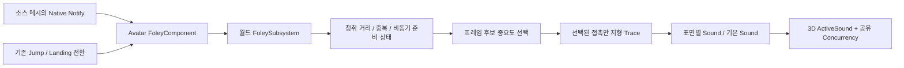

# 캐릭터 Foley 기반과 군중 재생 정책

## 현재 범위

2026-10-08에 추가한 C++ 기반이다. 보행·달리기·스침 등 애니메이션 접촉 이벤트와 기존 캐릭터 점프·착지 경계를 받아, 클라이언트에서만 지형별 사운드를 선택한다. 레벨·Physical Material·사운드·Data Asset이 없어도 실행할 수 있으며 미설정 상태는 무음이다. 초기 기반 이후 사용자가 승인한 [노티파이 교체](../Diagnostics/Foley_Notify_Migration_2026-10-08.md)와 기본 마네킹 오디오 연결은 별도 검증 기록을 따른다. 현재는 인간형 마네킹과 기본 바닥 소리를 기준으로 하며 프로젝트 지형 슬롯이나 새 레벨을 생성하지 않는다.

[GASP 실제 조사](../Diagnostics/GASP_Foley_Investigation_2026-10-08.md)는 원본 경로·확인 근거를 보존한다. 아래는 Project_J의 새 계약이다. AAA 게임 전체를 재현하거나 군중 성능 개선률을 실측한 결과라는 뜻은 아니다.

## 책임과 흐름

| 타입 | 책임 |
| --- | --- |
| UProject_JAnimNotify_FoleyEvent | 공유 노티파이의 이벤트·좌우·배율. 블렌드 아웃 필터. 상태를 보관하지 않음 |
| UProject_JFoleyComponent | Avatar 활성·사망·탑승·지상 조건, 소스 메시만 수신, 가족/좌우별 짧은 admission cooldown, 접촉 위치 해석 |
| UProject_JFoleyAudioProfile | 태그별 Soft Sound, 명시적 이벤트 대체, 표면 override, 발·손·소켓 정책, 감쇠·청취 반경 |
| UProject_JFoleySubsystem | 월드별 listener cache, 공유 비동기 로딩, bounded 후보 선별, CPU/발생률 예산, voice 그룹, 종료 수명과 계측 |

BaseCharacter가 Foley 컴포넌트를 기본 서브오브젝트로 가지므로 플레이어와 NPC가 공유한다. 컴포넌트에는 Tick과 복제가 없다. NPC는 ProfileOverride, 플레이어는 override가 없으면 CharacterAnimProfile.FoleyAudioProfile을 사용한다. PlayerState·ASC·GAS GameplayEvent에 접촉음을 저장하지 않는다. Mount 모듈이 Character를 역참조하지 않는다.

## MMORPG 청취와 네트워크

MMORPG라는 장르가 타인 발소리의 유무를 결정하지 않는다. 이 프로젝트의 기본 정책은 내 캐릭터와 **가까운 원격 플레이어·NPC를 함께 듣는 것**이다. 모든 캐릭터를 같은 볼륨으로 재생하는 정책은 아니다. OtherCharacterVolume 기본 0.6과 청취 거리·선별·voice 제한을 적용한다. 옵션으로 타인 발소리를 비활성화할 수 있다.

- 보행마다 RPC/Multicast를 만들지 않는다. 각 클라이언트가 이미 평가하는 애니메이션의 Notify로 접촉을 재구성한다.
- 전용 서버는 Foley 월드 서비스를 만들지 않으며, 이벤트를 받아도 audio 프로필·음원을 로딩하거나 트레이스하지 않는다. BaseCharacter의 컴포넌트 객체 자체는 존재하지만 오디오 작업을 수행하지 않는다.
- 로컬 Jump는 물리 점프가 발생한 OnJumped에서 재생한다. 원격 Jump는 기존 confirmed jump Sequence를 소비한다. 별도 Foley 복제를 만들지 않는다.
- Land는 LocomotionAnimStateComponent의 수용된 StartLanding에서 한 번 요청한다. 이미 landing active인 확인 이벤트는 다시 재생하지 않는다. 가짜 착지 억제 이후의 경로를 사용한다.
- 원격 confirmed 이벤트의 age를 전달하고 기본 0.15초보다 오래된 요청은 폐기한다. relevancy 진입 시 과거 소리가 재생되지 않게 한다.
- bUseMovementEventsForJumpAndLand=true이면 Jump/Land Notify는 제외한다. NPC가 Notify만 사용하는 경우 이 값을 false로 설정한다.
- 클라이언트 간 동일 랜덤 샘플·완벽한 프레임 일치는 필요 없다. AI hearing/은신 판정이 필요해지면 별도 서버 gameplay 계약을 만든다. 실제 audible voice나 클라이언트 trace를 서버 판정으로 사용하지 않는다.

## 군중 비용을 다루는 방식

### 이벤트 집계와 지각적 선택

각 캐릭터를 별도로 Tick하지 않는다. 이벤트가 있을 때 listener 위치를 해당 프레임에 한 번 갱신하고, FWorldDelegates.OnWorldPostActorTick에서 후보를 묶는다. 해당 월드의 local PlayerController.GetAudioListenerPosition과 attenuation override를 사용하므로 카메라 변경·분할 화면·PIE 월드가 구분된다.

remote score는 `Importance / (1 + 4 * distance² / radius²)`이다. 근거리 접촉과 저자가 중요한 것으로 지정한 착지 등이 먼저 선택된다. local 여부는 score보다 우선하며 AI의 IsLocallyControlled만으로 내 캐릭터 그룹에 넣지 않는다.

후보는 최대 128개다. 가득 찬 경우 더 중요한 새 후보가 가장 낮은 기존 후보를 교체하므로 먼 캐릭터가 먼저 도착했다는 이유로 내 캐릭터를 막지 않는다. 같은 remote emitter는 pass당 한 슬롯만 쓴다. 선택되지 않은 후보는 즉시 버리고 다음 프레임으로 누적하지 않는다. 프레임이 느려도 발소리 backlog를 뒤늦게 재생하지 않는다.

기본 local pass 한도는 4, remote는 6이다. remote에는 초당 60, burst 12의 token bucket도 적용해 FPS 변화가 지속 발생률을 바꾸지 않도록 한다. 모든 처리에는 기본 0.75ms의 soft GT 예산이 있고 작업 사이에서 검사한다. 이미 실행한 단일 collision query를 중단하는 hard 실시간 보장은 아니다. 값은 실제 군중과 음원으로 조정해야 한다.

### 필요한 후보만 접촉 계산

거리·이벤트 유효성·ready 음원·중복을 검사한 후 살아남은 후보만 발 위치와 지면을 조회한다. default profile이 없거나 음원이 미설정이면 ground trace가 없다. 보행↔달리기는 같은 Footstep 그룹과 Side를 사용해 블렌드 중 같은 발의 중복을 억제한다. 기본 cooldown은 접촉 0.075초, Jump/Land 0.2초다. 모든 시간은 Avatar별 저장소에 있으며 공유 AnimNotify에는 없다.

보이는 메시가 최근 렌더링되고 발 본이 유효하면 기존 FindVisualFollower 해석을 사용한다. 유효한 최근 source pose는 fallback이며, 화면 밖의 stale/URO pose나 없는 소켓은 현재 캡슐 하단으로 떨어진다. 발소리를 위해 군중 전체의 URO/ABA를 끄거나 GameplayPose 요구를 만들지 않는다. 카메라 뒤라는 이유만으로 가까운 캐릭터 소리를 차단하지 않는다.

이벤트 정의의 Contact는 Foot, Hand, Capsule, Socket 중 하나다. Foot/Hand는 Side와 프로필의 source/visual 본 이름을 사용한다. Socket은 ContactSocket을 사용하며 Side=None도 허용한다. Capsule은 메시의 현재 포즈를 조회하지 않는다. 손·커스텀 소켓 역시 최근 렌더링/존재 조건을 만족해야 하며, 없거나 오래된 포즈는 캡슐 하단으로 돌아간다. Handplant를 발 위치로 처리하는 초기 한계를 제거한다. ScuffWall은 현재 벽 방향·벽 재질을 찾는 API가 아니며, 이를 필요로 하는 액션은 미래에 접촉 normal/대상 정보를 제공해야 한다.

이 기반은 source animation이 Notify를 전달하는 경우에 접촉을 받는다. 별도 animation 정책이 근거리 offscreen 메시의 pose/Notify 평가를 완전히 중지하면 해당 보행 이벤트도 없다. 합성 보행 cadence나 청취 cohort의 최소 animation demand는 실제 offscreen 청취 시험 후 추가할 확장이다. 무음 상태에서 모든 캐릭터의 애니메이션을 강제로 깨우지는 않는다.

### 음원 준비와 voice 수명

프로필과 음원은 Soft 참조다. 청취 후보가 생기면 중앙 서비스가 프로필별로 한 번 비동기 요청하고 음원 경로를 중복 제거해 preload한다. 재생 경로에 동기 LoadSynchronous가 없다. 로딩 중의 이벤트는 drop하며 완료 callback에서 과거 이벤트를 재생하지 않는다. 캐시는 최대 32개 프로필이고 capacity가 필요하면 2초 이상 사용하지 않은 항목을 해제한다. 실패한 로딩은 매 발걸음마다 재시도하지 않는다.

내 플레이어는 PossessedBy/PawnClientRestart 경계에서 PrepareLocalAudio를 요청해 첫 접촉 이전부터 준비한다. 서비스는 활성·생존·탑승·동일 월드·실제 locally controlled player 여부를 확인하고 기존 shared async cache를 재사용한다. 원격/NPC/전용 서버 소유 경계는 stream entry를 만들지 않는다. 이 경로는 리스너 조회, ground trace, contact 큐, RPC, 추가 Tick을 만들지 않는다. bool 반환은 준비 요청/캐시 진입 여부이며 로딩 완료나 재생 보장이 아니다. 매우 느린 로딩 중의 이벤트 drop 정책은 유지한다. 향후 런타임 프로필을 바꾸는 시스템도 로컬 소유 상태에서 이 hook을 호출할 수 있다.

짧은 impact는 PlaySoundAtLocation으로 ActiveSound를 제출한다. 발이 움직여도 tail을 끌고 가지 않으며 프로젝트가 AudioComponent를 매번 만들거나 pool 수명을 직접 관리하지 않는다. 엔진의 concurrency/voice 관리에 맡긴다. local 그룹은 4 voices/StopOldest, remote 공유 그룹은 16 voices/StopQuietest이고 짧은 voice-steal fade를 둔다. 서로 다른 사운드·프로필도 해당 그룹의 제한을 공유한다.

Slide.Loop 같은 loop는 이 API에서 재생하지 않는다. 루프는 시작·갱신·종료를 추적하는 별도 emitter 수명이 필요하다. 이를 one-shot API에 넣어 장시간 슬롯을 점유하지 않는다. artist attenuation이 없으면 공간화와 거리 감쇠를 가진 runtime fallback을 만든다.

EndPlay는 Avatar 요청을 취소한다. World EndPlay/Deinitialize는 후보·streaming handles·공유 참조를 정리한다. profile 변경 후 이전 profile의 queued contact도 폐기한다.

## 지형별 데이터 작성

### 이벤트 대체와 콘텐츠 독립성

Events는 정확한 태그로 먼저 조회한다. 해당 정의에 default 또는 surface 음원 참조가 있으면 이를 사용한다. 없거나 빈 정의일 때만 EventFallbacks의 명시적 경로를 따라 다른 **완전한 정의**를 선택한다. 대체된 정의의 Group, Contact, surface 맵, Importance가 함께 적용된다. 원래 Side/Volume/Pitch/Age는 유지한다. 태그 부모, 이름의 부분 문자열, GASP 폴더 경로로 자동 추론하지 않는다.

EventFallbacks는 프로필 데이터이며 런타임 기본 규칙은 비어 있다. 새 콘텐츠는 자기 태그를 등록해서 Events에 넣을 수 있다. 호환용 RunBackwds 같은 기존 철자는 재작성하지 않는다. 기본 마네킹 프로필에는 RunStrafe/RunBackwds→Run, WalkBackwds→Walk, ScuffPivot/ScuffWall→Scuff를 작성한다. 정확한 전용음이 있는 동안에는 전용음이 우선한다. Handplant→Walk처럼 의미·접촉 위치가 다른 소리는 자동 대체하지 않는다.

대체 탐색은 최대 16개 정의, inline 저장소, cycle 검사로 제한된다. 잘못된 경로는 무음으로 종료한다. 아직 로딩되지 않은 **할당된** 음원을 빈 정의로 취급하지 않으므로 streaming 완료 전후로 이벤트 정책이 바뀌지 않는다. surface/default의 준비된 음원 선택은 기존 규칙을 따른다. IsDataValid는 잘못된 이벤트 정책, 소켓 없는 Socket 모드, 순환·지나치게 긴·해결되지 않는 대체 경로, 유효 범위 밖 설정과 이미 로딩된 looping 음원을 검사한다. 전체 음원을 동기 로딩하는 검증은 하지 않는다.

### 표면과 미래 환경 상태

지금은 지형 이름·Physical Surface 슬롯을 예약하거나 샘플 맵을 만들지 않는다. 각 이벤트의 SurfaceSounds는 엔진 EPhysicalSurface를 키로 사용한다.

1. 미래에 프로젝트의 Physical Surface 이름을 정의한다.
2. 각 지형/메시/landscape에 맞는 Physical Material의 SurfaceType을 설정한다.
3. Native Foley Audio Profile Data Asset을 만들고 Events에 Walk/Run 등 정확한 태그를 넣는다.
4. 기본 음원을 DefaultSound, 필요 표면을 SurfaceSounds에 연결한다. USoundBase 기반이므로 Wave·Cue·MetaSound를 사용할 수 있다.
5. Group을 지정한다. Walk/Run 계열은 Footstep, Scuff 계열은 Scuff, Jump는 Jump, Land는 Land. Jump처럼 지면 선택이 필요 없는 경우 bTraceSurface=false.
6. 이벤트 Contact와 체형별 발/손 본, 필요 ContactSocket을 지정한다. Visual 본이 None이면 source 이름을 시도하고, 없거나 stale pose이면 캡슐 contact를 사용한다.
7. 플레이어 CharacterAnimProfile.FoleyAudioProfile 또는 NPC Foley.ProfileOverride에 연결한다.
8. 접촉 애니메이션에 Project J Foley Event Notify를 배치하고 좌우·태그·배율을 지정한다.

선택된 이벤트는 configurable channel의 짧은 line trace와 bReturnPhysicalMaterial로 표면을 구한다. 정의하지 않은 surface·빈 override·trace miss는 DefaultSound로 돌아간다. 선택 표면의 음원이 아직 안 읽혔으면 준비된 default로 돌아간다. default까지 없으면 무음이다. simple collision과 landscape의 Physical Material 반환은 미래의 실제 지형에서 검증해야 한다.

눈·진흙은 Physical Surface와 음원을 추가해서 표현할 수 있다. 얕은 물 위의 바닥, 젖은 신발 유지, 눈 덮임은 단일 blocking hit의 표면만으로 판정하지 않는다. 이 단계에서는 가짜 water volume이나 지형 슬롯을 만들지 않는다. 향후 환경 판정이 필요해지면 선별된 접촉에 surface+wetness/depth 정보를 제공하는 resolver를 추가하고, 짧은 splash 레이어의 비용도 voice/작업 예산에 포함한다. 신발·지형·젖음의 모든 조합을 애니메이션 태그로 늘리지 않는다. 확장 입력은 클라이언트 표현 데이터로 유지하며 AI hearing 등의 서버 권한 판정과 분리한다.

기존 GASP 애니메이션의 끊어진 BP 노티파이는 native class를 추가하는 것만으로 복원되지 않는다. 원본 BP 의존성을 읽기용으로 복원하고, 시간·Event override·Side·배율·Trigger Weight를 읽어 명시적으로 변환하는 편집 도구를 사용한다. BP enum/struct의 native 교체를 단순 Reparent/ClassRedirect만으로 보존된다고 가정하지 않는다. 상세한 대상·보존 계약·명명 이벤트 예외·실행 기록은 [GASP 노티파이 교체](../Diagnostics/Foley_Notify_Migration_2026-10-08.md)를 따른다.

## 계측과 조정

| CVar | 기본값 | 용도 |
| --- | --- | --- |
| ProjectJ.Foley.Enabled | 1 | 전체 Foley admission |
| ProjectJ.Foley.OtherCharacters | 1 | 원격 플레이어·NPC 포함 |
| ProjectJ.Foley.RemotePerFrame | 6 | remote 접촉 작업 수 |
| ProjectJ.Foley.RemotePerSecond | 60 | 지속 발생률 |
| ProjectJ.Foley.MaxEventAge | 0.15 | 과거 이벤트와 queued contact 만료 |
| ProjectJ.Foley.WorkMilliseconds | 0.75 | pass의 soft CPU 예산 |
| ProjectJ.Foley.Status | 명령 | 후보·drop 이유·재생 제출·프로젝트 trace 수 |

Insights에는 ProjectJ_Foley_Admission과 ProjectJ_Foley_SurfaceTrace scope를 남긴다. Played 통계는 PlaySoundAtLocation에 **제출한 횟수**이며 concurrency에서 살아남아 실제로 들린 voice 수가 아니다. SurfaceTraces는 이 시스템의 지면 query만 세며 artist attenuation의 엔진 occlusion 비용까지 포함하지 않는다.

Status의 Unmapped는 해결 가능한 음원 정의가 없는 요청, Fallbacks는 명시적 대체로 실제 admission된 요청, Loops는 실행 시 거부된 looping 음원이다. 매 프레임 로그나 캐릭터별 디버그 Tick을 추가하지 않는다.

현재 자동화 범위는 surface fallback·invalid/old event·100-emitter 선택·local 보호·한 emitter 독점 방지·blend cooldown·capacity replacement·누락 콘텐츠·cancel/stop 수명이다. 실제 청취·수백 명 군중 CPU·Audio Insights voice 실측·2인 PIE 지연·landscape 재질·체형별 발 접촉은 레벨과 음원이 생긴 다음 검증한다. acoustic propagation, portal routing, HRTF/Steam Audio, 복잡한 occlusion, 합성 군중 bed는 현재 구현으로 주장하지 않는다.

## 2026-10-08 초기 기반 검증

최종 소스로 직접 UnrealBuildTool.exe를 실행해 Project_JEditor / Project_J의 Win64 Development 빌드를 완료했다. NullRHI / nosound 자동화는 Foley 4개와 관련 animation·component·presentation 회귀 테스트를 합쳐 12개가 모두 통과했다. 테스트별 오류·경고는 0이며, 에디터 시작 로그 전체가 오류 없이 깨끗하다는 의미는 아니다.

빌드 후 실제 Project_J 에디터를 실행하고 Unreal MCP로 BP_GreatSword의 상속된 Foley 컴포넌트를 확인했다. bAutoActivate=true, bEnabled=true, bReplicates=false이며 movement Jump/Land 정책도 활성이다. 새 native Notify의 Walk 태그와 프로필의 발 본·거리·타인 볼륨 기본값을 확인했다. Blueprint 편집기도 저장 없이 열어 MCP 화면 캡처로 확인했다. Windows 컴퓨터 사용 도구에서는 해당 에디터 창이 노출되지 않아 실제 에디터 조회에는 MCP를 사용했다.

초기 기반 검증 당시 DA_GreatSword_AnimProfile.FoleyAudioProfile은 None이었다. 이 초기 검증은 코드와 에디터 등록·기본값의 검증이며 실제 음원 청취나 기존 GASP 노티파이의 콘텐츠 이관 완료를 의미하지 않는다. 초기 기반 단계에서는 레벨·Blueprint·Data Asset·애니메이션 바이너리를 저장하지 않았다. [초기 검증 기록](../Diagnostics/Foley_Validation_2026-10-08.json)에 테스트 결과, MCP 확인값, 로컬 근거 파일 경로와 SHA-256을 남긴다. 이후 사용자가 승인한 애니메이션 저장은 별도의 교체 기록에 남긴다.

후속 [음원 연결과 확장](../Diagnostics/Foley_Extension_2026-10-08.md)에서 DA_Mannequin_Foley의 12개 이벤트와 5개 대체 규칙을 연결했다. [정면 달리기 복구](../Diagnostics/Foley_Forward_Run_Fix_2026-10-08.md)에서는 이름만 남은 893개 이벤트를 추가 복구하고 실제 MM 이동 경로를 검증했다. 현재 연결 상태와 최신 검증은 이 후속 기록을 따른다. 이후 이관 감사는 BP referencer만 사용하지 않고, 객체 없는 이벤트의 이름과 원본 GUID 대조도 포함해야 한다.
