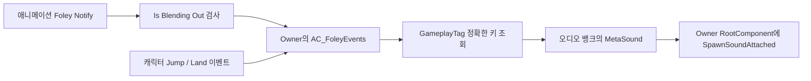

# GASP Foley 재생 구조 조사 — 2026-10-08

## 조사 범위와 근거

로컬 `C:\Users\I\Documents\Unreal Projects\GameAnimationSample`의 UE 5.7.4 에디터를 실행하고 Computer Use로 관련 Blueprint·Data Asset·MetaSound를 열었다. Project_J는 UE 5.8 에디터를 실행해 공식 Unreal MCP의 최소 객체 속성 조회와 로드 로그로 연결을 비교했다. 분석 단계에서 에셋·레벨 저장, Blueprint 컴파일, PIE, 코드 수정은 하지 않았다.

아래 내용은 이 로컬 GASP 버전의 실제 그래프를 기준으로 한다. 모든 GASP 버전의 공통 구현이라고 일반화하지 않는다. 모든 애니메이션의 노티파이 시간·Trigger Weight를 전수 검사하거나 실제 멀티플레이 청취를 검증한 기록은 아니다.

그래프 복사 원문은 당시 로컬 `C:\Users\I\.codex\visualizations\2026\10\08\01a11936-80a5-7073-a336-ee13652ced66`의 `GASP_PlayFoleyEvent.txt`, `GASP_GetSoundFromFoleyEvent.txt`, `GASP_CMC_EventGraph.txt`에 보관했다. 저장소 밖 원문이 없는 다른 작업 환경에서도 아래 에셋 경로로 다시 확인할 수 있다.

## 실제 호출 경로

### 노티파이

`/Game/Blueprints/AnimNotifies/BP_AnimNotify_FoleyEvent`는 UAnimNotify 기반이다. Event GameplayTag, E_FoleyEventSide(None/Left/Right), VolumeMultiplier, PitchMultiplier, DefaultBank를 보관한다.

`Received Notify`는 EventReference의 `Is Blending Out`을 반전하여 활성 문맥에서만 진행한다. MeshComp.GetOwner에서 AC_FoleyEvents를 찾고, 유효하면 Event와 S_FoleyEventParams를 `PlayFoleyEvent`에 전달한다. 컴포넌트가 없으면 DefaultBank를 조회해 `PlaySound2D`를 호출한다. 이 fallback에는 확인한 그래프상 명시적인 에디터 preview 전용 조건이 없으므로 preview-only라고 단정하지 않는다.

`BP_AnimNotify_FoleyEvent_Run_L`의 실제 기본값은 `Foley.Event.Run`, Left, Volume/Pitch 각각 1, DefaultFoleyEventAudioBank였다. Run_R, Walk_L/R, Scuff_L/R, Jump, Land, Handplant_L/R 자식도 존재한다. 인스턴스에서 RunStrafe 등으로 이벤트를 덮어쓸 수 있으므로 클래스 이름만으로 이벤트를 결정해서는 안 된다.

UE 5.8 로컬 `Engine/Source/Runtime/Engine/Private/Animation/AnimNotifyLibrary.cpp`의 IsBlendingOut 구현은 `!EventReference.IsActiveContext()`이다. 이 필터는 몽타주 전체의 블렌드 플래그와 같지 않다.

### 컴포넌트와 뱅크

`/Game/Audio/Foley/AC_FoleyEvents`의 EventGraph는 비어 있다. `PlayFoleyEvent`는 뱅크 조회 결과를 IsValid로 검사한 뒤 SpawnSoundAttached에 연결한다.

- AttachToComponent: Owner.RootComponent.
- AttachPointName: None, 상대 위치·회전: 0, KeepRelativeOffset.
- Volume/Pitch: 전달받은 Params.
- AttenuationSettings와 ConcurrencySettings: 연결된 override 없음.
- AutoDestroy: true.
- 반환: 생성된 AudioComponent.

별도 `CanPlayFoley` 함수가 Owner의 I_FoleyAudioBankInterface를 호출하지만, 확인한 노티파이·PlayFoleyEvent 실행 경로에는 그 함수 호출이 연결되어 있지 않았다. 함수 존재만으로 활성 재생 조건이라고 판단하지 않는다.

TriggerVisLog는 좌우 foot_l/foot_r 소켓 위치를 디버그 구체에 사용한다. **확인한 경로에서 발 소켓은 오디오 부착 위치가 아니다.** 지면 트레이스나 Physical Material 선택도 없다.

`/Game/Audio/Foley/FoleyEventComponent`는 AC_FoleyEvents의 자식이다. 노티파이가 조회하는 실제 기반 클래스는 AC_FoleyEvents다.

`/Game/Audio/Foley/DABP_FoleyAudioBank`의 GetSoundFromFoleyEvent는 GameplayTag→Sound 맵의 정확한 키를 검색하고 Sound/Success를 반환한다. SetFloatParameter 등 일부 노드는 주 실행 경로에서 분리되어 있었다. 동적 속도 파라미터 제어가 활성이라고 해석하지 않는다.

### 기본 뱅크의 연결

| 이벤트 | 연결 사운드 |
| --- | --- |
| Foley.Event.Walk | MSS_FoleySound_Walk |
| Foley.Event.Run | MSS_FoleySound_Run_Soft |
| Foley.Event.Jump | MSS_FoleySound_Jump |
| Foley.Event.Land | MSS_FoleySound_Land |
| Foley.Event.Scuff | MSS_FoleySound_Scuff |
| Foley.Event.Handplant | MSS_FoleySound_Handplant |
| Foley.Event.RunBackwds | MSS_FoleySound_RunBackwards |
| Foley.Event.ScuffPivot | MSS_FoleySound_ScuffPivot |
| Foley.Event.ScuffWall | MSS_FoleySound_ScuffWall |
| Foley.Event.RunStrafe | MSS_FoleySound_RunStrafe |
| Foley.Event.Tumble | MSS_FoleySound_Tumble |
| Foley.Event.WalkBackwds | MSS_FoleySound_WalkBackwards |
| Foley.Event.Slide.Loop | MSS_FoleySound_Looping_Slide |

마지막 Slide.Loop는 직렬화된 태그와 참조로 확인했고, 나머지 항목은 에디터에서 펼친 맵에서도 확인했다.

MSS_FoleySound_Walk는 MSS_FoleySound의 preset이다. 부모는 음원 배열의 랜덤 선택과 볼륨·피치 변주 후 Wave Player를 실행한다. 확인한 Walk preset의 source Volume은 0.24, Pitch는 1, Attenuation은 None이었다. 다른 모든 preset의 감쇠 설정까지 동일하다고 단정하지 않는다. Sneaker/Concrete 등의 Wave 경로는 특정 콘텐츠를 의미하며, 재질 선택 시스템이 있다는 근거는 아니다.

## 점프·착지와 원격 캐릭터

`/Game/Blueprints/SandboxCharacter_CMC`는 AC_FoleyEvents 컴포넌트를 갖고 다음 이벤트에서도 재생한다.

- Custom OnJumped Event: Jump, 점프 직전 수평 속도 0~500을 볼륨 0.5~1.0으로 clamped mapping.
- Custom OnLanded Event: Land, LandVelocity.Z -500~-900을 볼륨 0.5~1.5로 clamped mapping.
- simulated proxy: OnCharacterMovementUpdated에 연결한 UpdatedMovementSimulated 경로로 커스텀 점프·착지를 감지. 그래프 주석도 일반 OnJumped/OnLanded가 해당 원격 캐릭터에서 호출되지 않는 점을 설명한다.

Jump/Land 노티파이와 캐릭터 이벤트를 함께 이식할 경우 실제 사용 애니메이션을 확인해 중복을 방지해야 한다. 이 조사만으로 모든 애니메이션에서 중복이 발생한다고 주장하지 않는다.

## Project_J에서 확인한 연결 상태

실행한 Project_J 로그에서 Run 애니메이션이 `/Game/Blueprints/AnimNotifies/BP_AnimNotify_FoleyEvent_Run_L`·Run_R를 로드하지 못했다. Content에 해당 클래스·Foley 오디오 경로가 없고, 가져온 시퀀스의 직렬화 참조가 남아 있다. 일부 연결이 끊어진 이관 상태다.

MCP로 BP_GreatSword의 CharacterMesh0가 hidden-in-game SKM_Quinn_Simple이며 ABP_Humanoid_Master를 사용하는 것을 확인했다. CharacterAnimProfile은 DA_GreatSword_AnimProfile에 연결되어 있었다. 시퀀스 Notifies 배열은 해당 MCP get_properties에서 읽을 수 없었으므로 그 실패를 빈 배열 또는 노티파이 부재로 해석하지 않는다.

현재 C++ 기반과 제작 절차는 [Foley 시스템 기준](../Architecture/Foley_Audio_System.md)을 따른다. 이 조사 단계에서는 바이너리 에셋을 변환하거나 저장하지 않았다. 이후 사용자가 승인한 실제 노티파이 교체는 [교체 기록](Foley_Notify_Migration_2026-10-08.md)에 별도로 정리한다.

## 엔진 참고 자료

- [Animation Notifies](https://dev.epicgames.com/documentation/en-us/unreal-engine/animation-notifies-in-unreal-engine): Trigger Weight 등 제작 정책. Sync Group follower의 Notify 설정을 리타깃 메시와 혼동하지 않는다.
- [Sound Attenuation](https://dev.epicgames.com/documentation/en-us/unreal-engine/sound-attenuation-in-unreal-engine): 3D 감쇠·공간화 정책.
- [Sound Concurrency](https://dev.epicgames.com/documentation/unreal-engine/sound-concurrency-reference-guide): 동시 voice 제한과 회수 정책.
