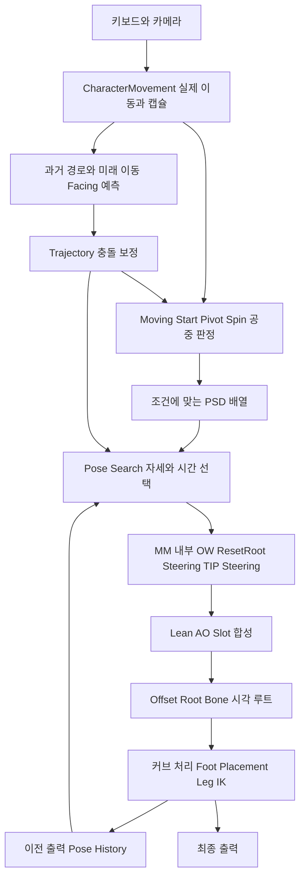

# 02. GASP CMC: 자연스러움을 만드는 연결

이 문서는 로컬 5.7.4의 확인한 CMC 경로를 설명한다. 근거 G01-G05. 기본 활성 MM과 비활성 실험적 State Machine을 구분한다. 그래프에서 추론한 효과는 I이며 새 영상 검증은 U다.

2026-10-10 보충: Computer Use로 원본 EarlyTransition Tick 그래프를 확인했다.
누락된 Run 6개 인스턴스는 기본값 Always가 아니라 `Re-Transition / Gait Not Equal Run`이다.
단순 구간 Begin/End bool과 동일하게 취급하지 않는다.
Project J 복구와 적용 한계는 [EarlyTransition 복원 기록](../../Diagnostics/EarlyTransition_Recovery_2026-10-10.md)을 따른다.

## 1. 전체 흐름과 책임



G/A: 게임플레이 위치와 충돌 캡슐은 CharacterMovement가 책임진다. 애니메이션의 루트 움직임 정보와 root offset은 시각 몸체를 연결하는 데 사용된다. 루트 모션 정보 이용을 곧바로 animation-driven 이동으로 해석하지 않는다. 온라인 Epic 문서도 capsule-driven 모델을 설명하지만 로컬의 실제 mode/pin은 별도 근거다.

G/A: 기본은 MM 경로다. Experimental State Machine은 현재 확인한 설정에서 비활성이다. 실험 경로의 Start/Land 직접 스택 또는 진입 MM을 기본 동작의 실행 방식으로 혼합하지 않는다.

## 2. 입력과 실제 이동

### 효과 → 근거 → 원리

I/U: 캡슐이 빠르게 목표 방향을 따르더라도 몸의 자세와 발은 authored 동작을 이어갈 수 있는 구조다. 플레이에서 그 품질을 새로 계량한 것은 아니다.

G/A: 확인한 CMC 이동 설정은 지상 yaw 회전 -1, 공중 200, Run 가속 800, Sprint 가속 구간 800→300, 속도 범위 300-700, 입력 중 감속 500/해제 감속 2000, ground friction 5 및 Sprint 구간 5→3 조정이다. 구간별 값을 한 상수로 축약하지 않는다.

G/A: trajectory는 CMC 상태·가속·회전 정보를 이용하고, 이후 충돌 보정을 적용한다. 확인한 history/prediction 샘플 수는 각각 30/15이며 prediction 시간 간격 0.1을 사용한다. 이것을 컴포넌트 업데이트 빈도로 오해하지 않는다. 원하는 방향에는 미래 0.5초 Facing을 사용하는 경로가 있다. MaxYawRate=0은 해당 엔진/함수의 즉시 회전 의미이며 기능 비활성이라고 단정하지 않는다.

작동 원리 I: 현재 velocity와 새 acceleration이 반대인 순간을 단순 정지로만 보지 않고 미래 경로 변경으로 나타낼 수 있다. 충돌 보정은 앞으로 가려는 경로와 실제로 이동할 수 있는 경로의 차이를 줄이는 역할이다. 시각 루트는 급한 캡슐 회전의 영향과 별도로 처리된다.

### Project_J 차이 → 비용·검증

Project_J는 제한된 CMC yaw, 2048 가속, 5Hz 시간 샘플링, 별도 Strafe Facing 예측을 사용한다. 두 프로젝트의 camera/velocity/input 방향을 동시에 기록해야 한다. GASP 물리값을 복사하면 MMORPG 이동 응답과 공격·충돌 계약이 바뀔 수 있다. 충돌 trajectory 조회는 로컬/근거리부터 비용과 벽 근처 효과를 비교한다.

## 3. 상태 판정과 Chooser

G/A: Moving 판정은 velocity와 acceleration을 활용한다. Start에는 future speed가 현재보다 약 100 커지는 조건과 현재 Pivots 태그 억제가 포함된다. Pivot은 velocity/acceleration 관계를 이용하며 확인한 각도 기준은 OTM 45, Strafe 30, Aim 0이다. Spin은 시각 root와 actor의 차이 약 130, 속도 150 및 Pivot과의 우선 관계를 사용한다.

이 숫자는 독립적인 '각도별 클립 강제 재생표'가 아니다. 현재 데이터/태그/상태와 함께 후보를 구성한다.

G/A: Chooser는 조건에 맞는 PSD들을 배열로 반환한다. 확인한 조건 조합에는 Start+Loops, Pivot+Loops, Spin+Loops처럼 후보가 겹친다. MM은 이렇게 열린 database의 검색 가능 pose/time과 continuing 후보를 평가한다. 모든 database를 무조건 동시에 검색하는 구조는 아니다.

I/U: 이 후보 겹침은 state 판정이 조금 먼저/늦게 변해도 현재 자세와 미래 경로가 맞는 Loop를 유지하거나 전환 구간으로 들어갈 여지를 준다. 실제 선택 비용·clip/time trace를 봐야 어느 후보가 이겼는지 입증할 수 있다.

Project_J 차이: C++가 단일 Cycle/Turn PSD를 고른 뒤 내부 후보를 검색한다. state 조건이 신규 후보 검색의 경계로 더 직접적으로 작동한다. 큰 반전 자격 구간만 후보 겹침을 실험할 수 있지만 schema/정규화/bias와 검색 비용 검증이 선행되어야 한다.

## 4. PSS와 데이터가 제공하는 자연스러움

G/A: 확인한 PSS_Default는 Normalize 계열 전처리, 30Hz, trajectory 그룹 가중치 1을 사용한다. 확인한 시간/특징은 다음과 같다.

| 시간 | 특징 | 가중치 |
| --- | --- | --- |
| -0.05 | 위치 XY | 0.3 |
| 0 | 속도 XY, Facing XY | 1 |
| +0.35 | 위치 XY, Facing XY | 1 |
| +0.7 | 위치/속도/Facing XY | 1 |
| +1 | 속도 방향 3D | 1.5 |

Pose 계열에는 발 사이 상대 위치 가중치 1, 발 속도 0.3, 골반 Heading Y/Strip Z 0.1 등의 확인한 특징이 있다. continuing pose 사용도 포함한다. 전체 특징 차원은 확인한 Loops에서 30이다.

G/A: PSS_Jump는 trajectory 그룹 가중치 10과 Z 특징을 포함한다. 확인한 데이터는 21개 시퀀스, 923 pose, 269 searchable, 39차원, continuing bias -0.5였다. 공중 데이터의 더 작은 searchable 수를 데이터 부족으로 단정하지 않는다. notify·범위 제외의 영향이 있다.

G/A: 실험적 PSD_SM_CMC_Loops에서는 20개 시퀀스, 1478 pose/1170 searchable, continuing -0.01, loop -0.005, 끝 -0.3초 제외를 확인했다. 이 수치를 기본 MM의 모든 Loop 데이터 크기라고 표현하지 않는다.

I: trajectory만 맞으면 발이 어긋나고, 발만 맞으면 입력 방향에 늦게 반응할 수 있다. 방향·속도·현재 자세·발 위상을 함께 설명하는 특징과 다양한 전환/곡선 데이터가 있어야 검색의 선택 폭이 실제 자연스러움으로 이어진다.

Project_J 차이: trajectory 그룹 4, 발·골반의 다른 상대 가중치와 과거 -0.4, 미래 +0.35/+0.7 특징을 쓴다. Normalize된 비용이므로 원시 가중치 비율을 결과 비용 비율로 해석하지 않는다. PSS_Default 복사는 기존 Combat Hourglass/Diamond 선택 분포를 바꿀 수 있다.

## 5. continuing·재검색·진입 제한

G/A: 확인한 MM 설정은 SearchThrottle=0, PoseReselectHistory=0.3, 최대 blends=4, PlayRate=0.85-1.15, UseInertialBlend=false, ResetOnBecomingRelevant=true다. BlendTime은 상황별 지상 0.5, 착지 0.2, 점프 0.15 등의 함수 설정이다.

I: throttle 0은 매 update 검색 가능성을 뜻하며 매 update 반드시 새 클립으로 점프한다는 뜻은 아니다. continuing 비용, 검색 제외, pose history, reselection 제한, 상태별 interrupt가 교체를 제한한다. 큰 blend는 연결에 도움을 줄 수 있으나 반응 지연/발 혼합을 만들 수도 있다.

G/A: 대표 180도 시퀀스의 Exclude/Branch In/continuing override/Block Transition 구성은 Project_J 대응 시퀀스와 유사한 시간 구간을 가진다. GASP Branch In에는 PSD_SM_CMC_Transitions가 연결되어 있다. Project_J에서 확인한 대응 Branch In은 None이다.

S/E: Branch In 연결은 AnimationAsset 기반 진입 검색의 database 연결에 중요하다. 시퀀스가 명시적 PSD entry로 들어 있을 때와 동일한 제한으로 생각하면 안 된다. Block Transition은 새로운 pose 진입 제한이며 게임플레이 취소 금지가 아니다. continuing override -0.1은 DB bias에 합산하는 값이 아니라 해당 구간에서 대체하는 값이다.

## 6. 기본 MM과 실험적 직접 스택

G/A: 기본 활성 경로는 움직임·전환·공중 후보를 MM 중심으로 처리한다. Experimental SM 경로는 별도 논리 상태·Chooser·외부 스택·진입 검색을 사용한다. State Machine용 데이터 에셋이 존재한다는 사실만으로 기본 출력이 직접 재생 경로라고 보고하지 않는다.

G/A: 실험적 one-shot entry MM은 유효 animation 후보 배열에서 진입 시간을 검색하는 경로가 있다. authored time/direct playback을 쓰는 설정도 가능하다. Project_J의 현재 native entry MM은 Chooser가 이미 고른 한 animation만 검색한다.

U: Start/Land 중 실제 입력 변경에 대한 모든 runtime 반응을 이 실험 경로와 기본 경로에 공통으로 단정할 수 없다. 해당 모드·활성 분기·선택 time·state reselect·interrupt를 함께 추적해야 한다.

## 7. 클립별 보정과 적용 순서

G: 기본 MM 내부 그래프는 다음 순서다.

```text
Input
→ Local to Component
→ Orientation Warping
→ Reset Root
→ 일반 Steering
→ TIP Steering
→ Component to Local
→ Result
```

G/A: 현재 Blend Stack 플레이어의 asset/time을 각 보정에서 사용한다. 플레이어를 식별하는 tag가 있고 새/기존 클립에 같은 global time을 넣는 구조가 아니다.

G/A: OW는 root/component 공간 조건, 약 135의 임계값, interpolation 8 및 enable_warping 커브의 Alpha 연결을 사용한다. 일반 Steering은 Moving/Air, 미래 Facing 약 0.5초, Procedural 0.4/Animated 2, 저속 10 미만 비활성 조건 등의 확인한 설정을 가진다. TIP Steering은 TIP database tag와 큰 procedural 시간 약 1e6을 사용한다.

I: OW는 이동 방향과 자세의 어긋남을 분산하고, Steering은 앞으로 남은 authored root 회전과 목표 방향을 조정한다. Reset Root는 앞/뒤 단계의 root 처리 계약을 연결한다. 정확한 각 노드 영향은 엔진 버전과 설정에 종속된다. ResetRoot를 다른 위치에 추가한다고 동등한 결과가 되지 않는다.

G: 실험적 외부 스택 순서는 일반 Steering→TIP Steering→OW→Reset Root다. 기본 MM 내부와 다르며 현재 기본 활성 경로의 순서로 혼합해서 설명하면 안 된다.

Project_J 차이: 일반 MM 내부는 Input→Result, 외부는 OW→TIP gate Steering이다. 단순 노드 추가보다 current asset/time·Alpha·root motion provider·component transform·visual yaw 소유권을 먼저 정의해야 한다.

## 8. 주 그래프 후처리와 발

G: 확인한 주 경로는 MM 출력 뒤 Lean/AO의 관성 합성, mesh additive, Default Slot, Offset Root Bone, curve remap, Foot Placement, Leg IK, Pose History, 최종 출력으로 이어진다. AO 쪽 dead blend/inertial 경로와 MM 자체 UseInertialBlend=false를 구분한다.

G/A: Offset Rotation은 Slot/full-body에서 Release, 일반 구간 Accumulate 정책을 사용한다. Translation은 moving Interpolate, idle/air Release, half-life moving 0.3/idle 0.1 및 radius 0 등의 확인한 정책이다. 전체 모든 상황의 상수로 단순화하지 않는다.

I: 캡슐의 빠른 방향 변화와 authored 시각 root가 같은 순간에 두 번 회전하지 않도록 역할을 분리한다. 이동 종료 후 residual offset을 복귀시키는 것이 발·몸의 회전 연결에 영향을 준다. 몽타주·지형·collision과 상호작용하므로 GASP 정책을 그대로 적용하지 않는다.

G/A: Foot Placement의 Stop 설정은 현재 DB의 Stops tag를 기준으로 선택한다. 기본 SpeedThreshold 1, GroundDistance 10, UnplantRadius 20, ReplantRatio 0.2, Angle 60, Stop Radius 40/ReplantRatio 0.75를 확인했다. 기본 linear stiffness 100, Stop 250, angular 450, floor 1000/450, root smoothing false다.

G: Foot Placement→Leg IK 뒤 History가 기록된다. 보정된 발 자세가 후속 query에 영향을 줄 수 있다. 활성 경로에서 Distance Matching/Stride Warping을 확인하지 않았고 이 기능을 자연스러움 원인으로 가정하지 않았다.

U: 모든 skeleton postprocess·retarget follower·curve map·foot lock의 실행 세부까지 조사 완료로 간주하지 않는다. 화면의 발 접지 품질은 별도 검증한다.

## 9. 핵심 평가

I: GASP의 가치 있는 계약은 '최신 의도 예측 → 조건부 후보 풀 → 자세/발/미래 경로로 선택 → 각 클립의 현재 시간으로 회전 보정 → 시각 루트 연결 → 마지막 접지'다.

I: 후보 다양성과 지속성, 보정이 같이 있어 급변 입력에서 효과를 낼 수 있다. 각도별 Turn 강제나 노드 전체 복사로 같은 효과를 보장하지 않는다. Project_J의 native 수명·네트워크·예산과 결합할 부분을 04 문서에서 제한한다.
