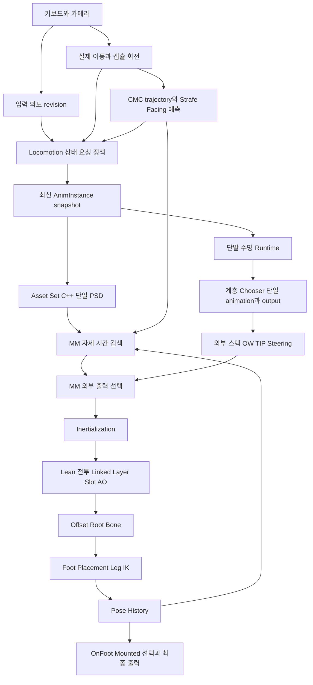

# 03. Project_J 운영 연결 상세

근거 J01-J07, S01-S08, E01-E03, H01-H04. G/A/S는 조사 시점의 확인이며 새로운 실행 결과가 아니다.

## 1. 운영 Pawn과 프로필

G/A: Config 기본 GameMode는 BP_Project_JGameMode, 기본 맵은 Lvl_ThirdPerson이다. GameMode DefaultPawn은 BP_GreatSword, native parent는 ProjectJGreatswordCharacter다. Mesh는 SKM_Quinn_Simple, AnimClass는 ABP_Humanoid_Master_C, native budgeted skeletal mesh component를 사용한다.

```text
BP_GreatSword
├─ DA_GreatSword_AnimProfile
│  ├─ DA_Player_Profile
│  └─ DA_Player_Combat
└─ CharacterMesh0
   ├─ SKM_Quinn_Simple
   └─ ABP_Humanoid_Master
      └─ Project_JCharacterAnimInstance
```

G/A: Mesh bDisablePostProcessBlueprint=false지만 SKM_Quinn_Simple.PostProcessAnimBlueprint=None이다. 시퀀스 preview의 ABP_UEFN_Mannequin_PostProcess는 운영 leader의 추가 단계가 아니다. 해당 preview 그래프의 linked input/modify bone 노드 조회만으로 운영 발 보정을 추정하지 않는다.

G/A/D: ABP_Player는 Master child가 아니며 별도 테스트 경로다. 운영 기준은 Master+Linked Layer라는 문서와 실제 Mesh 연결이 일치한다. 새 PIE에서 world override/실제 spawn은 U다.

## 2. 전체 선택·출력 흐름



G/A: Master CDO의 MotionMatchingChooserTable, DefaultPoseSearchDatabase, DefaultIdlePoseSearchDatabase는 모두 None이다. RootMotionMode는 RootMotionFromMontagesOnly다. 일반 이동의 애니메이션 루트 정보를 사용하는 것과 게임플레이 translation을 animation root motion이 소유하는 것은 다르다.

S: 입력→이동→trajectory→상태→snapshot→worker 평가라는 책임을 유지한다. Player tick에는 Super Tick 뒤 UpdateMaxWalkSpeed, ApplyCombatRotationMode, trajectory update, locomotion state update 호출 순서가 있다. 실제 엔진 movement tick 의존성과 프레임 관측은 함께 확인해야 하며 함수 순서만으로 모든 component 실행 시점을 보장한다고 단정하지 않는다.

## 3. 입력·회전·trajectory

S01: HandleMove는 SetMoveInput으로 의도를 먼저 기록하고 sprint/start replication을 갱신한 뒤 camera yaw 기준 AddMovementInput을 한다. 반전이 CMC 감속 전 속도에서 감지되게 하는 의도다. 서로 반대 방향 키의 입력 revision은 actual motion의 감속과 구분한다.

S02/A: 일반 속도 500, Sprint 700, OTM yaw 500, Run/Sprint 가속 2048·감속 2000·friction 8이다. Combat moving yaw는 프로필 360이며 forward sprint 조건 threshold 0.1과 strafe directional speed scale 비활성 설정을 확인했다.

S02: bUseControllerRotationYaw=false, moving Combat ground에서 bUseControllerDesiredRotation=true, noncombat에서 bOrientRotationToMovement=true를 사용하는 정책이다. 공중 Combat은 RInterpTo catch-up 12이며 12deg/s가 아니다. idle TIP는 authored cumulative root yaw를 추출해 clamp하여 actor에 적용하는 별도 owner다.

A/S03: 실제 BP trajectory 설정은 history/prediction length 각 1.5초, samples per second 각 5다. RotateTowardsMovementSpeed=10, MaxControllerYawRate=70, BendVelocityTowardsAcceleration=0, speed/acceleration remap 비활성이다. 이 sampling 5Hz는 프레임 업데이트 5Hz와 다르다.

S03: GenerateTrajectory는 UpdateDataFromCharacter→history→UpdatePrediction_SimulateCharacterMovement→PredictCombatStrafeFacing이다. history는 GFrameCounter로 한 프레임 한 번, 예측은 동일 프레임 정책 변경에 재생성 가능하다. parent movement callback 바인딩과 별도 update를 조정해 중복 history 전진을 막는다.

S03: Strafe facing 예측은 로컬·Combat·지상·controller desired rotation·프로필 enable 조건에서만 적용하며 공격/dodge/hit/root motion을 제외한다. actor에서 controller 목표까지 FixedTurn을 CMC yaw rate로 예측하고 camera angular velocity를 더한다. translation/past를 꺾지 않는다. 카메라가 멈춰도 몸의 catch-up을 미래 query에 표현한다.

S03: 원격 position/rotation smoothing과 facing repair는 opt-in CVar 정책이다. 무조건 켜져 있다고 가정하지 않는다. 조사한 생성 경로에 GASP 같은 월드 collision projection은 없다. 최근성/age validation, visibility eligibility, buffer reset이 있으므로 stale query와 숨김 캐릭터를 함께 고려한다.

## 4. 상태와 단일 PSD 선택

S: phase/context 우선순위는 Land·Jump/Fall·Stop·TIP·Pivot·Start·Turn·Cycle 계열을 조합한다. 물리적 공중과 표시용 landing/inAir 의미를 구분한다. 다음 함수/파일이 책임을 나눈다.

- [Locomotion Component](../../../../Source/Project_JCharacter/Private/Project_JLocomotionAnimStateComponent.cpp): authoritative/kinematic/derived context, 요청과 큰 Turn.
- [Context Builder](../../../../Source/Project_JCharacter/Public/Animation/Project_JLocomotionContextBuilder.h): selection context의 의미.
- [Asset Set](../../../../Source/Project_JCharacter/Private/Animation/Project_JMotionMatchingAssetSet.cpp): gait/mode/phase의 PSD 해석.
- [AnimInstance](../../../../Source/Project_JCharacter/Private/Animation/Project_JCharacterAnimInstance.cpp): snapshot·Chooser·단발 commit.
- [Proxy](../../../../Source/Project_JCharacter/Private/Animation/Project_JCharacterAnimInstanceProxy.cpp): worker MM 노드 적용·검색 실행/소비.

링크는 저장소의 현재 경로를 참조한다. 파일 지문과 실제 관련 경로는 Evidence snapshot도 참고한다.

A: OTM Asset Set은 Default/Idle=PSD_Idle, RunCycle=PSD_Run_Cycle, RunTurn=PSD_Run_Turn, SprintCycle/Turn 각각 Sprint PSD다. Run/Sprint Settled는 None이다.

A: Combat Strafe는 Default/Idle=CombatIdle, RunCycle=CombatRunCycle, Settled=CombatRunLoop, Turn=**PSD_Player_Locomotion 폴더의 새 CombatRunTurn**이다. SprintCycle은 CombatSprintCycle, SprintSettled/Turn=None이다. fallback은 해당 Combat family를 유지하며 OTM으로 대체한다고 가정하지 않는다.

G/S07: MM Database pin은 단일 getter이며 proxy의 SetDatabaseToSearch도 단일이다. Combat 또는 자격 있는 MovingTurn180에서 명시적 Asset Set을 사용해 legacy chooser override를 피한다. 운영 Master legacy chooser=None이므로 legacy가 ordinary selection을 실제로 다시 덮어쓰는 경로는 기본값에서 활성 아님.

S/E01: Cycle↔Turn은 InterruptOnDatabaseChange, Idle destination은 continuing invalidate를 사용하는 구분이 있다. 전환 시 이전 continuing pose의 특징/query·블렌드 보존은 전체 Cycle/Turn 신규 후보의 동시 경쟁이 아니다. 엔진은 interrupt가 이전 DB에 걸리면 그 continuing winner search를 생략할 수 있으며 invalidate 여부는 query 재구성과 별도다.

## 5. 실제 Master 주 그래프

G: 논리 StateController→TwoWayBlend A, MM→B, Alpha=1, AlwaysUpdateChildren=true. 상태 Result pose는 미연결이며 논리 갱신 목적이다.

G: BoolBlend는 True=MM, False=외부 스택, ActiveValue=NOT ShouldOverrideMotionMatching이다. 두 방향 전환 0.2, transition type Inertialization. 이후 Inertialization node가 있다.

```text
MM / 외부 Stack 선택
→ Inertialization
→ Lean mesh additive (1D AdditiveLeanRun, native Lean.X)
→ Cached Locomotion
→ Combat UpperBody Linked Layer
→ Cached Resolved Locomotion
→ UpperBody Slot (spine_03, depth 3)
→ DefaultSlot
→ AO mesh additive (Neutral AO Stand, native yaw/pitch)
→ Offset Root Bone
→ Local to Component
→ Foot Placement
→ Leg IK
→ Component to Local
→ Pose History
→ LocomotionMode OnFoot/Mounted Linked output
→ Output
```

G/A: ControlRig CR_Mannequin FootIK의 pose pin은 전부 미연결이다. 주/MM/외부 활성 경로에서 Distance Matching·Stride Warping을 확인하지 않았다. 다른 전투·리타깃/탑승 전체의 부재를 뜻하지 않는다.

G: 상태는 IdleLoop, TransitionToLocomotion, TransitionToInAir, LocomotionLoop, TransitionToIdle, InAirLoop, TIP이다. Land는 native presentation에 있으나 이 SM에 별도 Land state가 없다. 전이에는 WantsLocomotion/Idle, IsInAir/Grounded, SelectedAnimAlmostComplete, PresentationState, ShouldTIP/Abort 등 native getter가 쓰인다.

G: OnStateEntry_TransitionToLocomotion은 Entry→Return만 확인했다. 외부 스택 Update 함수는 ConvertToBlendStack→ShouldForceBlend→true ForceBlendOnNextUpdate이며 false return 흐름은 연결되지 않았다. 이 body에 Chooser/MM/ApplyNative selection은 없다. compiled alias와 UI function 이름이 다를 수 있어 본문을 기준으로 판정했다.

## 6. 두 Blend Stack과 History 설정

### MM 내부

G: Input→Result 두 노드만 존재한다. OW/Steering/ResetRoot는 일반 MM 출력에 활성 아님.

A: 노드의 BlendTime=.2, PoseJumpThreshold min/max=0, PoseReselectHistory=.3, SearchThrottle=.05, PlayRate .85-1.10, UseInertialBlend=false, ResetRelevant=true, ShouldSearch=true, CachedChannelData=false, NotifyFilter=true, MaxActiveBlends=3, StoreBlendedPose=true, NotifyRecency=.2, MaxOverride=.03, DepthMultiplier=1.1을 확인했다. OnMMStateUpdated/Initial/Become/Update 바인딩은 None이었다.

S/A: proxy는 실제 profile의 blend time, notify, MaxBlends=4, PlayRate max=1.15 등을 적용한다. 에디터 노드 3/1.10을 runtime final로 보고하지 않는다.

### 외부 스택

G/A: Asset/StartTime/Loop/BlendTime/BlendProfile은 native 값에 연결된다. DesiredPlayRate=1.0, Mirror=false, MirrorTable=None, UseInertialBlend=false, ResetRelevant=true, NotifyFilter=false, MaxBlends=4, StoreBlendedPose=true, NotifyRecency=.2, MaxOverride=0, DepthMultiplier=1이다.

G: 내부는 Input(tag StateMachineBlendStackInput)→L2C→OW→Steering→C2L→Result다. asset/time은 GetCurrentBlendStackAnimAsset/Time을 해당 player tag로 얻는다.

G/S: Steering Alpha=TIP native gate×enable_turninplacesteering(asset,time). Target=DesiredFacingQuat, ProceduralTime=10000, AnimatedTime=.5, Mirror=false. Start/Land/일반 Turn용 general steering은 활성 아님.

G/S/E03: OW는 RootBoneTransform graph mode와 spine_01-05/neck_01-02/head/ikroot/feet를 사용한다. Angle=OneShotStrafeDirectionAngle, Alpha=native CombatStrafeOW bool→float다. enable_warping(asset, actual time)×native gate는 **CurrentAnimAssetTime**에 연결되고 TargetTime=0이다. 엔진은 TargetTime>0에서만 그 시간으로 미래 root motion을 추출하므로 커브는 현재 Alpha gate가 아니다. visible bug의 크기는 U다.

### Pose History

G/A: root/foot/leg 후처리 뒤, mounted 선택 앞에 있다. PoseCount=2, interval=.04, CollectedBones/Curves=0, ResetRelevant=true, StoreScale=false, GenerateTrajectory=false, RootRecoveryTime=0, SpeedMultiplier=1, Tag=PoseHistory, 외부 trajectory getter 연결이다. native fallback PoseCount=10은 운영 BP 값이 아니다. PSS -0.4 trajectory와 two pose samples는 다른 데이터다.

## 7. Chooser 계층과 실제 행

G/A/S06: 루트 CHT_Player_StateControllerAnimations는 다음 테이블을 반환하고 native는 단일 객체를 재귀 평가한다. leaf의 output struct는 context index 2, native AnimInstance context와 별도로 StartTime/BlendTime/UseMM/Tags를 제공한다.

```text
루트
├─ OTM Ground → CHT_Player_OTM_Ground (AnimationAsset)
├─ Strafe Ground Presentation
│  ├─ TIP → CHT_Player_TurnInPlace
│  └─ Ground → Start/Stop/Pivot leaf
├─ OTM Air → CHT_Player_InAir (AnimationAsset)
├─ Strafe Air → CHT_Player_Strafe_InAir (ChooserTable)
│  ├─ FallOff → CHT_Player_Strafe_FallOff
│  ├─ Jump → CHT_Player_Strafe_Jump
│  └─ InAirLoop → CHT_Player_Strafe_InAirLoop
├─ OTM Land → CHT_Player_Land
└─ Strafe Land → stand/run/sprint leaf
```

A/G: Strafe Ground의 Start는 Run/Sprint+TransitionToLocomotion+Pivot false, Stop은 TransitionToIdle, Pivot은 Run+TransitionToLocomotion+Pivot true 조건이다.

| Leaf | 조건·후보 | 확인한 출력 |
| --- | --- | --- |
| OTM Ground | Presentation/gait/input facing delta/stop velocity delta/foot | 저장31행 UseMM=false, Idle blend .2, 나머지 .3 |
| OTM Forward Start | facing ±45 | time .1 |
| OTM Reface Start | L180[-180,-135], L90[-135,-45], R90[45,135], R180[135,180] | time .2 |
| OTM Stop | Run forward delta ±22.5 등, Sprint | Run .65, Sprint .6 |
| Strafe Start | 8 directions×2 feet, 16행 | time .2, UseMM=false, blend .3 |
| Strafe Run Pivot | previous/current direction×foot | 대각8행 Disable, cardinal8행 활성, UseMM=false |
| Strafe Run Stop | direction/foot, 16행 | .8/.6, UseMM=false, blend .3 |
| OTM InAir | transition/falloff/loop/gait 등 | 저장29행 UseMM=false, time .25/.17/0/.1/.3/.5 등 |
| Strafe Jump | gait/direction/foot | stand/lateral0, forwardRun/Sprint .2, forward diagonalRun .3, back diagonal .1, 저장29행 UseMM=false |
| Strafe FallOff | direction/foot | 활성 cardinal .8, 활성 diagonal1.1, UseMM=false |
| Strafe InAirLoop | single result | M_Neutral_Jump_Loop_Fall, time0, UseMM=false |
| OTM Land | landing meaning/strength/foot | .6/1.1/.5/1 등, 전체 저장행 UseMM=false |
| Strafe Land | captured moving/sprint, stand/run/sprint leaf | Run light .5/heavy1, blend .3, UseMM=false 확인 |
| TIP | 90L/180L/90R/180R, index1-4 | StandTurn 각 asset, time0, UseMM=false, blend .3, TIP tags |

저장 행 수는 비활성 separator를 포함할 수 있다. 열의 bDisabled=false는 행 활성의 증거가 아니다. StrafeFallOff 8/9의 UseMM=true는 None 결과의 Disable 행이며 활성 검색 경로가 아니다.

A: Pivot B→F는 L2/R2.2, F→B는 양발 .75, L→R은 L.8/R2.3, R→L은 양발 .8을 확인했다. 전체 저장16출력 UseMM=false, blend.3이다. native도 Pivot UseMM을 false로 만들어 authored timeline을 보존한다.

S06: row UseMM=true일 때 AssetsToSearch=[SelectedAsset]으로 entry MotionMatch를 호출한다. 전체 후보 배열 재비교가 아니다. global OneShot.bUseMotionMatchOnEntry는 설정되지만 이 native 분기의 AND gate가 아니다. 운영 Master에서 그 getter를 쓰는 별도 gate도 확인하지 않았다. global flag만으로 entryMM이 활성이라고 보고하지 않는다.

## 8. 단발 동작의 수명과 급격한 입력

S/H01: StateControllerRuntime은 요청 소비와 hold, Chooser cache는 asset/output/start time을 소유한다. snapshot을 고정하지 않고 최신 값으로 계속 갱신한다. context 변경만으로 재생 command를 다시 만들지 않는다.

| 동작 | 같은 episode에서 유지 | 명시적으로 재선택/종료하는 경계 |
| --- | --- | --- |
| Start | asset/output/clock, 초기 gait .15초 조정 후 확정 | 입력 해제→새 이동, 확정 후 gait 변화는 Cycle 복귀 |
| Stop | 해제 episode, 정지 전 Run/Sprint | 재입력, 다음 해제 episode |
| Land | landing epoch, 착지 당시 moving/sprint 의미 | 새 epoch, 완료/취소, fullbody/mount |
| Pivot | 새 승인 request revision과 foot/time | 새 승인 Pivot이 이전 redirect보다 우선, Stop, 일반 redirect는 MM 복귀 |
| Jump/FallOff | 공중 entry asset/output | 명시적 jump 방향 reselect, FallOff 변경, 착지/상태 이탈 |
| TIP | fixed target/sequence | 명시적 새 sequence, 같은 asset도 새 command면 재시작 |

A/S: Start mouse cancel15, move cancel30, Land mouse25, Land도 move cancel30의 입력 취소 함수 경로를 사용한다. 임계값 아래에서는 현재 clip/time을 유지하고, 초과하면 취소→최신 ground intent로 복귀한다. gait 확정 후 Start 변경도 Cycle로 돌려보낸다.

A/S: Jump reselect 설정은 enable, cooldown .08, blend .15, min blend progress .7, max clip progress .85, OTM launch angle45다. 구현에서 blend progress로 산출하는 대기도 있으므로 profile .08을 모든 경로의 실제 재선택 빈도로 단정하지 않는다. elapsed/progress를 보존하고 실패하면 이전 asset을 유지한다. 명시적 새 command는 같은 asset이어도 force blend가 가능하다.

A/S: FallOff maxhold .65, fallback lead0, idle break false다. custom LocomotionEarlyTransition notify는 PoseSearchBlockTransition과 별도의 동작 수명 허용이며 같은 의미가 아니다.

H01: 과거 Pivot은 새 승인 request를 일반 redirect가 취소했고 Land는 mode/combat 변경으로 같은 epoch에서 재시작했다. 10/05 수정 후 회귀와 사용자의 '잘된다' 확인이 있다. 현시점 미수정 문제로 다시 설계하지 않는다. 자동화는 최종 렌더 품질의 보증이 아니다.

S/H02/S07: 단발 override 종료는 최신 snapshot과 PoseHistory 기반 force request를 사용한다. 실제 검색까지 pending을 유지하고 검색 후 consume/정상 throttle을 복원한다. linked layer nested traversal의 외부 traversal이 검색 policy arm/complete를 소유하는 guard가 있다. 비활성 노드는 실제 업데이트까지 request를 유지한다. H02 후속 PIE에서 이동 Land 취소 후 Cycle 복귀가 기록되었으며 과거 Idle60ms 문제는 현재 미수정으로 분류하지 않는다.

## 9. InAirLoop의 출력 계약 불일치

G/A/S: 다음 확인 사항이 동시에 존재한다.

1. Chooser는 FallLoop animation을 반환한다.
2. IsTransitionState는 TransitionToLocomotion/Idle/InAir/Land/TIP만 포함하며 InAirLoop는 제외한다.
3. InAirLoop는 ShouldPresentationLoop=true다.
4. 외부 override 조건은 hasSelected&&IsTransitionState&&!loop다.
5. 논리 SM의 InAirLoop pose는 미연결이다.
6. Master legacy MMChooser=None이며 확인한 AssetSet은 Idle/Cycle/Turn 구조다.

I/U: 조사한 계약만으로는 FallLoop를 선택해도 외부 최종 출력을 활성화하지 않는다. 긴 fall에서 ground Idle/Cycle query/출력으로 돌아갈 가능성이 있다. **연결 불일치는 확인, 화면의 잘못된 pose는 미확인**이다. 미사용 InAir/Jump/FallOff PSD 파일의 존재를 활성 routing 증거로 삼지 않는다. 05의 P0 추적으로 owner를 확정한다.

## 10. MovingTurn180과 TIP

S05/A: MovingTurn은 매 update local ground Run, speed>=180, onfoot, input 유효, Start/Pivot/TIP/Land/air/action/montage/rootmotion 제외를 bEligible로 판정한다. OTM target=input 방향, CombatStrafe target=controller desired yaw이며 profile enable과 CMC controllerdesired가 필요하다.

S05: entry facing>=150, velocity→newinput>=135, velocity→actor<=45, input→target<=45, align 관측<=90에서 armed다. active 종료는 align<=OTM15/Strafe5, entry target에서>60 변경, input-target>45, .75초, mode/eligibility 무효다. 일반 종료 cooldown은 .1이며 eligibility 무효는 즉시 reset하고 같은 cooldown 경로가 아니다.

S/I: active 내부는 velocity 반전을 계속 entry 조건으로 요구하지 않지만 외부 speed>=180은 계속 필요하다. 반전 감속으로 빠르게 Ineligible이 될 수 있다. MinHold .18은 legacy phase 값이며 이 policy의 active minimum이 아니다. 기존 Turn45/min180 정책과 새 180 수명을 혼동하지 않는다.

H03: 남은 trace 분석 8episodes(OTM1/Strafe7)는 speed guard로 약 .008-.025초에 종료했다. OTM frame1034 TurnL180Rfoot time약.8→1035 speed159 종료→1036 ArcSmallL 사례가 있다. 이는 당시 입력/빌드/데이터 조건의 역사적 증거이며 이번에 현재 렌더 개선이 없다고 새로 관측한 것이 아니다.

S04/S02: TIP은 ControlYawStep-ActorYawStep을 누적한 unwrapped camera intent로 ±180 경계에서 같은 방향 회전을 반대로 오인하지 않도록 한다. 고정90/180target, move/air/Land 중단, 역입력 release+.25blocked, 같은 방향 remaining을 약45 넘거나 시간.75 조건의 newsequence, remaining<=5 해제 경로가 있다. actor에는 authored rootyaw 추출/clamp를 적용하며 이전 selection 대기/역전 release에서 오래된 rootyaw 적용을 억제한다.

S05: MovingTurn은 AbsFindDeltaAngleDegrees를 사용하며 같은 방향 latch는 없다. 좌우/foot은 MM에 위임한다. TIP의 경계 처리가 전체 이동에 적용되었다고 말할 수 없다.

## 11. PSD/PSS 실제 값

A: 4PSD는 PCAKDTree, PC4, neighbors200, leaf16, Exclude[0,-.3]이다.

| PSD | schema | data | bias |
| --- | --- | --- | --- |
| OTM RunCycle | PSS_Player | 15seq/889pose/613searchable/276PCA-pruned/35dim | continuing-.01, loop-.005 |
| OTM RunTurn | PSS_Player | 16seq/1008pose/686searchable/322PCA-pruned/35dim | continuing-.25, loop-.005 |
| CombatRunCycle | PSS_Combat | 76seq/5158pose/5103searchable/55PCA-pruned/35dim | continuing0/base0/loop0 |
| 새 CombatRunTurn | PSS_Combat | 180좌우×발4seq | continuing-.25/base0/loop-.005 |

pose/searchable/PCA-pruned는 조사 UI의 별도 지표이며 차이를 전부 notify 제외로 계산하지 않는다. NormalizationSet=None은 OTM RunTurn에서 확인했으며 다른 PSD로 일반화하지 않는다.

A: OTM15seq는 ArcSmall/Tight/Wide 좌우, LoopF, 8Prism이며 Hourglass/Diamond가 없다. Combat76seq에는 ArcSmall/Wide, Box, Diamond, Hourglass가 있다. Hourglass16seq를 filter로 확인했다.

A: PSS_Player/Combat은 30Hz, normalize, trajectory group4, -.4 위치XY .4, 0 속도/FacingXY2, +.35 위치/Facing .7, +.7 위치/속도/Facing .5다. pose group1, Player feet2/pelvis.5, Combat feet/pelvis 각1(위치/속도), continuing/character-space velocity 설정이다. 별도 pelvisVelocity는 root origin, XY제거=Z, Player4/Combat5, normalizefalse, time0, continuingtrue다.

A/E02: 대표 Turn은 30fps107frames108keys, rate1, 비loop, length3.566이다. exclude0-.672, BranchIn.676 length.379 DatabaseNone, override continuing-.1 .677 length1.453, BlockTransition2.127-end다. DB-.25와 override-.1은 더하지 않는다. branch null은 asset단독 entryMM의 DB수집을 성립시키지 않으며 명시적 PSD entry 검색과 별개다. branch None의 window를 PSD 전체 후보의 유일한 sampling 범위로 단정하지 않는다.

## 12. root/foot/additive 설정

G/S/A: OffsetRoot는 연결되어 일반OTM/Strafe/air RotationRelease, TIPInterpolate, TranslationRelease, HL.1/radius30을 사용한다. Release는 잔여 offset decay이며 즉시0이 아니다. FootPlacement→LegIK 연결, LegIK alpha native, rotation limittrue/hingeZ/minTheta0다.

A/S: 발 default Speed60/Ground10/ball35/replant.35/angle45/replantAngle.5/maxExt.95/min.1/separation0/unplantSpeed200/ankleTwist.75/heelAdjustfalse, stop Speed80/radius25/replant.5/angle35/replantAngle.65다. default linear250/angular450/floor1000/450/rootSmoothfalse다. stop interpolation 에셋 실제 값은 미취득이므로 native fallback500/700을 runtime 확정값으로 삼지 않는다.

S: stop foot settings는 Ground.bStopRequested로 선택하며 GASP는 DB Stops tag다. Montage policy alpha는 class default Foot1/Leg0을 확인했고 air/optimization gate도 있다. 모든 contactcurve/footlock 입력을 조사했다고 주장하지 않는다.

A/S: Lean OTM/Strafe1, clamp1, air enabled scale1, Sprint curvature disable threshold16/hysteresis3/minspeed5.5m/s다. 이미 곡선 움직임에 포함된 lean에 additive가 중복되는 것을 억제하는 설정이며 단순 lean 누락이 아니다. AO/upperbody/root 합성의 visual 오차는 최종 body에서 확인한다.

## 13. 검색·원격·군중 실제 설정

A/S08: OneShot enabled/rootChooser assigned, global entryMM true(실제 gate와 별개), phase every-update Start/Stop/Land/JumpStart/FallOff/AirLoop false, SuppressedThrottle60초, RemoteUrgent.1, MM DefaultBlend.2/Land.5/Jump.15/Air.5/Transition.2, PlayRate.85-1.15, blends4, notify.2/override.03/depth1.1이다.

A/S: idle30/moving10/startSpeedGain25/predict.25/stopIntent80/stopExit20/startCompletion.9, sharpTurn60min500/Pivot135min350, legacyTurn45min180/minhold.18/cooldown.1, SprintStopMemory.25다. 값의 존재만으로 새180policy가 모두 사용한다고 해석하지 않는다.

A/S: Combat input-turn force reselect=false(각도35/cooldown.1은 비활성 설정), Strafe direction min10/hysteresis7.5, FacingRedirect enabled entry150/exit5다. SettledCycle 성립의 모든 조건을 조사했다고 주장하지 않는다.

A/S: Near2500/Mid6000/Far12000cm, mid .033/far .083, DisableMMBeyondFar=false, Hidden data/AnimInstance .1이다. 실제 tier는 significance도 사용한다. Near foot/hand/retargetIK 활성, Mid foot/hand 활성 retargetIKoff/followeron .033, Far IKoff/followeronLOD2 .083, Hidden fullChooser/data sampling/followeroff다.

S08: worker throttle=max(phase interval,budget). 일반 Cycle은 baseline .05이므로 Mid .033을 30Hz 검색이라고 부르지 않는다. Far는 최소 .083이다. 복귀/explicit edge는 일시0 적용이 있으며 검색 후 복원한다.

A/S: remote forward-only Start=true, FarStartStopChooserDisable=true, FarLandDisable=false, StartExit15, StopSuppress.2, Urgent.1이다. remote yaw를 local controller로 추정하지 않는다. hidden wake나 RPC 추가를 새 Turn의 암묵적인 기능으로 도입하지 않는다.

## 14. 확인과 해석의 경계

확인: 단일PSD, 풍부한 CombatCycle, native 수명, 비어 있는 MM내부 보정, TIP전용 external steering, OW시간pin, rootRelease, airLoop override 불일치, movingTurn 속도gate, 예산.

해석: Cycle의 작은 회전을 유지하면서 큰 반전 수명/보정을 보완할 가치가 높다. airLoop는 출력owner 확인이 먼저다. 후보 확대/root accumulate는 실험 게이트 뒤 검토한다.

미확인: 현재 binary/source 일치, 새 PIE의 최종 pose, 모든 직업/retarget/curve/군중 비용. 다음 단계는 05의 시나리오로 확인한다.
