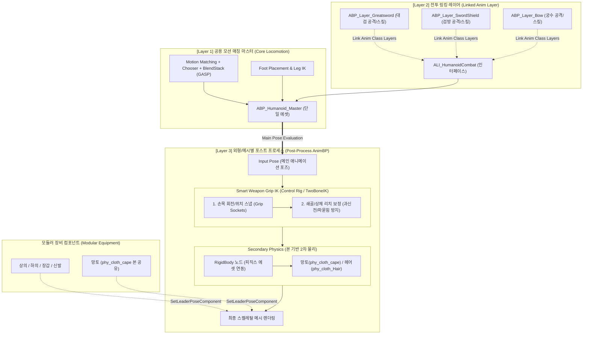

# [Project J] 차세대 휴머노이드 스켈레톤 표준 & 애니메이션 파이프라인 구조 개선 제안서
### Next-Gen Humanoid Skeleton Architecture Redesign & New Session Master Prompt

> **2026-10-02 상태 갱신:** 이 문서는 초기 구조 제안이며 아래 전체 로드맵이 구현됐다는 뜻은 아니다. 현재는 소스 마네킹의 이동/전투 합성과 임포트 몸체의 런타임 리타깃을 유지하고, 몸체 프로필·Palm 접촉 변환·Guided Hand IK 및 몽타주 가중치 복귀를 구현했다. 노드 설정과 검증은 [Guided 손 접촉](Guided_Hand_Contact.md), 무기 소유권은 [무기 정책](Weapon_Grip_Drive_Policy.md)을 우선한다. [Idle 접촉 자동 부착](Primary_Grip_Attachment.md)은 선택 모드로 구현했다. 상체 FBIK와 Post Process 전환은 후속 검토 사항이다.

> **문서 버전:** 1.0.0<br>
> **작성일:** 2026-09-27<br>
> **대상 엔진:** Unreal Engine 5.4 ~ 5.8<br>
> **핵심 키워드:** Motion Matching, GASP, Compatible Skeleton, Translation Retargeting, Post-Process AnimBP, Control Rig, Hand IK, Linked Anim Layer (`ALI_HumanoidCombat`), RigidBody Physics, Modular Character<br>
> **문서 목적:** 수백 개의 애니메이션을 에셋별로 중복 리타기팅하지 않기 위해 단일 스켈레톤/호환 스켈레톤을 채택한 현 구조에서 발생하는 **체형 차이로 인한 무기 손잡이(Grip) 미도달/손목 비틀림 현상**과 **캐릭터별 ABP 중복 생성 문제**를 근본적으로 해결하기 위한 차세대 아키텍처 제안 및 새 세션용 마스터 프롬프트 제공.

---

## 목차 (Table of Contents)
1. [기존 확정 스켈레톤 표준 및 파이프라인 가이드 (Baseline Context)](#1-기존-확정-스켈레톤-표준-및-파이프라인-가이드-baseline-context)
2. [현행 아키텍처의 한계 및 문제점 심층 분석 (Root Cause Analysis)](#2-현행-아키텍처의-한계-및-문제점-심층-분석-root-cause-analysis)
3. [언리얼 엔진 5 최신 솔루션 비교 및 기술 검토](#3-언리얼-엔진-5-최신-솔루션-비교-및-기술-검토)
4. [권장 차세대 타깃 아키텍처 (Recommended Target Architecture)](#4-권장-차세대-타깃-아키텍처-recommended-target-architecture)
5. [단계별 마이그레이션 및 구현 로드맵 (Actionable Roadmap)](#5-단계별-마이그레이션-및-구현-로드맵-actionable-roadmap)
6. [새 대화창(New Chat)용 마스터 프롬프트 (Copy & Paste Ready)](#6-새-대화창new-chat용-마스터-프롬프트-copy--paste-ready)

---

## 1. 기존 확정 스켈레톤 표준 및 파이프라인 가이드 (Baseline Context)

현재 Project J는 언리얼 엔진 5 기반의 액션 MMORPG 구조를 구현 중인 프로젝트입니다.<br>
GASP(Game Animation Sample Project)의 모션 매칭 에셋과 향후 추가될 다양한 직업/전직 시스템을 위해 아래 스켈레톤 규격과 파이프라인이 수립되어 있습니다.

### 1.1 스켈레톤 기준 및 배경
* **표준 골격(Golden Standard)**: 모든 인간형 플레이어블 캐릭터, 직업 의상, 무기 애니메이션은 언리얼 엔진 5 표준 골격인 **`SK_Mannequin`**을 단일 기준으로 삼습니다.
* **GASP(UEFN) 호환 해결**:
  * GASP는 UEFN 규격(`SK_UEFN_Mannequin`)이라 일반 마네킹에 적용 시 팔 굽음, 어깨 축소, 다리 11자 모임, IK 발바닥 고정 등의 왜곡이 발생했습니다.
  * 이를 수백 개의 에셋을 중복 복제(Duplicate & Retarget)하는 비효율적인 방식 대신, **`SK_Mannequin`의 본 트랜슬레이션 리타기팅(Translation Retargeting) 옵션 조정**과 **호환 스켈레톤(Compatible Skeleton)** 지정을 통해 에셋 복제 0개로 해결했습니다.

### 1.2 확정된 `SK_Mannequin` 본 트랜슬레이션 리타기팅 옵션
스켈레톤 에디터의 `[스켈레톤 트리] ➡️ [옵션] ➡️ [리타기팅 옵션 표시]` 적용 규칙:

| 본(Bone) 부위 | 설정값 | 이유 및 목적 |
| :--- | :--- | :--- |
| **`root`** | **`Animation`** | 점프, 롤링, 대쉬 등 루트모션(Root Motion) 스킬의 월드 이동 보존 |
| **`pelvis` (골반)** | **`Animation Scaled`** | 직업별/성별 키 차이에 맞게 높이 자동 보정 (공중 부유 및 파묻힘 방지) |
| **`spine_01 ~ 05` (척추)** | **`Animation Scaled`** | 상체 스트레칭, 허리 숙임 및 대검/스킬 타격감 볼륨을 체형에 맞게 확장 |
| **`clavicle_l / r` (쇄골)** | **`Animation Scaled`** | 어깨 으쓱임, 활 당기기, 무기 양손 파지 시 어깨가 좁아지지 않고 펴짐 |
| **목 / 머리 (`neck`, `head`)** | **`Skeleton`** | 목 늘어남 및 머리 파묻힘 방지 (시선 Aim Offset은 회전값이라 정상 작동) |
| **팔/다리 사지 (`upperarm`, `lowerarm`, `thigh`, `calf`)** | **`Skeleton`** | **팔 굽음 및 다리 11자 모임 원천 차단**; 캐릭터 본래의 뼈 길이 및 보폭 100% 보존 |
| **발 / 손목 (`foot`, `hand`)** | **`Skeleton`** | 자연스러운 발목/손목 스탠스 유지 |
| **손가락 전 마디 (`thumb`, `index` 등)** | **`Skeleton`** | 손가락 길이가 늘어나 무기 손잡이를 뚫거나 허공을 잡는 버그 방지 |
| **IK 본들 (`ik_foot_...`, `ik_hand_...`)** | **`Animation`** | 지면 접지 및 양손 무기 파지 트랜스폼 보존 (`Skeleton` 시 발이 허공/바닥에 고정됨) |

### 1.3 AnimGraph 지면 접지 (Foot Placement & Leg IK) 설정
* **`Foot Placement` 노드**:
  * `골반 세팅` ➡️ **`가로 리밸런싱 가중치` = `0.0`**, **`최대 오프셋 가로` = `0.0`** (평지/대기 상태에서 발을 몸 안쪽으로 모으는 현상 차단)
  * 다리 정의 순서: 인덱스 [0] = `foot_l`, 인덱스 [1] = `foot_r` (좌우 순서 일치)
* **`Leg IK` 노드**:
  * `Foot Placement`가 지형 레이캐스트로 계산한 `ik_foot` 위치로 실제 다리 관절(`thigh` ➡️ `calf` ➡️ `foot`)을 접어 올리는 실행자 역할 수행.
  * 사지가 `Skeleton` 모드로 고정되어 있으므로, Leg IK가 켜져 있어도 다리가 모이지 않고 자연스러운 보폭을 유지한 채 경사로 높이만 정확히 밟고 올라섬.

### 1.4 에셋 임포트 및 확장 파이프라인 (기존 수칙)
1. **새로운 캐릭터/직업 의상 메쉬(Skeletal Mesh) 임포트 시**:
   * FBX 임포트 시 새 스켈레톤을 만들지 않고 기존 `SK_Mannequin`을 지정.
2. **새로운 공격/스킬 몽타주(Anim Montage / Sequence) 임포트 시**:
   * 스켈레톤으로 `SK_Mannequin` 지정. RTG 오프라인 복제 없이 GAS 및 슬롯(`DefaultSlot`, `UpperBody`)에 즉시 등록.
3. **외부 특수 스켈레톤(GASP 등) 도입 시**:
   * 호환 스켈레톤(Compatible Skeletons)에 `SK_Mannequin`을 등록하여 공유.

### 1.5 아키텍처 및 관련 코드/문서 현황
* **Master AnimBP**: `ABP_Humanoid_Master` (공통 모션 매칭 + Blend Stack)
* **전투 레이어 인터페이스**: `ALI_HumanoidCombat` (`CombatUpperBody` 상체 오버라이딩 + `CombatLocomotion` 전신 선택)
* **C++ 동적 레이어 링킹**: `UProject_JCombatAnimationLayerComponent`
* **무기 외형 및 양손 IK**: `UProject_JWeaponPresentationComponent`, `UProject_JRetargetAnimInstance`, `UProject_JAnimNotifyState_TwoHandIK`
* **관련 문서**:
  - `Docs/HumanoidSkeletonRetargetingStandards.md`
  - `Docs/CombatAnimationComposition.md`
  - `Docs/GASP_ProjectJ_Locomotion_Parity.md`
  - `Docs/Architecture/Animation/Runtime_Retarget_HandIK_Architecture.md`
  - `Docs/Gameplay/ModularCharacterEquipmentGuide.md`

---

## 2. 현행 아키텍처의 한계 및 문제점 심층 분석 (Root Cause Analysis)

### 2.1 문제 1: 사지 `Skeleton` 설정 시 양손 무기 파지(Grip) 불일치 및 손목 뒤틀림

```text
[표준 마네킹 원본 애니메이션]
  어깨 너비: 40cm, 팔 길이: 60cm
  → 애니메이션에서 양손 사이 거리: 30cm (대검 손잡이 양 끝에 정확히 위치)

[여성/체형 다른 캐릭터 메쉬 (사지: Skeleton 모드)]
  어깨 너비: 32cm, 팔 길이: 50cm
  → 사지 뼈 길이가 고정된 상태에서 회전값(FK Angle)만 적용됨
  → 오른손에 장착된 대검 손잡이의 보조 소켓(WeaponGrip_L) 위치까지
    왼손이 물리적으로 도달하지 못함 (5~12cm 거리 결손 발생)
  → 손목이 허공을 잡거나, 무기 손잡이를 뚫고 지나가거나, 비정상 각도로 꺾임(Wrist Pop)
```

1. **기구학적 원인 (Forward Kinematics Discrepancy)**:
   * 본 트랜슬레이션 리타기팅에서 사지(`upperarm`, `lowerarm`)를 `Skeleton`으로 두면 캐릭터 고유의 뼈 길이가 유지되므로 **팔 굽음은 방지**되지만, **손의 3D 공간상 절대 도달 좌표(FK End-Effector)는 원본 애니메이션과 완전히 달라집니다.**
   * 대검, 활, 양손 도끼, 창, 총기 등 **"오른손이 잡은 무기 손잡이의 특정 위치를 왼손이 잡아야 하는"** 양손 파지 모션에서는 손 사이의 상대적 거리가 유지되지 못합니다.
2. **손목 꼬임 (Wrist Pronation/Supination Issue)**:
   * 단순 Two-Bone IK 노드로 왼손을 무기 소켓에 끌어당길 경우, 손목 회전(Rotation)과 팔꿈치 극벡터(Pole Vector)가 어긋나 손목이 180도 회전하거나 팔꿈치가 몸 안쪽으로 꺾이는 왜곡이 발생합니다.
3. **팔 과신전 (Hyperextension / Arm Lockout Popping)**:
   * 팔 길이가 짧은 캐릭터가 큰 무기의 보조 손잡이를 잡으려 할 때, 팔이 100% 한계치까지 팽팽하게 펴지면서 프레임마다 덜덜 떨리는 지터링(Popping)이 일어납니다.

---

### 2.2 문제 2: 캐릭터/의상마다 별도 ABP를 만들어 물리를 적용하는 구조의 문제점

```text
[현재 발생 중인 파편화 패턴]
BP_Warrior_Man   ──> ABP_Warrior_Man   ──> [Motion Matching 복제 or 상속] + [헤어/망토 RigidBody]
BP_Warrior_Woman ──> ABP_Warrior_Woman ──> [Motion Matching 복제 or 상속] + [헤어/망토 RigidBody]
BP_Mage_Woman    ──> ABP_Mage_Woman    ──> [Motion Matching 복제 or 상속] + [치마 RigidBody]
```

1. **로코모션 로직 중복 및 유지보수 지옥**:
   * 모션 매칭(Chooser, Pose Search Database, BlendStack, Foot Placement, 턴인플레이스)의 세부 수치나 버그를 수정할 때마다 모든 캐릭터의 개별 ABP를 일일이 열어서 수정해야 합니다.
2. **메모리 및 패키징 낭비**:
   * AnimGraph가 복제될 때마다 내부 상태 머신 노드, 포즈 캐시 메모리가 중복 할당됩니다.
3. **의상/외형 교체(모듈러 장비) 시의 결합도 증가**:
   * 플레이어가 투구/망토를 벗거나 다른 의상으로 갈아입을 때마다 ABP 전체를 스위칭하거나, 미사용 물리 본 때문에 불필요한 연산 비용이 낭비됩니다.

---

### 2.3 문제 3: 직업별 자식 BP(`BP_직업`) 중심 상속 구조의 비대화

* 현재 캐릭터 베이스(`AProject_JBaseCharacter`) 위에 `BP_Warrior`, `BP_Assassin` 등을 만들고 각자 메시와 스켈레톤, ABP를 자식에서 오버라이드하고 있습니다.
* 무기 스왑이나 전직, 커스터마이징 시 캐릭터 클래스 자체가 강하게 결합되어 있어 유연한 컴포넌트 기반 확장이 어렵습니다.

---

## 3. 언리얼 엔진 5 최신 솔루션 비교 및 기술 검토

### 3.1 솔루션 A: `Post-Process AnimBP` (포스트 프로세스 애님 블루프린트) ★ 강력 권장
* **개념**:
  * 메인 로코모션 및 전투 애니메이션은 공용 `ABP_Humanoid_Master` 단 하나에서만 계산합니다.
  * 캐릭터의 스켈레탈 메시 에셋(`USkeletalMesh`) 내부 설정의 `Post Process Anim Blueprint` 또는 컴포넌트에 **외형 전용 경량 포스트 애님BP(`ABP_PostProcess_*`)**를 등록합니다.
* **작동 메커니즘**:
  ```text
  [메인 AnimGraph: ABP_Humanoid_Master]
    ├── Motion Matching (GASP)
    ├── ALI_HumanoidCombat (공격 몽타주 / 전투 레이어)
    └── Foot Placement & Leg IK
          │ (최종 전신 포즈 전달)
          ▼
  [스켈레탈 메시의 Post-Process AnimBP]
    ├── Input Pose (메인 포즈 수신)
    ├── Hand Grip IK / Control Rig (무기 손잡이 소켓 파지 보정)
    └── RigidBody / KawaiiPhysics (해당 외형의 헤어/망토 2차 물리)
          │
          ▼ [최종 렌더링]
  ```
* **장점**:
  * `ABP_Humanoid_Master`는 물리나 특정 체형에 대해 전혀 알 필요가 없음 (100% 순수 로직 유지).
  * 캐릭터나 의상이 100개 추가되어도 메인 모션 매칭 ABP는 단 1개만 존재.
  * 피직스 에셋과 2차 물리 본(`phy_cloth_*`, `phy_Hair_*`)을 가진 캐릭터만 해당 포스트 애님BP를 달고, 물리가 없는 캐릭터는 비용이 0원.

---

### 3.2 솔루션 B: 컨트롤 릭(Control Rig) 기반의 지능형 손 파지 & 상체 리치(Reach) 보정
* **기존 TwoBoneIK의 한계 극복**:
  * 단순히 손을 소켓 좌표로 강제 이동시키는 TwoBoneIK 대신, **AnimGraph 내부 또는 Post-Process AnimBP에 Control Rig 노드**를 배치.
* **Control Rig 내부 처리 로직**:
  1. **쇄골(Clavicle) 보조 회전 (Clavicle Reach Assist)**:
     * 팔 길이가 짧아 무기 손잡이까지 거리가 팔 길이의 90%를 초과할 경우, 쇄골(`clavicle_l`)을 무기 방향으로 5~15도 회전시켜 어깨를 밀어줌. 팔이 뻣뻣하게 펴지는 현상(Lockout) 원천 제거.
  2. **손목 정렬 (Hand Transform Alignment)**:
     * 손 본(`hand_l`)의 위치뿐만 아니라 회전을 `WeaponGrip_L` 소켓의 로컬 회전에 강제 일치시켜 손목 비틀림 방지.
  3. **팔꿈치 극벡터(Pole Vector) 자동 계산**:
     * 무기 종류(대검은 바깥쪽 아래, 활은 위쪽 바깥 등)에 맞춰 엘보 방향을 자연스러운 해부학적 각도로 고정.
  4. **핑거 컬(Finger Curling)**:
     * 무기 손잡이 두께에 맞춰 손가락 뼈대(`index`, `middle` 등)를 손잡이를 감싸는 그립 포즈로 블렌딩.

---

### 3.3 솔루션 C: 가상 본(Virtual Bone) 파이프라인
* **개념**:
  * `SK_Mannequin` 스켈레톤의 `hand_r`(주손) 밑에 가상 본 `VB ik_hand_l_grip`을 생성.
  * 애니메이션에서 무기를 쥘 때 오른손 대비 왼손의 상대적 오프셋을 이 가상 본에 기록하거나, 무기 손잡이 소켓의 상대 위치를 가상 본으로 매핑.
* **장점**:
  * 캐릭터의 체형이 변해도 오른손을 기준으로 한 왼손의 상대적 공간 좌표가 보존되어 연산량이 매우 가볍고 안정적임.

---

### 3.4 솔루션 D: 리더-팔로워 런타임 리타기팅 (이종 골격 전용)
* **적용 대상**:
  * `SK_Mannequin` 호환이 불가능한 외부 골격(예: 3ds Max `Bip01`, 믹사모, 커스텀 크리처).
  * `Docs/Architecture/Animation/Runtime_Retarget_HandIK_Architecture.md`에 구축된 대로 리더 메시(`SK_Mannequin`, 숨김)에서 모션 매칭을 돌리고, 팔로워 메시(`Bip01`)가 `Retarget Pose From Mesh` 노드로 실시간 복제.
* **표준 휴머노이드와의 분리 기준**:
  * 언리얼 마네킹 계열 캐릭터는 **솔루션 A(단일 스켈레톤 + Post-Process ABP)** 사용.
  * 외부 이종 골격 캐릭터만 **솔루션 D(리더-팔로워 RTG)** 사용.

---

## 4. 권장 차세대 타깃 아키텍처 (Recommended Target Architecture)



### 아키텍처 핵심 요약:
1. **`ABP_Humanoid_Master`의 순수화 (0% Duplication)**:
   * 오직 로코모션과 발 접지만 담당하며, 모든 캐릭터/직업이 100% 동일한 인스턴스를 공유.
2. **`ALI_HumanoidCombat`의 직업별 동적 탈부착**:
   * 무기 교체 시 `LinkAnimClassLayers`로 전투 레이어만 실시간 스위칭.
3. **`Post-Process AnimBP`를 통한 외형 특화 처리**:
   * 각 스켈레탈 메시에 맞는 경량 포스트 애님BP에서 **손잡이 소켓 파지 보정(Control Rig)**과 **헤어/의상 물리(RigidBody)**만 실행.
   * 메인 로코모션과 완전히 격리되어 캐릭터 추가 비용이 극소화됨.

---

## 5. 단계별 마이그레이션 및 구현 로드맵 (Actionable Roadmap)

* **Step 1: 손 파지 보정용 Control Rig / Post-Process AnimBP 프로토타입**
  * `CR_HumanoidHandIK` 생성: 주손(`hand_r`) 기준 보조손(`hand_l`)의 `WeaponGrip_L` 소켓 스냅 및 쇄골(Clavicle) 리치 보정 로직 구현.
  * 테스트 캐릭터(`GreatSword_Woman`)에 `ABP_PostProcess_GreatswordWoman`을 할당하고 포스트 프로세스에서 손 파지 정상화 검증.
* **Step 2: 2차 물리(RigidBody)의 Post-Process 이관**
  * 메인 AnimBP에서 복잡하게 얽혀 있던 `RigidBody` 노드를 Post-Process AnimBP의 Hand IK 뒷단으로 이전.
  * 모듈러 장비(`Clothes/`) 장착 시 몸통 콜리전과 망토/헤어의 물리 반응 확인.
* **Step 3: `SK_Mannequin` 본 트랜슬레이션 리타기팅 테이블 최종 동기화**
  * 상체/쇄골은 `Animation Scaled`, 사지는 `Skeleton`을 유지하되, 체형 차이로 인한 거동 오차는 100% Step 1의 Control Rig가 흡수하도록 일원화.
* **Step 4: 성능 벤치마크 및 Dedicated Server 분리 검증**
  * 전용 서버(Dedicated Server)에서는 Post-Process AnimBP 및 물리 시뮬레이션이 자동 비활성화되도록 설정 확인.

---

## 6. 새 대화창(New Chat)용 마스터 프롬프트 (Copy & Paste Ready)

> **사용 방법:** 아래 코드 블록 전체를 복사하여 새로운 대화창에 첫 번째 메시지로 그대로 붙여넣으세요.<br>
> 프로젝트의 현재 상황, 골든 스탠다드 스켈레톤 규격, 문제의 근본 원인, 지향하는 차세대 아키텍처 요구사항이 모두 완벽히 압축되어 있어 즉시 고수준의 설계 및 구현 작업을 시작할 수 있습니다.

```markdown
# [Project J] 언리얼 5 휴머노이드 스켈레톤 & 애니메이션 아키텍처 리팩토링 요청

안녕하세요! 언리얼 엔진 5 기반 액션 MMORPG를 1인 개발 중인 Project J입니다.
현재 모션 매칭(Motion Matching) 로코모션, 직업별 전투 레이어 애님BP(Linked Anim Layer), 모듈러 캐릭터 의상 및 물리 시스템을 구축해 두었는데, **체형 차이로 인한 무기 손잡이(Grip) 불일치/손목 비틀림 문제**와 **캐릭터/의상별 애님BP(ABP) 중복 생성 문제**를 근본적으로 해결하기 위해 아키텍처를 고도화하려 합니다.

아래에 프로젝트의 현재 구조, 확립된 골든 스탠다드 스켈레톤 규칙, 현재 겪고 있는 문제점, 그리고 지향하는 목표 아키텍처를 상세히 정리해 드립니다. 이를 정밀하게 분석하고 최적의 언리얼 엔진 5 구현 방안과 단계별 실무 가이드를 제시해 주세요.

---

## 1. 프로젝트 핵심 기술 스택 및 현행 구조
1. **로코모션 마스터**: `ABP_Humanoid_Master`
   - Epic의 GASP(Game Animation Sample Project) 기반 Motion Matching + Chooser + BlendStack.
   - 단일 표준 스켈레톤인 `SK_Mannequin`을 골든 스탠다드로 채택.
2. **전투 모션 합성**: `ALI_HumanoidCombat` (애님 레이어 인터페이스)
   - 상체 오버라이딩(`CombatUpperBody`) 및 전신 전투 이동(`CombatLocomotion`).
   - C++ `UProject_JCombatAnimationLayerComponent`를 통한 런타임 레이어 링킹.
3. **무기 외형 및 양손 파지**:
   - `UProject_JWeaponPresentationComponent` + `UProject_JRetargetAnimInstance`.
   - 무기 데이터 에셋(DA)에 주 손잡이(`WeaponGrip_R`), 보조 손잡이(`WeaponGrip_L`) 소켓 정의.
   - 공격 몽타주에서는 애님 노티파이 스테이트(`UProject_JAnimNotifyState_TwoHandIK`)로 공격 스윙 중에만 왼손 IK를 1.0으로 보정.
4. **모듈러 캐릭터 및 2차 물리**:
   - 머리+몸통 통합 베이스 메쉬 위에 의상(`Clothes/` - 상의, 하의, 망토 등)을 `SetLeaderPoseComponent`로 부착.
   - 헤어/망토/치마의 2차 물리 본(`phy_cloth_*`, `phy_Hair_*`)을 스켈레톤에 두고 피직스 에셋 바디 및 AnimGraph의 `RigidBody` 노드로 시뮬레이션.

---

## 2. 확정된 골든 스탠다드: `SK_Mannequin` 본 트랜슬레이션 리타기팅 규칙
수백 개의 애니메이션을 캐릭터마다 오프라인 복제(Duplicate & Retarget)하지 않고, 단일 스켈레톤 또는 호환 스켈레톤(Compatible Skeleton)으로 공유하기 위해 아래 본 트랜슬레이션 리타기팅 테이블을 엄격히 적용 중입니다:

| 본(Bone) 부위 | 설정값 | 이유 및 목적 |
| :--- | :--- | :--- |
| **`root`** | **`Animation`** | 롤링, 대쉬, 점프 등 루트모션(Root Motion)의 월드 이동 보존 |
| **`pelvis` (골반)** | **`Animation Scaled`** | 직업/성별 키 차이에 맞게 높이 자동 보정 (공중 부유 및 파묻힘 방지) |
| **`spine_01 ~ 05` (척추)** | **`Animation Scaled`** | 상체 스트레칭, 허리 숙임 및 스킬 타격감 볼륨을 체형에 맞게 확장 |
| **`clavicle_l / r` (쇄골)** | **`Animation Scaled`** | 어깨 으쓱임, 무기 양손 파지 시 어깨가 좁아지지 않고 펴짐 |
| **목 / 머리 (`neck`, `head`)** | **`Skeleton`** | 목 늘어남 및 머리 파묻힘 방지 (시선 Aim Offset 정상 작동) |
| **팔/다리 사지 (`upperarm`, `lowerarm`, `thigh`, `calf`)** | **`Skeleton`** | **팔 굽음 및 다리 11자 모임 원천 차단**; 고유 뼈 길이 및 보폭 100% 보존 |
| **발 / 손목 (`foot`, `hand`)** | **`Skeleton`** | 자연스러운 발목/손목 스탠스 유지 |
| **손가락 전 마디 (`thumb`, `index` 등)** | **`Skeleton`** | 손가락 길이가 늘어나 무기를 뚫거나 허공을 잡는 버그 방지 |
| **IK 본들 (`ik_foot_...`, `ik_hand_...`)** | **`Animation`** | 지면 접지(Foot Placement) 및 양손 파지 트랜스폼 보존 |

* **Foot Placement & Leg IK 세팅**:
  - `Foot Placement` 노드: 골반 세팅 가로 리밸런싱 가중치 `0.0`, 최대 오프셋 가로 `0.0`. 다리 인덱스 [0]=`foot_l`, [1]=`foot_r`.
  - 사지가 `Skeleton` 모드이므로 Leg IK가 켜져 있어도 다리가 11자로 모이지 않고 보폭을 유지하며 지형에 접지됨.

---

## 3. 현재 직면한 핵심 문제 및 한계 (Pain Points)

1. **사지 `Skeleton` 설정과 무기 파지(Grip)의 충돌 (손목 비틀림 / 미도달)**:
   - 사지 뼈 길이가 고정된 상태에서 표준 마네킹 기준의 회전각(FK)만 전달받다 보니, 키가 작거나 팔이 짧은 캐릭터(예: 여성 전사 `GreatSword_Woman`)는 대검 등 양손 무기를 쥘 때 **왼손이 무기 손잡이 소켓(`WeaponGrip_L`)까지 닿지 못하고 허공에 뜨거나 손목이 꺾이는 현상**이 발생합니다.
   - TwoBoneIK로 억지로 손목을 당기면 팔꿈치가 뒤틀리거나(Pole Vector 붕괴), 팔이 100% 팽팽하게 펴지며 관절이 튀는(Arm Popping) 문제가 있습니다.
2. **캐릭터/외형별 개별 ABP 생성 및 물리 중복 (유지보수 분산)**:
   - 캐릭터나 외형 의상마다 헤어/망토 물리(`RigidBody`)를 돌리기 위해 별도의 ABP를 만들거나 복제하면서, 메인 로코모션 수정 시 모든 ABP를 고쳐야 하는 심각한 유지보수 부담이 생겼습니다.
3. **직업 BP(`BP_직업`) 자식 클래스 구조의 비대화**:
   - 스켈레톤과 ABP를 자식 BP 단위에서 교체하려다 보니 아키텍처가 경직되어 있습니다.

---

## 4. 우리가 원하는 개선 방향 및 목표 아키텍처

우리는 다음과 같은 **3계층 모듈러 애니메이션 파이프라인**으로 리팩토링하고자 합니다:

1. **Layer 1: 공용 모션 매칭 코어 (`ABP_Humanoid_Master`)**
   - 어떠한 캐릭터별 물리나 외형 특화 로직도 포함하지 않는 순수한 로코모션/발접지 마스터 (모든 캐릭터 공유, 중복 0개).
2. **Layer 2: 직업/무기별 전투 링킹 레이어 (`ALI_HumanoidCombat`)**
   - 무기 교체 시 동적으로 꽂히는 공격/스킬 몽타주 및 전투 대기 레이어.
3. **Layer 3: 외형 전용 포스트 프로세스 애님BP (`Post-Process AnimBP`) + 스마트 핸드 IK (Control Rig)**
   - 각 스켈레탈 메시 에셋에 `PostProcessAnimBlueprint`로 등록되어 메인 포즈가 끝난 뒤 최종적으로 실행.
   - **Control Rig 기반 손 파지 보정**:
     - 주손/보조손 무기 소켓 정렬.
     - 팔이 짧을 경우 쇄골(`clavicle_l`)을 자연스럽게 앞으로 밀어주는 상체 리치(Reach) 보정으로 팔 팝핑 방지.
     - 손목 회전 스냅 및 해부학적 팔꿈치 극벡터 유지.
   - **2차 물리 (`RigidBody`) 격리**:
     - 해당 메쉬의 헤어/망토 피직스 에셋만 독립적으로 시뮬레이션.
4. **이종 골격(Bip01 등)의 경우**:
   - 기존의 검증된 리더-팔로워 런타임 리타기팅(`Retarget Pose From Mesh`)을 보조 파이프라인으로 유지.

---

## 5. 요청 사항 (구체적인 가이드 및 코드/블루프린트 구성 안내)

위 배경과 목표를 바탕으로 다음 질문들에 대해 언리얼 엔진 5.4~5.8 최신 모범 사례에 입각한 구체적이고 실무적인 솔루션을 제시해 주세요:

1. **Post-Process AnimBP 설정 및 파이프라인 상세**:
   - 스켈레탈 메시의 `Post Process Anim Blueprint`에 등록할 경량 애님 그래프의 표준 노드 구성 (`Input Pose` ➔ `Control Rig` ➔ `RigidBody` ➔ `Output Pose`) 방법.
   - 전용 서버(Dedicated Server) 및 거리별 LOD에서 포스트 프로세스 연산 비용을 0으로 최적화하는 방법.
2. **무기 파지 보정용 Control Rig 노드 구성법**:
   - 체형(팔 길이, 어깨 너비)이 달라도 대검/활/창 등 양손 무기의 보조 손잡이 소켓(`WeaponGrip_L`)을 자연스럽게 쥐게 만드는 Control Rig 그래프 구조 (쇄골 회전 보정 및 TwoBoneIK/FBIK 솔버 활용법).
3. **모듈러 의상(`Clothes/`)과 물리(`RigidBody`)의 상호작용 정리**:
   - `SetLeaderPoseComponent`로 결합된 상의/망토에서 몸통 피직스 에셋의 콜리전 캡슐과 망토의 `phy_cloth_cape` 본이 뚫리지 않고 자연스럽게 충돌하도록 만드는 최적 세팅.
4. **현 프로젝트 기준 단계별 마이그레이션 순서**:
   - 기존 C++ `UProject_JWeaponPresentationComponent` 및 `UProject_JRetargetAnimInstance`와 충돌 없이 점진적으로 이 구조로 이전하는 구체적 작업 절차.
```

---

## 7. 관련 참고 문서 링크
* [모듈러 캐릭터 및 의상 파이프라인 가이드](file:///c:/Users/I/Documents/GitHub/Project_J/Docs/Gameplay/ModularCharacterEquipmentGuide.md)
* [런타임 리타기팅 & 무기 손 IK 아키텍처 명세서](file:///c:/Users/I/Documents/GitHub/Project_J/Docs/Architecture/Animation/Runtime_Retarget_HandIK_Architecture.md)
* [대검 전투 애니메이션 오더링 가이드](file:///c:/Users/I/Documents/GitHub/Project_J/Docs/Combat/GreatswordCombatAuthoringGuide.md)
* [전투 애니메이션 합성 구조 명세서](file:///c:/Users/I/Documents/GitHub/Project_J/Docs/Combat/CombatAnimationComposition.md)
