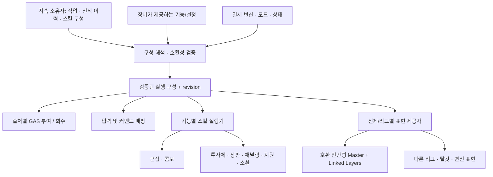

# 콘텐츠 확장 구조 검토 — 2026-09-13

상태: **현재 C++/문서 기반 진단과 후속 설계안**. 이 문서는 아래 구조를 이미 구현했다고 주장하지 않는다. 직전 내부 리팩터링의 빌드·54개 테스트 결과와 구분한다. 이번 검토에서는 런타임 코드와 ABP 에셋을 변경하지 않았다.

## 판단

공통 Master ABP, Linked Anim Layer, 데이터 기반 AttackDefinition/ComboDefinition, GAS AbilitySet과 서버 권한 구조는 유지할 가치가 있다. 다음 확장 비용은 공통 그래프 자체보다 **직업·전직·장비·일시 변신을 합치는 규칙, 지속 상태의 소유권, 데이터 간 호환성 검증**에 집중되어 있다.

모든 콘텐츠에 하나의 거대한 실행기를 적용하지 않는다. 같은 스켈레톤/레이어 계약을 사용하는 인간형은 공통 Master를 공유하고, 다른 리그·신체 구성은 별도 표현 제공자를 사용할 수 있어야 한다. 공통 규칙은 데이터 계약·권한·수명이며, 콘텐츠 구현은 도메인이 소유한다.

## 코드에서 확인한 확장 제약

| 우선순위 | 관찰한 현재 동작 | 확장 시 영향 | 제안 |
|---|---|---|---|
| 높음 | `PlayerCharacter::GetCombatStyleDefinition`은 `CurrentCombatStyle`을 먼저 반환하고 직업/전직 스타일은 fallback | 장비 스타일과 전직 변경을 함께 적용하려면 여러 데이터 에셋을 복제하거나 개별 분기할 가능성 | 기본 직업, 전직, 장비, 일시 상태의 적용 범위를 명시하는 구성 해석기 |
| 높음 | ASC는 플레이어 PlayerState에 있지만 `AdvancementDefinition`, `AdvancementGrantedHandles` 등은 BaseCharacter 멤버 | 리스폰·아바타 교체 시 지속 상태와 능력 회수 정보의 수명이 달라짐 | 플레이어의 직업/전직 진행 상태·부여 출처를 지속 소유자에 보관하고 Pawn은 실행/표현 연결 담당. NPC는 캐릭터 소유 adapter |
| 높음 | 전직 정의는 BaseClass, 레벨, required/blocked tags, Additive/Replace 정책 제공. 선행 전직 그래프와 획득 이력은 명시적 모델이 아님 | 다단계·분기·전직 변경 조건을 여러 태그 관례에 분산하게 됨 | 안정된 전직 ID, 선행 조건, 배타 분기, 획득 이력, 변경 정책을 명시하고 그래프 검증 |
| 높음 | `CombatStyleDefinition::IsDataValid`가 모든 스타일에 ComboDefinition을 요구 | 콤보 없는 단발 주문·지원·소환 스타일도 콤보 데이터를 요구받음 | 실제로 제공하는 실행 기능에 따른 검증. 콤보를 사용하는 실행기만 콤보 그래프 요구 |
| 중간 | AttackDefinition은 피해·조건·HitSpec과 montage/section/root-motion 정책을 함께 보유 | 공통 공격 규칙을 다른 리그/직업 표현으로 재사용할 때 결합이 커짐 | 공격 규칙과 표현 변형을 구분하되 서버 판정 타이밍·권한 root motion은 명시적으로 유지 |
| 중간 | class/advancement/장비에서 AbilitySet을 부여하며 grant source 추적 기능이 이미 존재 | 출처별 유지·대체·회수 규칙이 콘텐츠별 코드로 갈라지기 쉬움 | 기존 grant source 기능을 확장해 출처 ID/세대와 수명을 통일. 공유 능력 중복 처리도 명시 |
| 중간 | Combat/Mounted 전용 레이어 소유자가 있고 Swimming/Vehicle/Transformed 모드는 선언되어 있음 | 새 신체/이동 모드마다 링크·해제·복귀 조정 코드가 추가될 수 있음 | 전체 신체 레이어 선택 및 복귀를 조정하는 소유자와 기능별 표현 제공자 계약 |
| 중간 | 직업 registry 초기화가 지정된 soft asset을 동기 로딩하고 style은 여러 데이터/표현을 강하게 참조 | 직업/전직/외형 증가에 따라 초기 로딩 및 서버의 표현 에셋 의존성 점검 필요 | Primary Asset ID와 gameplay/presentation bundle 구분. 실제 사용 구간별 preload/lease; 무조건 모든 참조를 soft로 바꾸지 않음 |
| 중간 | style/attack/combo 등 개별 validator는 존재하지만 직업→전직→스킬→입력→공격→레이어 전체 호환 검증은 제한적 | 개별 에셋은 정상이어도 조합에서 누락/중복이 발생 | 조합 단위 데이터 검증 및 대표 직업/전직 fixture |
| 연결 시 적용 | MMO feature catalog와 service port는 메타데이터/계약이며 콘텐츠 실행 관리자가 아님 | 등록 항목만으로 활성화·저장·UI 연결까지 구현된 것으로 오해할 수 있음 | 실제 도메인 구현에 등록/활성화/해제 수명, 버전, 상태 소유자, 요청·이벤트 adapter를 연결 |

근거 파일:

- [직업·전직 정의](../../Source/Project_JCharacter/Public/CharacterClass/Project_JCharacterClassDefinition.h)
- [직업 등록과 조회](../../Source/Project_JCharacter/Private/CharacterClass/Project_JCharacterDataSubsystem.cpp)
- [직업·전직 적용과 능력 부여](../../Source/Project_JCharacter/Private/Project_JBaseCharacter.cpp)
- [현재 전투 구성 선택](../../Source/Project_JCharacter/Private/Project_JPlayerCharacter.cpp)
- [전투 스타일 validator](../../Source/Project_JCharacter/Private/Combat/Project_JCombatStyleDefinition.cpp)
- [공격 정의](../../Source/Project_JCharacter/Public/Combat/Project_JAttackDefinition.h)
- [기존 능력 부여 출처](../../Source/Project_JCharacter/Private/AbilitySystem/Project_JAbilitySet.cpp)
- [전투 레이어](../../Source/Project_JCharacter/Private/Components/Project_JCombatAnimationLayerComponent.cpp)
- [MMO 서비스 계약](../../Source/Project_JMMO/Public/MMO/ServicePort.h)

## 목표 흐름

### 작성 방식 자체의 재검토

사용자 요구에는 기존 DA 연결의 정리뿐 아니라 **DA를 나누는 방식과 콘텐츠 작성 절차의 대체**도 포함된다. DA 개수를 늘리는 것을 확장성의 지표로 삼지 않는다. 작성자가 유지하는 원본 데이터와 실행 시 사용하는 구성을 구분한다.

현재 전투는 Class/Advancement → CombatStyle → AbilitySet/AttackSet/Combo/Command/AnimationProfile로 연결된다. 같은 공격이 AttackSet 목록과 Combo 노드에 각각 참조될 수 있으며, style validator는 Combo를, attack validator는 Montage를 필수로 요구한다. 이는 현재 근접 전투에 맞춘 구조다. 모든 미래 콘텐츠에 동일한 DA 묶음을 강제하는 기준으로 사용하지 않는다.

권장 작성 모델:

| 데이터 성격 | 권장 원본 | 별도로 분리하는 기준 |
|---|---|---|
| 직업·스킬·아이템처럼 독립 ID와 수명이 필요한 콘텐츠 | 해당 콘텐츠의 대표 Definition/Primary Asset | 독립 조회·버전·재사용·로딩 단위 |
| 한 스킬에만 속하는 타격 단계·조건·표현 옵션 | 대표 정의 내부의 타입이 정해진 구조체/기능별 설정 | 다른 콘텐츠에서 실제로 공유하거나 독립 관리할 필요가 생길 때 공유 에셋으로 승격 |
| 성장 계수·레벨별 수치·반복되는 정형 밸런스 데이터 | 타입이 정해진 테이블/커브 | 대량 편집·비교·검증에 적합한 표 구조 |
| 여러 직업이 사용하는 애니메이션·VFX·공통 공격 패턴 | 공유 DA/프로필 | 아티스트 소유권·재사용·로딩 요구가 분명한 단위 |
| 비용·예측·취소·충돌·서버 권한 같은 실행 의미 | C++/GAS 실행기 | 데이터가 정의된 동작을 선택·설정하며, 임의의 게임 코드를 대체하지 않음 |
| 쿨다운 잔여·습득 스킬·전직 이력·아이템 상태 | 런타임 상태와 영속 저장 | 여러 플레이어가 공유하는 정의 에셋에 기록하지 않음 |

작성 흐름은 `콘텐츠 정의/프리셋 → 타입·참조·호환성 검증 → 실행 구성 생성 → 기존 GAS/표현 소비자`를 목표로 한다. 대표 정의는 명확한 기능별 설정을 포함하며 모든 스킬에 무제한 fragment 조합이나 범용 스크립트 그래프를 강제하지 않는다.

예를 들어 콤보 없는 단발 스킬은 스킬 정의 안에서 실행 유형·피해·표현을 설정한다. 콤보 그래프가 필요한 스킬만 그래프를 제공한다. 전직 변형은 기본 스킬의 명시적으로 허용된 항목을 재정의하고, 설정 출처를 표시한다. 독립 관리할 이유가 없는 AttackSet/AbilitySet 등의 **파생 연결 정보**는 검증된 구성에서 만들어 중복 저작을 줄이는 방향을 검토한다. 기존 시스템이 DA 타입을 요구하는 전환 기간에는 adapter가 그 계약을 유지한다.

실행 구성 생성은 우선 로딩/구성 변경 시 한 번 수행하고 revision과 함께 재사용한다. 에디터/cook 단계에서 미리 생성하는 방식은 실제 규모와 빌드 요구가 확인되면 적용한다. 별도 저작 도구를 만들기 전에도 타입별 Details 구성, 템플릿과 조합 validator로 작성 부담을 줄일 수 있다.

다른 콘텐츠도 동일한 판단 기준을 사용한다. 퀘스트는 단계·목표, 아이템은 기능별 속성, 상호작용은 실행 및 취소 조건을 중심으로 작성하되 각 도메인의 실행 규칙은 유지한다. 모든 콘텐츠를 한 종류의 거대한 DA 또는 범용 실행기로 통합하지 않는다.

구성 해석기는 모든 필드에 동일한 우선순위를 강제하지 않는다. 예를 들어 장비 외형은 장비가 제공하고, 전직의 스킬 교체는 전직 규칙이 결정하며, 일시 변신은 허용된 이동/표현 영역만 덮어쓸 수 있다. 각 값의 출처를 진단할 수 있어야 한다.

## 전체 확장에 적용할 공통 기준

- **직업·전직·스킬:** 영속 식별자와 runtime grant handle 분리. 리스폰·재접속·전직 대체 후 중복 부여/잘못된 회수가 없어야 한다.
- **애니메이션·장비·탈것·변신:** 리그/소켓/레이어 계약 검증, full-body 소유권과 overlay 조합 규칙, 비동기 로딩 완료의 revision 확인.
- **전투 실행:** GAS가 활성화·비용·쿨다운·예측·취소를 소유한다. 근접, 투사체, 채널링 등 의미가 다른 실행기는 작은 별도 책임으로 구현한다. 데이터만으로 가능한 변형은 실행기를 재사용한다.
- **인벤토리·제작·강화·거래:** 아이템 InstanceId, 출처와 소유권, 버전/중복 명령 처리, 여러 소유자의 변경 조정을 도메인 경계에서 적용한다.
- **퀘스트·업적·파티·길드·이벤트:** 안정된 도메인 이벤트/조회 모델을 이용한다. 임의 메시지 한 종류에 모든 변경과 오류를 싣지 않는다.
- **UI·입력:** 콘텐츠 ID 및 읽기 모델에 연결한다. 플레이어 캐릭터나 특정 직업 클래스를 직접 캐스팅하는 새 경로를 늘리지 않는다.
- **네트워크·저장:** 클라이언트는 의도와 식별자를 보내고 서버는 정의/요구 조건을 해석한다. 공유 MMO 계약과 도메인별 payload schema를 구분한다.
- **스레딩:** 구성 변경·GAS·UObject 적용은 GT에서 일관된 revision으로 게시한다. 대량 계산은 값 스냅샷으로 분리하고 크기가 충분한 배치에만 worker를 사용한다. 직업 하나를 바꿀 때마다 비동기 task를 만드는 방식은 피한다.

## 구현 순서와 완료 기준

1. **지속 진행 상태와 능력 출처 정리:** 기존 부여 코드를 adapter로 유지하며 플레이어/NPC 소유권 분리. 아바타 교체, 중복 적용, Additive→Replace 전환을 검증한다.
2. **구성 해석기:** 현재 장비 우선 fallback을 기본 호환 정책으로 보존한 뒤 전직/장비 조합 정책을 명시한다. 구성 실패 시 기존 유효 구성을 유지하고, 모든 소비자가 같은 revision을 보게 한다.
3. **스킬/공격 확장 계약:** 콤보 필수 조건을 실행 기능에 맞게 바꾸고 단발·콤보·채널링 등의 실행 수명과 데이터 검증을 분리한다. 새 스킬을 추가할 때 PlayerCharacter 함수가 늘지 않아야 한다.
4. **표현 제공자 조정:** 기존 Master/Linked Layer를 그대로 연결하는 adapter부터 적용한다. 다른 리그, 전직 override, 탑승/변신 복귀의 소유권을 검증한다. 실제 ABP 연결 확인은 별도 에셋 검증 범위다.
5. **로딩·검증·다른 콘텐츠 연결:** 대표 조합을 검증하는 authoring 도구, 필요한 asset bundle, 도메인별 확장 수명을 연결한다. metadata-only인 기능은 구현 완료로 표시하지 않는다.

각 단계는 기존 공개 UFUNCTION·에셋 경로·네트워크 식별자를 보존하면서 전환한다. UObject 타입의 모듈 이동은 직렬화 경로 및 CoreRedirect 영향을 확인한 뒤 필요한 경우에만 수행한다. 콘텐츠마다 빈 모듈/플러그인을 선제적으로 생성하는 것은 이 설계의 목표가 아니다.
