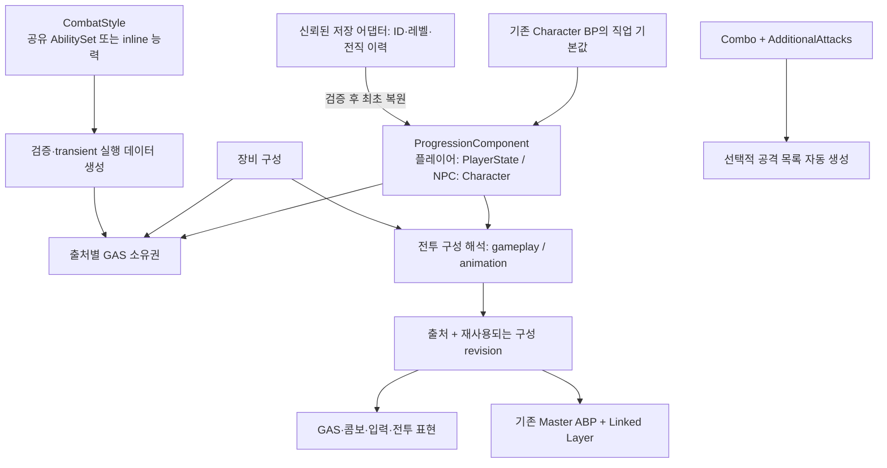

# 직업·전직·전투 콘텐츠 확장 기반 — 2026-09-19

후속 변경: [내부 갱신·수명 정리](Internal_Polish_2026-09-19.md) 및 [직업·전직 제작 도구](Content_Bundle_Authoring_2026-09-19.md). 아래 빌드·61개 테스트 결과는 확장 기반을 처음 적용한 당시의 기록이다.

9월 13일의 [설계 검토](Extension_Architecture_Review_2026-09-13.md)를 기반으로 런타임 소유권, 구성 선택, DA 작성 방식과 검증 경로를 구현했다. 기존 Master ABP/Linked Layer와 공개 캐릭터 API를 연결점으로 사용한다. 에셋 이동·일괄 변환은 필요하지 않다.

## 소유권과 데이터 흐름

### 지속 진행 상태

- `UProject_JProgressionComponent`가 직업·현재 전직·레벨·취득 이력과 부여 핸들을 소유한다. 플레이어 아바타를 교체해도 PlayerState와 ASC가 유지되면 이 상태도 유지된다.
- 캐릭터의 기존 직업/전직 필드는 **최초 기본값**이다. 조회 API는 초기화 이후 지속 소유자의 상태를 읽는다. 리스폰의 BP 기본값으로 이전 진행을 덮어쓰지 않는다.
- public 상태는 하나의 복제 구조체로 전달하고 전체 취득 이력은 owner-only로 복제한다. 변경 완료 시 revision과 이벤트를 게시하며 PlayerState의 공개 직업/레벨 및 기존 ViewModel을 갱신한다. 레벨만 바뀌면 전투 구성 revision과 입력 기록을 유지한다.
- `RequiredAdvancementIds`는 모두 취득해야 하는 선행 조건이다. 동일 `ExclusiveBranch`의 전직을 Additive로 동시에 활성화할 수 없다.
- `ReplacePreviousAdvancement`는 그동안 누적된 **전직 부여 묶음 전체**를 회수한다. 직업·장비 소유권과 취득 이력은 보존한다. 재전직/전직 초기화는 별도 도메인 명령으로 추가해야 하며, 동일 취득 ID의 반복 적용은 거절한다.
- 레지스트리는 ID 중복, 정확한 BaseClass 참조, 없는 선행 ID, 자기 참조, 순환, 타 직업 선행 조건을 검사한다. 잘못된 전직 그래프는 서버 조회에 게시하지 않는다.
- 변경 중 재진입을 막고 취득 이력은 최대 256개로 제한한다. 여러 캐릭터의 값 계산을 병렬화할 수 있어도, 한 캐릭터의 진행·GAS 변경은 GT에서 직렬 적용한다.

### 저장 경계

`CaptureSnapshot()`은 schema version, ClassId, Level, 순서가 있는 AdvancementHistory만 복사한다. UObject/ASC/AbilitySpec handle을 저장하지 않는다. 복사 이후의 인코딩·저장은 어댑터가 담당할 수 있다.

`RestoreSnapshot()`은 신뢰된 서버 어댑터가 ID를 정의로 해석한 뒤, 아직 초기화하지 않은 소유자에 한 번 호출한다. 버전·크기·ID 대응·중복·선행 순서·직업·배타 분기를 모두 확인한 후 현재 정책에 따른 활성 전직만 다시 부여한다. 과거 취득 당시의 레벨/태그 조건은 재실행하지 않는다. 취득 사실은 신뢰된 저장 데이터의 책임이다.

**DB 연결, 저장 CAS/마이그레이션 정책, 재접속 세션 재구성, PlayerState 교체를 수반하는 seamless travel 및 서버 handover payload 연결까지 구현한 것은 아니다.** 기존 handover v1 위치/레벨 직렬화와 구분한다. 정의가 제거되거나 정책이 변경된 저장 데이터는 콘텐츠 버전 마이그레이션을 거쳐야 한다.

### 공유 능력 수명

동일 스타일을 직업과 장비가 함께 제공하면 GAS spec/effect는 한 번 생성하고 제공자마다 소유권을 얻는다. 마지막 제공자가 해제할 때 회수한다. 같은 핸들 묶음의 중복 부여·해제는 다른 제공자의 소유권에 영향을 주지 않는다.

같은 스타일/세트의 정체성은 전체 경로로 구분하므로 다른 폴더의 같은 파일명이 충돌하지 않는다. 서로 다른 스타일이 같은 Ability 클래스를 사용하면 별개의 spec으로 취급한다. 같은 입력에 서로 다른 spec을 의도 없이 연결하지 않도록 조합 검증이 필요하다. 스타일 내부의 공유/inline 입력 중복은 validator가 거절한다.

## 작성 방식

기존 `AbilitySets`, `AttackSet`, `ComboDefinition`, 애니메이션 프로필 참조는 유지한다. 새 콘텐츠는 다음 옵션을 사용할 수 있다.

| 설정 | 사용 방법 |
|---|---|
| `InlineAbilities`, `InlineEffects` | 해당 스타일에만 속하는 능력/효과를 스타일 안에서 작성. 공용 능력 묶음만 별도 AbilitySet으로 공유 |
| `bDeriveAttackCatalog` | Combo 노드와 AdditionalAttacks에서 공격 목록 생성. 이 모드에서는 별도 AttackSet을 지정하지 않음 |
| `bUsesCombo = false` | 콤보가 없는 GAS 스타일. 실행은 지정한 GameplayAbility가 담당 |
| `bRequiresWeaponAnimation = false` | 무기 애니메이션 프로필이 필요 없는 스타일 |
| Attack의 `bMontageDriven = false` | 몽타주 없는 능력 실행기가 읽는 공격 데이터. root motion 및 기존 콤보 실행기의 몽타주 요구는 그대로 유지 |

생성된 AbilitySet/AttackSet은 transient이며 공유 스타일당 최초 필요 시 생성·재사용된다. 입력마다 새 UObject를 만들지 않는다. 새로운 작성 모드는 사용 전에 검증하며, 잘못된 구성이면 능력을 부분 부여하거나 기존 장비 슬롯을 먼저 해제하지 않는다. 정의는 플레이 중 불변으로 취급한다. 에디터 저작 변경 후에는 PIE를 다시 시작한다.

이 단계는 모든 스킬의 비용·예측·취소를 새 범용 실행기로 옮기지 않는다. GAS가 계속 책임진다. 투사체/장판/채널링/소환 실행기와 독립 스킬 습득·슬롯 편집 UI는 실제 콘텐츠를 추가할 때 구현한다.

## 직업·전직·장비 조합

기본값은 기존처럼 장비 스타일 전체 우선, 없으면 전직 → 직업 순이다. 전직에서 `bOverrideEquippedGameplay`를 켜면 전직 스타일이 콤보·커맨드·스타일 VFX를 제공하고 장비 스타일이 무기 애니메이션을 제공한다. VFX의 전직/장비 cue override 순서는 기존과 같다.

`GetCombatConfiguration()`은 각 영역의 출처와 revision을 제공한다. 동일 클래스·전직·장비 구성에서는 revision을 재사용하며, 입력/GAS와 애니메이션 getter가 같은 해석 결과를 읽는다. **이 옵션은 부여된 능력 전체를 교체하는 정책이 아니다.** 전직 능력 Additive/Replace와 장비 능력 수명은 독립적인 정책이다.

조합할 몽타주·무기·스켈레톤·애니메이션 레이어의 실제 호환성은 콘텐츠 제작자가 확인해야 한다. 현재 코드만으로 ABP 그래프/스켈레톤 연결을 검증했다고 주장하지 않는다. 일시 변신의 full-body 소유권 조정 및 임의 리그 표현 제공자 체계는 후속 연결 범위다.

## 검증

- `Project_JEditor Win64 Development`: 직접 UBT 빌드 성공.
- `Project_J Win64 Development`: 직접 UBT 빌드 및 최종 재링크 성공.
- NullRHI 자동화 **61개 통과 / 오류 0 / 경고 0**: 확장 테스트 7개 + 기존 회귀 54개.
- 모듈 DAG 및 MMO 카탈로그 **205개 / 20개 영역** 검사 통과. 새 모듈 의존성을 추가하지 않았다.
- `git diff --check` 통과. 실행 시 소스 스냅샷 SHA-256과 최종 작업 파일 일치를 확인했다.

[검증 JSON](Extension_Foundation_Validation_2026-09-19.json)에 빌드 로그·자동화 보고서 경로/해시, 테스트 목록, 소스 해시를 기록했다. 로컬 원본은 `Saved/Validation/ExtensionArchitecture_20260919/Regression03`에 있다.

신규 테스트는 공유 능력의 마지막 제공자 회수, 전직 분기/교체/재진입과 저장 복원, 순환 그래프, inline 작성 충돌과 잘못된 장착의 무변경 거절, 구성 영역 선택, 실제 PlayerState를 공유하는 아바타 교체·공개/UI 표시·구독 해제를 다룬다. 기존 회귀에는 stop→idle, 입력 해제, 전투 판정·수명, 장비 soak, 애니메이션 budget, handover 및 MMO 계약이 포함된다.

게임 재빌드 중 생성 파일 접근/공유 오류가 있었다. 실행 프로세스·Windows Application 이벤트 로그를 확인하고 최종 실행 파일을 다시 링크해 성공을 확인했다. 정확한 잠금 주체는 확인되지 않았으며, 런타임의 병렬 처리 정책은 변경하지 않았다.

성능 수치 향상은 주장하지 않는다. 새 Tick/worker task를 추가하지 않았고 변경 시 해석과 공유 실행 데이터 캐시를 사용한다. 대규모 동시 접속 성능이나 실제 멀티클라이언트 복제 검증을 대신하는 결과는 아니다.
