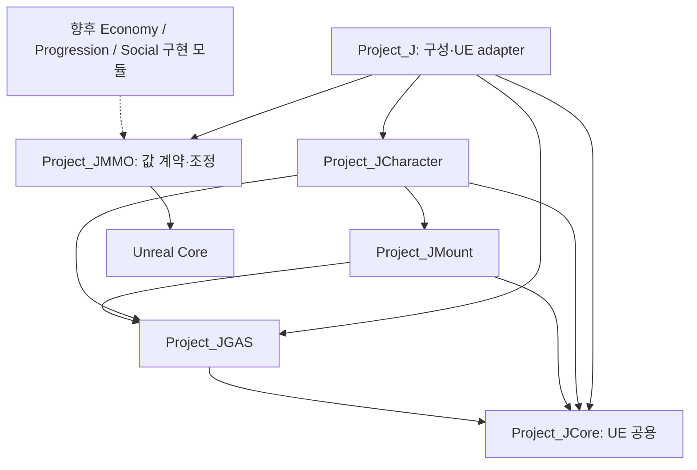
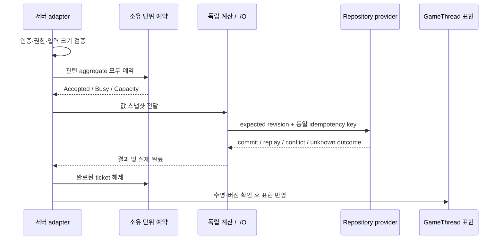

# MMORPG 확장 기반과 콘텐츠 경계

2026-09-12, 실제 main 작업 디렉터리. 목적은 콘텐츠 전체를 지금 구현하는 것이 아니라 이후 구현에서 공유할 계약·동시성·저장 경계를 마련하는 것이다. **205개 항목은 구현된 콘텐츠 수가 아니다.** [전체 카탈로그](MMO_Content_Catalog.md)는 20개 영역의 콘텐츠·운영 기능·기반 계약을 담는다. 카탈로그는 기능을 활성화하거나 서버에 접속하지 않는다.

## 조사와 적용 범위

현재 서비스의 공식 콘텐츠 설명을 참고했다. 아래 게임의 서버 내부 구조를 알 수 있다는 뜻은 아니며, 프로젝트 모듈 설계는 코드 분석을 바탕으로 한 자체 설계다.

| 공식 자료 | 확인한 콘텐츠 패턴 | 프로젝트 확장 영역 |
|---|---|---|
| [WoW Warbands](https://worldofwarcraft.blizzard.com/en-us/news/24061008) | 캐릭터를 넘는 계정 공유 성장 | Identity.Roster, Progression.AccountMilestones, Collections |
| [WoW Delves](https://worldofwarcraft.blizzard.com/en-us/news/24104270) | 짧은 인스턴스 모험과 단계 진행 | PvE.SoloInstances, Challenges, CompanionSupport |
| [WoW Housing](https://worldofwarcraft.blizzard.com/en-us/news/24230692) | 주거 구역과 여러 활동에서 얻는 장식 | Housing.Neighborhood, Decor, Permissions |
| [검은사막 모험가 안내](https://www.naeu.playblackdesert.com/en-US/News/Detail?countryType=fr-fr&groupContentNo=5583) | 시즌 캐릭터, 지식, 생활 활동, 이동·채널, 성장 지원 | Life, Progression.Codex, LiveOps, Travel |
| [FFXIV Game Manual](https://eu.finalfantasyxiv.com/game_manual/)와 [메뉴 안내](https://eu.finalfantasyxiv.com/game_manual/view/) | 임무 찾기, 커뮤니티, 카드·경주 등 부가 활동 | PvE, Community, Social |
| [FFXIV Island Sanctuary](https://eu.finalfantasyxiv.com/lodestone/playguide/contentsguide/island_sanctuary/) | 섬에서 채집·제작·개발 | Housing.Islands, Facilities, Crafting |
| [FFXIV Companion FAQ](https://companion-app.finalfantasyxiv.com/help/na/qa/app-functions.html) | 장터와 캐릭터 외부 앱의 연결 | Economy.Market, Platform, ServicePort |
| [GW2 Mastery](https://www.guildwars2.com/en/news/reimagining-progression-the-mastery-system/)와 [Competitive Play](https://www.guildwars2.com/en-gb/the-game/competitive-play/) | 계정 성장과 서로 다른 규모의 경쟁 활동 | Progression.Unlocks, Combat.Rulesets, PvP.Siege |

카탈로그에는 위 자료에서 확인한 패턴 외에도 프로젝트 설계 제안으로 범죄·현상금, 용병 파견, 일꾼 생산, 무역·선박, 길드 연구, 제작 의뢰, 수신 제한, 귀속, 기간제 만료, 임대·주거 설계도, 복귀 지원, 점검·드레인, 신고·제재·복구·감사를 포함했다. 모든 항목이 모든 MMORPG에 존재하거나 이 프로젝트에 반드시 출시해야 하는 기능이라는 의미는 아니다.

## 기존 코드 진단

| 확인한 구조 | 판단과 변경 |
|---|---|
| `Project_JCore/Project_JMMOTypes.h` | 계정·캐릭터·요청·거래·아이템·월드 ID가 이미 있다. 새 영구 식별자 체계를 중복 생성하지 않고 native 경계에서 기존 wrapper의 Value를 사용한다. |
| Core ← GAS ← Mount/Character ← Project_J | 기존 방향은 유지할 가치가 있다. 전체 프로젝트 모듈 그래프의 순환 및 역방향 의존성 검사를 추가했다. |
| BackendConnection/Gateway가 Project_J에 위치 | BP 반영 타입을 이동하면 경로·직렬화 호환성이 바뀐다. 기존 경로는 유지하고 미래 도메인이 의존할 native ServicePort/Repository 계약을 별도 모듈로 제공했다. 기존 HTTP adapter가 새 ServicePort를 구현한 상태는 아니다. |
| Gateway의 무제한 HTTP 발행과 종료 수명 | 기본 128개 in-flight 상한, 15초 요청 timeout, 완료 중복 방지, 종료 시 취소·이전 세션 응답 차단을 실제 경로에 추가했다. |
| UObject 메시지 router | 로컬 알림에 적합하다. GameThread 계약과 재진입 안전한 구독자 snapshot을 추가했다. 서버 간 내구성 이벤트로 사용하면 안 된다. |
| SocialSubsystem | 서버 권한의 메모리 파티·길드 서비스 및 PlayerState snapshot 분리가 이미 있다. 이번에 영구 저장 서비스로 교체하지 않았다. |
| Handover/GAS/장비/탈것/비동기 판단 | 기존 동작·자산 경로를 유지하고 관련 회귀 검사를 수행한다. 새 기반이 기존 장비 장착·해제의 직렬 소유권을 바꾸지 않는다. |

## 모듈 의존성

화살표는 참조 방향이다. 신규 모듈 `Project_JMMO`는 Unreal의 **Core만** 참조하며 Engine, UObject, GAS, UI, HTTP, JSON을 참조하지 않는다. 게임플레이 타입을 늘리는 공용 창고로 사용하지 않는다.



향후 콘텐츠 구현 모듈은 자체 정의·규칙·상태를 소유한다. 다른 콘텐츠의 Actor나 내부 map을 직접 수정하지 않고 공개 명령·조회 계약을 사용한다. UE Actor/Component/GAS와 연결하는 부분은 adapter에 두고, HTTP·DB 선택은 구성 지점에 둔다. 아직 구현도 없는 콘텐츠마다 Build.cs/UCLASS를 만들지 않았다.

## 이번에 동작하는 기반

| 구성 | 현재 구현 | 범위 제한 |
|---|---|---|
| FeatureCatalog | 등록, 중복 ID 거부, 의존성 순서, 미등록 의존성·순환 거부, 실패 시 부분 계획 제거 | 실행 가능한 콘텐츠/provider 등록부가 아니라 확장 메타데이터 |
| MMOFoundationSubsystem | GameInstance에서 카탈로그 검증·공개, BP/C++ 의존성 조회 | 권한 부여·기능 활성화·네트워크 연결 없음 |
| AggregateGate | 여러 aggregate의 원자적 예약, Busy/Capacity 응답, 독립 소유자 동시 처리 허용, 중복·오래된 ticket 해제 거부 | 프로세스 내부 조정. 분산 lock, 작업 큐, 순서 보장 scheduler가 아님 |
| RequestTracker | 동시 요청 상한, 완료 1회, 종료 이후 응답 차단 | 비즈니스 명령의 영구 중복 방지와는 별개 |
| IRepository | expected revision과 idempotency receipt를 포함한 다중 레코드 commit 계약 | 실제 DB provider 미구현 |
| MemoryRepository | 전체 버전 검사 후 원자적 쓰기·receipt 저장, 재시도 결과 재생, key 재사용 거부, tombstone 버전 보존, 크기·개수 제한 | 개발·테스트용. 재시작 내구성이나 분산 원자성 없음. 자동 인스턴스화하지 않음 |
| IServicePort / DomainEvent | transport와 UObject에 의존하지 않는 버전·상관 ID·값 payload 계약 | 서비스 adapter, outbox relay, durable consumer는 후속 구현 |
| 기존 Gateway / MessageRouter | 실제 요청 수명·상한 및 로컬 구독 변경 안전성 보강 | 인증·권한 검증·서버 운영 제품까지 구현한 것은 아님 |

Foundation.Access/Events/Clock/Observability 등의 카탈로그 항목은 필요한 계약의 이름이다. 이 이름이 존재한다는 이유로 인증 서버, 내구성 이벤트 버스, 전역 일정 실행기, 모니터링 서비스가 구현됐다고 해석하지 않는다.

## 권한·소유권·저장 규칙

`FAggregateKey`는 Kind와 기존 안정 ID로 구성한다. 예를 들어 Wallet/AccountId, Inventory/CharacterId, Guild/GuildId는 다른 소유 단위다. 모든 변이 명령은 서버에서 인증된 주체·대상 소유권·권한을 확인한 뒤 이 기반으로 들어와야 한다. 클라이언트가 보낸 account ID를 그대로 권한 근거로 신뢰하지 않는다. 카탈로그의 StateOwner는 이 검증을 대신하지 않는다.

기존 SocialSubsystem의 그룹 ID는 FName이므로 새 FGuid key로 곧바로 전달할 수 없다. 저장 adapter를 연결할 때 기존 ID 형식을 검증하여 GUID를 복원하거나 영구 매핑을 마련한다. 매 요청마다 새 GUID를 만들거나 FName의 프로세스 내부 hash를 영구 ID로 사용하는 것은 금지한다. 이번에 기존 그룹 ID 형식을 변경하지 않았다.

구매가 재화와 인벤토리를 함께 바꾸면 모든 예상 버전을 먼저 검사하고 전부 성공하거나 전부 실패해야 한다. MemoryRepository는 이 계약의 실행 예시다. 운영 DB adapter는 레코드와 idempotency receipt를 **같은 transaction**에 기록해야 한다. 같은 key+같은 요청 재전송은 원래 결과를 반환하고, 같은 key+다른 요청은 거부한다. 명령 실패 뒤 다른 payload로 key를 재사용하는 정책은 서비스 계층에서 별도로 정의한다. 현재 receipt는 성공한 commit에만 남는다.

서로 다른 저장 서비스에 걸친 거래는 이 메모리 구현으로 해결되지 않는다. escrow·상태 머신·보상 동작·재조정 절차를 실제 서비스 경계가 정해진 뒤 구현한다. timeout은 원격 commit이 실패했다는 증거가 아니므로 결과 미상으로 취급하고 동일 idempotency key로 조회/재시도한다. HTTP retryable 플래그도 새 key를 만들어 재구매하라는 의미가 아니다.

## 스레드·부하·수명



이 흐름은 후속 도메인 구현의 연결 규칙이다. AggregateGate가 스스로 worker를 시작하거나 기존 모든 콘텐츠를 이 흐름으로 전환한 것은 아니다.

- 같은 소유자의 변이는 겹치지 않게 조정한다. FIFO가 필요한 명령은 도메인의 제한된 큐로 순서를 정의한다. Busy 상태에서 spin/retry 폭주를 만들지 않는다.
- 서로 다른 소유자의 순수 값 계산은 기존 UE task 기반 실행부로 병렬화할 수 있다. 레코드 검증·자료구조 변경만 짧은 critical section 안에 둔다. 콜백·네트워크·UObject 조작은 lock 안에서 실행하지 않는다.
- 장비 장착·해제, Actor·Component 변경, replication 반영은 기존 GameThread 소유권을 유지한다. HTTP는 엔진 비동기 구현을 이용하며 별도 수신 스레드를 중복 생성하지 않는다.
- 예약 후 작업을 취소했다고 바로 lock을 풀지 않는다. 실제 작업 종료·취소 확인 후 해제해야 뒤 명령과 겹치지 않는다. admission Close는 새 예약만 막으며 진행 중 예약은 실제 완료 때 해제한다.
- Gateway는 완료를 GameThread로 명시하고, 종료 시 tracker를 먼저 닫은 뒤 HTTP를 취소한다. 닫힌 인스턴스의 응답은 전달하지 않는다. 살아 있는 다른 시스템이 결과 복구를 책임져야 하는 원격 명령은 세션과 분리된 receipt 조회 경로가 필요하다.
- 이번 128 경쟁 요청 테스트는 데이터 일관성 검사다. 128 플레이어 처리량, 성능 향상률, MMORPG 동접 수용 능력을 뜻하지 않는다.

## 콘텐츠를 추가하는 절차

1. `MMO_Content_Catalog.json`에서 항목과 주 상태 소유자·의존성을 확인/추가한다. `Validate-MMOArchitecture.py --write`로 C++ 목록과 표를 함께 생성한다.
2. 도메인의 명령·조회·결과 타입과 권한 규칙을 정의한다. payload는 도메인별 schema/version으로 검증한다. 범용 byte 배열을 무검증 데이터 저장소로 사용하지 않는다.
3. 실제 구현 모듈은 필요한 계약만 참조한다. 조회 편의를 위해 모든 콘텐츠 모듈을 서로 참조하지 않는다. 영구 상태와 월드 표현을 분리한다.
4. 개발 중 MemoryRepository를 주입해 실패·중복·충돌을 먼저 테스트한다. 운영 저장은 같은 repository 계약을 구현하는 provider로 교체한다.
5. UE adapter에서 서버 권한과 UObject 수명을 확인하고 최종 결과를 적용한다. 필요한 경우 상태 변경과 outbox를 같은 영구 transaction에 기록한다.
6. 빌드·모듈 검사와 실패 경로 테스트 후 콘텐츠를 활성화한다. catalog Resolve가 성공했다는 이유만으로 UI에 구현 완료 기능을 노출하지 않는다.

예: 길드 창고는 Social.Guild의 역할·권한과 Items.Storage의 저장 규칙을 조합한다. 시즌 보상은 서버 일정과 Economy.RewardClaims를 연결한다. 서버 시간은 클라이언트 시계를 믿지 않고 권위 있는 시간원에서 제공하며, 시즌 ID와 reset ID를 receipt key 범위에 포함한다.

## 검증과 남은 범위

검증 기록은 `Saved/Validation/MMOFoundation_20260912`에 보존한다. 공개 요약: [검증 JSON](MMO_Foundation_Validation_2026-09-12.json).

| 검사 | 결과와 실행 |
|---|---|
| 구조 검사 | 205개 항목, 20개 영역, 7개 프로젝트 모듈의 DAG·역방향 참조·생성 파일 일치 통과 |
| Editor 전체 빌드 | `EditorFull06.log`, 직접 UBT 성공 |
| Development Game 전체 빌드 | `GameBuild01.log`, 직접 UBT 성공, 26.56초. 실행 성능 수치가 아님 |
| 신규 기반 | `Foundation04`, 8개 통과, 오류·경고 0 |
| 기존 아키텍처 회귀 | `Foundation03`의 신규 MMO 테스트를 제외한 16개 통과. 그중 기존 PlayerCharacterSerialization fixture에서 context 없는 테스트 월드의 actor 정리 경고 2개 |
| 월드 정리 경고 후속 해결 | 테스트 월드 컨텍스트를 등록하고 scope 종료 시 월드→컨텍스트 순으로 해제하도록 수정. `HandoverWorldCleanup_20260912/Handover01`에서 Handover 테스트 3개 통과, 오류·경고 0. 컨텍스트가 해제되는지도 assertion으로 확인. Editor 직접 UBT 빌드 성공 |
| 동시성·실패 경로 | 128 동시 create 중 1개 commit, 128 duplicate completion 중 1개 전달, 512 multi-owner 예약 시도에서 중첩 0, 다중 레코드 rollback·receipt replay·tombstone·capacity 검사 통과 |

초기 실패도 보존했다. Foundation01은 `-Module` 빌드 후 전체 metadata 미갱신으로 실행 전 종료됐다. Foundation02는 테스트에서 TArray 자기 원소를 Add한 오류를 수정했다. Foundation03의 신규 Gateway fixture는 잘못된 Outer로 만든 GameInstanceSubsystem 때문에 실패했으며, 실제 GameInstance를 소유자로 만들어 Foundation04에서 통과했다. EditorFull05의 object/timestamp 파일 접근 충돌은 프로세스 종료와 최초 오류·Application 이벤트를 확인한 뒤 동일 빌드 재시도로 해결했다. 파일 삭제나 시스템 설정 변경은 하지 않았다.

운영 DB·인증/길드/경제 서버, 영구 outbox, reconnect reconciliation, 게임별 강화/전투/경제 규칙, 전체 콘텐츠 UI·에셋, 대규모 네트워크 부하 시험은 이번에 구현하지 않았다. foundation은 그 기능들이 연결될 경계를 제공한다. 현재 프로세스 로컬 메모리 구현을 운영 경제 원장으로 사용하는 것은 지원하지 않는다.

재현:

```powershell
python Scripts/Validation/Validate-MMOArchitecture.py
# UE 빌드는 직접 UnrealBuildTool.exe Project_JEditor Win64 Development -Project=<absolute .uproject> -WaitMutex -NoHotReloadFromIDE -NoUBA
# 신규 모듈 추가 시 -Module 빌드만으로 끝내지 않고 전체 타깃 WriteMetadata까지 완료한다.
./Scripts/Validation/Measure-CrowdE.ps1 -RunName FoundationRepeat -Suite MMOFoundation_20260912 -Filters 'ProjectJ.MMO.+ProjectJ.Architecture.+ProjectJ.Animation.StopIdleInterrupt'
```
