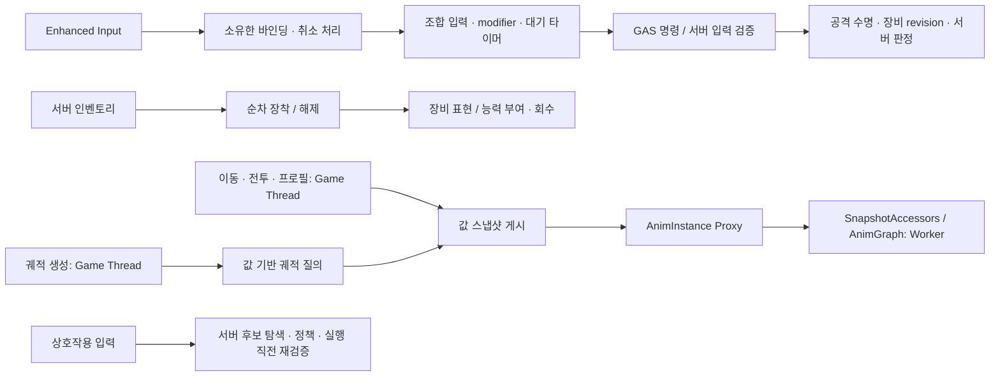

# 런타임 내부 리팩터링 — 2026-09-13

이번 변경은 기존 콘텐츠의 **상태 소유권, 재진입, 수명, 스레드 경계**를 보강한다. A–F 최적화와 MMO 확장 계약 위에서 진행했으며, 콘텐츠 기능 205개를 구현했다는 의미는 아니다. 기존 Blueprint 클래스·함수 경로와 에셋을 유지한다.

## 책임과 실행 흐름

UObject·장비·인벤토리·충돌 질의·GAS 변경은 게임 스레드가 소유한다. 기존 타깃 점수와 Mass의 데이터 계산 병렬화, 예산·취소·revision 검증 경계는 유지한다. 이 변경에 새 작업 스레드나 분산 락은 추가하지 않는다.

## 변경한 내부 계약

| 영역 | 발견한 문제 | 적용한 구조 / 동작 |
|---|---|---|
| 궤적 | 샘플 수와 예측 시간만으로 인덱스를 재사용. 샘플 시간이 바뀌어도 오래된 인덱스 사용 가능 | `Project_JTrajectoryQuery.h`의 값 전용 질의로 분리. 현재 샘플 시간으로 선택, NaN/Inf 입력 거부, 실패 출력 초기화. 숨은 mutable 캐시 제거 |
| 궤적 수명 | reset 후에도 이전 생성 시각이 남음. 전용 서버에서 수동 reset 시 버퍼 재생성 가능 | reset 후 age=-1, 다음 생성에서 새 시각 기록. 전용 서버 reset은 생성 생략. handover 적용 후 궤적 기록 초기화 |
| AnimGraph | `GetThreadSafe...TurnInPlaceIndex`가 실제 Pawn 소유권 조회. Foot Placement getter가 Pawn을 통해 프로필 조회 | 소유권과 선택한 Foot Placement 설정을 GT에서 캡처. 546줄의 getter를 `Project_JCharacterAnimInstance.SnapshotAccessors.cpp`로 분리해 읽기 경계를 명시. 그래프 UFUNCTION 이름 유지 |
| 인벤토리 | 추가 알림 후 재할당된 배열 참조 반환. 삭제 전 알림 중 재진입하면 잘못된 인덱스 제거 가능 | 서버 변경을 먼저 확정하고 값 복사본으로 알림. 추가 결과도 로컬 복사본 반환. 다른 아이템의 동기 변경 허용 |
| 수량 / 조회 | int32 수량 덧셈 overflow, 없는 ID의 0 증감 성공, 실패 조회에 이전 값 잔존 | int64에서 범위 검증 후 적용. ID 검증과 출력 초기화 |
| 장비 | 장착/해제 알림에서 슬롯 변경이 중첩될 수 있음. 해제 알림 때 슬롯에 이전 아이템 잔존 | 컴포넌트별 재진입 가드. 장착 결과에 `OperationInProgress` 추가. 배열 제거 후 unlock/해제 알림. 일반적인 순차 교체 경로 유지 |
| 입력 바인딩 | 다시 바인딩할 때 이전 Enhanced Input 콜백이 남음. direct input과 modifier 상태 미정리 | 자신이 만든 binding handle만 제거. 재바인딩·UnPossessed·EndPlay에서 release와 대기 상태 정리. 점프·스프린트에 Canceled 처리 추가 |
| 커맨드 스킬 | raw 입력으로 별칭을 활성화한 뒤 release는 raw 태그에만 전달 | 누를 때 raw→실제 dispatch 태그를 기록. 도중 스타일이 바뀌어도 원래 별칭에 release. 다른 raw 입력이 같은 별칭을 유지 중이면 조기 release 억제. ASC 교체/종료 시 정리 |
| 입력 라우터 | Initialize가 modifier를 유지하고 활성 태그를 release 없이 지움. 대기 chord 수명 명시 부족 | `ResetInputState`에 타이머·modifier·활성 태그 정리 집중. 재설정 및 종료에서 호출. release 전에 내부 상태를 지워 콜백 재진입 대응 |
| 카메라 | BeginPlay에서 소유권을 한 번만 판정. ASC 소실 시 이전 구독 잔존. AI도 로컬 컨트롤러로 취급 | Pawn의 controller 변경 이벤트 구독. PlayerState 도착 순서에 의존하지 않고 로컬 PlayerController일 때만 카메라 활성화. ASC 교체·소실·종료 시 구독 해제. 저작된 lag 설정 보존 |
| 서버 되감기 | 가장 오래된 정확한 시각 거부. 한 기록 조회 불가. 과거 피격을 현재 캡슐 크기로 검사 | 원형 버퍼의 정확한 경계값 지원. 중복 시각 교체, 시계 역행 초기화. 당시 월드 캡슐 위치·회전·크기로 판정. client 버퍼 미할당, 설정 상한 적용 |
| 상호작용 | 캐릭터 함수에 탐색/실행 혼재. Pawn만 검색하고 대상 설정 미사용 | `Project_JInteractionQuery`로 분리. Pawn/WorldDynamic/WorldStatic 후보, 중복 액터 제거, 활성·거리·우선순위·LOS 적용, 서버 실행 직전 재검증 |
| 풀 정책 | 에디터 ClampMin과 달리 C++ 등록 API에서 음수 개수 허용 | 런타임 등록 시 음수 prewarm/retained 거부 |
| 검증 도구 | PowerShell에서 단일 `-NullRHI` 인자가 문자별로 펼쳐지는 실행 확인 | `Measure-CrowdE.ps1`의 추가 인자를 명시적 `string[]`로 고정 |

## 확장 시 지켜야 할 점

- 서버 인벤토리 알림은 **확정한 작업의 복사본**이다. 다른 리스너가 추가 변경하면 현재 상태는 달라질 수 있다. 현재 상태가 필요하면 InstanceId로 다시 조회한다. 클라이언트 FastArray의 `PreReplicatedRemove`는 엔진의 제거 전 콜백이라는 별도 계약을 유지한다.
- 장비 알림 안에서 또 장착/해제하는 중첩 명령은 지원하지 않는다. 장착은 `OperationInProgress`를 반환하고 void 해제는 무시한다. 필요한 후속 명령은 다음 게임 스레드 업데이트에 별도 요청한다. 이는 같은 프로세스의 재진입 방지이며 DB 트랜잭션·분산 동시성 제어가 아니다.
- 미래의 teleport 경로도 궤적 `ResetTrajectoryHistory`, SSR `ResetHistory`를 호출해야 한다. 이번에 기존 handover 경로에 연결했다. 모든 이동 불연속을 거리 임계값으로 추정하는 방식은 도입하지 않았다.
- SSR는 대상에 컴포넌트가 있을 때 사용하는 기존 선택적 판정 경로다. 공격 RPC의 권한·시각·거리 검증을 대체하지 않는다. 기록 사이 캡슐 형상은 보간하며, 기본 1초/30Hz는 32개 슬롯을 사용한다. 설정은 0.05~10초, 1~120Hz로 제한한다.
- 상호작용은 기존 **즉시 실행** 경로다. 탐색 반경 기본값은 300cm이고 대상별 range는 그 안에서 제한한다. `HoldDuration`, `bExclusive`는 아직 지속 행동 세션/예약을 구현하는 필드가 아니다. 이후 hold·취소·다인원 독점 세션은 이 질의에 별도 수명 소유자를 연결해야 한다. 후보는 overlap 가능한 collision 설정이 필요하다.
- 궤적 질의는 O(N) 샘플 탐색이며 할당하지 않는다. 기존 O(1) 캐시 재사용보다 조회 계산이 늘어나는 대신 시간 구성 변경과 const 함수의 숨은 상태 변경 문제를 없앴다. 새 스냅샷 필드도 복사 비용이 있다. **이번 변경으로 FPS나 동시 접속 처리량이 몇 % 향상됐다고 주장하지 않는다.**

## 함께 점검한 기존 구조

| 영역 | 유지한 이유 / 현재 범위 |
|---|---|
| 이동·점프·콤보 | locomotion 상태, GAS 공격 수명, montage 취소와 weapon revision의 기존 책임을 유지. Stop→Idle 수정 및 공격 취소 회귀 검사 대상 |
| 장비 런타임·VFX | 능력 회수, 표현 revision, 비동기 visual lease/취소가 이미 분리되어 있음. 이번에는 장비 상태 변경의 경계만 보강 |
| NPC·Mass·타깃 점수 | 스냅샷 계산 / GT 적용 / bounded admission / 낡은 결과 거부 구조 유지. 전체 인원을 캐릭터별 task로 쪼개지 않음 |
| 탈것 | 기존 mount eligibility·전용 표현 레이어·이동 소유권 사용. 궤적의 탑승 중 생성 억제와 복귀 reset 유지 |
| UI·상태 태그 | 컴포넌트가 attribute/tag delegate와 EndPlay 해제를 소유하는 이벤트 구조 유지 |
| Gateway·MMO·소셜 | 제한된 in-flight 요청, 종료 취소, 프로세스 내 소셜 상태와 개발용 저장 adapter라는 범위를 유지. 라이브 DB·다중 서버 운영 기능 추가가 아님 |

## 검증

새 `ProjectJ.Internal.*` 테스트는 궤적 시간 구성/비정상 수치, 인벤토리 알림 재진입/수량 경계, 장비 중첩 해제, 입력 재바인딩, 실제 controller 변경 이벤트, 과거 캡슐 크기, AnimGraph 스냅샷 독립성, 상호작용 우선순위/거리, 풀 정책 등록을 검사한다.

**Editor / Game Win64 Development 빌드 성공. 최종 회귀: 54/54 통과, 테스트 오류 0·경고 0.** 신규 10개와 기존 44개를 함께 실행했다. `AnimInstance.cpp`는 3,794→3,251줄로 줄었고 getter 파일은 546줄이다. 함수 누락 여부와 본문을 비교했으며, 스냅샷 보강을 위한 4개 함수 외에는 기존 본문을 유지했다. 이 수치는 구조 분리의 규모이며 성능 향상률이 아니다.

빌드·테스트 최종 결과와 코드 지문은 [검증 기록](Internal_Refinement_Validation_2026-09-13.json)에 기록한다. Editor에서 실제 ABP 화면, 네트워크 PIE, 패키징된 다중 클라이언트 조작은 이번 무인 테스트와 별개다.

### 에디터에서 확인할 플레이 경로

1. 이동 후 정지, 방향 전환, 점프·착지, 질주 중 입력 취소.
2. 무기 장착·교체·해제, 콤보 도중 취소, draw/sheathe 뒤 locomotion 복귀.
3. 재빙의/리스폰 뒤 카메라·줌과 입력 1회당 동작 1회 여부.
4. 상호작용 대상의 활성/거리/우선순위, LOS 옵션을 켠 대상과 벽 사이 차단.

BP·몽타주·레벨·Niagara는 이번 작업에서 수정하거나 저장하지 않았다.
