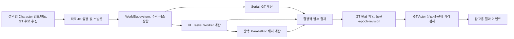
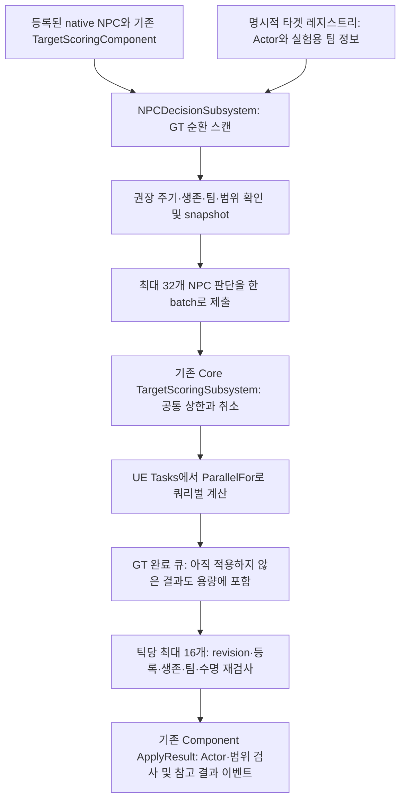
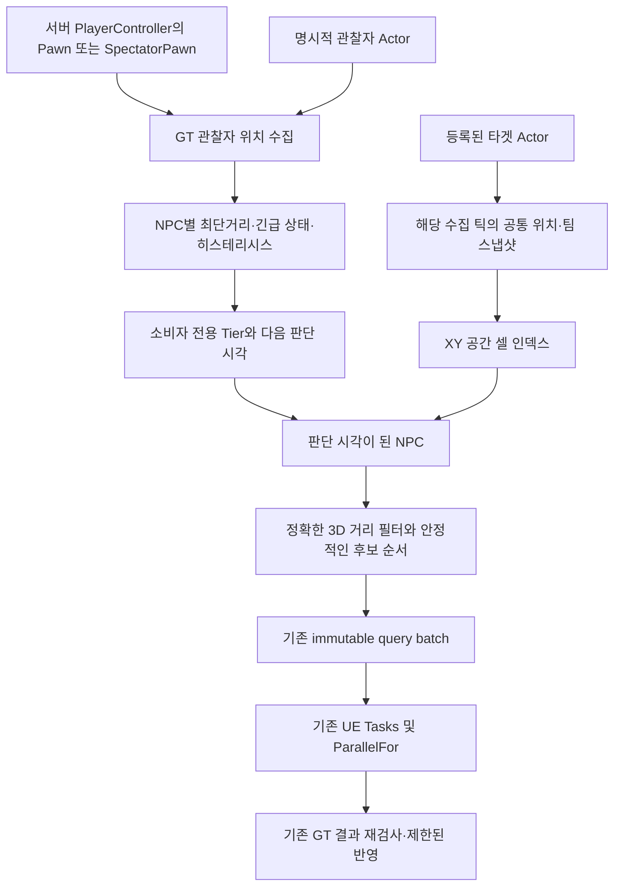
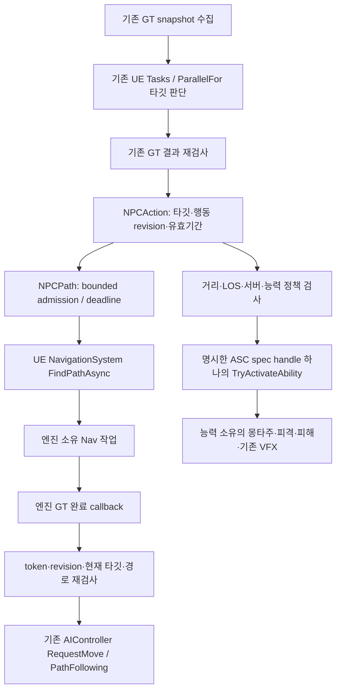
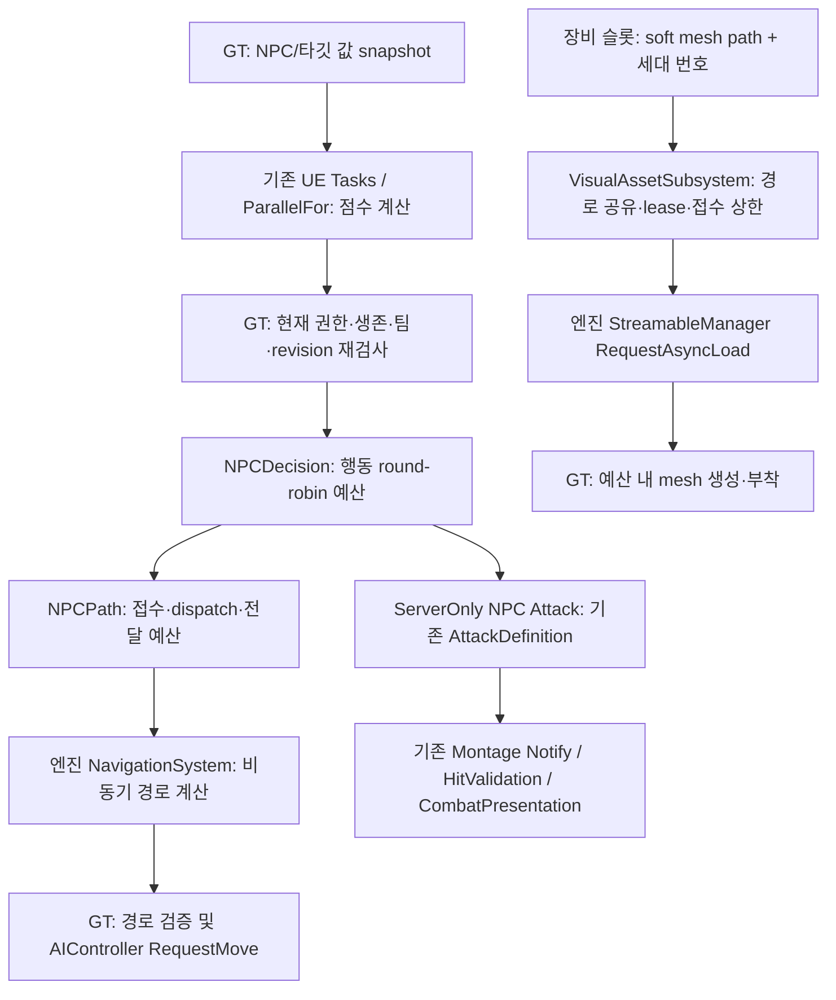
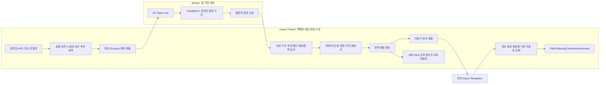
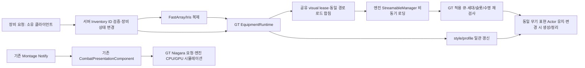

# Project_J 시스템 현대화 및 단계적 리팩토링 — 2026-09-08

> **2026-09-12 후속:** 실제 main에서 E의 기본 조명 PSO 누락을 동일 packaged binary 비교로 1→0 보완했고, F의 8개 격리 fixture를 구현·실행했다. E 사전검증 포함 10개와 production 회귀 17개가 통과했다. 이후 사용자 승인으로 운영 ABP 2개·Trail 1개를 저장하고 Stop→Idle 포즈 전환을 보완했다. 추가로 [MMORPG 확장 기반](MMO_Foundation_2026-09-12.md)과 205개 확장 계약을 마련했으며, Handover 테스트 월드 정리 경고도 관련 3개 검사 오류·경고 0으로 해결했다. 아래 과거 F 미착수/보류 표보다 [최신 E/F 실측과 적용 판단](../Benchmarks/ExecutionExperiments_2026-09-12/README.md) 및 새 기반 보고서를 우선한다.

> **현재 작업 기준 — main 병합(2026-09-10):** 사용자의 요청으로 A–E의 지금까지 구현한 코드·설정·검증 스크립트를 main에 fast-forward 병합했다(`f2c31fb`). 이어서 사용자가 선택한 worktree 플레이어·전투 에셋7개를 백업 후 반영·커밋했다(`89f94b4`). **이제 실제 작업 경로는 `C:/Users/I/Documents/GitHub/Project_J`, 브랜치는 `main`이다.** 아래의 worktree 전용 작업 지침, main571d8f1, 미커밋/미병합 표현은 과거 기록이며 현재 지침이 아니다. 기존 worktree는 원본 에셋·검증 증거 보존용으로 유지한다. E 미완료/F 미착수 범위는 병합으로 완료되지 않는다. 검증·보존 내역은 [main 병합 결과](../Handoffs/SystemsModernization_2026-09-09/병합결과.md)를 따른다. 원격 push는 하지 않았다.

> **이전 E 후속 검증 기록 — main 병합 전(2026-09-10):** UE 5.8 monolithic 게임의 Trail Distortion PSO RT 누락을 보완해 동일 binary 비교 Full miss1→0, 최종 binary도0을 확인했다. validation-only 검색과 modular DLL 등록 제약을 처리하며 Editor PSO 경로는 유지한다. ABP 연결 전 cooked native Motion Matching NodeData crash를 수정했다. 최종 직접 UBT Editor3.47초/Game8.87초 성공, 실제 RHI 회귀24개 오류·경고0. 최종 패키지 새 application cache/재사용 각각 장착→스킬→Trail→해제3회 성공. 거리+fixed bounds 임시 비교에서 near20/far80의 다음 tick 활성100→20과 근접 Trail 캡처를 확인했다. **E는 운영 ABP·Niagara 에셋 최적화/품질, driver cold, 진단 조명의 별도 DefaultLightFunction PSO miss1이 남는다.** F 미착수. [E 최신 상세·trace·실패 진단](../../Saved/Worktrees/SystemsModernization/Saved/Validation/GroupE_20260910/Comparison/결과.md). 기존 A–D 다인원 구조와 사용자 Content/main Source 보존, merge/push 없음.

> **이전 A–D 다인원/E 1차 기록(2026-09-10, 아래 Trail miss1·전체 스킬 미검증은 당시 상태):** 사용자가 A–C도 포함한다고 명확히 하여 공유 로딩1,024요청, 판단2,048명, Nav512명까지 검증·보완했다. 장비 권한 변경은 GT 직렬, 원격 비전투 표현은 최대4개/tick으로 분산한다. Mass 간격 계산은 실제 이동 중1,024명 이상에서 자동 병렬, 적용/전환은 GT다. E의 애니메이션 선택 갱신 위상 분산과 Niagara pool 수명을 구현했다. 최종 직접 UBT Editor5.06초/Game17.76초 성공, 회귀56개(오류0/경고10), 실제 RHI23개(오류0/경고0) 통과. 서버+실제 client4/NPC512 및 cooked3개 비교군은 모두 정상 종료·검증 성공. **E는 전체 완료가 아니다:** Trail Distortion Full PSO miss1, 실제 전체 스킬/driver cold, ABP 비용별 최적화·에셋 컬링/시각 품질 검증이 남는다. F는 미착수. 상세 증거·실패 진단·재현은 [최신 결과](../../Saved/Worktrees/SystemsModernization/Saved/Validation/CrowdE_20260910/Comparison/결과.md)를 따른다. HEAD49c8246 + 미커밋 C–E/다인원 보완, main Source 및 사용자 Content 보존, 병합/push 없음.

> **이전 D 격리 구현·검증 기록 — 2026-09-10(아래 직렬 기본값/E 미착수는 당시 상태):** 실제 Mass 값 이동 Processor와 GT Character 인계, stable ID/세대/world epoch·전환 상한·전투 보호를 구현했다. Character/ASC/장비를 유지하는 opt-in prototype이며 원거리 ISM 표현·Actor 메모리 감소는 구현 범위가 아니다. 최종 D4개 오류·경고0, 관련 회귀15개 성공/오류0(기존 Nav 경고4), 직접 UBT Editor5.31초/Game19.88초 성공. 실제 서버+두 socket client로 Spatial/AllRelevant/병렬 Net Tick 각5단계 및 접속 종료 성공, trace 분석 완료. Spatial 전송률은 실험 AllRelevant 대조군 대비 약29.6% 감소했으나 CPU 개선은 일관되지 않았다. 단순 Mass 이동은 직렬이 저렴해 기본 직렬, Net Tick 병렬화는 실험 옵션으로 유지했다. HEAD49c8246 + 미커밋 C/D, 사용자 Content 보존, main 병합/push 없음. 다음 미완료 단계는 E/F다.

> **이전 C 완료 기록 — 2026-09-10 정리(실행 로그 9월9일):** 동일 fixture Baseline06/After02 각2개 clean 성공, 관련 Regression02 12개 성공/오류0(기존 Nav 시험 경고4건), 직접 UBT Editor 실제 재컴파일4.70초·Game26.39초 성공. 정상 경로 교체의 잘못된 backoff를 수정해 Pursuit100의 backoff386→8(남은8=admission 거절8), 양쪽100명 도착을 확인했다. 최종 trace의 query/tile worker·GT wait 분석과 CSV/JSON을 완료했다. FPS/전반적 지연 개선 주장은 하지 않는다. HEAD49c8246 + 미커밋 C Source/Scripts, Content 보존, main 병합/push 없음. D/E/F는 다음 미완료 단계다.

> **현재 인계:** 상단 최신 기록과 마지막 A–D 다인원/E 절이 우선한다. A–C도 재검토·보완했으며 E 코드와 격리 측정까지 진행했다. E 잔여 검증·F·production 원거리 표현은 후속이다.

## 현재 구현·검증 상태표 — 2026-09-10 A–D 다인원/E 반영

**과거 차단 확인(19:47 KST, 이후 해소):** 최초 실패 UBT8880/9756과 출력 정지를 확인했으나 당시 실제 창은 미확인이었다. 이후 원래 작업에서 computer-use로 csrss 소유 응용 프로그램 오류 창을 확인하고 확인 버튼으로 해제했다는 인계를 받았다. 본 작업에서도 충돌 프로세스0을 확인한 뒤 권한 있는 직접 UBT 빌드에 성공했다. 아래의 대기 기록은 당시 상황이다.

이 표를 현재 상태의 첫 기준으로 사용한다. 아래 초기 조사표와 커밋별 결과는 해당 시점의 기록이다. 기준은 기존 worktree `codex/systems-modernization-2026-09-08`, HEAD `49c8246` 및 미커밋 C–E/다인원 보완 변경이다. **코드 작성, 빌드 통과, 자동화 통과, 성능 실측은 별도 상태**다. B의18개와 C Regression02는 과거 근거다. 다인원 회귀는 CrowdE RegressionFinal02의56개가 기존 근거이고, E 최종 렌더링 회귀는 GroupE Regression03의24개다. 중복 시험을 고유 시험 개수로 합산하지 않는다.

| 원래 번호 / 기술 | 현재 구현 상태 | 남은 작업·검증 / 단계 |
|---|---|---|
| 1 Tasks/TaskGraph/ParallelFor/Async/Pool/전용 thread | TargetScoring의 UE::Tasks + ParallelFor 및 배치 제출 구현. 엔진 Nav/애님/로딩의 비동기 실행 재사용 | 독립 TaskGraph/Async/Pool 제출 비교와 FThread/FRunnable 학습 실험은 미구현. F에서 같은 값 입력·취소·종료·overhead 비교 |
| 2 Lock/Event/Atomic/SharedPtr | scoring 취소 atomic과 thread-safe 공유 작업 데이터 구현 | Event/lock별 경합·wake/join 실험은 미구현. 참조 카운트 안전성과 공유 내용의 안전성을 구분하는 F 학습 항목 |
| 3 Tick/Group/Prerequisite/Concurrent | Decision/Action의 GT 예산·분산 갱신, idle 비활성화와 기존 tick group 사용 | 독립 prerequisite/Concurrent Tick 비교는 미구현. F 실험으로 남기며 기존 UObject Tick을 일괄 Worker로 이동하지 않음 |
| 4 애니메이션 병렬/Property Access/Fast Path | GT snapshot/Proxy·worker와512명 선택 위상 분산 유지. cooked ABP 연결 전 native NodeData crash 수정, generated ABP 경로 유지. 실제 handler 비용·thread trace 확보 | native-only cooked MM fallback 미지원. bound handler 수는 Fast Path 증거가 아님. 운영 ABP 노드 변경·시각 비교는 남음 |
| 5 Animation Budget Allocator | production Character 메시·런타임 플러그인·등록 정책·공격 동기 제외/복귀 구현. B 빌드·18개 자동화·사용자 확인 완료 | 새 실제 전투 장면 FPS/CPU 개선 폭은 미측정. 0.1ms 실험 예산을 운영 기본값으로 해석하지 않음 |
| 6 AI scoring/Async Pathfinding | bounded worker 계약 유지, targets2,048/observers512. 전체 후보16,384에 맞춰 배치 분할·공정 재개. InRange/cooldown 오류 수정 | 2,048명 판단·512 Nav 및 기존 C dirty/pursuit 회귀 통과. 실제 대규모 전투 서버 tick 성능은 별도 |
| 7 Mass Entity | GT 값 snapshot/grid → worker 경로·간격 계산 → join/GT 인계. 실제 이동1,024명 이상 auto parallel, 과밀/막힘 Character 복귀. 2,048명 동일 결과·bounded 조회 검증 | p95 직렬0.634ms/병렬0.241ms는 해당 커널 결과. Character 유지 opt-in, Actor 메모리 감소/ISM/production 자동 등록은 없음 |
| 8 Chaos/Async Physics | 기존 CMC/capsule/물리 query 사용 | 프로젝트 독립 GT↔PT snapshot 실험은 미구현. F에서 지연·파괴·종료 검증 |
| 9 Render Thread/RDG/Parallel Render | 엔진 렌더 경로 사용 | 프로젝트 custom RDG pass는 확인되지 않음. F 독립 패스의 의존성·리소스 수명 실험 |
| 10 GPU Async Compute | 프로젝트 custom compute pass는 확인되지 않음 | F에서 readback·세대·지원 환경·실제 queue overlap 측정. 엔진 지원만으로 적용 완료 선언 금지 |
| 11 Shader Worker/PSO | UE5.8 monolithic 게임의 Distortion RT 누락 보완. 동일 binary A/B Full miss1→0, 최종 패키지0 확인. 실제 장비/스킬/Trail/해제 새 cache·재사용 각각3회 성공 | 별도 DefaultLightFunction/TLV miss1, 인증된 driver cold 남음. Editor는 기존 엔진 PSO 경로 유지 |
| 12 SoftRef/AssetManager/AsyncLoad | owner lease 계수로 입장 전체 순회 제거, 256 owner/1,024 공유 요청 검증. 원격 비전투 무기 생성 bounded GT FIFO·revision/취소/재입장 보호 | 장착·해제/GAS는 즉시 GT. 기존 표현 해제도 즉시. 전체 스킬 prefetch 지연/메모리 효과는 미확정 |
| 13 WP/HLOD/Streaming Source | 기존 월드 범위 유지 | 확대는 사용자 보류. 필요한 작업 수명 검증과 대형 월드 전환을 구분 |
| 14 Iris/Replication Graph/Parallel Net Tick | 기존 D Spatial 소비·2client 비교 유지. 서버+실제 socket client4/NPC512의 AOI·inventory·장비·삭제/disconnect 모두 통과/exit0 | Net Tick parallel off 유지. 512 NPC는 512접속자가 아님. party/guild helper custom Iris adapter/production scale은 별도 |
| 15 Niagara CPU/GPU/컬링 | pool 소유·종료 정책 유지. 최종 near20/far80 임시 distance+bounds 대조로 다음 tick 활성100→20, 실제 근접 Trail 캡처·CPU/GPU trace 확인 | 운영 에셋의 bounds/distance/instance cap 적용·품질 비교는 남음. 초기 allocation100은 유지. NPC ChildActor Trail 보류 |
| 16 Audio Thread/Mixer | 엔진 경로와 Windows 오디오 설정 존재 | F의 다수 voice/concurrency/virtualization/underrun 실험 미완료 |
| 17 Runtime PCG | 프로젝트 runtime 생성 소비자 구현은 확인되지 않음 | F 격리 생성·budget·cancel·stream-out 학습 실험 미완료 |
| 18 대량 Navigation/Dynamic NavMesh | 기존100명 dirty/tile/mixed·취소·종료 검증 유지. 동시512 bounded burst 모두 완료, 기존 cooldown InRange 정지 수정 | queue peak64/in-flight8, timeout0. 사용자 BP/ABP 렌더·전투·DS 복합 대규모 성능은 별도 |

대조 근거는 worktree `Source/Project_JCore`의 TargetScoring/VisualAsset, `Source/Project_JCharacter`의 Decision/Path/Action/AnimationBudget/Mass/Network/CombatPresentation, CharacterEditor Navigation 시험, `Scripts/Validation`, Config/uproject 및 로컬 UE 5.8 NavigationSystem/NetDriver 소스다. B 결과 JSON과 C 합성 집계기 입력을 확인했으며 에셋 전체나 F의 엔진 내부 전체를 검증한 것은 아니다. 상세 C 작성 범위와 D/E/F 계약은 후반 「참고 소스 대조 후 C 보완 및 C–F 누락 방지」를 따른다.

**아래 초반 상태·경계는 초기/중간 시점의 기록이다.** `3130eae`에서 실행 미검증, Editor 전용 ABA, sparse checkout/Content 미포함 등의 표현은 현재 상태가 아니다. 위 상태표와 최신 인수인계 및 후반 결과를 우선한다. 학습·포트폴리오용 도입은 이후 승인된 범위이며 초기 표의 No/보류를 모든 독립 실험의 영구 보류로 해석하지 않는다.

> 과거 중간 상태 (`3130eae`): **비동기 경로 요청 관리 + 선택적 NPC 행동/GAS 연결** 구현 직후에는 직접 UBT 컴파일만 통과했고 실행 검증은 보류했다. 이후 native 이동·공격·A 기반 검증이 추가됐다. 당시 계약은 「NPC 행동 의도와 비동기 경로 요청 연결」, 현재 상태는 위 상태표를 따른다.

> 실행 정책 변경 기록 (`befadbf`): 사용자 요청에 따라 타겟 계산 컴포넌트의 기본값을 **TaskParallelFor**로 변경했다. 아래 초기 구현 기록의 Serial 기본값은 당시 상태다. 근거는 「병렬 실행을 기본값으로 변경」 절을 따른다.

> 구현 기록 (`e3e8c9d`): **NPC 배치 스케줄링과 native 실험 Actor**를 추가했다. 해당 시점의 적용 범위·측정은 「NPC 판단 요청의 배치 처리」 절에 있다. 현재 상한과 검증 범위는 후속 A/C 기록을 함께 따른다.

> 과거 중간 상태 (`163d614`): **공통 위치 스냅샷·공간 검색·서버 관찰자 기반 갱신 주기** 추가 직후에는 사용자 요청으로 컴파일까지만 확인했다. 이후 A 검증이 이어졌으므로 당시 실행 보류를 현재 상태로 읽지 않는다.

## 초기 작업 경계 및 기준 — 착수 시점 기록

- 기준 커밋: `571d8f10`, 시작 시 main 변경 없음. 기존 문서와 모든 에셋은 수정하지 않는다.
- 격리 브랜치: `codex/systems-modernization-2026-09-08`.
- 작업 위치: `Saved/Worktrees/SystemsModernization`. Source/Config/Docs sparse checkout이며 기존 Content를 연결하거나 저장하지 않는다.
- 사용자 지정 기록은 이 새 문서 하나에만 남긴다. 기존 Architecture 문서와 CombatVFXArchitecture.md는 읽기 전용이다.
- `AGENTS.md`, 9월 3~6일 profiling/architecture 결과, Docs/참고1.txt 및 참고2.txt, 현 Source/Config를 조사했다. 별도 첨부 메모는 보이지 않아 요청의 18개 기술 목록을 필수 검토 목록으로 삼는다.
- `Saved/Profiling`에서 원본 trace 13개를 확인했다. 원본을 수정하지 않으며 문서의 선택 구간 통계를 근거로 사용한다. 이번 작업에서 재분석하지 않은 trace를 재측정했다고 표현하지 않는다.

## 초기 구조와 우선순위 — 후속 변경 전

```text
Project_J (game composition, PlayerState ASC, backend prototypes)
  -> Character (Input -> GAS melee/combo -> authoritative hit -> cosmetic presentation)
     -> Mount -> GAS -> Core (tags/interfaces/AssetManager)
     -> animation GT snapshot -> proxy -> engine parallel update/evaluation
     -> equipment FastArray -> equipment runtime -> async modular mesh
  CharacterEditor -> Character (editor authoring)

AttackTag -> CombatPresentationSet -> AttackPresentationProfile
Montage Notify State -> CombatPresentationComponent -> Niagara
```

| 우선순위 | 근거 / 후보 | 초기 결정 |
|---|---|---|
| P0 | SkillInputExecution RPC가 유효한 임의 태그를 Gameplay Event로 전달 | 입력 태그 경계 위반 재현·수정·회귀 테스트 통과 |
| P0 | EquipmentRuntime이 비동기 요청 핸들을 버림, 교체/종료 시 취소 불가; 실패한 mesh에도 컴포넌트 생성 | 수명 관리 수정 및 같은 전후 자동화 테스트 통과 |
| P1 | S0 rotation 39.21 µs, N2 rotation 8.11 µs는 inclusive 평균이며 TIP root motion 필수 경로 | 원인별 추가 측정 없이는 변경하지 않음 |
| P2 | N50 aggregate 62.3 KB/s, 50 mover/2 connections/always relevant | 실제 AOI 정책과 다중 프로세스 시나리오가 선행 |
| 보류 | S100 snapshot 1.84 µs, parallel-evaluation callback 약 99.99%, GPU 단일 프레임 3.99 ms | 강제 worker 분리, Mass 전환, Niagara pooling의 병목 근거 없음 |

## 초기 코드 기준 시스템 감사 — 후속 변경 전

### 모듈 경계

화살표는 Build.cs의 의존 방향이다. `Core`는 프로젝트 저수준 모듈 `Project_JCore`를 뜻한다.

```text
Project_JCharacterEditor -> Project_JCharacter
Project_J -> Project_JCharacter -> Project_JMount -> Project_JGAS -> Project_JCore
Project_J -> Project_JGAS, Project_JCore
Project_JCharacter -> Project_JGAS, Project_JCore
Project_JMount -> Project_JCore
```

프로젝트 모듈 간 순환 의존은 발견하지 않았다. Character는 167개 파일로 combat/input/animation/equipment/Mass/network/UI까지 소유한다. Core와 GAS에 presentation 역방향 의존을 추가하지 않고, 향후 gameplay와 presentation 분리는 소비 인터페이스와 에셋 직렬화 경계를 먼저 고정한 뒤 시행한다. 당장 모듈을 옮기면 `/Script/Project_JCharacter.*` 경로와 cook/redirect, Blueprint 부모가 바뀌므로 P2다. Game 모듈의 HTTP/JSON은 private 의존이고 GAS는 Niagara/Character를 모른다.

| 영역 | 현재 코드에서 확인한 흐름과 책임 | 위험 / 후속 단계 |
|---|---|---|
| Player/Character | PlayerState가 Mixed ASC, AttributeSet, inventory/equipment 소유. BaseCharacter가 owner interface로 조회하고 PossessedBy/OnRep_PlayerState에서 actor info와 runtime binding 갱신. PlayerCharacter는 입력·이동·component facade | respawn/PlayerState 교체 시 grant 제거와 재부여 통합 테스트 필요. NPC와 player ASC 중복 생성 금지 |
| Input/GAS | EnhancedInput → PlayerInputBinding → SkillInputRouter(chord/direct/modifier) → SkillInputExecution → ASC DynamicSpecSourceTags 활성화/이벤트 | RPC는 raw input을 서버 command table로 재해석. 유효 태그만 검사하는 경계 오류를 이번 P0로 수정 |
| 예측/취소 | Melee LocalPredicted + CommitAbility, AbilityTask montage 완료/interrupt/cancel → EndAbility → movement 복원, hit/presentation 종료. 입력 RPC의 서버 dispatch는 추가 ability 활성화 안 함 | unreliable 입력과 GAS activation 간 순서, packet loss에서 combo divergence는 P2. 이번 테스트는 transport를 흉내 낸 다중 클라이언트 검증이 아님 |
| Combat 데이터 | Class/Advancement/Equipment → CombatStyle → AbilitySets/ComboDefinition/CommandSet/AttackSet. Combo node가 AttackDefinition을 참조 | AttackDefinition은 montage/section/play rate/movement/hit/서버 DamageEffect, combo는 전이/버퍼/조건. 동일 공격 데이터를 스킨마다 복제하지 않음 |
| 히트/SSR | MeleeHit Notify가 socket sweep/authoritative trace 기록. HitValidation이 활성 node/window, sequence/rate, timestamp/finite/range/LOS/중복 확인 후 서버 선택 GE 적용. SSR은 고정 ring buffer+이진 탐색 | SSR은 target 과거 capsule과 현재 서버 weapon trace를 사용. 완전한 쌍방 historical sweep으로 표현하면 안 됨. non-SSR bounding-box fallback/고지연 보정은 별도 측정 |
| Weapon | EquipmentManager FastArray → EquipmentRuntime(grant/stat/modular mesh) → CombatStyle/WeaponPresentationProfile 갱신. WeaponPresentationComponent는 무기 actor/socket/독립 모션 | 장비 로딩 핸들 취소만 수정. 무기 motion, socket 계약, 대검 montage와 skin VFX override는 유지 |
| VFX | AttackTag → CombatPresentationSet → AttackPresentationProfile → cue. Notify State → non-ticking CombatPresentationComponent → Niagara. style < advancement < skin의 cue별 override | Niagara와 damage geometry 분리. recovery state는 현재 `COND_None`으로 owner도 수신하며 unreliable multicast/order가 별도로 있음. 오래된 skip-owner 설명 적용 금지 |
| VFX 수명 | Begin/EndAttack, Notify end, cancellation, EndPlay에서 loop stop; 즉시 destroy 또는 natural fade | owner 예측과 recovery, relevance 재진입, event/state 순서, same-tag 연속 공격은 현재 VFX 담당 범위. 이번 작업에서 복제 조건/중복 억제 방식을 변경하지 않음 |
| 직업/전직 | CharacterClassDefinition/AdvancementDefinition의 ID, 조건, AbilitySet grant source, CombatStyle override. CharacterDataSubsystem에 ID registry | registry config가 비어 있으면 경고, 초기 PopulateRegistry 및 검증 경로에 LoadSynchronous. 콘텐츠 규모와 첫 전직/탈것 로드 trace 없이 async 전환 금지 |
| Animation | Player tick의 movement policy/trajectory/semantic locomotion → NativeUpdateAnimation snapshot → Chooser/PSD 선택 → proxy → engine animation graph | StateController와 MM 역할 유지. 한 순간의 graph screenshot이나 `ThreadSafe` 이름으로 모든 노드 안전성을 보증하지 않음 |
| NPC/AI/Mass | NPC는 actor tick off, Minimal ASC, URO/visibility/net-rate 정책. AI interval getter는 scheduler가 아님. Mass는 stats trait와 100-count test spawner | 실제 타겟 scoring loop, behavior/path scheduler, Mass actor promotion/replication bridge 없음. local crowd AIController는 CMC 구동용이며 MMORPG AI 부하 증거 아님 |
| Mount | 별도 Mount 모듈, server-authoritative mount state, flying tick, rider linked layer async load | player mount class LoadSynchronous 잔존. flight physics/movement/notify 비용과 대량 비행 population은 미측정 |
| Network/Iris | Config UseIrisReplication + registered subobjects + IrisNetDriverConfigs, Character.Build.cs SetupIrisSupport. N2 런타임 Iris/FastArray 초기 state 확인 | distance filter/prioritizer는 여전히 UObject policy helper이며 등록된 Iris adapter가 아님. ReplicationGraph도 미연결. Iris와 AOI 구현을 구분 |
| 복제 조건 | inventory 및 identity owner-only, equipment FastArray 공개, anim/jump 일부 skip-owner, VFX recovery는 owner 포함 | Listen server는 authority local presentation, DS는 Niagara spawn 생략. standalone server-target 존재와 실제 dedicated binary 빌드 성공은 다른 사실 |
| Asset/Tag/Config | custom AssetManager, 대부분 PrimaryAsset AlwaysCook, native tags + ini tags/redirects. AttackPresentationProfile은 UDataAsset이고 Set이 UPrimaryDataAsset | hard Niagara/profile 참조는 async unload나 DS 콘텐츠 분리를 보장하지 않음. bundle/chunk/PSO/기기별 예산 P2 |
| UI/Backend | MVVM binding 컴포넌트, social/gateway/handover seams. HTTP thread-safe ref, handover 응답은 GT에 marshal하고 attempt/transfer 확인 | 인증·영속 경제·zone handoff는 프로토타입 범위. 실 서비스 보안/부하 검증으로 일반화 불가 |
| 검증/복구 | IsDataValid(attack/style/combo/command/equipment/animation), trace scopes, 진단 CVars, 기존 architecture automation 11개 | VFX profile/set 전용 validation은 현재 없음. invalid load 복구 추가. debug 기본 활성화 및 무조건 Notify 로그는 전투 trace로 비용 검증 후 담당 작업에서 조정 |

### 기존 문서와의 차이

9월 3일 audit의 “Iris 활성화/SetupIrisSupport/Server.Target 부재”, “VFX infrastructure only”는 현재 코드와 다르다. 현재는 Iris 활성화·fragment 지원·Server Target·전투 VFX 시스템이 존재한다. 반대로 custom Iris AOI 연결, 실제 Mass population pipeline, 엔진 Animation Budget Allocator 연결은 여전히 확인되지 않았다. 문서 자체는 수정하지 않았다.

## 프로파일링 근거와 적용 판단

| 근거 | 측정된 값 / 조건 | 판단과 한계 |
|---|---|---|
| S0_MovementPolicy | 7,500회, rotation incl 294.05 ms / 39.21 µs | TIP 누적 root extraction과 actor rotation 자식 비용 포함. 같은 입력/카메라 없는 S100과 전후 비교 불가 |
| S70 (`S50_MovingCrowd.utrace`) | 실제 70 clone, 39.65 s, player tick 596.78 ms/292,175회, snapshot 1.78 µs | 파일명 50을 인구수로 읽지 않음. 초기 Crowd50 정지 capture는 제외 |
| S100 local visual | 35.95 s, tick 601.00 ms/288,965회, snapshot 175.49 ms/95,269회=1.84 µs; trajectory 1.02 µs | 이동 local non-replicated crowd. snapshot worker task dispatch/copy 추가 이득 근거 없음 |
| S100 worker proof | parallel-evaluation callback 47,274회 vs foreground 4회 | 약 99.99% parallel 상태. 모든 BP 노드의 Fast Path나 개별 작업의 실제 OS thread 보증은 아님 |
| animation completion | CompleteParallelAnimationEvaluation incl 2.55 s/130,174회 | GT completion aggregate를 worker 실행시간 또는 순수 wait로 오해하지 않음 |
| S100 ProfileGPU | Frame 3.99 ms, PostProcessing 약 0.70 ms | 한 frame/camera, 대량 스킬 VFX/GPU p95·p99 근거 없음 |
| N2 PIE | rotation 166.60 ms/20,532회=8.11 µs; CMC 813.36 ms/30,798회 | DS + 2 client world가 같은 프로세스. 서버 전용 시간 아님 |
| N2 packet | 32.5 s, DataStream 77,751 bits, pending/failed small object 0 | low population에서 custom AOI/parallel net tick 정당화 불가 |
| N50 | 19.362 s, mover50 → connection2, 30 Hz, always-relevant, DataStream 9,649,722 bits | aggregate 약 62.3 KB/s, 균등 분배 가정 31.2 KB/s/connection. 50 실제 접속/전투/AI 측정 아님 |
| 장비 async/입력 P0 | 이번 신규 재현 테스트 | 보안·수명 오류의 기능 근거. 위 기존 trace가 이 오류의 CPU 병목을 입증한다고 주장하지 않음 |

이번 evidence에는 즉시 변경을 정당화할 명확한 성능 병목과 동일 workload의 개선 전후 프레임 통계가 없다. P0 기능 오류는 실제 수정하고, P1 성능 변경은 억지로 만들지 않는다. 이전 baseline을 수정 후 성능으로 재사용하지 않으며 속도 향상률을 제시하지 않는다.

## Game Thread / Worker 책임 지도

```text
Game Thread
  Input/RPC/GAS/CMC, authoritative hit and gameplay events
  movement/trajectory/semantic state, NativeUpdateAnimation snapshot
  StateController Chooser + PSD choice + QueueGameThreadData
  async mesh request/cancel/completion and UObject component creation
       |
       v  engine-managed proxy handoff
Parallel animation update / evaluation (eligible engine task, GT fallback possible)
  proxy consumers, Motion Matching query/search, BlendStack update, graph pose evaluation
       |
       v  engine completion dependency
Game Thread completion / Notify dispatch / final mesh update -> Render Thread/RHI
```

| 처리 | 확인된 실행 책임 | 근거 / 제약 |
|---|---|---|
| CMC, locomotion, trajectory | GT | PlayerCharacter::Tick, BuildThreadSafeData의 Actor/CMC 읽기. 이 함수를 임의 Task로 보내지 않음 |
| significance | engine ParallelFor 계산 + Update 호출 스레드에서 Sequential post | Engine SignificanceManager.cpp:499/509. BaseCharacter callback은 Actor 위치를 직접 읽음. Sequential은 계산까지 GT로 바꾸지 않음. 프로젝트 Source에서 명시적 manager Update 호출을 찾지 못해 실제 구동자는 미확인 |
| native snapshot / semantic profile 수집 | GT | AnimInstance.cpp:790 NativeUpdateAnimation 및 Project_J snapshot 호출 경로 |
| Chooser / PSD 선택 / proxy publish | GT | EvaluateStateControllerAnimationChooserOnGameThread, EvaluatePoseSearchDatabaseOnGameThread, PublishThreadSafeDataToProxy. UObject 컨텍스트 접근과 profile 선택 |
| native thread-safe callback | parallel animation update phase, foreground fallback 가능 | Project_J callback은 Super와 instrumentation 중심. 비용이 작고 99.99%는 callback 상태 표본 |
| MM query/search/result/cost | engine AnimNode Update_AnyThread 경로 | 실행 eligible 여부에 따름. 별도 프로젝트 worker가 아님. query/search 세부 p95는 현재 제공 통계 없음 |
| BlendStack / PoseHistory / AimOffset / FootPlacement / LegIK / pose composition | engine graph update/evaluate 영역 | 노드별 native AnyThread 구현과 실제 ABP 설정 별개. 이번 에셋 미조회로 VM fallback/Property Access 노드별 상태 미확인 |
| linked layer | 로드와 Link/Unlink는 GT, 그래프 평가는 engine parallel 조건에 따름 | combat/mount preload의 CancelHandle 경로 유지 |
| Notify / montage delegates / gameplay events | GT dispatch/application | 엔진은 animation update에서 notify를 queue할 수 있지만 프로젝트 damage/VFX 변경을 worker로 옮기지 않음 |
| curve / final pose | curve 계산은 evaluation, Project_J NativePostEvaluate의 contact curve 읽기는 completion 경로 | engine SkeletalMeshComponent.cpp:4980. completion 시간 전체를 stall로 단정하지 않음 |
| physics / cloth / render | engine physics/evaluation/render scheduler | CMC/scene query는 GT 책임 유지. 실제 cloth 사용 및 GPU/RT synchronization은 trace 추가 필요 |

추가 불변 snapshot을 도입한다면 world epoch + request generation + weak owner를 GT에서 검증한다. Worker는 ID/위치/가중치 등의 값만 소유하고 결과 배열을 넘긴다. 장비 비동기 로딩 수정은 엔진 loader를 사용하므로 프로젝트 Worker/락/대기를 추가하지 않는다.

## 초기 필수 기술 검토표 (18개 항목 전체)

이 표의 「현재 적용 상태」와 No/P2는 최초 조사 당시 판단이다. 구현 이후 상태는 문서 앞의 「현재 구현·검증 상태표」를 사용한다. 과거 기대 효과·판단 근거를 보존하기 위해 초기 행은 소급해서 완료로 바꾸지 않는다.

`미확인`은 에셋 또는 런타임 구동 증거가 없다는 뜻이며 엔진 기능이 꺼졌다는 뜻은 아니다. 기대 효과는 정성 후보이며 측정한 개선 수치가 아니다. No는 이번 도입하지 않음, 유지/P0는 현재 경로 유지 또는 수명 수정이다.

| 번호 / 기술 | 현재 적용 상태 | 현재 병목 관련성 | 스레드 안전성·엔진 제약 | 기대 효과 | 적용 여부 | 적용 시 수정 범위 | 미적용 이유 | 검증 방법 |
|---|---|---|---|---|---|---|---|---|
| 1 UE::Tasks | 프로젝트 직접 launch 없음 | snapshot 수 µs에는 불리할 가능성 | 값 snapshot, prerequisite, 취소 generation, GT apply 필요 | 무거운 독립 계산 분산 | No/P2 | 미래 targeting/scoring service | 실제 scoring workload 없음 | serial/batched 크기별 CPU·dispatch·p95 |
| 1 TaskGraph | engine animation, AsyncTask GT marshal | animation 이미 parallel | task 기다림/GT fallback 구분 | engine scheduling 재사용 | 유지 | proxy와 callback 계약 | 새 graph 불필요 | Insights task lane/dependency |
| 1 ParallelFor | significance 엔진 간접 사용 | scoring/대량 루프 미측정 | return까지 join, 요소별 출력 소유; UObject 공유 금지 | batch data 계산 | 유지/P2 | significance snapshot 또는 pure scoring | tiny loop 분할 이득 불명확 | batch size, serial 대비, GT join |
| 1 Async | handover AsyncTask(GT) 외 gameplay Async dispatch 없음 | CPU 병목 근거 없음 | future 대기로 GT 막지 않기 | engine thread pool 작업 | No | data preprocessing 소비자 | 비동기 자체가 목적 아님 | task lifetime/cancel/queue age |
| 1 Thread Pool | engine loader/animation/PSO가 사용 | 프로젝트 pool 포화 미측정 | 기존 pool 경쟁·backpressure 필요 | 유한 background 작업 | 유지 | 필요할 때 job budget | 별도 pool 과잉 | queue latency·worker utilization |
| 1 FThread | 직접 사용 없음 | 장기 blocking 작업 없음 | stop/join 및 shutdown 소유 필수 | 전용 작업 격리 | No/보류 | 별도 서비스 구현 시 | 수명·스택·context switch 비용 | 종료/맵전환/CPU utilization |
| 1 FRunnable | 직접 사용 없음 | 동일 | Stop/Exit/WaitForCompletion 수명 규약 | 지속 I/O loop | No/보류 | 실제 장기 외부 I/O backend | HTTP engine 경로로 충분 | leak·join·shutdown stress |
| 2 FCriticalSection | 프로젝트 gameplay 명시 사용 없음 | contention 근거 없음 | 짧은 critical region, GT wait 금지 | 공유 데이터 보호 | No | 미래 queue 경계만 | 소유권 분리가 우선 | lock wait timeline |
| 2 FRWLock | 직접 사용 없음 | shared hot read 구조 없음 | read-heavy일 때만, writer starvation 주의 | read 병렬성 | No | immutable swap 대안 비교 | snapshot으로 해결 가능 | read/write ratio·writer wait |
| 2 FEvent | 직접 사용 없음 | wait 병목 근거 없음 | pooled event 회수·종료 signal, GT wait 금지 | background sleep/wake | No | 장기 서비스 필요 시 | task dependency 우선 | 종료 deadlock/timeout |
| 2 FSpinLock | 직접 사용 없음 | 이득 근거 없음 | preemption에서 CPU 낭비 | 극히 짧은 lock | No/보류 | 확인된 초단기 공유 영역 | 일반 gameplay에 부적합 | contention CPU·tail latency |
| 2 Atomic | 직접 job cancellation atomic 없음 | 병목 근거 없음 | flag 원자성은 전체 UObject thread safety 아님 | worker cancel flag | No/P2 | 미래 snapshot job token | 현 async loader cancel이 GT에서 해결 | race/stale-result 테스트 |
| 2 Thread-safe Shared Ptr | HTTP request ESPMode::ThreadSafe | refcount 병목 미측정 | refcount만 안전, pointee 보호 아님 | callback lifetime | 유지 | HTTP 경로 유지 | 전 UObject pointer 전환 불필요 | callback after shutdown |
| 3 Actor/Component Tick | 대부분 off, player/flight/SSR 등 on | S0/N2 rotation incl 확인 | gameplay GT, server/owner 역할 유지 | 불필요 tick 축소 | 유지/P2 | role별 측정 후 해당 component | 근거 없는 tick 제거 회귀 위험 | S0/TIP/CMC 같은 입력 A/B |
| 3 Tick Group/Prerequisite | input binding/weapon TG_PostUpdateWork, 대규모 custom prerequisite 없음 | frame order correctness 관련 | group은 thread 허용과 별개 | 올바른 pose/socket 순서 | 유지/P2 | actor/mesh/weapon 간 필요한 의존만 | 의존 추가는 serialization 가능 | low FPS hit/socket timing |
| 3 Concurrent Tick | bRunOnAnyThread 직접 설정 없음 | GT UObject 접근 많음 | 독립 snapshot 없이는 금지 | safe pure tick 병렬 | No/보류 | 별도 snapshot worker로 설계 | GAS/World/Actor 변경 위험 | engine race + destruction stress |
| 4 Thread Safe Update/Property Access/parallel evaluation | native proxy + parallel 상태 입증, ABP 노드별 Property Access 미확인 | S100 정상 parallel, snapshot 1.84 µs | GT snapshot와 graph AnyThread 구분 | VM 제거/worker 유지 | 유지/P2 | ABP_Humanoid_Master/linked layers의 확인된 노드만 | C++만으로 Fast Path 설정 판정 불가 | node Details, Animation Insights, BP VM scopes |
| 5 Animation Budget Allocator | custom tier/URO 있음; Budgeted mesh/plugin 연결 없음 | 단일 S100 overload 근거 없음 | ABA/URO 중복 제어, root motion/notify DS 보장 필요 | 총 anim GT 예산 관리 | No/P2 | mesh class/plugin/등록/priority policy | 이름이 Budget라고 ABA 도입 아님 | 100+ combat workload, notify correctness, p95 |
| 6 AI target scoring 병렬 | 구현된 scoring service 없음 | crowd harness는 AI 아님 | GT candidate snapshot → worker scores → GT 재유효성 | O(N*M) scoring 분산 | No/P2 | AI 서비스/epoch/cancel | 측정 가능한 workload 선행 | 100/500/1000 후보 serial 비교 |
| 6 Async Pathfinding/NavMesh async | engine 지원, 프로젝트 직접 호출 없음 | path query trace 없음 | FindPathAsync query ID, AbortAsyncFindPathRequest, completion owner/epoch | GT path 탐색 분산 | No/P2 | AI path requester | 현재 movement harness는 nav 부하가 아님 | query latency/취소/도착 시 target 유효성 |
| 7 Mass Entity | GT 값 snapshot/grid → worker 경로·간격 계산 → join/GT 인계. 실제 이동1,024명 이상 auto parallel, 과밀/막힘 Character 복귀. 2,048명 동일 결과·bounded 조회 검증 | p95 직렬0.634ms/병렬0.241ms는 해당 커널 결과. Character 유지 opt-in, Actor 메모리 감소/ISM/production 자동 등록은 없음 |
| 8 Chaos/Async Physics/동기화 | CMC/capsule/query, custom async physics 없음 | N2 CMC 26.41 µs incl, physics 분해 없음 | PT↔GT snapshot, predicted movement/hit timing | physics 부하 분산 | 유지/P2 | 실제 물리 heavy actor만 | 근접전 권한·notify timing 변경 위험 | physics step/GT wait/서버 보정 |
| 9 Render Thread/RDG/Parallel Render | engine 소유, custom render pass 없음 | S100 GPU 한 frame만 | RDG resource lifetime, RT 전용 접근 | engine pass 병렬 효율 | 유지 | 확인된 custom pass가 생길 때 | gameplay 리팩토링으로 해결할 근거 없음 | RT/RHI/Draw/PSO/GPU timeline |
| 10 GPU Async Compute | project custom pass 없음; engine feature runtime 미확인 | compute overlap 근거 없음 | GPU/queue/barrier 지원, bandwidth 경쟁 | GPU compute와 graphics overlap | No/P2 | RHI/RDG 또는 VFX 설정 제한 범위 | 지원=성능 이득 아님 | 동일 GPU GPU queue overlap/Frame p95 |
| 11 Shader Compile Worker | engine 사용 | 빌드/에디터 컴파일과 runtime 구분 | 실행 중 빌드 중첩 금지 | shader compile 병렬 | 유지 | 엔진 설정 유지 | 런타임 병목 해결책 아님 | compile/job count·DDC |
| 11 PSO Precaching | engine 기본 경로, 프로젝트 특화 override/검증 없음 | 첫 사용 hitch trace 없음 | async PSO 비용/메모리/ready 전 표시 정책 | 첫 시전 hitch 완화 | 유지/P2 | PSO capture/validation, platform config | 무근거 cvar 변경 금지 | cold cooked run, miss/late/untracked·hitch |
| 12 Soft Reference/AssetManager/RequestAsyncLoad | combat/mount layers async; equipment handle 누락; class/mount 일부 sync | load hitch 수치 없음, cancellation 오류 재현 | StreamableManager request/cancel GT, delayed callback까지 CancelHandle 적용 | stale callback 억제, 실패 시 빈 component 방지 | P0 | EquipmentRuntime .h/.cpp + 새 tests | 로딩 전체 async 전환은 측정 전 보류 | equip/unequip/rebind/endplay/A-B-A, invalid mesh |
| 13 World Partition/HLOD/Streaming Source | 기본 map Lvl_ThirdPerson, WP 관련 content 존재만 확인 | streaming/cell churn 미측정 | world lifecycle/GT apply/전용 서버 정책 | world residency/draw 감소 | No/P2 | 실제 map/source/data layer/HLOD | binary 에셋 조회·수정 미허가 | cell load p95·memory·teleport |
| 14 Iris/Replication Graph/Parallel Net Tick | 기존 D Spatial 소비·2client 비교 유지. 서버+실제 socket client4/NPC512의 AOI·inventory·장비·삭제/disconnect 모두 통과/exit0 | Net Tick parallel off 유지. 512 NPC는 512접속자가 아님. party/guild helper custom Iris adapter/production scale은 별도 |
| 15 Niagara CPU/GPU/컬링 | pool 소유·종료 정책 유지. 최종 near20/far80 임시 distance+bounds 대조로 다음 tick 활성100→20, 실제 근접 Trail 캡처·CPU/GPU trace 확인 | 운영 에셋의 bounds/distance/instance cap 적용·품질 비교는 남음. 초기 allocation100은 유지. NPC ChildActor Trail 보류 |
| 16 Audio Thread/Audio Mixer | engine 경로, Windows 48kHz·source workers config | audio overload trace 없음 | audio command boundary, UObject GT | mixing/source processing 분산 | 유지 | sound concurrency/virtualization 측정 후 | 별도 thread 또는 worker수 변경 근거 없음 | audio mixer/source count/underrun |
| 17 Runtime PCG Scheduler | 프로젝트 PCG C++ 소비/명시 plugin 없음 | runtime generation workload 없음 | component/world epoch, generation 취소, GT spawning | procedural 작업 budget | No/보류 | PCG graph/scheduler/runtime generation 서비스 | 실제 PCG 사용 전 과잉 도입 | generation frame budget·stream-out cancel |
| 18 대량 Navigation/Dynamic NavMesh | 기존100명 dirty/tile/mixed·취소·종료 검증 유지. 동시512 bounded burst 모두 완료, 기존 cooldown InRange 정지 수정 | queue peak64/in-flight8, timeout0. 사용자 BP/ABP 렌더·전투·DS 복합 대규모 성능은 별도 |

엔진 소스 검토: `Engine/Classes/Engine/StreamableManager.h:327`, `Engine/Private/StreamableManager.cpp:981`, `Engine/Private/NetDriver.cpp:378,1261`, `NavigationSystem/Public/NavigationSystem.h:668`, `NavigationSystem/Public/NavMesh/RecastNavMesh.h:764,866`. 엔진 루트는 `C:/Program Files/Epic Games/UE_5.8/Engine/Source/Runtime`이며 SignificanceManager는 `Engine/Plugins/Runtime/SignificanceManager` 아래다.

공식 보조 자료: [Tasks System](https://dev.epicgames.com/documentation/unreal-engine/tasks-systems-in-unreal-engine?lang=en-US), [Niagara scalability](https://dev.epicgames.com/documentation/en-us/unreal-engine/scalability-and-best-practices-for-niagara), [PSO Precaching](https://dev.epicgames.com/documentation/en-us/unreal-engine/pso-precaching-for-unreal-engine). 실제 프로젝트 적용 판단은 위 코드·설정·측정을 우선한다.

### 참고1/참고2 animation 메모 추가 항목 대응

- Thread ownership/Chooser/parallel update/evaluation: 위 지도와 표 4. native snapshot/Chooser GT, graph worker 조건부를 구분했다.
- Fast Path/Property Access, BP getter/cast/struct expression: 실제 ABP graph 미조회로 노드별 판정 보류. ABP_Humanoid_Master의 thread-safe update와 linked-layer graph Details가 필요한 최소 확인 범위다.
- Snapshot hot/cold, cache locality/container copy: `FProject_JAnimThreadSafeData`는 proxy로 복사되고 희소 데이터가 섞이지만 S100 1.84 µs. allocation/memory trace 없이 재배치하지 않는다.
- Event-driven decisions: layer link/unlink는 변경 시 수행, PSD 선택에는 context refresh와 tier throttle 존재. velocity/acceleration/trajectory를 단순 dirty flag로 대체하지 않는다.
- PoseSearch query/search/cost/result, BlendStack, procedural IK 비용: scope별 숫자 미제공. engine node 단계별 capture 필요. PCA/KDTree/pose pruning/PSD 분할은 authored 데이터와 검색 정확도 비교가 선행한다.
- allocation/reuse: SSR ring buffer 이미 존재. Notify sweep의 임시 arrays, GameplayTagContainer copy, Chooser 후보는 확인 가능한 후보이나 이번 trace에서 병목으로 분해되지 않았다. inline allocator/pool을 일괄 추가하지 않는다.
- locks/fences/wait: 프로젝트 custom lock chain 없음. GT CompleteParallelAnimationEvaluation aggregate만으로 worker starvation/lock contention 단정 금지.
- Animation Sharing/LeaderPose: modular mesh는 AttachAndSetLeader 재사용. Animation Sharing 도입은 캐릭터별 MM/장비/전투 다양성과 pose 공유율 측정 후 결정한다.
- 1/10/30/50/100 remote 비교: 기존 S70/S100 local visual과 N50 simulated movers를 remote real-client 부하로 혼용하지 않는다. p95/p99·worst frame 새 측정 없이 추정 수치를 기록하지 않는다.

## 단계별 우선순위 및 충돌 관리

| 그룹 | 작업 | 결정 / gate |
|---|---|---|
| P0 실행 | raw input RPC의 InputTag 경계 | native gameplay-event listener로 같은 전후 재현. montage Event와 Command alias를 직접 수신하지 않게 함 |
| P0 실행 | 장비 메시 async cancellation/lifetime/실패 처리 | per-slot handle ownership, weak capture, teardown cancellation, failed mesh 무생성 |
| P0 후속 gate | DS melee notify/socket 정확성, VFX recovery/예측 ordering | 전용 전투 PIE/DS 에셋 시나리오 필요. VFX/animation 담당 범위와 겹쳐 이번 수정 제외 |
| P1 후보→P2 | ApplyCombatRotationMode 비용 분해 | S0/N2 inclusive 비용 중 extraction/actor rotation/role별 기여 재측정. 근거 없는 caching·worker 전환 없음 |
| P1 후보→P2 | 첫 장비/전직/mount load hitch | loadtime/assetloadtime/GC capture에서 시간·빈도 확인 후 soft bundles/preload 정책 |
| P2-1 | owner+remote+Listen/DS combat 기능 시나리오 | input loss/reorder, activation reject, combo cancel, same attack, equip swap/respawn/GC |
| P2-2 | 실전 전투/VFX CPU·GPU·allocation | 기존 VFX 구조 유지, debug on/off 별도, target hardware/camera/seed 고정 |
| P2-3 | 실제 AOI + Iris delta correctness | inventory/equipment mutation add/change/remove 후 owner/public payload, relevance churn, connection bytes |
| P2-4 | Significance snapshot/구동자와 ABA prototype | engine worker에서 Actor read 회피 검토. manager Update 구동 지점부터 확인; profiling과 coordinator 정책 보존 |
| P2-5 | NPC AI/nav budget 및 representation | full actor 100/500/1000 비용 측정 후 score tasks 또는 ambient Mass prototype 하나씩 |
| 보류 | 대규모 모듈 이동, FThread/FRunnable, Concurrent Tick, Async Physics, parallel net tick, 전면 Mass, custom Niagara pool | 현재 병목·수명·엔진 제약·검증 조건 부족 |

`VFX 로직(with 대검)`과 `전투 Strafe 대각선 루프 선택 되도록` 작업의 관련 코드를 보존한다. 시작 시 main clean이라는 사실이 다른 작업의 향후 변경을 허가하지는 않는다. source 수정은 이 브랜치에만 남기고 main에 자동 merge/cherry-pick하지 않는다. EquipmentRuntime의 style/profile 갱신 호출 순서를 유지해 VFX 선택 데이터 계약을 보존한다. merge 전 main의 같은 파일 재변경을 검사해야 한다.

## 검증 계획

신규 테스트를 먼저 기준 코드에서 실행하고 동일 테스트를 수정 후 재실행한다. Game Thread에서 RPC와 로딩 callback을 검증하며 Worker를 추가하지 않는다. 직접 UnrealBuildTool.exe로 격리 worktree의 Development Editor를 빌드한다. UBT/dotnet/UnrealEditor/LiveCodingConsole/MSBuild/ShaderCompileWorker 실행 중에는 다음 빌드를 시작하지 않는다. 성능 수치 개선과 안전성 테스트 통과를 구분한다.

## 구현 결과 (P0)

구현 커밋: **`4e8505f` — Fix combat input event boundary and equipment load lifetime**. 기준 `571d8f10`에서 별도 codex 브랜치에 C++ 4개 파일만 커밋했다. main으로 병합하지 않았다. 이 보고서는 사용자 지정 main의 새 경로에 단일 문서로 전달하며, 기존 문서는 모두 보존한다.

### P0-1: 입력 RPC의 Gameplay Event 경계

- **근거:** 변경 전 `ServerSendCombatInputEvent_Implementation(Event.Combat.ComboWindow, 0, 1)` 호출이 실제 ASC listener에 1회 전달됐다. 유효한 태그이면 `ResolveDispatchInputTag`가 그대로 반환할 수 있었고 `SendGameplayEventToActor`에 도달했다. 현재 이 payload의 magnitude는 0이므로 기존 melee에서는 window close로 해석된다. 이를 “공격 window를 임의로 연다”거나 “임의 타겟에 damage를 준다”고 과장하지 않는다.
- **수정:** 서버 수신을 `InputTag` 하위의 태그로 제한하고 루트 태그 자체는 거부한다. BoundPlayerCharacter authority도 확인한다. 서버 command table이 생성한 alias는 내부 dispatch에서 계속 허용한다. 타임스탬프 clamp·sequence·rate cap·GAS LocalPredicted activation 구조는 유지한다.
- **책임:** RPC 검증·tag lookup·GAS/event 전달 전부 GT. Worker 및 락 추가 없음.
- **영향:** `Event.*`, `Command.*`를 raw RPC로 보내는 잘못된 경로는 차단. documented InputTag 기반 입력 및 서버 command resolve 유지. namespace 제한은 입력 매핑별 allowlist, 실제 입력 장치 증명, packet-order 문제까지 해결하는 기능이 아니다.
- **검증:** 같은 native ASC listener scenario에서 부적절 event 전달 1→0; 정상 LMB 전달과 duplicate sequence 억제 유지. 추가로 resolved command 직접 주입 차단과 거부 요청의 sequence 비소비 확인.
- **롤백 조건:** 정상 콘텐츠가 InputTag 계약 외 raw tag에 의존한다는 재현 증거가 생길 때만 경계 설계를 재검토한다. 보안 검사를 통째로 제거하지 않고 해당 입력 데이터/명시 allowlist 정책을 별도 변경으로 검증한다.

### P0-2: 장비 메시 로드의 소유권·취소·실패 처리

- **근거:** 기존 fire-and-forget RequestAsyncLoad에서 반환 handle을 버렸고 해제/manager unbind 후 active handle의 WasCanceled가 false였다. unresolved mesh로 completion body를 실행하면 빈 skeletal component가 생성됐다. raw ItemDef capture는 UObject 수명을 보장하지 않았다.
- **수정:** 기존 `FProject_JEquipmentRuntimeItem`에 slot 소유 handle 하나를 추가. 해제/교체/바인딩 변경/EndPlay에서 CancelHandle, BeginPlay 전 DestroyComponent도 cancellation. callback은 weak component + weak ItemDef + 요청 당시 soft path를 확인. teardown 뒤 재장착 및 callback 적용을 거부한다. 완료 시 local handle이 mesh component가 참조를 얻을 때까지 asset을 유지한다. 실패 시 경고만 남기고 빈 component를 등록하지 않는다.
- **책임:** request, cancellation, weak resolve, component 생성/등록은 모두 GT. 실제 I/O는 기존 엔진 loader 소유. CancelHandle은 엔진의 지연 completion queue도 무효화하므로 A→B→A 재장착에서 첫 A의 callback을 허용하지 않는다. 별도 epoch/task scheduler/전역 cache를 만들지 않았다.
- **취소 의미:** 이 요청의 callback과 참조 소유를 취소한다. 다른 handle이 공유하는 package I/O까지 중단했다고 주장하지 않는다.
- **영향:** 장비 gameplay grant/stat 로직과 style/profile 갱신 순서, VFX DataAsset/Notify/무기 actor/socket/스킨 override는 유지. DS에서는 기존대로 visual request를 시작하지 않고 completion도 DS 방어 조건을 둔다.
- **검증:** 해제/unbind cancel false→true, 실패 메시 component 1→0. 추가 A→B→A(두 이전 handle 취소/마지막 handle 유효), stale item 불가, 정상 engine mesh 생성, 중복 생성 방지, LevelTransition EndPlay, teardown 이후 재장착 거부, BeginPlay 전 파괴 취소 통과.
- **검증 한계:** 정상/실패 completion body는 fixture에서 직접 호출한다. cancellation은 실제 FStreamableManager handle 상태로 검사한다. 실제 cooked package cold-load/GC/동시장착 scene의 지연 callback 순서를 모두 재현한 테스트는 아니다. LevelTransition은 실제 맵 로딩 대신 동일 EndPlay reason 호출로 검사했다.
- **롤백 조건:** 정상 장착 mesh 누락, grant 제거/중복, teardown crash, shared-asset unload 회귀가 동일 fixture나 gameplay scenario에서 재현되면 해당 변경을 격리해 수정한다. 기존 fire-and-forget 경로로의 단순 회귀는 미취소 문제를 다시 만든다.

## 빌드 및 전후 검증 결과

### 검증 환경과 빌드 충돌 처리

- UE 5.8, `Project_JEditor Win64 Development`, MSVC 14.50.35734, Windows SDK 10.0.22621.0, UBT 보고 8 physical/16 logical cores, physical memory 31.16 GB. parallel compile 제한 2.
- 시작 시 관련 프로세스 없음. 모든 다음 build/test 전에 UBT/dotnet/UnrealEditor*/LiveCoding*/MSBuild/ShaderCompileWorker를 조회했다. 실행 중 빌드를 중단하지 않았고 동시에 다른 빌드를 요청하지 않았다.
- 초기 worktree 직접 UBT 전체 빌드: **Succeeded, 96.42 s**. 후속 증분 빌드는 GoogleDriveFS가 `.obj/.dep.json/.sarif` 및 `.dll`/UHT timestamp를 점유해 실패. UBA 없는 시도에서도 linker 잠금이 재현됐다. 실패 원인 확인 없이 파일을 삭제하거나 엔진 경로를 변경하지 않았다.
- Windows Application Event Log의 당시 최근 15분 `1000/1001/1026` 조회에서 해당 이벤트가 반환되지 않았다. dotnet 예외 대화상자를 관찰한 것은 아니며 로그의 IOException 및 UBA의 GoogleDriveFS 점유 진단을 근거로 삼았다.
- 최종 빌드용 복사본: `C:/Users/I/AppData/Local/Temp/ProjectJModernization_20260908_01a07f69`. Source/Config/uproject만 복사해 기존 Content/사용자 에디터 상태를 공유하지 않는다. source worktree는 원래 위치에 보존했다.
- 임시 복사본 기준 전체 빌드: **Succeeded, 153.57 s**. test fixture 수정 후 baseline 증분 빌드: **Succeeded, 10.10 s**. P0 반영 최종 빌드: **Succeeded, 12.91 s (8 actions)**.
- worktree ↔ 최종 빌드 복사본 Source/Config/uproject **261개 SHA-256 일치, 불일치 0**. git diff --check 통과. 빌드 시간은 full/incremental 차이가 있으므로 성능 향상 비교가 아니다.
- Editor-Cmd 시작 시 엔진이 자체 `ValidatePlatforms`를 실행했다. Win64 VALID이며 다른 미설치 플랫폼 SDK 진단은 이번 Win64 컴파일 결과와 구분한다. Server Target binary/cook/shipping 빌드는 이번 실행 범위에 포함하지 않았다.

재현 명령 형태(새 출력 경로를 사용할 것):

```powershell
& 'C:/Program Files/Epic Games/UE_5.8/Engine/Binaries/DotNET/UnrealBuildTool/UnrealBuildTool.exe' Project_JEditor Win64 Development '-Project=C:/Users/I/AppData/Local/Temp/ProjectJModernization_20260908_01a07f69/Project_J.uproject' -NoHotReloadFromIDE -MaxParallelActions=2
```

자동화 공통 조건: `UnrealEditor-Cmd.exe`, `/Engine/Maps/Entry`, `-unattended -NullRHI -nosound -nosplash -NoLiveCoding`, runtime `GlobalDefaultGameMode=/Script/Engine.GameModeBase`, `-TestExit="Automation Test Queue Empty"`. MCP/editor toolset 관련 plugin은 이 테스트 프로세스에서만 `-DisablePlugins=AIAssistant,ModelContextProtocol,EditorToolset,AutomationTestToolset`로 제외했다. Config/에셋 파일을 수정하거나 저장하지 않았다. 종료코드가 0이어도 automation 실패가 있을 수 있으므로 JSON과 개별 test result를 확인했다.

### 전후 비교

| 동일 scenario / 관찰 | 변경 전 (`ModernizationBaseline_v2`) | 변경 후 (`ModernizationAfter`) |
|---|---|---|
| Event.Combat.ComboWindow raw RPC → ASC listener | 전달 1회, 테스트 Fail | 전달 0회, 테스트 Success |
| 정상 LMB / 중복 sequence | 정상 1회 / 재전달 없음 | 동일 유지 |
| pending equipment → Unequip | WasCanceled=false, Fail | true, Success |
| pending equipment → manager unbind | WasCanceled=false, Fail | true, Success |
| unresolved mesh → completion body | 빈 component 1개, Fail | component 0개, Success |
| 신규 P0 테스트 2개 | 2 Fail (핵심 assertion 4개) | 2 Success |
| 추가 teardown/ABA/command 회귀 | baseline에는 추가 시나리오 미포함 | 모두 Success |
| CPU/GPU frame p50/p95/p99 | 기존 S70/S100/N2/N50 보고 통계만 존재 | **새 측정 없음; 향상 주장 없음** |

최초 테스트 준비에서는 추상 PlayerCharacter 생성과 미등록 ASC의 InitAbilityActorInfo assertion이 발생했다. 기존 native GreatswordCharacter 사용 및 ASC RegisterComponent로 fixture를 수정한 뒤 위 유효 baseline을 수집했다. 이 두 준비 오류는 제품 결함/개선 수치에 포함하지 않는다.

수정 후 광범위 필터 `Automation RunTests ProjectJ.Architecture+ProjectJ.Modernization` 결과: **17개 중 16 Success, 1 Fail**. 성공 중 경고 2건이 있으며 fixture의 경고도 포함한다. 실패는 `ProjectJ.Architecture.Handover.PlayerCharacterSerialization`의 기본 `/Game/Character_BPs/BP_Player.BP_Player_C`가 Content 없는 검증 복사본에 없어서 발생했다. 기존 C++ 11개 architecture policy 테스트와 나머지 native handover/social/P0 테스트는 통과했다.

실패한 테스트 한 개만 `-ini:Engine:[ProjectJ.Tests]:PlayerCharacterClassPath=/Script/Project_JCharacter.Project_JGreatswordCharacter`라는 기존 설정 seam으로 재실행: **1 Success (warning 포함), 0 Fail**. 따라서 native 코드 시나리오는 각각 통과했지만 **원래 BP_Player asset fixture가 통과한 것은 아니다**. 실제 BP/멀티클라이언트/Listen/DS 실전 전투는 미검증으로 남긴다.

### 보관된 검증 산출물

다음은 자동 생성된 로그/JSON 보고서이며 별도 설계 문서는 만들지 않았다. main 기준 `Saved/Worktrees/SystemsModernization/Saved/Validation/Modernization_20260908/`에 보관했다.

- `Modernization_After_UBT.log` — 최종 직접 UBT 성공.
- `Modernization_Baseline_UBT_v2.log`, `Modernization_Baseline_Tests_v2.log`, `ModernizationBaseline_v2/index.json` — 유효 변경 전 재현.
- `Modernization_After_Tests.log`, `ModernizationAfter/index.json` — 16/17 통과 및 asset fixture 누락 증거.
- `Modernization_NativeHandover_Tests.log`, `ModernizationNativeHandover/index.json` — native fixture 한정 후속 통과.

## 전달 파일과 남은 검증

| 파일 | 변경 목적 / 전달 위치 |
|---|---|
| Source/Project_JCharacter/Private/Components/Project_JSkillInputExecutionComponent.cpp | raw RPC namespace/authority 검사. 격리 worktree 및 커밋 4e8505f |
| Source/Project_JCharacter/Private/Components/Project_JEquipmentRuntimeComponent.cpp | handle 소유·weak callback·취소·종료·실패 처리. 동일 커밋 |
| Source/Project_JCharacter/Public/Components/Project_JEquipmentRuntimeComponent.h | per-slot handle, teardown override, private test friend. 동일 커밋 |
| Source/Project_JCharacter/Private/Tests/Project_JSystemsModernizationTests.cpp | 신규 P0 두 회귀 테스트와 수명 확장 scenario. 동일 커밋 |
| Docs/Architecture/ProjectJ_Systems_Modernization_Refactor_2026-09-08.md | 사용자 지정 단일 새 기록. main에 새 파일로 전달 |

main의 기존 Source/Config/Docs 및 에셋 변경 없음 확인. worktree code를 main에 자동 병합하지 않았다. 후속 병합 전 이 네 C++ 경로의 main 변경을 확인하고 충돌이면 작업 담당자와 범위를 조정한다. 기존 문서 전체나 VFX 구조를 이전 상태로 되돌리는 rollback은 하지 않는다.

다음 P2 실행 순서는 (1) 원래 BP_Player와 실제 owner/remote/Listen/DS combat correctness, (2) 같은 카메라/인구/공격 반복으로 CPU·GPU·allocation·loading p95/p99, (3) Iris mutation/AOI 및 실제 connection 부하, (4) NPC scoring/nav와 ABA/representation prototype이다. VFX의 CPU/GPU simulation, bounds, EffectType 및 PCG/WP 설정은 필요한 에셋 조회가 별도로 허용된 뒤 최소 범위로 확인한다.

## 후속 구현: 초기 프로젝트의 학습·포트폴리오용 비동기 기반 (2026-09-08)

### 목적과 실제 적용 범위

사용자가 locomotion, 간단한 공격/스킬/VFX까지 구현한 초기 프로젝트임을 명확히 하고, 성능 개선뿐 아니라 다양한 멀티스레딩 기술의 학습·포트폴리오 기반 도입을 요청했다. 이에 **현재 프레임 병목 해결로 주장하지 않는 선택형 실험 기반**을 추가했다. 앞의 프로파일링 수치를 새 타겟 쿼리의 병목 근거로 전용하지 않는다. 현재 코드/설정, 기존 architecture/VFX 문서 및 profiling 결과를 읽은 평가이며 Blueprint/Animation Blueprint/Data Asset의 모든 실제 연결을 확인한 것은 아니다.

후속 시작 시 main에는 이 작업의 새 보고서 하나만 untracked였다. 이전 P0 커밋 `4e8505f`가 있는 `codex/systems-modernization-2026-09-08` worktree는 깨끗했다. 동일 worktree에 구현했으며 기존 Character 생성자, GAS, 공격 판정, CombatPresentationComponent/AttackPresentationProfile/CombatPresentationSet/Notify VFX, Config, 에셋은 수정하지 않았다. 다른 작업 문서와 `Docs/CombatVFXArchitecture.md`도 수정하지 않았다.

이번 단계에서 실행 가능한 것은 **동일 후보의 직렬 / UE::Tasks / UE::Tasks 내부 ParallelFor 점수 계산**, 제한된 요청 관리, GT 결과 반영, 취소·수명 테스트 및 비교 벤치마크다. 범용 실행 프레임워크나 실제 AI/자동 타겟팅 시스템 전체를 구현한 것은 아니다. 기존 `FProject_JGameplayAsyncRequestToken`을 사용하며 별도의 중복 요청 토큰 체계를 만들지 않았다.



Core는 값 기반 계산과 월드 요청 수명을 소유한다. Character는 Actor를 값으로 변환하고 weak Actor ID를 해석한다. Core → Character 의존성을 추가하지 않았고 Build.cs 의존성도 증가시키지 않았다. Optional component는 어느 기존 캐릭터에도 자동 부착하지 않는다. 서브시스템은 Game/PIE 월드에서 생성되지만 요청이 없으면 실제 Tick 본문을 실행하지 않는다. IsTickable 확인 자체의 비용까지 0이라고 주장하지 않는다.

### 수정 파일

아래 경로는 격리 worktree `Saved/Worktrees/SystemsModernization/` 기준이다. 새 C++ 파일 8개, 기존 Core 파일 2개만 변경했다.

| 파일 | 구현 책임 |
|---|---|
| Source/Project_JCore/Public/Optimization/Project_JTargetScoring.h | UObject 없는 snapshot/candidate/result/status와 계산 인터페이스 |
| Source/Project_JCore/Private/Optimization/Project_JTargetScoring.cpp | 직렬·분리 배치 계산, 취소 확인, 안정적인 tie-break/reduction, Compute trace |
| Source/Project_JCore/Public/System/Project_JTargetScoringSubsystem.h | 수락/취소/조회 API, 완료 envelope와 상한 |
| Source/Project_JCore/Private/System/Project_JTargetScoringSubsystem.cpp | GT 큐, Task dispatch/poll, 월드 epoch·종료·기한 관리, 전역 task 수명 추적 |
| Source/Project_JCore/Public/Optimization/Project_JGameplayAsyncTypes.h | 명시적인 Serial/Task/TaskParallelFor 선택 enum 추가 |
| Source/Project_JCore/Private/Project_JCore.cpp | 모듈 unload 직전 data-only task 취소·join |
| Source/Project_JCharacter/Public/Components/Project_JTargetScoringComponent.h | 선택형 컴포넌트의 설정·요청·무효화·완료 이벤트 API |
| Source/Project_JCharacter/Private/Components/Project_JTargetScoringComponent.cpp | GT 스냅샷/weak actor mapping, 장비 이벤트 취소, 결과 재검증 |
| Source/Project_JCore/Private/Tests/Project_JTargetScoringTests.cpp | 수학/수명/실제 task 모드별 벤치마크 5개 테스트 |
| Source/Project_JCharacter/Private/Tests/Project_JTargetScoringComponentTests.cpp | 장비·context·거리·파괴 시나리오 1개 테스트 |

### 계산·소유권·취소 계약

- 후보는 caller가 명시적으로 전달한다. GetAllActorsOfClass, 매 Tick 전역 탐색, UObject의 worker 전달을 하지 않는다. 후보 위치·원점·전방·범위·두 가중치를 GT에서 복사한다.
- 점수는 `DistanceWeight * (1 - distance / range) + DirectionWeight * (dot(forward, direction) + 1) / 2`다. 범위 밖, 음수 ID, 비유한 위치를 제외한다. 잘못된 query 설정은 InvalidInput이다. 방향이 0이면 방향 점수는 중립값이며, 점수가 같으면 작은 stable ID를 선택한다. 컴포넌트의 ID는 해당 요청 후보 배열 인덱스이므로 다른 머신의 후보 순서를 일치시키는 네트워크 결정성까지 제공하지 않는다.
- `FWork`는 `const FSnapshot`과 취소용 `std::atomic<bool>`만 소유한다. Worker lambda는 Work와 실행 모드만 capture한다. Job/delegate/weak UObject/World를 capture하지 않는다. Thread-safe SharedPtr는 수명만 보장하며 내부 임의 데이터의 스레드 안전성을 의미하지 않는다.
- `ParallelFor`는 128개 후보 단위 배치의 서로 다른 score array 구간에 쓴다. 공유 best 값이나 lock을 갱신하지 않고 작업이 끝난 뒤 동일한 순서로 reduction한다. 취소는 배치 경계와 reduction 전에 확인한다. Atomic의 relaxed ordering은 취소 플래그 용도이며 결과 게시의 동기화는 Task 완료 계약에 맡긴다.
- 최대 후보 **16,384개**, 월드별 대기+미수거 요청 **8개**, 전역 root Task **2개**, Tick당 완료 처리 **2개**다. root Task 상한은 ParallelFor 내부 엔진 task 수/CPU thread 수를 2개로 제한한다는 뜻이 아니다. 취소됐지만 완료되지 않은 root task도 상한에 포함해 월드 교체 중 무제한 dispatch를 막는다.
- Serial도 Submit 즉시 callback하지 않고 다음 서브시스템 Tick에서 계산한다. Component의 기본 모드는 Serial이다. Task 모드는 한 worker에서 직렬 커널을 수행하고 TaskParallelFor 모드는 worker에서 배치 분할한다. 완료 전 GT Wait를 호출하지 않는다. `GetResult()` 내부 Wait는 `IsCompleted()` 확인 뒤에만 접근한다.
- 기본 timeout은 **0.25초**이며 만료 결과는 Expired로 전달한다. 이미 실행 중인 작업을 강제 선점하지 않는다. 따라서 timeout은 실제 callback까지의 hard deadline이 아니다. cancellation은 callback을 억제한다. 상한 초과 등 제출 거부는 invalid token/RequestTargets=false다.
- 취소된 queued job은 즉시 제거하며 실행된 job은 완료 수거까지 용량을 차지한다. callback 중 다른 ready job 취소/새 제출/월드 파괴도 처리하도록 callback 전에 현재 job만 제거하고 나머지 job의 취소 가능성을 유지한다.
- World BeginTearingDown/OnWorldEndPlay/Deinitialize에서 수락 차단, 플래그 취소, delegate 제거, epoch 무효화를 수행한다. 월드 전환에서 join하지 않는다. 남은 작업에는 값만 있으므로 전역 tracker가 완료까지 보유한다. tracker는 다음 active Tick 또는 모듈 종료에서 정리되며, idle 기간에는 완료된 snapshot 최대 2개가 남을 수 있다.
- **모듈 unload에서만** 취소 후 Task.Wait를 한다. 실행 중인 코드가 DLL과 함께 사라지는 위험을 막기 위한 예외다. Worker는 GT callback이나 lock을 기다리지 않는다. 개발 중 엔진 자체의 task scheduler/Live Coding 동작 전체를 검증한 것은 아니며 실행 중 빌드·Live Coding은 사용하지 않았다.
- 컴포넌트는 새 요청, 장비 장착/해제, 명시적인 InvalidateQueryContext, EndPlay/DestroyComponent에서 취소한다. PlayerState의 장비 매니저 또는 owner 매니저를 GT에서 바인딩하고 완료 시 매니저 교체/파괴도 확인한다. 직업·스킬·possession·eligibility 변경은 호출부가 InvalidateQueryContext를 호출해야 한다.
- 결과 반영은 token + world epoch + context revision, weak Actor 유효성, 같은 World, 현재 유한 좌표와 요청 범위를 확인한다. 살아 있는 적인지, 팀, LOS, 서버 권한, 실제 공격 시점의 eligibility는 게임 로직이 다시 검사해야 한다. 결과는 참고용이며 GAS 활성화, RPC, 피해, hit confirmation을 수행하지 않는다. Listen/DS/owner/remote의 실행 여부도 호출부 정책으로 명시해야 한다.

### 같은 시나리오의 전후 검증

이번 기반은 기존 게임 타겟 점수 루프를 교체한 것이 아니므로 기존 게임 FPS의 before/after는 없다. 비교 baseline은 **동일 커널의 Serial 모드**이고 실험군은 Task/TaskParallelFor다. 기존 P0 before/after와 이 결과를 혼합하지 않는다.

직접 UBT `Project_JEditor Win64 Development` 최초 **Succeeded 16.62초 / 13 actions**, 월드 종료 시작 시 취소 보강 후 최종 **Succeeded 8.89초 / 10 actions**. 실행 프로세스 충돌 검사 후 각각 완료까지 기다렸다. 빌드 위치는 앞의 temp verification copy이며 최종 Source/Config/uproject **269개 SHA-256 일치, mismatch 0**. UBT 실행 시간은 증분 빌드 통계이며 성능 최적화 수치가 아니다.

같은 자동화 필터 `ProjectJ.Architecture+ProjectJ.Modernization+ProjectJ.AsyncTargeting`를 최초·최종 각각 실행했다. 두 실행 모두 **23/23 Success (18 clean + 5 warning, 실패 0)**. 새 테스트 6개는 아래와 같다.

| 테스트 | 확인한 결과 |
|---|---|
| Math | 예상 점수/거리 필터/tie-break, NaN·invalid ID·잘못된 범위, 16,384개 직렬·병렬 score/ID/count 일치, 사전 취소 |
| Lifecycle | idle, 8개 수락/9번째 거부, queued cancel/owner cancel, callback에서 다른 ready 결과 취소, GT callback/revision/epoch, owner 파괴, timeout, 실행 요청이 있는 월드 종료 및 새 epoch |
| ComponentContext | owner/null 제외, 정상 Actor 결과, 장비 변경 취소, explicit context 취소, 현재 범위 이탈·타겟 파괴, BeginPlay 전 컴포넌트 파괴 취소 |
| Benchmark.256 / .4096 / .16384 | 실제 UE Task dispatch·in-flight cancel 상한 보존, 세 모드의 정확한 winner/score/eligible count 일치, GT 전달, compute/delivery 시간 |

경고 5개 테스트의 원인은 context 없는 native test world에서 DestroyActor, 기존 GameplayCue 경로 fallback, 의도한 실패 mesh fixture다. 기존 PlayerCharacterSerialization 테스트는 native GreatswordCharacter override로 실행했으며 원래 BP_Player를 검증한 결과는 아니다. 로그 시작 부분에 선택 필터 실행 전 엔진 초기화 중 `LogAutomationTest: Error: Condition failed`가 출력되지만, 지정된 23개 테스트의 JSON 오류는 0이다. 이를 제품 테스트 실패나 완전히 경고 없는 실행으로 잘못 보고하지 않는다.

벤치마크 조건: UE 5.8 Editor Development/NullRHI, 앞의 8C/16T 머신, seeded random `20260908`, 후보 수별 같은 snapshot, 각 모드 warmup 2회 + 기록 12회, Serial → Task → TaskParallelFor 순차 실행. p50/p95는 nearest-rank이며 12회에서 p95는 최대값이다. 재현 가능한 기능·비용 비교를 위한 작은 표본이며 안정적인 production tail latency 추정치는 아니다. cache/order/OS/에디터 부하 영향을 제거한 전용 성능 실험도 아니다.

**최종 실행 측정** (`Automation_Final.log`):

| 후보 | 모드 | Compute p50 (µs) | Compute p95 (µs) | Submit→GT delivery p50 (ms) | delivery p95 (ms) |
|---:|---|---:|---:|---:|---:|
| 256 | Serial | 5.398 | 5.901 | 8.315 | 8.564 |
| 256 | Task | 5.197 | 9.201 | 16.643 | 16.882 |
| 256 | TaskParallelFor | 10.397 | 19.100 | 16.681 | 16.832 |
| 4,096 | Serial | 70.103 | 151.798 | 8.297 | 8.637 |
| 4,096 | Task | 69.000 | 78.898 | 16.665 | 16.875 |
| 4,096 | TaskParallelFor | 67.998 | 82.999 | 16.638 | 16.872 |
| 16,384 | Serial | 262.599 | 482.399 | 8.294 | 8.680 |
| 16,384 | Task | 287.000 | 554.498 | 16.630 | 16.851 |
| 16,384 | TaskParallelFor | 165.198 | 264.503 | 16.647 | 16.858 |

관찰: 256개는 ParallelFor 계산이 직렬의 약 1.93배다. 4,096개는 p50 차이가 약 3%에 그쳤다. 16,384개는 계산 p50이 약 37% 줄었지만 이득은 커널 구간에 한정된다. 최초 실행의 같은 16,384개 비교는 258.900 → 148.199µs였으므로 단일 숫자를 보장값으로 취급하지 않는다. 작은 작업의 병렬화 손실과 측정 변동성이 확인되어 기본 Serial 유지가 합리적이다.

Delivery에는 automation frame 간격과 큐 대기·dispatch·다음 Tick 수거가 포함된다. 약 8/16ms의 차이는 이 deferred 서비스/테스트 cadence에서 발생하며 Unreal task 자체가 항상 8ms를 소비한다는 뜻이 아니다. Compute 시간은 score array 생성·계산·reduction을 포함하지만 GT Actor snapshot 생성, Submit 복사, task queue 대기는 제외한다. GT 스냅샷 비용, 전체 CPU 사용량, allocation, 서버 인구 증가, 실제 전투 deadline과 frame p95/p99는 별도 측정해야 한다.

증거는 `Saved/Worktrees/SystemsModernization/Saved/Validation/AsyncTargeting_20260908/`의 `Build.log`, `Build_Final.log`, `Automation.log`, `Automation/index.json`, `Automation_Final.log`, `Automation_Final/index.json`에 보관했다. 자동 생성 검증 결과 외 별도 설계 문서는 만들지 않았다.

### 재현·사용·중단 방법

직접 UBT 명령은 앞의 검증 명령과 동일하다. 게임/에디터/UBT/Live Coding 등이 실행 중이면 새 빌드를 시작하지 않는다. 빌드 후 에디터 automation console에서 다음 필터로 독립 실행할 수 있다.

```text
Automation RunTests ProjectJ.AsyncTargeting
```

테스트는 엔진 native transient world와 C++ fixture를 생성한다. 프로젝트 에셋을 요구하거나 저장하지 않는다. 동일 native fixture를 포함한 전체 회귀 재현에서는 앞의 native PlayerCharacterClassPath override를 유지한다. headless라면 `/Engine/Maps/Entry -unattended -NullRHI -nosound -nosplash -NoLiveCoding`, `-ExecCmds="Automation RunTests ProjectJ.Architecture+ProjectJ.Modernization+ProjectJ.AsyncTargeting"`, `-TestExit="Automation Test Queue Empty"`, 새 `-ReportExportPath`/`-abslog`를 사용한다. 종료코드 외 JSON failed를 반드시 확인한다.

실제 씬 실험을 할 때만 별도 native 실험 Actor/캐릭터에 `UProject_JTargetScoringComponent`를 추가하고 `Execution`을 선택한 후 `RequestTargets(명시적 후보 배열)`을 호출한다. `OnQueryCompleted`에는 선택된 Actor와 snapshot 점수가 전달되고, 유효한 결과가 없거나 기한이 만료되면 nullptr/0이다. 명시적 취소에는 callback이 없다. `GetLastScoredTarget`은 캐시된 참고 결과이며 지속적인 target tracking을 제공하지 않는다. 16,384개 초과 및 큐 포화는 false를 반환하므로 호출부는 오래된 결과로 공격하거나 즉시 무한 재시도해서는 안 된다.

Trace scope: `ProjectJ_TargetScoring_Compute`, `ProjectJ_TargetScoring_Batches`, `ProjectJ_TargetScoring_DispatchAndApply`. 실제 workload trace에서는 compute만이 아니라 GT snapshot/전체 frame/task 대기/분기별 request rate를 함께 비교한다. 자동 모드 선택, CPU별 임계값, GPU 커널, AI/nav 실행기는 추가하지 않았다.

롤백·중단 조건은 stale 결과 반영, lifetime crash, queue 증가, 권한 로직으로의 잘못된 사용, 허용할 수 없는 delivery 지연 또는 전체 frame/CPU 회귀다. 우선 신규 요청 중지와 InvalidateQueryContext로 취소하고 해당 opt-in component를 실험에서 제외한다. 병렬 커널만의 회귀라면 새 요청부터 Serial로 전환한다(이미 제출된 요청의 Mode는 바뀌지 않는다). 코드 제거가 필요하면 이번 후속 커밋만 대상으로 검토하고 이전 P0 수명/RPC 수정이나 기존 VFX를 되돌리지 않는다.

### 타깃 계산 첫 구현 당시의 18개 기술 학습 단계와 다음 우선순위

앞의 18개 상세 평가표는 현재 코드/병목 평가의 기준으로 유지한다. 아래는 사용자가 추가로 승인한 학습 목적에 대한 **진행 상태와 후속 실험 순서**다. 모든 기술을 상시 켜는 것을 완료 조건으로 삼지 않는다.

| 번호 / 기술 | 이번 구현 상태 | 학습용 다음 단계·판단 기준 |
|---|---|---|
| 1 Tasks/TaskGraph/ParallelFor/Async/Pool/FThread/FRunnable | UE::Tasks + ParallelFor 실행 완료. 별도 TaskGraph/Async/thread pool/thread 클래스 구현 없음 | P2: 같은 순수 계산의 다른 제출 API 비교는 작은 독립 실험으로 한다. UE Tasks/TaskGraph의 엔진 scheduler 중복을 이해하고 장기 blocking I/O 없이는 전용 thread를 만들지 않는다 |
| 2 Lock/Event/Atomic/SharedPtr | cancel atomic + thread-safe SharedPtr만 사용. lock-free라는 일반적 성능 보장은 하지 않음 | P2: shared queue가 실제 필요할 때 lock contention 실험. 이번 disjoint ownership에 CriticalSection/RWLock/SpinLock/Event를 억지로 추가하지 않는다 |
| 3 Tick/Group/Prerequisite/Concurrent | idle 비활성 subsystem, component tick 없음. Concurrent Tick 도입 없음 | P2: 캐릭터 이동→snapshot→anim 순서 관찰. bRunOnAnyThread는 접근 데이터 전부 검증하는 독립 fixture에서만 비교 |
| 4 Animation thread-safe/Property Access/Parallel Evaluation | 기존 GT snapshot/proxy 경로 보존 | P2 우선: 실제 Animation Blueprint 접근·병렬 evaluation trace 비교. 이번 native scoring 테스트가 Animation Blueprint 검증을 대체하지 않음 |
| 5 Animation Budget Allocator | 새 적용 없음 | P2: NPC 100/300/1,000별 ABA/URO 비교, combat-critical montage/notify의 정확성과 시각 품질 포함 |
| 6 AI scoring/Async Pathfinding | bounded worker 계약 유지, targets2,048/observers512. 전체 후보16,384에 맞춰 배치 분할·공정 재개. InRange/cooldown 오류 수정 | 2,048명 판단·512 Nav 및 기존 C dirty/pursuit 회귀 통과. 실제 대규모 전투 서버 tick 성능은 별도 |
| 7 Mass | 기존 trait/spawner 보존, Character 전환 없음 | P2: 원거리 NPC representation 실험을 별도 씬에서 만들고 near combat Character handoff 비용·기능 유지 비교 |
| 8 Chaos/Async Physics | 새 적용 없음 | P2 후순위: 독립 물리 상호작용 실험, 결과 한 프레임 지연/GT-PT sync 비용/서버 검증까지 측정 |
| 9 Render Thread/RDG/Parallel Render | 엔진 실행 경로 사용, 사용자 렌더 패스 없음 | P2 후순위: 필요한 커스텀 패스가 생길 때 RDG resource lifetime/dependency 실험. 게임플레이 기반 task queue를 renderer로 전용하지 않음 |
| 10 GPU Async Compute | 없음 | P2 후순위: GPU 독립 compute workload·queue overlap·지원 HW/fallback을 먼저 확보. 현재 CPU scoring을 즉시 GPU로 옮기지 않음 |
| 11 Shader Worker/PSO | UE5.8 monolithic 게임의 Distortion RT 누락 보완. 동일 binary A/B Full miss1→0, 최종 패키지0 확인. 실제 장비/스킬/Trail/해제 새 cache·재사용 각각3회 성공 | 별도 DefaultLightFunction/TLV miss1, 인증된 driver cold 남음. Editor는 기존 엔진 PSO 경로 유지 |
| 12 SoftRef/AssetManager/AsyncLoad | owner lease 계수로 입장 전체 순회 제거, 256 owner/1,024 공유 요청 검증. 원격 비전투 무기 생성 bounded GT FIFO·revision/취소/재입장 보호 | 장착·해제/GAS는 즉시 GT. 기존 표현 해제도 즉시. 전체 스킬 prefetch 지연/메모리 효과는 미확정 |
| 13 WP/HLOD/Streaming Source | 새 적용 없음 | P2: 이동 가능한 실제 월드가 생기면 cell 전환·HLOD·서버 로딩 정책 시나리오. 지금 큰 월드 기반을 빈 상태로 만들지 않음 |
| 14 Iris/Replication Graph/Parallel Net Tick | 기존 D Spatial 소비·2client 비교 유지. 서버+실제 socket client4/NPC512의 AOI·inventory·장비·삭제/disconnect 모두 통과/exit0 | Net Tick parallel off 유지. 512 NPC는 512접속자가 아님. party/guild helper custom Iris adapter/production scale은 별도 |
| 15 Niagara CPU/GPU/컬링 | pool 소유·종료 정책 유지. 최종 near20/far80 임시 distance+bounds 대조로 다음 tick 활성100→20, 실제 근접 Trail 캡처·CPU/GPU trace 확인 | 운영 에셋의 bounds/distance/instance cap 적용·품질 비교는 남음. 초기 allocation100은 유지. NPC ChildActor Trail 보류 |
| 16 Audio Thread/Mixer | 엔진 경로 유지 | P2 후순위: 다수 스킬 동시 재생의 voice/concurrency·audio render 비용. 직접 worker에서 오디오 UObject를 수정하지 않음 |
| 17 Runtime PCG | 새 적용 없음 | P2 후순위: 런타임 절차 생성 요구가 생긴 독립 씬에서 scheduler 예산·cancel·stream-out 테스트 |
| 18 대량 Navigation/Dynamic NavMesh | 기존100명 dirty/tile/mixed·취소·종료 검증 유지. 동시512 bounded burst 모두 완료, 기존 cooldown InRange 정지 수정 | queue peak64/in-flight8, timeout0. 사용자 BP/ABP 렌더·전투·DS 복합 대규모 성능은 별도 |

포트폴리오의 첫 완료 단위는 **문제/가정 → 소유권 경계 → 직렬 baseline → 병렬 구현 → 동일 결과·실패/취소 테스트 → 측정 → 적용하지 않을 조건**이다. 이번 실험은 이 흐름을 실제 코드와 로그로 남겼다. 다음 단위는 NPC scoring/pathfinding, async load/prefetch, Niagara+animation scalability 순으로 진행하는 것이 현재 플레이 가능한 기능과 연결하기 쉽다. 추가 씬·에셋 연결, 실제 multiplayer, Server/Shipping/cook, 실전 전투 성능은 이번 완료 범위 밖이며 별도 검증 전까지 기존 게임에 자동 활성화하지 않는다.

후속 코드 전달 커밋: **`9d7d5f5`** (`codex/systems-modernization-2026-09-08`, 이전 P0 `4e8505f` 위). 10개 파일 / 863 insertions이며 커밋 후 worktree는 clean이다. main에는 이 단일 보고서만 새 파일로 남겨 두었고 코드 자동 병합·push는 수행하지 않았다. main에 반영할 때는 이 10개 경로와 이전 P0 4개 경로의 다른 작업 변경을 다시 확인해야 한다.

## 병렬 실행을 기본값으로 변경 (2026-09-08, befadbf)

사용자가 병렬 실행을 원한다고 명확히 했다. 학습·포트폴리오 목적에 맞춰 `UProject_JTargetScoringComponent::Execution`의 native 기본값을 **Serial → TaskParallelFor**로 바꿨다. Serial과 Task 모드는 비교 실험용으로 유지한다. 이는 새로운 병목 발견이나 작은 요청의 성능 우위에 따른 변경이 아니다. 이전에 측정된 작은 작업의 dispatch/분할 overhead와 다음 Tick까지의 결과 전달 지연은 그대로 존재한다.

- 기본 요청은 UE::Tasks로 Worker에 전달된다. 후보가 여러 배치이면 내부 ParallelFor로 분할한다. 128개 이하인 한 배치에서는 Worker 안에서 계산하며 추가 분할하지 않는다. 코어 몇 개가 실제 동시에 실행되는지는 엔진 scheduler와 순간 부하에 달려 있다.
- 기존 GT snapshot/결과 적용, 취소·기한·world epoch·revision·장비 변경 처리와 요청 상한을 유지한다. UObject 접근, GAS, 판정, RPC, VFX를 worker로 이동하지 않는다.
- 이번 변경 파일은 `Source/Project_JCharacter/Public/Components/Project_JTargetScoringComponent.h`(기본값), `Source/Project_JCharacter/Private/Tests/Project_JTargetScoringComponentTests.cpp`(실제 기본 경로 테스트), `Source/Project_JCore/Public/Optimization/Project_JGameplayAsyncTypes.h`(오래된 기본값 주석 정정) 3개다.
- 기존 ComponentContext 정책 fixture는 Serial을 명시적으로 선택한다. 신규 `ProjectJ.AsyncTargeting.ComponentDefaultParallel`은 설정을 변경하지 않은 컴포넌트에 후보 257개를 전달한다. dispatch Tick에서 동기적으로 결과를 적용하지 않는지, 후속 Tick에서 예상 타겟을 받는지, 다시 제출한 병렬 요청이 장비 교체로 취소되는지 검증했다.
- 직접 UBT `Project_JEditor Win64 Development`: **Succeeded, 12.80초 / 11 actions**. 동일 필터 자동화: **24/24 Success (19 clean + 5 warning), 실패 0**. 기존과 같은 native fixture 조건이며 실제 BP/멀티플레이 검증은 아니다. worktree와 build copy Source/Config/uproject **269개 SHA-256 일치, mismatch 0**, diff check 통과. 실행 중 빌드/에디터와 겹치지 않도록 확인했다.

동일 seeded snapshot, warmup 2회 + 표본 12회 조건으로 재실행한 커널 비교:

| 후보 | Serial compute p50/p95 (µs) | TaskParallelFor compute p50/p95 (µs) | Serial / TaskParallelFor delivery p50 (ms) |
|---:|---:|---:|---:|
| 256 | 9.403 / 13.098 | 12.301 / 23.700 | 8.314 / 16.700 |
| 4,096 | 70.103 / 151.999 | 64.503 / 84.698 | 8.313 / 16.658 |
| 16,384 | 272.699 / 524.200 | 194.103 / 263.602 | 8.286 / 16.641 |

계산 함수 자체는 바뀌지 않았으므로 앞선 실행과의 숫자 차이를 이번 기본값 변경의 성능 개선으로 해석하지 않는다. p95 표본 수와 delivery 측정 한계도 이전과 같다. evidence: `Saved/Worktrees/SystemsModernization/Saved/Validation/ParallelDefault_20260908/Build.log`, `Automation.log`, `Automation/index.json`.

전달 커밋 **`befadbf`**, 기존 격리 브랜치에 보관했다. 다른 작업의 코드·문서·에셋 변경은 없으며 main 병합과 기존 캐릭터 자동 부착은 하지 않았다. 따라서 이번 타겟 계산 컴포넌트를 사용하면 기본적으로 병렬 경로를 선택하지만, 기존 전투 전체에 병렬 처리가 자동 활성화된 것은 아니다. 저장된 Blueprint/인스턴스가 Execution을 따로 지정했다면 native 기본값 변경으로 그 값을 덮어쓰지 않는다. 지연·CPU 비용 회귀가 실험 목적을 방해하면 요청을 취소한 뒤 Serial 비교 모드로 되돌릴 수 있다.

## NPC 판단 요청의 배치 처리 (2026-09-08, e3e8c9d)

### 목적·범위·기존 구조 재사용

사용자가 실험 NPC 연결과 여러 NPC 판단 요청의 배치 처리를 승인했다. 시작 시 main에는 이 새 문서만 untracked였고 격리 worktree는 `befadbf`에서 clean이었다. AGENTS, NPC/BaseCharacter/기존 중요도 정책, CombatInterface, Core 작업 서비스, Config를 확인했다. 기존 NPC에는 중요도별 AI 갱신 주기 데이터가 있지만 실제 판단 실행부는 없었다.

이번 구현은 **등록된 NPC의 주기적 타겟 판단을 모아 하나의 Worker 작업으로 실행하고 결과 반영도 제한하는 학습용 기반**이다. 새 스레드 관리자나 별도 점수 계산기를 만들지 않았다. Core의 기존 Submit은 singleton batch adapter가 되고 새 SubmitBatch와 같은 수명·상한·취소·모듈 종료 경로를 사용한다. Character의 기존 TargetScoringComponent도 snapshot 생성과 ApplyResult를 재사용한다. NPC 기본 클래스/기존 Character 생성자, 전투/VFX/GAS 권한 로직, Config, 에셋을 변경하지 않았다.



### 책임·상한·실패 처리

| 영역 | 현재 계약 |
|---|---|
| Core batch 입력 | 최대 64개 query / 합계 16,384개 candidate 값. 빈 batch/초과 입력은 수락하지 않음 |
| Core admission | 기존 8개 pending slot과 전역 root Task 2개 유지. singleton과 batch가 같은 상한을 공유 |
| Worker 계산 | 여러 query이면 query 단위 ParallelFor, 각 query 안에서는 기존 직렬 계산. 중첩 ParallelFor를 피함. singleton은 기존 후보 배치 ParallelFor 사용 |
| NPC 등록 | 명시적 opt-in, AProject_JNPCCharacter owner만 허용, 같은 World·등록된 component·authority 확인. 중복 등록은 중복 entry를 만들지 않음 |
| 대상 등록 | 같은 World의 명시적인 Actor registry 최대 256개. 자동 전역 Actor 탐색이나 매 NPC별 전 세계 탐색 없음 |
| NPC 상한 | 등록 최대 2,048개. 이는 허용 슬롯 수이며 2,048개 실전 부하 검증을 의미하지 않음 |
| 수집 상한 | Tick당 agent 방문 최대 128, batch 최대 32 query, candidate 방문 최대 32×256=8,192 |
| 대기·반영 상한 | in-flight+ready 결정 합계 최대 64. 결과가 Worker에서 완료돼도 GT에서 수거·폐기될 때까지 예약 용량 유지. Tick당 결과 처리 최대 16 |
| GT 시간 예산 | 수집·반영에 1ms soft budget. query/callback 경계에서 확인하므로 한 query나 사용자 callback이 초과할 수 있음. hard deadline/선점 기능은 아님 |
| 공정성 | 순환 cursor로 고정된 앞쪽 NPC 우대를 피하고 기존 NPC 권장 갱신 주기를 소비. 소비자에서 0.05~2초로 제한하고 밀린 틱을 연속 재실행하지 않음 |
| 중요도 | Near/Mid/Far/Hidden의 기존 추천 interval을 사용. 새로운 Significance 측정 driver나 observer 집합을 만들지 않았으므로 기존 중요도 값 갱신 여부는 여전히 별도 확인 필요 |
| 재제출 | NPC당 outstanding query 하나. 결과 무효화 후에도 이전 query가 수거될 때까지 기다려 취소/재제출 폭주를 방지. 등록 중에는 수동 RequestTargets를 거부하여 두 경로 경쟁 방지 |
| stale 결과 | 등록 entry의 수명, component revision/token/world epoch, owner 생존·authority, target의 현재 등록/팀/생존 및 component의 범위를 재검사. scheduler 결과 나이는 최대 0.5초, Core 기본 기한은 0.25초 |
| 개별 취소 | 장비/문맥 변경·등록 해제는 해당 component 결과를 무효화. 같은 batch의 다른 NPC는 유지. 이미 Worker에 복사된 해당 query 계산까지 개별 선점하지는 않음 |
| 전체 취소 | 모든 agent 해제 또는 World BeginTearingDown/EndPlay/Deinitialize에서 scheduler 소유 batch 취소, ready/registry 정리. Worker에는 객체가 없으며 GT 월드 전환에서 join하지 않음 |
| 네트워크 | NM_Client에서는 등록/스케줄링 거부. Standalone/Listen/DS 정책 허용 + actor authority 확인. 결과 자체는 복제/RPC/공격 명령이 아님 |

팀 ID는 실험 registry의 명시적 메타데이터다. 게임 전체 faction/team 네트워크 모델을 새로 정의한 것이 아니며, 실제 도입 시 권한 있는 faction 변경 경로에서 등록 정보를 갱신해야 한다. 대상 제거/같은 팀으로 변경될 때 cached selection도 무효화한다. CombatInterface의 IsDead를 GT에서 조회하며 Worker에서 GAS나 UObject에 접근하지 않는다. LOS/길찾기/피격 판정/능력 활성화는 추가하지 않았다.

Task 결과가 도착하면 모든 NPC 이벤트를 한꺼번에 실행하지 않고 ready queue에 둔다. 예약 용량에는 이 ready 결과도 포함하므로 느린 GT가 무제한 결과 메모리를 쌓지 않는다. 개별 result 폐기 전에 예약과 pending 상태를 갱신하며 외부 OnQueryCompleted callback은 그 뒤에 실행한다. `AppliedDecisions`는 component 적용 경로로 전달한 횟수이며, 최종 유효 타겟 수나 실제 공격 성공 횟수가 아니다.

현재 candidate 조회는 bounded registry 순회다. 공간 hash/grid/BVH, 공유 target-position pool, 자동 거리 observer, 긴급 전투 우선순위 큐까지 구현한 것은 아니다. 256개 이상 후보 또는 GT snapshot 비용이 커지면 공간 인덱스와 공통 위치 snapshot을 먼저 검토해야 한다. 상한만 늘리는 것을 대규모 확장으로 취급하지 않는다.

### 변경 파일 (격리 worktree 기준)

| 파일 | 변경 |
|---|---|
| Source/Project_JCore/Public/Optimization/Project_JTargetScoring.h | batch 입력 상한·결과와 EvaluateBatch 인터페이스 |
| Source/Project_JCore/Private/Optimization/Project_JTargetScoring.cpp | 기존 커널 재사용, query별 disjoint 병렬 실행 |
| Source/Project_JCore/Public/System/Project_JTargetScoringSubsystem.h | SubmitBatch와 root task 생성 수 진단 |
| Source/Project_JCore/Private/System/Project_JTargetScoringSubsystem.cpp | singleton adapter, 공통 batch ownership/cancel/dispatch/completion |
| Source/Project_JCharacter/Public/Components/Project_JTargetScoringComponent.h | NPC batch 등록/해제 API와 scheduler 협업 상태 |
| Source/Project_JCharacter/Private/Components/Project_JTargetScoringComponent.cpp | snapshot 재사용, 단독/공유 batch 취소 구분, component 종료 시 해제 |
| Source/Project_JCharacter/Public/System/Project_JNPCDecisionSubsystem.h | GT scheduler API·상한·통계 |
| Source/Project_JCharacter/Private/System/Project_JNPCDecisionSubsystem.cpp | 권한 있는 NPC/target registry, 순환 수집·주기·예산·ready 처리 |
| Source/Project_JCharacter/Public/Optimization/Project_JNPCDecisionExperiment.h | native 실험 Actor |
| Source/Project_JCharacter/Private/Optimization/Project_JNPCDecisionExperiment.cpp | 자체 NPC/target 생성·정리, 표시·상태 console 명령 |
| Source/Project_JCore/Private/Tests/Project_JTargetScoringBatchTests.cpp | 같은 query의 개별/배치 결과와 제출 비용 비교, 상한·취소 검증 |
| Source/Project_JCharacter/Private/Tests/Project_JNPCDecisionTests.cpp | native NPC, 팀/생존 변경, shared batch 취소, 공정성, 실제 BeginPlay/EndPlay fixture |

커밋 **`e3e8c9d`**, `codex/systems-modernization-2026-09-08`. 12개 파일(신규 6개), 1,052 insertions/27 deletions. 기존 P0/VFX 파일을 되돌리지 않았고 새 모듈 의존성도 추가하지 않았다. main 자동 병합·push는 수행하지 않았다.

### 동일 시나리오 비교와 빌드·테스트

배치 전 방식의 baseline은 기존 singleton Submit을 통해 동일한 32개 query를 개별 제출하는 경로다. 실험군은 같은 입력을 한 SubmitBatch로 보낸다. 두 경로 모두 TaskParallelFor를 선택하고 Core의 root task 상한 2와 Tick 완료 상한 2를 공유한다. 개별 경로는 pending 8개까지 채우며 무조건 하나씩만 직렬 제출하지 않는다. 기존 commit을 다시 빌드해 얻은 historical baseline은 아니며, 동일 실행 환경에서 제출 전략을 비교한 것이다.

조건: seeded input `20260908`, query 32개 × 후보 256개, 직렬 reference와 정확한 winner/score 비교, 전략별 warmup 1회 + 기록 5회, 기존 Editor Development/NullRHI/8C16T 환경. p50은 3번째, p95는 5개 중 최대다.

| 측정 | 개별 Submit | SubmitBatch |
|---|---:|---:|
| 같은 query 32개의 root Task 수 | 32 | 1 |
| 전체 32개 완료까지 p50 | 266.666ms | 16.675ms |
| 전체 32개 완료까지 p95 | 266.831ms | 16.872ms |
| GT 제출 호출 합계 p50 | 35.290µs | 8.602µs |
| 직렬 reference의 winner/score 일치 | 전부 일치 | 전부 일치 |

도착 시간은 automation Tick 주기·admission·완료 상한을 포함한다. 이 제한 아래 여러 query가 한 slot으로 처리되는 효과이며, 계산 자체가 16배 빨라졌거나 게임 FPS가 16배 올랐다는 의미가 아니다. 제출 시간에는 사전 생성한 snapshot의 복사·API 호출이 포함되고 실제 Actor 후보 수집은 제외된다. 후보 수집과 callback의 GT 시간은 별도 trace/stat으로 관찰해야 한다. 예전 단일 query 커널 결과와 이번 32-query 도착 시간을 직접 비교하지 않는다.

- 최초 직접 UBT: **Succeeded, 19.65초 / 17 actions**. 실제 BeginPlay fixture 및 실험 원점 보강 후 **Succeeded, 4.75초 / 5 actions**. EndPlay fixture 빌드 **4.69초 / 4 actions**, 종료 중 실험 시작 차단을 포함한 최종 직접 UBT **Succeeded, 4.59초 / 4 actions**. 각 build/test 전 충돌 프로세스 확인 후 완료까지 기다렸다.
- 전체 `ProjectJ.Architecture+ProjectJ.Modernization+ProjectJ.AsyncTargeting+ProjectJ.NPCDecision`: **29/29 Success (24 clean + 5 warning), 실패 0**.
- 이후 변경 영향 범위인 `ProjectJ.NPCDecision`만 재실행: **3/3 Success (2 clean + 1 warning)**. native BeginPlay 후 GAS 초기화·배치 실행, LevelTransition EndPlay, 종료 후 새 실험 거부까지 검증했다. 중간 fixture의 missing EndPlay 경고는 수정됐고 최종 남은 경고는 기존 GameplayCue 경로 fallback이다.
- native NPC 96개 시나리오: **96 decisions / 3 batches**, 개별 취소 1개 폐기, **나머지 95개가 모두 적 타겟 수신**. 가까운 아군 제외, 뒤쪽 NPC 처리, 동일 component 중복 등록 방지, 수동·배치 경로 경쟁 방지, outstanding/result/visit 상한을 확인했다.
- 적이 아군으로 바뀌거나 owner가 죽은 경우 계산 결과 폐기. 월드 종료 후 registry/reservation 0과 재등록 거부를 확인했다. 실험 정리는 자신이 만든 NPC/target만 제거하고 외부 Actor·registry entry를 보존했다.
- Core tests는 64-query/총 candidate 상한, 빈 batch, 전체 취소, singleton/serial/batch 결과 일치를 확인했다. 이전 단독 컴포넌트·수명·P0 테스트도 통과했다.
- 최종 worktree ↔ build copy Source/Config/uproject **275개 SHA-256 일치, mismatch 0**. `git diff --check` 통과. 빌드 시간은 성능 개선 지표가 아니다.

증거 위치: `Saved/Worktrees/SystemsModernization/Saved/Validation/NPCBatch_20260908/`. `Build.log`, `Build_Final.log`, `Build_EndPlay.log`, `Build_Complete.log`, `Automation.log`/`Automation/index.json`, `Automation_FinalNPC.log`/해당 JSON, `Automation_EndPlay.log`/해당 JSON을 보관했다. 전체 29개 통과 뒤 수정한 실험 경로는 관련 3개 테스트로 재검증했으며 전체 29개를 마지막에 다시 실행한 것으로 표현하지 않는다.

실제 DS/Listen/remote 네트워크 실행, packaged Server/Shipping/cook, GPU/렌더링, navigation, 2,048 NPC 장시간 부하는 미검증이다. client/Listen/DS 분기는 정책 테스트이며 여러 실제 연결을 띄운 결과가 아니다. 기존 PlayerCharacterSerialization은 native override fixture다. 실제 BP 연결이 검증된 것으로 해석하지 않는다.

### 실험 실행과 중단

검증한 격리 코드가 포함된 프로젝트를 빌드한 뒤 Standalone 또는 서버 PIE console에서 사용한다. 명령 등록은 non-shipping 전용이다. 현재 main 소스에는 이 코드가 병합되지 않았으므로 main을 그대로 빌드한 에디터에는 명령이 없다.

```text
ProjectJ.NPCDecision.Start 64 32
ProjectJ.NPCDecision.Control status
ProjectJ.NPCDecision.Control nodraw
ProjectJ.NPCDecision.Control draw
ProjectJ.NPCDecision.Control stop
```

Start는 자체 native NPC 64개와 candidate Actor 32개를 생성한다(허용 NPC 1~256, target 1~128). 프로젝트 mesh/BP/맵을 요구하지 않으며 cyan/orange sphere와 선택 타겟을 가리키는 녹색 선으로 표시한다. 표시 Actor의 0.25초 Tick 비용은 판단 scheduler와 별도이므로 성능 캡처 시 nodraw를 사용한다. 상태 통계는 해당 World 전체 scheduler 값이다. 기본 실험은 원점에서 시작하고 native Actor를 직접 배치하는 경우 Actor transform을 사용한다. 기존 실험이 있으면 Start는 중복 생성하지 않는다.

실험 NPC는 기존 NPC 클래스의 복제/ASC/장비 정책을 유지한다. 실험 자체는 공격·이동·경로 탐색을 수행하지 않는다. console 명령의 시각 결과는 NullRHI 테스트에서 육안 검증한 것이 아니며 native Actor 생성·실행·정리 경로를 automation에서 검증했다. MCP·에셋 저장은 사용하지 않았다.

실제 NPC에 연결하려면 기존 TargetScoringComponent를 명시적으로 부착·등록한 뒤 `StartBatchedNPCDecisions(TeamId)`를 호출하고, 권한 있는 후보를 `RegisterTarget(Target, TeamId)`로 등록한다. `StopBatchedNPCDecisions()` 후에는 기존 수동 RequestTargets를 다시 사용할 수 있다. NPC scheduler 경로는 항상 TaskParallelFor를 사용하며 component의 Execution 선택은 수동 요청 비교에 적용된다. 직업·스킬·eligibility 변경 시 기존 InvalidateQueryContext 계약도 유지한다.

롤백 조건은 stale/friendly/dead 결과 사용, shared batch의 취소 전파 오류, 등록 해제 후 재적용, 큐 상한 위반, 허용할 수 없는 GT 수집·callback 시간 또는 도착 지연이다. 우선 실험 stop 또는 NPC 등록 해제로 취소하고 새 batch 제출을 중지한다. 코드 변경을 되돌릴 때는 이 후속 커밋을 대상으로 하며 이전 P0 수명/RPC 보강이나 CombatPresentation/VFX를 함께 되돌리지 않는다.

다음 P2는 (1) 실제 후보 분포에서 GT snapshot/전체 frame/대기 시간 측정과 공간 인덱스·공통 위치 snapshot 평가, (2) 기존 중요도 갱신 driver 및 관찰자 기준 확인, (3) 비동기 경로 요청 ID·취소·월드 종료와 목적지 변경 처리, (4) 실제 Listen/DS/owner/remote 통합 검증이다. 현재의 bounded batch 구조가 이 확장의 출발점이며, Mass/물리/렌더링 시스템까지 병렬화한 것은 아니다.

## 공통 위치 스냅샷과 공간·중요도 확장 (2026-09-08, 163d614)

### 범위와 검증 보류

사용자가 밖에 있어 검증을 나중에 하겠다고 한 뒤 후보 수집 확장과 거리·중요도 연결의 구현을 승인했다. 이번에는 직접 UBT 컴파일과 정적 변경 확인만 수행했다. Unreal Editor/Editor-Cmd/MCP, 자동화 실행, 플레이, 성능 측정은 수행하지 않았다. 회귀 테스트는 소스에 추가해 이후 실행할 수 있게 준비했다.

시작 시 main HEAD `571d8f1`은 기존 Source 변경 없이 이 단일 새 문서만 untracked였고, 격리 worktree는 `e3e8c9d`에서 clean이었다. 기존 NPC의 거리 임계값·갱신 주기와 target component/batch scheduler를 읽고 재사용했다. 이번에 기존 NPC h/cpp에 읽기 전용 정책 accessor를 추가했으므로 향후 병합 시 이 두 경로도 다른 작업 변경 여부를 확인해야 한다. CharacterBase의 global significance, 기존 VFX/전투/GAS/Config/에셋은 수정하지 않았다.

### 구현 구조



후보 Actor 위치를 NPC마다 반복 조회하던 경로를 **한 수집 틱에 생성한 공통 value snapshot**을 조회하는 경로로 바꿨다. `FTargetSpatialSnapshot`에는 ID/Position/Team 값만 들어가고 Actor의 weak 참조 대응표는 Character scheduler의 GT 지역 변수에 남는다. 이 스냅샷은 해당 Tick 안에서만 사용하며 다음 Tick에는 다시 만든다. 여러 프레임에 걸친 위치 cache TTL이나 갱신 지연을 새로 도입하지 않았다.

기존 TargetScoringComponent::PrepareSnapshot에 같은 순서의 캡처된 위치 배열을 전달해 후보 위치를 재조회하지 않는다. 수동 RequestTargets는 기존 방식 그대로 동작한다. 관찰자 위치 읽기, NPC 자신의 위치·방향 읽기, 결과 적용 시 현재 위치 재검사는 별도이며 모든 Actor 접근이 틱당 한 번이라는 뜻은 아니다. Worker 입력은 기존 query별 값 복사이므로 **Worker 메모리까지 하나의 공통 candidate buffer로 공유하도록 바꾼 것은 아니다**. 이번 개선은 GT 후보 조회와 공간 범위 축소에 초점을 둔다.

### 공간 검색 계약

| 항목 | 동작·한계 |
|---|---|
| 공간 셀 | XY 평면의 1,000cm uniform grid. Z는 최종 구형 거리 검사에 포함 |
| 정확성 | 셀은 broad phase이며 최종 후보는 `DistSquared <= Radius²`와 팀 제외 조건으로 결정 |
| 셀 상한 | 한 query에서 최대 256개 셀. 초과하거나 정수 셀 좌표로 표현하기 어려우면 snapshot 전체를 검사 |
| 후보 누락 방지 | 큰 반경을 셀 상한에 맞춰 잘라내지 않음. fallback은 결과를 유지하면서 bounded full scan 수행 |
| 좌표 안전성 | 음수 좌표는 floor 기반 셀, 정수 변환 전에 범위 확인, 큰 유한 좌표는 unindexed list/full scan으로 처리. NaN/Inf 위치 제외 |
| 반경 | 비유한 값·음수·1e9 초과 반경은 거부. 0 반경은 수학 query에서 동일 좌표 조회 가능하지만 기존 scoring 커널의 양수 range 조건은 유지 |
| 안정적인 순서 | query 결과를 snapshot ID 순서로 정렬. 셀 순회 순서 때문에 기존 동일 점수의 tie-break가 바뀌지 않도록 함 |
| snapshot 상한 | 순수 자료구조의 최대 entry는 4,096개. 실제 NPC target registry 상한은 기존 **256개 그대로** |
| 수명 | collection Tick 지역 snapshot이며 Worker에 참조를 넘기지 않음. 기존 batch 복사·취소·world epoch·revision·현재 target 재검사 유지 |
| registry 변경 | IsDead GT interface 호출 중 registry가 바뀔 수 있어 registry 복사본을 순회하고 revision을 확인. 변경을 감지한 수집은 다음 틱으로 미룸 |

공간 검색은 현재 GT에서 실행한다. 값 기반 자료구조로 경계를 만들었지만 별도 공간 검색 Worker나 새로운 thread pool을 만들지는 않았다. 인덱스 구축·정렬·fallback 비용이 있으므로 후보가 적거나 모두 한 셀에 밀집한 장면에서는 이득이 작거나 비용이 증가할 수 있다. 실행 측정 전에는 더 빠르다고 결론 내리지 않는다.

### 서버 관찰자와 갱신 주기

- 서버의 PlayerController마다 `GetPawnOrSpectator()`가 반환하는 Pawn 위치를 사용한다. 클라이언트 카메라 위치 RPC를 새로 받거나 로컬 화면 렌더링 여부를 서버 중요도 기준으로 사용하지 않는다.
- `RegisterObserver`/`UnregisterObserver`로 같은 World의 권한 있는 Actor를 추가 관찰자로 등록할 수 있다. 중복 Actor는 한 번만 사용하며 명시적 observer registry는 최대 128개다. 초과 등록은 false를 반환한다.
- 한 수집 pass에서 PlayerController 방문 최대 128개, 최종 위치 최대 128개다. 자동 수집에서 상한에 걸리거나 관찰자 정보가 불완전한 경우 모든 NPC를 낮은 중요도로 판단하지 않고 Near 주기로 보수적으로 처리한다. 유효한 관찰자가 없는 경우도 Near다. 이 fallback은 계산량을 절약하는 정책이 아니라 관찰자 누락으로 중요한 NPC를 늦추지 않기 위한 정책이다.
- 여러 관찰자가 있으면 각 NPC에서 **가장 가까운 관찰자**를 기준으로 한다. 거리 임계값은 기존 NPC가 상속한 SignificanceNear/Mid/FarDistance를 읽으며 기본값은 2,500/6,000/12,000cm다. 설정이 비유한 값이거나 올바르게 증가하지 않으면 Near로 처리한다.
- 새로운 tier는 batch scheduler의 agent entry에만 저장한다. `CurrentSignificance`를 덮어쓰거나 기존 SignificanceManager callback, 애니메이션/URO/네트워크 정책을 수정하지 않는다. 따라서 이 연결이 기존 SignificanceManager driver의 모든 미검증 문제를 해결한 것은 아니다.
- 가까워질 때는 원래 경계에서 바로 승격하고, 멀어질 때는 10% 더 멀어져야 강등한다. 예를 들어 Near에서 2,600cm는 Near 유지, 2,800cm는 Mid, Mid에서 다시 2,600cm가 되어도 Mid 유지, 2,400cm에서 Near다. Hidden은 이 거리 정책의 가장 먼 단계이며 실제 화면 visibility/LOS 판정은 아니다.
- NPC의 기존 Near/Mid/Far/Hidden interval 설정을 `GetRecommendedAIUpdateIntervalForTier`로 재사용한다. 소비자는 기존처럼 0.05~2초로 제한한다. 이전 `GetRecommendedAIUpdateInterval()`의 동작은 유지한다.
- 다음 시각은 `LastScheduled + 새 Interval`로 계산한다. Far/Hidden에서 Near로 승격될 때 이전 긴 대기 시간을 끝까지 기다리지 않는다. 단, 순환 스캔·queue 상한·in-flight 결과 수거 때문에 즉시 실행이 보장되는 것은 아니다.
- `bUseUrgentNPCDecisionInterval`은 명시적으로 Near 주기를 요청하는 opt-in 값이다. 실제 전투/퀘스트 상태 변경 코드가 이 값을 설정하는 연결점이며, 이번에 GAS의 공격 상태를 자동 감지하거나 능력을 실행하도록 연결하지 않았다.
- Core admission이나 outstanding 결과가 가득 찼으면 새 snapshot 생산을 생략하고 결과 수거를 우선한다. 기존 128-agent 방문, 32-query batch, 64-outstanding, 16-result 반영 상한과 1ms **soft** GT budget을 유지한다. 한 번의 snapshot 구축이나 사용자 interface/callback은 이 시간 예산을 초과할 수 있다.

### 변경 파일

격리 worktree 기준, 기존 파일 8개와 새 Core 파일 3개다.

| 파일 | 변경 |
|---|---|
| Source/Project_JCore/Public/Optimization/Project_JTargetSpatialSnapshot.h | 값 기반 snapshot/query 계약·상한·진단 |
| Source/Project_JCore/Private/Optimization/Project_JTargetSpatialSnapshot.cpp | grid 구축·3D 필터·fallback·stable order |
| Source/Project_JCore/Private/Tests/Project_JTargetSpatialSnapshotTests.cpp | 선형 조회 동등성·경계·재구축 테스트 준비 |
| Source/Project_JCharacter/Public/Project_JNPCCharacter.h | consumer-local tier/interval 읽기 API |
| Source/Project_JCharacter/Private/Project_JNPCCharacter.cpp | 기존 threshold/interval 재사용과 강등 히스테리시스 |
| Source/Project_JCharacter/Public/Components/Project_JTargetScoringComponent.h | 캡처 위치 입력과 긴급 주기 선택 |
| Source/Project_JCharacter/Private/Components/Project_JTargetScoringComponent.cpp | 수동/공통 snapshot 경로에서 후보 위치 선택 |
| Source/Project_JCharacter/Public/System/Project_JNPCDecisionSubsystem.h | observer API·registry·추가 통계 |
| Source/Project_JCharacter/Private/System/Project_JNPCDecisionSubsystem.cpp | GT 공통 snapshot과 공간 query, 관찰자 기반 주기 연결 |
| Source/Project_JCharacter/Private/Optimization/Project_JNPCDecisionExperiment.cpp | observer 실험 명령·추가 상태 통계 |
| Source/Project_JCharacter/Private/Tests/Project_JNPCDecisionTests.cpp | 위치 공유·거리 주기·긴급 상태·전역 significance 보존 테스트 준비 |

### 컴파일 결과와 보류한 검증

- 최초 UBT는 존재하지 않는 문자열 변환 include 경로에서 실패했다. 설치된 UE 5.8의 `FDefaultValueHelper::ParseDouble` 선언을 확인해 수정했다. 엔진 설치 경로나 기존 빌드 파일을 삭제하지 않았다.
- 새 Core 소스가 cached makefile에 포함되지 않아 UBT의 문서화된 `-gather`로 소스 목록을 다시 수집했다. 이후 컴파일에서 셀 변수의 초기화 가능성 경고를 확인해 명시적인 초기값을 넣었다.
- 최종 직접 UBT `Project_JEditor Win64 Development -gather -NoHotReloadFromIDE -MaxParallelActions=2`: **Succeeded, 4.52초 / 7 actions**, 해당 최종 로그의 C++ compiler warning/error 없음. 새 테스트 코드도 컴파일 대상에 포함됐다.
- worktree ↔ 검증 copy Source/Config/uproject **278개 SHA-256 일치, mismatch 0**. `git diff --check` 통과. 빌드 충돌 프로세스가 없는 상태에서 직접 UBT를 실행하고 완료까지 기다렸다.
- 증거: `Saved/Worktrees/SystemsModernization/Saved/Validation/NPCSpatial_20260908/Build.log`, `Build_Final.log`, `Build_Complete.log`.
- **자동화·PIE·멀티플레이·성능 측정은 실행하지 않았다.** 이번 변경의 성능 전후 수치와 테스트 통과 수치는 없다. 이전 29개 통과 결과는 이전 단계의 결과다. 코드 경로상 조회 중복을 줄였다는 설명을 측정된 CPU/FPS 개선으로 바꾸어 표현하지 않는다.

준비한 신규 테스트(아직 미실행):

| 이름 | 나중에 확인할 내용 |
|---|---|
| ProjectJ.AsyncTargeting.SpatialEquivalence | seeded 256-target 자료의 grid/fallback 결과를 선형 sphere filter와 비교, ID 순서·셀/방문 상한 |
| ProjectJ.AsyncTargeting.SpatialEdgeCases | 음수 셀·경계 포함·높이·아군 제외·큰 반경·극단 유한 좌표·NaN·이동 후 재구축·duplicate/capacity |
| ProjectJ.NPCDecision.SpatialImportance | 공통 snapshot의 한 번 구축/위치 읽기, 먼 후보 pruning, observer 접근 시 승격, urgency, 관찰자 없음 fallback, 히스테리시스, global significance 보존 |

후속 검증에서는 위 테스트와 기존 전체 회귀를 실행하고, 같은 NPC/후보 배치에 대해 기존 레지스트리 순회와 공간 query의 GT 수집 시간·후보 방문 수·전체 frame p95/p99·allocation·결과 도착 지연을 비교한다. 후보가 흩어진 경우와 한 셀에 밀집한 경우, 이동·텔레포트·사망·팀 변경·멀티 관찰자·관찰자 overflow·월드 전환을 포함해야 한다. 새 테스트의 기대 결과도 실제 실행 전에는 확정된 것으로 보지 않는다.

### 나중에 사용할 실험 명령과 다음 단계

이번 코드가 빌드된 서버/Standalone 실험에서만 다음 명령을 사용할 수 있다. 이번 작업 중 명령을 실행하거나 Actor/에셋을 저장하지 않았다.

```text
ProjectJ.NPCDecision.Start 64 32
ProjectJ.NPCDecision.Control observer 20000 0 100
ProjectJ.NPCDecision.Control status
ProjectJ.NPCDecision.Control observer 0 0 100
ProjectJ.NPCDecision.Control observer-off
ProjectJ.NPCDecision.Control stop
```

observer 명령은 실험 Actor 자체를 추가 interest point로 등록하고 위치를 옮긴다. 생성된 NPC/target은 그 Actor에 attach되어 있지 않아 함께 움직이지 않는다. stop은 이 observer도 해제한다. 기존 플레이어 Pawn이 가까이 있으면 더 가까운 Pawn이 기준이므로 먼 observer를 추가해도 NPC가 Far가 되지 않는 것이 정상이다. status에는 후보 위치 읽기 수, 셀 방문/fallback, observer 수, 불완전 관찰자 여부, 승격 수를 추가했다. 모든 수치는 마지막 스케줄링 Tick 기준이다.

코드 전달: **`163d614`**, `codex/systems-modernization-2026-09-08`, 11 files / 476 insertions / 20 deletions. commit 후 worktree clean. main에는 이 단일 기록 문서만 남겼고 자동 병합·push는 하지 않았다.

중단/롤백 조건은 주변 후보 누락·불안정한 동점 결과·stale 적용·observer 변경 후 잘못된 갱신 지연·중요 NPC의 처리 지연·GT 수집 비용 회귀다. 우선 실험 stop/등록 해제로 작업을 취소하고 원인을 분리한다. observer 미등록은 Near fallback이라 부하 감소 수단이 아니다. 이 후속 커밋을 되돌릴 때는 이전 배치 수명/취소와 VFX를 함께 되돌리지 않는다.

다음 구현 후보는 **비동기 경로 요청의 수명·취소·목적지 변경 처리**다. Worker용 공통 candidate buffer 공유, 더 큰 target registry, 수집 자체의 병렬화는 이번 공간/주기 경로의 측정 후 결정한다. 이번 구현으로 대규모 NPC의 실전 처리량이나 전체 멀티스레딩 로드맵의 완료를 주장하지 않는다.

## NPC 행동 의도와 비동기 경로 요청 연결 (2026-09-08, 3130eae)

### 승인 범위·현재 단계

사용자가 로드맵의 1번(비동기 경로 탐색 요청 관리)과 2번(병렬 판단을 이동·공격 의도로 연결)을 함께 구현하도록 승인했다. 공통 계약부터 설계하고 실제 NPC 기본 활성화는 검증 후로 두는 합의를 따른다. 이전의 실행 검증 보류 요청도 유지한다.

시작 시 main은 `571d8f1`, 격리 worktree는 `163d614`에서 clean이었다. main에는 이 작업의 단일 기록 문서만 untracked였고 Source/Config 충돌 변경은 없었다. AGENTS.md, 기존 기록, 통합 profiling 결과, NPC/BaseCharacter/TargetScoring/DecisionScheduler, GAS melee, 이동 관련 코드와 Config, 설치된 UE 5.8 Navigation/AI/GAS 소스를 확인했다. 기존 Architecture 문서·CombatVFXArchitecture.md·에셋은 수정하지 않았다.

이번 작업은 **학습·포트폴리오를 위한 P2 기반 구현**이다. 기존 profiling은 animation/local crowd/networking 근거이며 신규 NPC 경로 탐색의 확정된 병목 수치는 없다. 따라서 측정된 P1 성능 개선으로 분류하지 않는다. 아래 P0 항목은 새 비동기 행동 경로가 갖춰야 하는 안전성 요구이며, 기존 서비스의 실전 장애를 재현했다는 뜻은 아니다.

| 분류 | 이번 처리 |
|---|---|
| P0 안전성 | 서버 권한, 요청 token·행동 revision, 오래된 결과 폐기, 소유 이동 ID만 중단, 장비·팀·타깃·소유권·월드 종료 대응 |
| P1 구조 원칙 | 이미 만든 값 기반 판단과 기존 AIController/PathFollowing/GAS를 재사용. 행동 검사마다 전체 agent registry를 선형 순회하지 않음 |
| P2 구현 완료·검증 대기 | opt-in 경로 서비스와 행동 컴포넌트, 엔진 비동기 navigation 연결, 명시적 GAS activation 경계, 회귀 테스트 소스 |
| 보류 | 실제 NPC 기본 활성화, NPC 전용 공격 콘텐츠/회전/타깃 데이터 계약, 실제 NavMesh/Listen/DS 시험, 성능 효과 판정 |

### 현재 구조와 책임



- 프로젝트가 직접 작성한 Worker에는 Actor/UObject/World/ASC 접근을 추가하지 않았다. 기존 타깃 판단 Worker의 값 기반 입력 경계를 유지한다. 새 경로의 비동기 계산과 NavData 동기화는 엔진 NavigationSystem이 소유하며, 프로젝트는 GT에서 요청하고 GT에서 완료를 소비한다. 엔진 내부 navigation 작업까지 단순 불변 FVector 계산으로 바꿨다는 뜻은 아니다.
- `UProject_JNPCPathSubsystem`은 Character 모듈의 world subsystem이다. Core에 AI/Navigation/GAS 의존성을 역방향으로 추가하지 않는다. Character Build.cs에 AIModule/NavigationSystem 의존성을 추가했다.
- `UProject_JNPCActionComponent`는 자동 부착·자동 시작하지 않는다. 기존 AIController, PathFollowingComponent, 초기화된 ASC, 같은 NPC의 batch-registered TargetScoringComponent가 필요하다. Controller를 생성하거나 기존 Brain을 중단하지 않는다.
- 기본 Tick은 비활성, StartActions 성공 시 GT 0.1초 주기로 동작한다. 이 주기는 아직 기존 거리 tier와 연동하지 않았고 전역 행동 CPU budget도 없다. 경로 대기열이 bounded라는 사실을 대량 NPC 행동 Tick 비용까지 검증한 것으로 해석하지 않는다.

### 비동기 경로 서비스 계약

| 항목 | 구현 |
|---|---|
| admission | World당 최대 64개 entry. queued·완료 대기·취소/시간 초과 후 계산 중인 entry를 모두 포함. owner당 하나 |
| 제출·전달 | service Tick당 engine dispatch 최대 4개, 사용자 callback 최대 8개. 선입력 순 배열 순회. hard wall-time budget/긴급 우선순위/전역 다중 World 상한은 없음 |
| API 결과 | Submit의 0은 거절이며 callback 없음. accepted token은 Success/Failed/Expired 중 하나를 최대 한 번 전달. Cancel은 callback 없음 |
| 유효기간 | 접수 시점부터 실제 시간 2초. 월드 pause 뒤에는 오래된 결과를 폐기할 수 있음. 만료 알림도 delivery 예산에 따라 늦을 수 있음 |
| queued 취소 | 아직 engine dispatch 전이면 즉시 entry를 제거 |
| dispatched 취소 | callback과 path 참조를 제거하지만 engine 완료 전까지 slot/owner 예약 유지. 엔진에 무제한 교체 요청을 보내지 않음 |
| 시간 초과 | Expired를 전달한 뒤에도 계산 중이면 완료까지 entry 유지. 늦은 engine 완료는 추가 callback 없이 예약 해제 |
| 경로 실패 | NavSystem/NavData 없음, 잘못된 위치, query 거절, 실패·partial 경로는 이동에 사용하지 않음. 동기 pathfinding fallback 없음 |
| 위치 | 요청/dispatch에서 유한 좌표 및 +/-1e9 범위를 검사. dispatch 시 NPC NavAgentLocation을 읽고 목표는 제출 시 value로 고정 |
| 소유권 | weak owner/Pawn/controller를 보관하고 possession 변경·파괴·권한 상실 시 취소. 새 World는 별도 subsystem이며 이전 weak callback을 받지 않음 |
| 월드 종료 | 접수 중단 → 사용자 callback 제거 → 아직 대기열에 남은 엔진 요청 abort 시도 → entry 정리. 이미 계산 중인 엔진 작업은 엔진 수명 관리에 맡기고 늦은 callback을 무시 |
| 진단 | Accepted/Rejected/Dispatched/Cancelled/Expired/Delivered/Discarded, Tick dispatch/delivery count, `ProjectJ_NPCPath_AdmissionAndDelivery` trace scope |

엔진 제약의 근거: UE 5.8 `NavigationSystem.cpp`의 FindPathAsync는 queue에 추가하고, AbortAsyncFindPathRequest는 아직 대기 중인 queue에서 ID를 제거한다. 이미 수행 중인 계산의 즉시 종료를 보장하지 않는다. DispatchAsyncQueriesResults는 NavigationSystem Tick에서 delegate를 전달한다. [Epic NavigationSystem 문서](https://dev.epicgames.com/documentation/en-us/unreal-engine/API/Runtime/NavigationSystem/UNavigationSystemV1), 설치된 엔진 소스의 해당 구현을 함께 확인했다.

따라서 실행 중 취소에서는 엔진 abort를 호출해 완료 알림 자체를 잃는 방법을 쓰지 않는다. 정상 완료까지 tombstone entry를 유지한다. 엔진 작업이 끝나지 않는 장애에서는 슬롯이 계속 점유되어 신규 접수를 제한하는 방향으로 실패한다. 프로젝트에서 계산을 강제 종료하거나 무제한 작업을 추가하지 않는다. 이것은 취소 응답 안전성과 부하 상한을 우선한 선택이며, 엔진 작업 hang의 자동 복구는 아니다.

### 행동·이동·공격 계약

- 상태는 Disabled/Idle/AwaitingPath/FollowingPath/InRange/Attacking/Backoff다. 같은 타깃의 후속 판단은 의도 유효기간을 갱신하며 이동 요청을 반복하지 않는다. 기본 판단 TTL은 3초다.
- 새 타깃 또는 semantic context 무효화는 revision을 바꾸고 자신의 경로·이동을 정리한다. 타깃 이동이 기본 150cm를 넘으면 새 revision으로 경로를 재요청한다. 실패·거절 시 기본 0.5초 간격으로 재시도한다. 특수한 NPC 이동 모델·텔레포트는 별도 검증 대상이다.
- 완료 시 token/revision뿐 아니라 현재 서버 권한, 같은 Controller/Pawn/ASC, NPC 생존, batch 등록, 현 registry의 적대 팀, 타깃 생존/World/range/판단 TTL을 재검사한다. 요청 당시 시작점과 현재 시작점, 요청 목표와 현 목표의 차이가 허용 거리를 넘으면 폐기한다.
- 성공한 non-partial 경로만 사용한다. path invalidation의 자동 재계산을 끄고, 유효성·IsUpToDate 실패 또는 이동 완료 후에는 명시적 async 재요청을 사용한다. `AIController::MoveTo`로 동기 경로를 다시 찾지 않고 `RequestMove`에 완료된 path를 전달한다. 동적 NavMesh 갱신의 실제 동작은 아직 미검증이다.
- 이동 중단은 기록한 FAIRequestID가 현재 PathFollowing request와 일치할 때만 수행한다. 다른 이동 명령이 실행되거나 Brain이 실행되면 action consumer를 중단한다. Behavior Tree/StateTree와 혼용할 경우 상위 행동 정책에서 명시적으로 소유권을 넘겨야 한다.
- 공격은 기본 200cm 거리와 server LOS를 만족하고 지정 spec이 비활성일 때만 시도한다. 재시도는 기본 0.5초 간격이며, 비용/cooldown/activation tags의 최종 허용 여부는 GAS가 판단한다. 공격 중에는 새 추적 이동을 발행하지 않는다.
- **공격 능력 handle을 명시해야 한다.** 유효하지 않은 handle은 이동 전용이다. 유효한 handle은 이미 NPC ASC에 부여된 InstancedPerActor + ServerOnly/ServerInitiated 능력이어야 한다. `TryActivateAbility(handle, false)`로 remote activation을 요청하지 않는다. 능력을 새로 grant하거나 넓은 태그로 여러 능력을 활성화하지 않는다.
- 실제 NPC 능력은 GetIntentTarget을 통해 현재 의도를 참조할 수 있지만, 대상 캡처·공격 방향·히트 시점 유효성·damage·GAS cancel 정책을 스스로 구현해야 한다. 이번 adapter는 TargetData/RPC/Gameplay Event를 임의 생성하지 않고 기존 몽타주/Notify/VFX를 복제하지 않는다.
- **현재 `UProject_JGameplayAbility_Melee`는 LocalPredicted이며 Activate에서 PlayerCharacter의 ComboDefinition을 조회한다.** 새 adapter의 NPC 공격 능력으로 자동 사용하지 않는다. 따라서 이번에 기존 대검 공격이 NPC에서 실제 재생되도록 완성한 것은 아니다. NPC용 능력/데이터 연결은 다음 콘텐츠 통합 작업이다.
- 자신이 시작한 공격 spec만 취소 요청한다. instant ability가 activation 안에서 종료되는 경우를 처리하며, 능력이 취소를 거부하는 구간에서는 강제 EndAbility를 호출하지 않는다. 이때 같은 활성 소비자는 새 타깃을 게시하지 않는다. StopActions 후에도 non-cancellable 능력 자체의 종료·안전한 피해 처리는 GAS/능력 계약에 남는다.
- 장비 변경은 기존 TargetScoring의 바인딩에서 전달되고, class/skill eligibility 변경은 기존 InvalidateQueryContext 계약을 사용한다. possession/ASC 교체는 callback 또는 다음 0.1초 action Tick에서 감지한다. 프레임 안의 모든 외부 gameplay 변화를 즉시 중단하는 전역 트랜잭션은 아니다.

기존 TargetScoring에서는 snapshot 준비와 외부 context 무효화가 같은 함수를 사용했다. 이를 내부 ResetPendingQuery와 외부 InvalidateQueryContext로 나눠 **매 판단마다 행동이 취소되는 문제를 예방**했다. 외부 무효화는 native delegate로 소비자에게 알린다. 소비자의 이동/GAS 정리가 registry에 재진입할 수 있어 관련 target 변경 루프는 agent snapshot을 순회한다. 등록 시 authoritative team metadata를 컴포넌트의 비공개 필드에 유지하므로 행동 검사마다 전체 agent 목록을 순회하지 않는다. Target 목록 조회는 기존 최대 256개 선형 검사다.

### 연결 방법과 수정 파일

아래는 초기화된 서버 NPC에서 호출하는 C++ 연결 순서다. 이번 작업에서는 실제 에셋·레벨에 적용하거나 실행하지 않았다.

```cpp
// 기존 AIController possession / NPC ASC actor info 초기화 후:
Decisions->RegisterTarget(EnemyActor, EnemyTeam);
Scoring->StartBatchedNPCDecisions(NPCTeam);
Actions->StartActions(Scoring, NPCCompatibleAttackSpecHandle);
// 공격 없이 추적만 연결하려면 FGameplayAbilitySpecHandle{}.
// Actions 중단은 판단 registry를 함께 해제하지 않는다.
Actions->StopActions();
// NPC 판단까지 끝낼 때 소유자가 별도로 호출:
Scoring->StopBatchedNPCDecisions();
```

NavMesh와 해당 agent에 맞는 NavigationData, 도달 가능한 목표의 NavAgentLocation이 필요하다. 경로 실패 시 임의 직선 이동이나 동기 projection을 수행하지 않는다. 기존 `ProjectJ.NPCDecision.Start` 실험 명령은 여전히 판단 전용이며, 이번 action component를 자동 생성하거나 공격을 시작하지 않는다.

격리 worktree 기준 **10개 파일, 856 insertions / 4 deletions**:

| 파일 | 변경·영향 |
|---|---|
| Source/Project_JCharacter/Public/System/Project_JNPCPathSubsystem.h | 새 world-local 경로 API·상한·결과·통계 |
| Source/Project_JCharacter/Private/System/Project_JNPCPathSubsystem.cpp | engine async navigation, GT admission/delivery, 취소 tombstone·deadline·teardown |
| Source/Project_JCharacter/Public/Components/Project_JNPCActionComponent.h | opt-in Start/Stop, 의도 getter, 상태·설정 |
| Source/Project_JCharacter/Private/Components/Project_JNPCActionComponent.cpp | 권한·context·target 재검사, move ID 소유권, GAS activation 경계 |
| Source/Project_JCharacter/Public/Components/Project_JTargetScoringComponent.h | semantic invalidation delegate·batch 등록 조회·private team metadata |
| Source/Project_JCharacter/Private/Components/Project_JTargetScoringComponent.cpp | routine reset과 외부 invalidation 분리 |
| Source/Project_JCharacter/Public/System/Project_JNPCDecisionSubsystem.h | 행동 소비자의 현 팀·등록·생존 재검사 API |
| Source/Project_JCharacter/Private/System/Project_JNPCDecisionSubsystem.cpp | metadata 수명 관리·재진입 가능한 target 변경 루프 보강 |
| Source/Project_JCharacter/Project_JCharacter.Build.cs | AIModule/NavigationSystem 의존성 |
| Source/Project_JCharacter/Private/Tests/Project_JNPCActionTests.cpp | 4개 automation 준비. 실행하지 않음 |

### 빌드·전후 검증 상태

- 첫 기본 sandbox UBT 실행은 **컴파일 전** `C:\Users\I\AppData\Local\UnrealBuildTool` 접근의 UnauthorizedAccessException으로 실패했다. compiler error는 없었다. Windows Application Event Log를 두 차례 조회했으나 해당 시간대 matching event가 없었다. Computer Use로 동일 UBT의 `0xe0434352` 예외 알림을 확인하고 확인 버튼을 키보드로 눌렀다. faulted 프로세스가 exit `-532462766`으로 끝난 뒤에만 재시도했다. 실행 중 빌드를 강제 종료하거나 엔진 경로/빌드 산출물을 삭제하지 않았다.
- 허용된 filesystem 권한으로 직접 UBT 재실행: **Succeeded 35.13초 / 33 actions**. 최종 후속 안전성·테스트 변경 포함 빌드: **Succeeded 16.05초 / 12 actions**, 최종 로그의 compiler warning/error 없음.
- 직접 명령은 기존 engine UnrealBuildTool.exe, `Project_JEditor Win64 Development -gather -NoHotReloadFromIDE -MaxParallelActions=2`. 각 실행 전 UBT/dotnet/Editor/LiveCoding/MSBuild/ShaderCompileWorker가 없는지 확인하고 완료까지 기다렸다. 실제 Editor는 실행하지 않았다.
- 기존 임시 build copy를 재사용했다. 격리 worktree와 copy의 **Source/Config/uproject 283개 SHA-256 일치, mismatch 0**, staged diff check 통과.
- 최종 build evidence: `Saved/Worktrees/SystemsModernization/Saved/Validation/NPCAction_20260908/Build_Final.log`; 초기 성공 빌드: 같은 폴더의 `Build_Compile.log`.
- **자동화·실제 NavMesh 이동·GAS 공격·Listen/DS·PIE·성능 측정은 전부 보류**했다. 이전 단계의 통과 수치를 재사용하지 않는다. 새 구현 전후 frame/GT/Nav/Worker 시간 수치는 없다. bounded queue나 async API 사용만으로 FPS/처리량 개선을 주장하지 않는다.

| 준비된 automation | 목적과 한계 |
|---|---|
| ProjectJ.NPCAction.IntentLifecycle | opt-in·중복 시작, 같은 타깃의 요청 중복 방지, 타깃/팀/context/possession 변경, consumer stop과 scoring 등록 분리 |
| ProjectJ.NPCAction.ContextSeparation | routine snapshot은 행동 무효화 신호를 내지 않고 semantic invalidation은 신호를 냄 |
| ProjectJ.NPCAction.PathAdmission | 64-entry 상한, owner 중복, queued 취소·재사용, possession 소실·월드 종료 후 거절 |
| ProjectJ.NPCAction.LatePathCompletion | private development-only seam으로 엔진 완료 경계를 모사. 취소/만료 중 slot 유지, 오래된 token 무시, 중복 전달 방지·teardown 후 callback 폐기. 실제 NavMesh/Worker 실행 시험은 아님 |

후속 동일 시나리오 비교: 같은 맵·NavMesh·NPC/target 배치·이동 속도·경로 재요청 주기로 기존 판단 전용 baseline, async pursuit, pursuit+NPC ability를 각각 캡처한다. GT action/collection, Nav async worker, pending/tombstone 수, 거절률·만료율, 완료 지연 p95/p99, 이동 성공률·stale 결과 폐기, frame p95/p99를 함께 기록한다. target switch·teleport·unregister·team change·death·equipment swap·unpossess·맵 전환·NavMesh rebuild·기존 Brain/foreign move 경쟁을 포함한다. 단순 commandlet 모사 테스트로 게임 속 이동이나 복제 성공을 판정하지 않는다.

### 전달·롤백·다음 P2

코드는 `codex/systems-modernization-2026-09-08`의 **`3130eae`**에 커밋했다. commit 후 worktree clean, main 병합·push 없음. main Source/Config/기존 문서·에셋은 그대로이며 이 단일 보고서만 갱신했다.

롤백 조건은 stale target 이동/공격, 타인의 이동·능력 취소, teardown 뒤 callback 적용, 경로 큐 상한 위반, 임계 지연/timeout 증가, GT action 비용 회귀다. 우선 해당 Actions->StopActions로 소비를 끄고 필요 시 scoring 등록을 해제한다. 코드 롤백은 이 후속 커밋 범위로 한정하고 이전 공간/배치/P0/VFX 변경을 함께 되돌리지 않는다. non-cancellable ability는 강제 종료 대신 능력 소유의 종료 정책을 확인해야 한다.

다음 P2 순서는 (1) 준비한 테스트와 실제 NavMesh/DS 이동 검증, (2) 기존 공격 표현·피격 구조를 재사용하는 NPC 전용 능력 및 타깃/회전 계약 연결, (3) 행동 Tick·경로 요청의 전역 예산/긴급 우선순위/공정성·재시도 분산, (4) 같은 시나리오 Insights 비교 후 상한 조정이다. Mass/Async Physics/Parallel Net Tick을 이번에 활성화하지 않았다.

## 후속 구현: NavMesh 이동 검증·NPC 공격·행동 예산·장비 비동기·VFX (2026-09-08)

### 범위와 협업 상태

사용자가 위 후속 작업과 장비 비동기, VFX 보강을 함께 요청했다. 기존 격리 worktree `Saved/Worktrees/SystemsModernization`, `codex/systems-modernization-2026-09-08`에서 `3130eae` 이후 변경을 구현하고 **`fdf6f4b`**에 커밋했다. 시작/완료 시 main은 이 보고서만 untracked였고 Source/Config 충돌은 없었다. 최종 worktree clean, main 병합·push 없음. 실제 에셋 및 기존 VFX/Architecture 문서는 수정하지 않았다. 기록은 계속 이 파일에만 추가한다.

아래는 앞 절의 ‘미검증/미구현’ 상태를 갱신하는 후속 결과다. 기존 profiling에서 이번 NPC 경로·장비 로딩의 CPU 병목이 입증된 것은 아니다. 초기 프로젝트의 학습·확장 기반 구축 요청에 따라 P2 후보를 제한된 구현으로 진행했고, 성능 향상을 확인했다는 주장과 구분한다. 새로운 전후 Insights trace/FPS 수치는 없다.

| 분류 | 이번 처리 | 근거·위험 |
|---|---|---|
| P0 | 장비 세대 번호/weak owner/lease 정리, 조기 컴포넌트 파괴 정리; VFX 반복 공격 식별·오래된 복구 방지 | 비동기 완료 뒤 다른 장비를 적용하거나 오래된 연출 상태를 복원하는 위험을 코드와 수명 테스트로 다룸 |
| P1 | 기존 기능 흐름 유지, VFX 기본 상세 로그 비활성·Data Validation·trace scope | 로그 작업과 반복 네트워크 상태 갱신을 줄임. 실제 frame 효과는 미측정 |
| P2 → 제한 구현 | NPC 행동 전역 예산, 경로 soft budget, shared visual load service, NPC용 단일 공격 능력 | 대량 요청 상한과 통합 경계를 실제 코드로 마련. 아직 운영 규모에 맞춘 budget 값은 아님 |
| 보류 | 실제 게임 NPC 에셋 연결, 네트워크/렌더 검증, Niagara pooling·soft reference 일괄 전환, 긴급 우선순위·byte budget | 에셋 수정 금지 및 측정 근거 부족. Mass/Async Physics/Parallel Net Tick 추가 활성화 없음 |

### 연결 구조와 스레드 책임



직접 작성한 Worker는 기존 값 기반 타깃 계산뿐이다. 새 장비/경로 서비스는 GT에서 요청을 관리하며, 엔진 로더/NavSystem이 비동기 작업을 소유한다. UObject/Actor/Component/World/GAS/Gameplay Event 직접 변경은 GT다. 새 mutex·FRunnable·FThread·Concurrent Actor Tick을 추가하지 않았다. Core visual service에 Character/AI/GAS 역방향 의존성도 추가하지 않았다.

### NPC 행동·경로 예산과 공격 능력

- NPCAction의 개별 Tick을 없애고 기존 NPCDecisionSubsystem에 opt-in action registry를 추가했다. 기존 StartActions/StopActions 계약을 유지하며, 최대 agent 수를 공유하는 별도 action entry/cursor를 둔다. 호출 중 해제·월드 종료에 대비해 callback 이후 배열 참조를 사용하지 않는다.
- 행동은 subsystem Tick당 **최대 128 entry 방문, 32 UpdateAction, soft 0.75ms**다. 기본 목표 간격은 0.1초, 최초 실행은 0~0.09초로 분산한다. 과부하 시 간격은 늘어날 수 있다. 기존 decision 수집/적용 1ms와 별도 예산이다. ‘전역’은 **World당**이며 여러 PIE World를 합친 프로세스 상한은 아니다.
- NPCPath에는 Tick당 **soft 0.5ms**를 추가했다. 기존 64 outstanding entry, 4 dispatch, 8 callback, 2초 TTL, 실행 중 취소 tombstone을 유지한다. 이 시간은 GT 접수/전달 비용에 대한 점검값이며 Nav Worker의 계산 시간이나 개별 callback을 강제 중단하는 제한이 아니다.
- 새 `UProject_JGameplayAbility_NPCAttack`은 **InstancedPerActor + ServerOnly 단일 지상 공격**이다. 기존 AttackDefinition을 spec SourceObject 또는 기본 속성으로 받는다. 기존 플레이어 LocalPredicted 대검 콤보를 NPC에 억지로 적용하지 않는다.
- 기존 State_Attacking 태그, GAS 비용/cooldown, MontageAndWait, WaitGameplayEvent, CombatHitValidation, CombatPresentation을 재사용한다. Notify가 보내는 hit event tag를 명시적으로 설정해야 한다. 능력/장비를 임의로 자동 grant하지 않는다.
- 시작 시 서버 권한, 현재 유효한 intent, 공격 거리/LOS, AnimInstance, HitValidation, AttackTag/Montage/DamageEffect, 유한 양수 PlayRate, 소유 태그를 검사한다. InPlace만 허용하며 root motion/warp/aerial 공격은 거절한다. 공격 방향은 캡처한 타깃을 향한 yaw 회전이다.
- 비용 적용이 재진입해 능력/캐릭터/장비를 바꿀 수 있어 commit 이후 활성 상태·타깃·정의·필수 컴포넌트를 다시 확인한다. 히트 시점에는 캡처한 타깃, instigator, exact event tag, 현재 팀/생존/사거리/LOS/의도, active definition을 다시 확인하고 기존 서버 hit validator로 넘긴다.
- Dedicated Server의 기본 NPC mesh 최적화가 공격 Notify/본 갱신을 생략하지 않도록 공격 중에만 AlwaysTickPoseAndRefreshBones, URO off를 적용하고 종료 시 이전 설정을 복원한다. 많은 NPC가 동시에 공격하면 이 비용이 커질 수 있으므로 추후 서버 애님 trace가 필요하다. 외부 애님 정책 시스템과 함께 쓸 때 정책 소유권 조정도 남는다.
- NPC가 HitValidation/CombatPresentation 및 유효한 mesh/AnimInstance/몽타주를 갖추도록 콘텐츠 조합이 필요하다. 이번에는 native NPC의 기본 구성을 변경하거나 실제 NPC Blueprint/Data Asset에 연결하지 않았다. 능력 grant/configure와 잘못된 데이터 거절은 테스트했지만 **실제 공격 몽타주→Notify→피해 적용까지 성공한 것으로 판정하지 않는다**.

초기화된 서버 NPC에서의 명시적 연결 예시(실제 에셋에는 적용하지 않음):

```cpp
const auto Handle = ASC->GiveAbility(FGameplayAbilitySpec(
    UProject_JGameplayAbility_NPCAttack::StaticClass(), 1, INDEX_NONE, ExistingAttackDefinition));
auto* Spec = ASC->FindAbilitySpecFromHandle(Handle);
auto* Attack = Spec ? Cast<UProject_JGameplayAbility_NPCAttack>(Spec->GetPrimaryInstance()) : nullptr;
if (Attack && Attack->ConfigureHitEvent(AuthoredMontageHitEventTag))
{
    Scoring->StartBatchedNPCDecisions(NPCTeam);
    Actions->StartActions(Scoring, Handle);
}
// grant 소유자가 종료 시 Actions 중단/능력 제거/Scoring 등록 해제를 책임진다.
```

### 장비 비동기: 공유 로딩과 GT 적용 분산

기존 장비 soft mesh 참조와 gameplay grant 경로를 유지하면서 슬롯별 StreamableHandle을 World visual service의 lease token으로 교체했다. 같은 path의 소비자가 하나의 로딩 group을 공유한다. 엔진 로더 자체도 중복을 처리하므로 이것을 디스크 I/O 25배 감소로 해석하면 안 된다. 프로젝트 계층의 handle/접수/완료 적용을 통합 관리하는 변경이다.

| 계약 | 구현·제약 |
|---|---|
| 상한 | World당 256 asset group, 2048 lease, 16 in-flight load. Tick당 새 load 4개, lease 방문 128개, 완료 적용 8개, soft 1ms |
| 요청 | Game/PIE, 동일 World의 유효 owner, 유효 soft path만 허용. DS 요청 거절. 0 token은 접수 거절이며 callback 없음 |
| 수명 | weak owner, monotonic token, 슬롯별 monotonic VisualRevision, weak item/path/현재 슬롯 검사를 통과할 때만 mesh 생성 |
| 공유 | 동일 path 요청들은 하나의 RequestAsyncLoad를 공유하고, 성공한 lease를 유지하는 동안 handle이 에셋을 pin함 |
| 취소 | queued 또는 완료 group의 마지막 lease는 즉시 해제. 계산 중 마지막 lease가 사라져도 엔진 완료까지 group/in-flight 예약 유지하여 취소 churn이 상한을 우회하지 못하게 함 |
| callback | 로더 callback은 group ready만 표시. 실제 NewObject/RegisterComponent/mesh/attach는 service GT Tick 예산 내에서 실행. 재진입 중 마지막 lease가 해제되어도 적용 중 에셋은 StrongObjectPtr로 보호 |
| 종료 | 장비 교체·unbind·EndPlay·조기 DestroyComponent에서 lease/별도 생성 visual/부여 상태 정리. 월드 종료/teardown에서는 신규 접수 중단, callback/handle 정리 |
| 실패 | null load는 한 번 전달하고 실패 lease 해제. `RetryEquipmentVisuals()`로 visual만 명시적 재시도하며 능력/스탯을 재부여하지 않음 |
| 사전 로딩 | C++ Request에 빈 Apply를 주면 preload lease로 쓸 수 있으며 명시적 Release 필요. 실제 스킨/직업 선택 UI와 자동 연결하지 않음 |
| 남은 제한 | count 상한이며 byte 기반 메모리 상한/LRU/priority/backoff는 없음. 로더가 완료하지 못하면 예약을 유지해 접수를 제한함. 이전 장비를 새 visual 준비까지 유지하는 정책은 아직 없음 |

### VFX: 기존 구조 보존과 복구 보강

- CombatPresentationComponent, AttackPresentationProfile, CombatPresentationSet, 몽타주 Notify State와 hard reference 필드를 그대로 사용한다. 병렬 VFX 시스템이나 별도 cue 데이터 모델을 만들지 않았다.
- NPC도 같은 set/profile/cue를 쓸 수 있도록 component의 BasePresentationSet을 추가했다. 플레이어는 기존 combat style → advancement → weapon cosmetic override 순서를 유지한다. NPC는 base → advancement다. attachment는 BaseCharacter mesh 및 기존 WeaponPresentation component를 사용한다. NPC 무기 스킨 프로필의 자동 선택은 아직 별도 연결 대상이다.
- 같은 AttackTag의 반복 공격에도 새 AttackInstance를 발급한다. replicated recovery state와 multicast가 instance 및 공통 event order를 전달한다. 같은 공격의 recovery는 live loop/StartedCueTags를 보존해 재생 중 loop를 일괄 재생성하거나 one-shot 중복 방지 기록을 지우지 않는다.
- loop 상태용 recovery order를 일반 cue event order와 나눴다. 뒤에 도착한 one-shot만으로 유효한 앞선 loop recovery를 버리지 않으며, 더 새로운 loop/end 뒤의 오래된 recovery는 적용하지 않는다. 반복 EndAttack과 이미 게시한 loop 상태의 불필요한 recovery publish를 줄였다.
- 기본 VFX debug CVar는 0, Notify 상세 로그는 Verbose, spawn에는 trace scope를 추가했다. 컴포넌트 파괴 시 loop 정리를 추가했다. 기존 deactivate/immediate-destroy 옵션은 유지한다.
- 기존 Data Asset 클래스의 editor Data Validation에 유효·중복 없는 tag와 필수 Niagara/profile 참조를 검사하도록 추가했다. 부분 override를 위한 빈 목록은 허용한다. 에셋을 스캔하거나 저장하지 않았으므로 현재 프로젝트의 모든 VFX 에셋이 validation을 통과한다고 주장하지 않는다.
- **복제 state/RPC 서명이 바뀌므로 client/server는 같은 빌드로 배포해야 한다.** 현재 테스트는 상태 적용 로직 검사이며 실제 packet loss, owning-client prediction, Listen Server 화면, DS 연결 클라이언트 렌더 검증을 대체하지 않는다. Niagara CPU/GPU simulation·pooling·scalability 에셋 설정은 변경하지 않았다.

### 전후 검증과 재현 근거

기준 `3130eae`에서 기존 NPCAction 4개를 먼저 실행해 통과했다(`Baseline/index.json`: 3 success + 1 warning success). 변경 후 동일 4개는 `BudgetInitialized` 및 `ReleaseCandidate`에서 모두 통과했다. 새 통합 테스트는 baseline에 없었으므로 다음 숫자는 ‘기능/상한 검증 결과’이며 개선율이 아니다.

| 동일 조건/새 시나리오 | 변경 전 | 변경 후 실제 결과 | 해석 |
|---|---|---|---|
| 기존 NPCAction 4개 | 4/4 통과 | 4/4 통과 | intent/context/path admission/늦은 완료 회귀 없음 |
| 장애물 있는 transient Game World, native NPC, Recast + CharacterMovement | 실제 이동 미검증 | **5 path points, dispatch 1, 최종 (803.073, 42.678, 90.150), 목표 (900,0) 수평 120cm 안 도달** | 실제 NavMesh 우회/경로 적용/이동 확인. mock path 아님 |
| Nav fixture 최종 재실행 | 해당 없음 | **1.052초 harness wall time**, 실패 0 | World.Tick의 0.05초 delta로 가속 진행. 게임 이동 시간/경로 CPU 시간/프레임 성능 수치 아님 |
| 행동 96개 등록 후 사망, self-unregister | 각 component 0.1초 Tick, 전역 행동 상한 없음 | 모두 Disabled/해제, ReleaseCandidate **peak 30 updates ≤ 32**, 0.105초 harness; 이전 focused run peak 32 | 순회 중 해제와 soft/count budget 및 처리 누락 여부 검증. 실제 대규모 교전 throughput 미측정 |
| 동일 mesh path 25회 요청, 1회 취소 | 슬롯별 handle, 공통 적용 예산 없음 | **25 admitted / 1 cancelled / 24 delivered, logical load 1, Tick당 적용 ≤ 8**, 전체 release 뒤 group 0 | 공유·취소 격리·GT 적용 상한. cold disk load/메모리 절감 비율 미측정 |
| 장비 교체·unbind·EndPlay·BeginPlay 전 파괴 | 기존 취소/weak 보호 | 세대 갱신, lease 해제, visual 중복 생성 방지, 조기 파괴 시 visual/runtime 정리 통과 | resolved engine fixture 직접 완료 seam + 별도 실제 async service 테스트. 모든 장비 조합 실기 검증 아님 |
| NPC attack 계약 | NPC 호환 명시 spec seam만 존재 | native ServerOnly grant/configure, CDO 변경 거절, 사거리 재확인, 불완전 데이터 activation 거절 통과 | 유효한 몽타주 공격/피해 성공 경로는 아직 미검증 |
| VFX 상태 복구 | 동일 tag 재공격/복구 시 상태 초기화 위험 | 같은 tag 새 instance, dedup 보존, 오래된 recovery 차단, 유효 recovery 허용, 반복 end 무갱신 통과 | 렌더 및 실제 네트워크 패킷 테스트 아님 |

직접 **UnrealBuildTool.exe / Project_JEditor Win64 Development** 빌드 성공. runtime 최종 안전성 변경 포함 `Build_ReleaseCandidate.log`: 16.43초/10 actions. Nav fixture 정상 초기화와 진단 문자열 수정 포함 최종 `Build_Accepted.log`: **Succeeded 5.68초/7 actions**. 이번 초기 컴파일에서는 DLL-export class의 static constexpr 다중 선언(C2487), Editor 테스트의 Navigation/AI/GAS 직접 링크 의존성 누락을 수정했다. 최종 빌드 compiler error 없음.

`ReleaseCandidate/index.json`의 통합/회귀 테스트는 **26/26 통과(22 success + 4 warning success, failed 0)**. 마지막 Nav fixture 변경 후 해당 테스트만 `NavAccepted/index.json`으로 재실행해 통과했다. Editor 프로세스 exit 0만으로 판정하지 않고 JSON의 failed와 error entries를 확인했다. 테스트 중 엔진이 자동 실행한 SDK 검증 자식 프로세스 외 별도 빌드를 겹치지 않았고 각 실행 전 UBT/dotnet/Editor/LiveCoding/MSBuild/ShaderCompileWorker를 확인했다. 빌드를 강제 중단하지 않았다.

행동 예산 테스트의 초기 실패 기록도 보존했다. 체력 0에도 Execute_IsDead가 false여서 96개가 Idle에 머물렀다. 처음에는 BeginPlay 누락으로 추정했지만 그것만으로 해결되지 않았다. 설치 UE5.8 Actor.cpp의 AActor::ProcessEvent가 AreActorsInitialized를 요구하는 것을 확인하고, fixture에 UWorld::InitializeActorsForPlay를 호출했다. 실제 interface assertion과 예산 테스트가 함께 통과했다. production의 IsDead를 우회하거나 실패 assertion을 삭제해 통과시키지 않았다.

warning은 기존 async test의 ‘World has no context’, GameplayCueNotifyPaths 미설정으로 /Game fallback, transient NavMesh의 저장 데이터 없는 rebuild, teardown 시 CrowdManager의 Recast 부재다. 테스트 경고를 숨기기 위해 기존 Config/에셋을 바꾸지 않았다. GameplayCue 경로 범위는 실제 콘텐츠 위치 확인 후 후속 설정 후보다.

검증은 source-identical 기존 임시 build copy `C:/Users/I/AppData/Local/Temp/ProjectJModernization_20260908_01a07f69`에서 수행했다. 최종 Source/Config/uproject **290개 SHA-256 일치, mismatch 0**, staged diff check 통과. 로그/JSON은 격리 worktree의 `Saved/Validation/IntegratedSystems_20260908/` 아래에 있다. 기준/최종 폴더는 Baseline, ReleaseCandidate, NavAccepted이며 실패 진단 기록도 남겼다. 에셋을 저장하지 않는 NullRHI automation을 사용했고 Unreal MCP는 사용하지 않았다.

### 수정 파일·롤백·다음 P2

커밋 `fdf6f4b`: **23개 Source 파일, 1029 insertions / 132 deletions**. 아래 h/cpp 표기는 각각 실제 변경 파일이며 기존 데이터를 변경한 목록이 아니다.

| 모듈/파일 | 영향 |
|---|---|
| Project_JCore/Public/System/Project_JVisualAssetSubsystem.h, Private/System/Project_JVisualAssetSubsystem.cpp | 새 공유 visual lease/로딩·적용 예산 |
| Project_JCore/Private/Tests/Project_JVisualAssetTests.cpp | 실제 Streamable async 공유·취소·상한 검증 |
| Project_JCharacter/Public/Components/Project_JEquipmentRuntimeComponent.h, Private/Components/Project_JEquipmentRuntimeComponent.cpp | 슬롯 세대/lease, retry, 종료 정리 |
| Project_JCharacter/Public/Components/Project_JNPCActionComponent.h, Private/Components/Project_JNPCActionComponent.cpp | component Tick 제거, scheduler 등록, 공격 거리/LOS 확인 |
| Project_JCharacter/Public/System/Project_JNPCDecisionSubsystem.h, Private/System/Project_JNPCDecisionSubsystem.cpp | World 행동 registry·round-robin·예산/통계 |
| Project_JCharacter/Public/System/Project_JNPCPathSubsystem.h, Private/System/Project_JNPCPathSubsystem.cpp | GT 경로 soft budget |
| Project_JCharacter/Public/Combat/Project_JGameplayAbility_NPCAttack.h, Private/Combat/Project_JGameplayAbility_NPCAttack.cpp | 신규 서버 NPC 단일 공격 능력 |
| Project_JCharacter/Public/Components/Project_JCombatPresentationComponent.h, Private/Components/Project_JCombatPresentationComponent.cpp | 기존 VFX NPC 연결/instance·event order 복구/수명 |
| Project_JCharacter/Public/Combat/Project_JCombatPresentationSet.h, Private/Combat/Project_JCombatPresentationSet.cpp | 기존 profile/set editor Data Validation |
| Project_JCharacter/Private/Animation/Project_JAnimNotifyState_CombatPresentationCue.cpp | 상세 Notify 로그 Verbose |
| Project_JCharacter/Private/Tests/Project_JNPCActionTests.cpp | 기존 4개 + NPC ability/96 action budget 검증 |
| Project_JCharacter/Private/Tests/Project_JSystemsModernizationTests.cpp | 장비 lease/세대·시각 컴포넌트 수명 검증 갱신 |
| Project_JCharacter/Private/Tests/Project_JPresentationRecoveryTests.cpp | VFX 데이터 재사용·복구 순서·반복 종료 검증 |
| Project_JCharacterEditor/Private/Tests/Project_JNPCNavigationIntegrationTests.cpp | 에셋을 저장하지 않는 실제 NavMesh·이동 검증 |
| Project_JCharacterEditor/Project_JCharacterEditor.Build.cs | 테스트에 직접 필요한 AIModule/NavigationSystem/Project_JGAS/GameplayAbilities 링크 |

롤백 조건: 이전 장비 완료가 새 슬롯에 반영됨, 파괴 뒤 callback/visual 잔존, action/path 상한 위반·처리 누락, 잘못된 타깃 피해, 서버 애님 비용 회귀, 예측 client의 VFX 중복/소실. NPC는 우선 StopActions로 소비를 중단한다. visual preload lease는 소유자가 Release하고 장비 런타임은 unbind/종료 경로로 정리한다. 코드 롤백이 필요하면 이 커밋의 연관 소스만 함께 되돌리고 이전 공간/배치 작업이나 기존 VFX 에셋을 되돌리지 않는다. RPC/state 변경 때문에 VFX 일부 파일만 다른 버전으로 혼합하지 않는다. 실제 롤백은 수행하지 않았다.

다음 P2 우선순위:

1. 실제 NPC 구성에 기존 AttackDefinition/Montage/Notify/HitValidation/Presentation을 연결한 성공 공격, 취소·타깃 교체·장비 교체·죽음 테스트. 이후 Listen/DS의 이동·피해·owning client/원격 VFX 검증. 현재 자동 활성화하지 않은 기능이므로 실제 게임에 연결된 것으로 오해하지 않는다.
2. 동일 맵/캐릭터 수/장비·스킬 부하로 before/after Insights 캡처. action/decision/path/visual GT p95/p99, Nav 완료 지연·큐 깊이·거절/만료, 로딩 적용 지연, 공격 중 서버 애님, Niagara spawn/GC/CPU/GPU를 분리해 측정한다.
3. 측정 후 행동·경로의 urgent priority/거리 tier cadence/재시도 분산, visual byte budget·LRU·실패 backoff·화면 중요도 기반 로딩 순서를 검토한다. 단일 callback의 긴 작업과 0.75/0.5/1ms soft budget 초과를 함께 본다.
4. 실제 VFX 병목이 spawn/GC면 기존 Niagara pooling을 검토하고, simulation 병목이면 CPU/GPU 및 scalability/culling을 조정한다. 대검 기존 데이터와 override 순서를 보존한 소규모 에셋 실험 후 확대한다.

## 에디터 실행용 worktree 준비·직접 빌드 (2026-09-08)

- 사용자 요청으로 `codex/systems-modernization-2026-09-08` / `fdf6f4b`의 실제 worktree에서 Editor 빌드를 수행했다. 이번에는 임시 빌드 복사본이 아니다. main은 `571d8f1` 유지, 소스 변경·main 병합·push 없음.
- 실행 경로: `C:/Users/I/Documents/GitHub/Project_J/Saved/Worktrees/SystemsModernization/Project_J.uproject`.
- 기존 sparse checkout에 Content를 추가하여 **같은 커밋의 기존 콘텐츠 2314개**를 체크아웃했다. main Content 연결·덮어쓰기나 에셋 편집/저장은 하지 않았다. 미해결 LFS pointer 파일 0개, 기본 Lvl_ThirdPerson 맵과 BP_Project_JGameMode 파일 존재 확인.
- checkout 시 기존 저장소의 LFS attribute와 일반 binary blob 혼재 경고가 발생했고 60개 에셋이 수정으로 표시됐다. 해당 60개 모두 `git hash-object --no-filters`와 HEAD blob hash가 동일함을 확인한 뒤, 그 파일만 필터 없는 `git add --refresh`로 stat cache를 갱신했다. staged 변경 없음, 최종 worktree clean. 파일 내용·.gitattributes·공유 Git 설정은 변경하지 않았다.
- 실행 프로세스 충돌이 없는 상태에서 엔진 **UnrealBuildTool.exe**를 직접 호출: `Project_JEditor Win64 Development -Project=<위 경로> -gather -NoHotReloadFromIDE -MaxParallelActions=2`. **Succeeded, 71.38초 / 31 actions**, 완료까지 대기. 이전 worktree 빌드에서 발생했던 산출물 잠금은 이번에 재현되지 않았다.
- 로그: `Saved/Worktrees/SystemsModernization/Saved/Validation/EditorReady_20260908/Build.log`. 실제 worktree Binaries/Win64의 Character/Core DLL 생성 확인. 빌드 시간은 게임 성능 측정값이 아니다.
- 이번 요청은 빌드이므로 에디터 실행·에셋 저장·추가 자동화 재실행은 하지 않았다. 실제 화면/PIE 검증과 테스트 NPC 연결은 이후 작업이다. 기록은 이 보고서에만 추가했다.

## NPC 이동 타깃 추적·지상 루트 모션 공격·종료 안전성 보강 (2026-09-08)

### 근거와 작업 경계

- 사용자 PIE 확인: 정지한 플레이어는 NPC가 접근하지만 플레이어가 계속 움직이면 접근 중 멈춘다. 이동 애니메이션은 ShouldMove/경로 가속도 설정 확인 후 정상이라고 보고했다. 공격 모션은 아직 나오지 않았다.
- 실제 AttackDefinition 화면은 `RootMotionMontage`, 기존 NPC 공격 코드는 `InPlace`만 허용하고 루트 모션 몽타주를 거절했다. 이 계약 불일치를 해소한다. 기존 몽타주/AttackDefinition/VFX 데이터를 변경하지 않는다.
- 기존 추적 코드는 타깃 위치 변화가 RepathDistance를 넘으면 진행 중인 경로 요청과 이동을 함께 취소했다. 지속 이동 타깃에서 취소·재요청으로 정지가 발생할 수 있는 경로를 확인했다. 사용자 PIE의 모든 정지 원인이 이 코드 하나라고 단정하지 않는다. 타깃 거리/결정 만료/외부 이동 명령도 별도 원인이 될 수 있다.
- 사용자 종료 로그에서 World BeginTearingDown 이후 무기 SpawnActor 실패가 확인됐다. 종료 중 시각 액터 생성을 차단한다.
- 이 세 항목은 기능/수명 문제인 P0 보강이다. 새 Insights trace 또는 동일 시나리오의 변경 전 성능 수치는 제공되지 않았으므로 성능 향상률을 주장하지 않는다. Worker 병렬화 범위를 추가하지 않았다.
- 작업 시작 시 worktree에는 사용자 몽타주 수정, 레벨 ExternalActors 삭제/추가, Content/NPCs 추가가 있었으며 C++ 변경과 겹치지 않았다. 이를 그대로 보존했다. 최종 확인 시 main에도 별도의 NPC/ExternalActors 변경이 있었으며 수정·동기화하지 않았다. Unreal MCP 및 에셋 편집/저장을 수행하지 않았다.

### 변경 내용과 책임

| 항목 | 변경 전 → 변경 후 | Game Thread/Worker 책임 | 영향·롤백 조건 |
|---|---|---|---|
| 이동 타깃 재탐색 | 목표 위치 변화 즉시 기존 이동 취소 → 유효한 기존 경로를 계속 따라가며 대체 경로 하나를 요청하고, 유효한 완료 결과가 도착하면 교체 | 행동 상태, Actor/Controller/PathFollowing 접근·반영은 GT. 기존 decision snapshot Worker와 엔진 비동기 Nav 서비스 사용 방식은 유지 | 타깃/소유권 변경·공격 진입·종료 시에는 기존 취소를 유지. 잘못된 타깃 추적, 오래된 경로 적용, 외부 MoveRequest 중단이 재현되면 NPC StopActions 후 해당 소스 변경 검토 |
| NPC 지상 루트 모션 | InPlace 전용 → 지상 RootMotionMontage 허용. 실제 루트 모션 몽타주는 ABP RootMotionFromMontagesOnly 필요. Warped/공중 정책은 계속 거절 | GAS 활성화·취소, 회전, 자신의 경로 중단, 몽타주 수명은 GT. 루트 모션 추출/이동·복제는 기존 엔진 애님/CharacterMovement 경로에 맡김 | 시작 시 지상 확인, 낙하 전환 시 취소하고 Falling 유지. 종료 시 자신이 소유한 몽타주만 즉시 중단하고 Hit/VFX/서버 mesh 정책 정리. 위치 보정·원격 모션 회귀 시 이 NPC 공격 사용을 중단해 조사 |
| 종료 중 무기 생성 | 종료 callback에서 Refresh가 다시 Spawn 가능 → EndPlay/Component 파괴/Owner 파괴/World teardown 차단 및 Refresh 재진입 방지 | 생성·파괴·상태 변경 모두 GT | 무기 포인터는 Destroy 호출 전에 해제. Spawn 중 종료 callback 발생도 재검사. 정상 장착/프리뷰가 깨지면 이 수명 가드 변경을 검토하며 장비 비동기 서비스나 VFX 데이터는 되돌리지 않음 |
| 진단 | 거절·재탐색 이유를 추적하기 어려움 → 기본 OFF 콘솔 로그 제공 | GT에서만 읽고 출력 | `ProjectJ.NPC.Attack.Debug 1`, `ProjectJ.NPC.Action.Debug 1`. 성능 캡처 시 0으로 복원. 거절 사유, 거리·범위·결정 나이, 경로 요청/폐기 이유 확인 |

### 직접 빌드와 검증

- 실행 중 Editor/UBT/dotnet/LiveCoding/MSBuild/ShaderCompileWorker가 없는 상태에서 실제 worktree의 `Project_JEditor Win64 Development`를 엔진 `UnrealBuildTool.exe`로 직접 빌드하고 완료까지 대기했다. **Succeeded, 26.89초, 14 actions**. 시간은 빌드 시간이며 게임 성능 수치가 아니다.
- 같은 worktree에서 UnrealEditor-Cmd, NullRHI, transient 테스트 월드로 `ProjectJ.NPCGameplay+ProjectJ.NPCAction+ProjectJ.Integrated` 실행. **총 12개 통과, 실패 0 (경고 없는 성공 8, 경고 포함 성공 4)**. 기존 행동 계약/예산/실제 Nav 이동/공유 visual 로딩/VFX 복구 회귀 테스트 포함.
- `MovingTargetPursuit`: 실제 Recast/NavMesh, 기존 decision 배치 및 NPCAction 사용. NPC 속도 300cm/s, 타깃은 100cm/s로 이동 후 정지하는 시나리오. 경로 dispatch **7회**, 기존 MoveRequest를 유지한 재탐색 **4회**, 최종 NPC 위치 `(882.754, 616.088, 90.150)`로 타깃 `(900, 800, 90)`의 공격 범위 200cm 이내 도달. 이것은 기능 검증이며 변경 전 동일 테스트 실행값이나 성능 A/B 측정은 아니다.
- `GroundRootMotion`: 기존 Quinn mesh와 실제 `AM_Greatsword_LMB1`을 읽고 `HasRootMotion=1` 확인. transient AttackDefinition/기본 GameplayEffect/native AnimInstance로 능력 활성화, 사망 시 취소, 재활성화 후 낙하 시 취소·Falling 유지, Hit/mesh 정책 복원을 확인했다. 사용자 ABP의 최종 렌더링, 실제 루트 이동량, 피해 효과 수치, 네트워크 클라이언트 결과를 검증한 것은 아니다.
- `WeaponPresentationTeardown`: EndPlay 이후 Refresh/Exit, World teardown이 Component EndPlay보다 먼저 시작되는 경우의 재생성 차단과 기존 visual 정리 통과.
- 경고: 테스트 환경의 GameplayCueNotifyPaths fallback, transient Nav/Crowd 관련 경고, 무기 종료 fixture의 World context 없는 Actor 파괴 경고 2건이 남았다. 성공을 무경고로 기록하지 않는다.
- 로그/리포트: `Saved/Worktrees/SystemsModernization/Saved/Validation/NPCRootMotion_20260908/Build.log`, `Automation.log`, `Automation/index.json`. Source `git diff --check` 통과. 사용자 콘텐츠 변경은 stage하지 않는다.
- C++ 9개 파일만 `codex/systems-modernization-2026-09-08`의 **`bd7a069`**에 커밋했다. 커밋 후 worktree에는 작업 시작 시의 사용자 Content 변경만 남았다. main 병합·push는 하지 않았다. 이 보고서는 지정된 main 경로의 기존 작업 기록에만 추가했다.

### 수정 파일

기준 디렉터리는 `Saved/Worktrees/SystemsModernization/Source`이다.

| 파일 | 수정 범위 |
|---|---|
| Project_JCharacter/Public/Combat/Project_JGameplayAbility_NPCAttack.h, Private/Combat/Project_JGameplayAbility_NPCAttack.cpp | 지상 루트 모션 계약·진단·취소 수명 |
| Project_JCharacter/Public/Components/Project_JNPCActionComponent.h, Private/Components/Project_JNPCActionComponent.cpp | 이동을 유지한 재탐색, 공격 진입 시 자신의 이동 정리, 진단 |
| Project_JCharacter/Public/Components/Project_JWeaponPresentationComponent.h, Private/Components/Project_JWeaponPresentationComponent.cpp | 종료·파괴·재진입 가드 |
| Project_JCharacter/Private/Tests/Project_JNPCActionTests.cpp | 실제 몽타주 능력 활성화/사망·낙하 취소 |
| Project_JCharacter/Private/Tests/Project_JSystemsModernizationTests.cpp | 무기 presentation 종료 순서 검증 |
| Project_JCharacterEditor/Private/Tests/Project_JNPCNavigationIntegrationTests.cpp | 실제 Nav의 이동 타깃 추적 회귀 검증 |

다음 확인: 올바른 worktree 프로젝트를 다시 열어 플레이어가 계속 이동할 때의 추적, 멈췄을 때 공격 모션, Notify/HitEventTag 일치와 실제 피해를 확인한다. 추적 범위 초과나 NPC보다 빠른 플레이어는 별도 정상 이탈 조건이다. 이후 Listen/Dedicated Server에서 원격 몽타주·루트 이동·피해를 검증하고 동일 부하 Insights를 수집한다. Warped/공중 공격, NPC 무기 프레젠테이션 확장, 대규모 애님/AI 예산 조정은 이번 변경의 완료 범위가 아니다.

## 플레이어 Trail 조기 종료 수정 (2026-09-08)

- 사용자 후속 확인: NPC 추적과 공격 모션 정상. 플레이어 Trail은 보이지 않았으며 실제 PIE 로그에서 같은 프레임의 `BeginAttack → BeginAttack → EndAttack`, 약 0.65초 후 `Notify begin → PlayCue rejected: no active attack` 확인. `State.Attacking`은 몽타주 종료까지 유지됐다. 이는 게임 성능 병목이 아닌 P0 기능 오류다.
- 수정 전 재현: 기존 `GA_Greatsword` Blueprint 클래스, `DA_CombatStyle_Greatsword`/실제 콤보·공격 몽타주, Quinn mesh를 읽어 transient native player에 같은 능력을 두 개의 spec으로 부여하고 실제 InputExecution 경로로 한 번 입력했다. 사용자와 같은 중복 Begin/조기 End가 재현됐고, presentation과 HitValidation의 ActiveAttackDefinition이 함께 사라져 **MeleeLifetime 테스트 실패**. 이 재현은 PIE 에셋의 정확한 두 grant 출처를 조회한 결과는 아니다. 부여된 spec을 임의로 삭제하거나 에셋을 변경하지 않았다.
- 원인 경로: 기존 Melee는 이미 State.Attacking인 상황에서 별도 melee spec의 활성화를 막지 않았다. 두 능력이 같은 입력을 받아 몽타주를 시작하면 후속 몽타주가 이전 몽타주를 중단하고, 이전 능력의 EndAbility가 공유 presentation/hit 상태를 정리했다. 기존 EndAbility의 Super 호출 이전 정리에는 재진입·이미 종료된 능력 검사도 없었다.
- 변경: native CanActivateAbility에서 State.Attacking 및 종료 처리 중 활성화를 거절한다. 기존 Blueprint의 직렬화된 tag 배열을 변경하지 않고 근접 콤보의 단일 소유 규약을 적용한다. 진행 중 콤보 입력은 기존 GameplayEvent 경로를 계속 사용한다. EndAbility는 inactive/reentrant 종료를 무시하고, 실제 종료 후 MontageTask 참조를 초기화한다. ComboDebug에 종료 ability 이름과 취소 여부도 기록한다.
- 책임: GAS 활성화/종료, montage task, HitValidation, presentation 모두 기존 GT에서 처리한다. Worker·RPC·복제 형식·VFX cue/profile/set/Notify 데이터에는 변경 없음. 기존 montage/Content/NPCs/ExternalActors 사용자 변경을 보존했다. Unreal MCP 사용·에셋 저장·새 VFX 구조 생성 없음.

| 검증 | 변경 전 | 변경 후 |
|---|---|---|
| 두 grant + 한 번 입력 | Begin 2회 후 End, presentation/hit 유실; 재현 테스트 실패 | 첫 능력만 활성화, montage 재생·presentation/hit 상태 유지 |
| 취소 후 같은 공격 재시작 | presentation 재유실 | 재활성화 및 상태 유지 통과 |
| inactive sibling의 늦은 EndAbility | 기존 코드에서 공유 정리를 무조건 수행 | 현재 공격의 presentation/hit 유지 통과 |
| 입력 버퍼와 LMB 1 → 2타 | 이번 수정 전 별도 측정 없음 | 기존 실제 ComboDefinition으로 buffer → window open → LMB2 전환·hit/presentation 갱신 통과 |
| 회귀 | 기존 실행 기록과 별도 | MeleeLifetime + CombatInputBoundary + Integrated + NPCGameplay **10개 통과, 실패 0 (경고 포함 성공 4)**. 이후 정상 콤보 assertion을 추가하고 해당 테스트만 재실행해 통과 |

- 실행 전마다 Editor/UBT/dotnet/LiveCoding/MSBuild/ShaderCompileWorker 충돌을 확인했다. 엔진 UnrealBuildTool.exe 직접 빌드: 재현용 13.69초, 수정 후 17.12초, 테스트 확장 후 최종 **Succeeded 4.55초 / 4 actions**. 모든 실행 종료까지 대기했다. Source diff whitespace 검사 통과.
- 기록 경로: `Saved/Worktrees/SystemsModernization/Saved/Validation/PlayerTrail_20260908/` 아래 `BaselineBuild.log`, `Baseline/index.json`(의도한 실패 재현), `Build.log`, `After/index.json`(10개 통과), `FinalBuild.log`, `FinalCombo/index.json`(콤보 전환 포함 최종 통과). 경고는 GameplayCue 경로 fallback 및 기존 transient Nav/World context fixture 경고이며 실패 0과 구분한다.
- 수정 소스: worktree의 `Source/Project_JCharacter/Public/Combat/Project_JGameplayAbility_Melee.h`, `Private/Combat/Project_JGameplayAbility_Melee.cpp`, 새 `Private/Tests/Project_JMeleeLifetimeTests.cpp` 세 파일. 기록은 이 파일에만 추가한다.
- 위 3개 소스만 `codex/systems-modernization-2026-09-08`의 **`f5e2881`**에 커밋했다. 사용자 Content 변경은 그대로 남아 있으며 stage하지 않았다. main 병합·push 없음.

## A 묶음 — 기존 병렬·비동기 기반 보강 (2026-09-08)

### 범위·근거·소유권

사용자가 A 묶음(NPC 판단/행동 예산, 대량 비동기 Navigation, 장비/공용 리소스 로딩)을 승인했다. 기존 `UE::Tasks + ParallelFor`, 공유 위치 스냅샷, 공간 검색, 행동 round-robin을 재사용한다. 새 전용 스레드·전역 락·중복 VFX 데이터 구조를 도입하지 않는다. 이번 근거는 코드의 상한/실패 경로 점검과 자동화 부하 실험이다. 실제 MMORPG 플레이에서 이 부분이 병목이라는 새 Insights 증거는 없으므로, 안정성 보강과 학습용 P2 확장으로 기록한다.

시작/최종 확인에서 worktree Source는 다른 작업과 겹치지 않았다. 사용자 몽타주 수정, NPC 에셋, ExternalActors 추가/삭제는 보존한다. main의 콘텐츠를 worktree로 동기화하지 않는다. 에셋·Config 변경, Unreal MCP, 기존 Architecture/VFX 문서 수정은 하지 않는다.

GT는 UObject/Actor/Component/World, GAS, 경로 제출·완료·적용, 로딩 lease·장비 visual·timer를 소유한다. 기존 Worker는 불변 스냅샷 점수 계산만 수행하고 엔진 Nav/Streamable 작업은 엔진이 실행한다. 이번 재시도 함수는 값만 처리하는 공통 정책이다. 물리적인 작업 종료와 호출자에게 실패를 알리는 시점을 구분하며, 취소/시간 초과로 실제 진행 중인 작업의 예약 수를 줄이지 않는다.

### 변경 전후와 검증 기준

| 영역 | 변경 전 | 이번 적용 | 검증/롤백 조건 |
|---|---|---|---|
| 경로 admission | 전체 요청 64, Tick당 제출 4. 별도 실제 in-flight 상한 없음 | 실제 진행 중인 엔진 탐색 16개 상한. 취소/만료 tombstone도 완료 전까지 포함 | 모의 엔진 경계에서 16개 채움 → 전부 취소해도 추가 제출 0 → 완료 후 대기 6개 처리. 상한 우회/누락이면 해당 admission 변경 조사 |
| 경로 우선순위·공정성 | 배열 등록 순서 | 초기/이동 중단 상태는 Urgent, 유효 경로의 교체는 Normal. 제출 시각에 0.25초의 유한 우선권만 부여해 오래 기다린 일반 요청이 새 긴급 요청보다 앞서도록 함 | 0.5초 오래 기다린 Normal → 신규 Urgent → 신규 Normal 순서로 처리 확인. 소프트 예산 하의 절대 지연 보장은 아님 |
| 경로 실패 재시도 | 일정한 간격 | 소비자별 결정적 분산을 포함한 지수 대기, 최대 5초. 성공/타깃 의미 변경 시 초기화. 목표 위치 drift만 있는 경우 실패 지수를 늘리지 않음 | 실패 시 대기 증가·context 초기화 및 실제 추적 통과. NPC는 Nav 복구를 위해 제한된 빈도로 계속 시도하며 영구 중단하지 않음 |
| 공유 visual 로딩 | 전체 lease 2048/group 256, 실제 load 16/시작 4/적용 8 | owner당 lease 64, 소비자 완료 대기 30초, 실패 경로 2초 cooldown(최대 256항목), timeout 진단 추가 | 한 owner 포화 시 다른 owner admission 가능. timeout은 null 한 번 전달 후 lease 해제, 아직 끝나지 않은 load group 예약은 유지. 재진입 요청에도 cooldown 적용 |
| 장비 실패 복구 | 실패/용량 거절 후 명시적 RetryEquipmentVisuals 필요 | 컴포넌트당 단일 비반복 timer로 자동 재시도. 0.5초 기반 지수 대기와 개체별 분산, 최초 요청 포함 최대 4회. 동일 timer로 가장 이른 실패 슬롯만 깨움 | 즉시 반복 호출로 deadline/횟수 우회 불가, 4회 후 timer 종료. 재장착은 새 generation/새 시도 예산. 게임플레이 grant/stat 재적용 없음 |
| 수명·재진입 | 기존 teardown delegate/epoch/cancel + 서비스별 일부 체크 | Path/Decision의 World teardown 직접 체크, Decision/Path/Visual Tick 재진입 차단, lease 제거 시 방문 cursor 보정 | callback 중 종료·해제와 기존 회귀 통과. 종료 뒤 적용/중복 생성/처리 예산 우회가 재현되면 해당 서비스 변경 조사 |
| 관측 | 기존 CPU scopes와 누적 통계 | Path queued/in-flight/peak/최대 전달시간/Tick시간, Visual timeout/cooldown 거절/in-flight/peak, Action 최대 지연 통계 | 기존 Insights scope와 함께 사용. 최대값은 percentile이 아니며 경고 포함 fixture 결과를 실전 지연으로 해석하지 않음 |

메모리 byte-budget/LRU cache는 이번에 추가하지 않았다. 성공 lease는 소비자가 Release할 때까지 유지한다. 로더가 실제로 끝나지 않으면 fail-closed로 그 슬롯이 남으며, 이를 강제로 반환해 상한을 우회하지 않는다. 모든 Streamable 호출을 이 서비스가 통제하는 것은 아니다. 기존 combat/mounted 애님 레이어의 개별 로더와 hard-reference 스킬/몽타주/Niagara 데이터는 보존했다. 공용 visual 서비스는 soft-path 기반 스킬 시각 리소스에도 사용할 수 있지만, 새 스킬 에셋 prefetch 소비자를 자동 연결하거나 권한 있는 GAS 데이터를 이 DS-excluded 서비스로 옮기지는 않았다.

### 빌드·실행 결과

- 실행 프로세스 충돌 확인 후 실제 SystemsModernization worktree의 `Project_JEditor Win64 Development`를 엔진 UnrealBuildTool.exe로 직접 빌드. 묶음 첫 빌드 **Succeeded 123.80초 / 20 actions**. 코드와 테스트를 함께 준비했고 작은 변경마다 빌드를 반복하지 않았다.
- 첫 자동화 실행에서 13개 통과 후 새 EquipmentRetry fixture가 BeginPlay 없이 EndPlay를 호출해 `bHasBegunPlay` assertion으로 종료됐다. 제품 실패로 숨기거나 무시하지 않고 테스트에 BeginPlay를 추가했다. 최종 직접 빌드 **Succeeded 24.25초 / 4 actions**. runtime 코드는 첫 빌드와 같고 테스트 준비 순서만 수정했다.
- 이미 통과한 AsyncTargeting/대검 수명/DynamicNavRecovery는 반복하지 않고 실패·미실행 항목만 이어서 실행: **21개 통과(경고 없는 성공 17, 경고 포함 성공 4), 실패 0**. 두 실행 합계 **고유 34개 테스트 최종 통과**. 한 프로세스에서 34개가 모두 무중단 통과한 것으로 기록하지 않는다.
- 새 GroupA 테스트: PathPressure, VisualPressure, EquipmentRetry, DynamicNavRecovery. 기존 AsyncTargeting 수학·배치·실제 Task 실행·수명·공간 검색, NPCDecision 등록·재검증·거리 tier, NPCAction 수명·늦은 완료, 통합 이동·공격·프레젠테이션·공유 로딩, Modernization 입력·장비, MeleeLifetime을 포함한다.
- DynamicNavRecovery는 transient World에서 실제 Recast의 RuntimeGeneration을 Dynamic으로 설정하고 장애물을 이동시킨 뒤 기존 path를 명시적으로 invalidate하고 Nav->Build를 호출한다. 실제 비동기 재탐색 후 타깃 범위 도달. **dispatch 7, 기존 이동을 유지한 재탐색 4**, 최종 `(876.438, 623.578, 90.150)`, 타깃 `(900,800,90)`에서 200cm 안 도달. 자동 dirty-tile 감지만으로 재빌드된 결과나 대규모 Nav 부하 결과는 아니다.
- 기존 96 action 소비자 서비스/정리 통과, 한 Tick 최고 update **26 / 상한 32**, fixture 경과 **0.105초**. 96개 실제 전투 NPC 전체 프레임 벤치마크는 아니다.
- 로그는 `Saved/Worktrees/SystemsModernization/Saved/Validation/GroupA_20260908/`: `Build.log`, `Automation.log`(첫 실행과 assertion 포함), `FinalBuild.log`, `Remaining.log`, `Remaining/index.json`. 최초 실행의 완료 13개는 Automation.log의 Test Completed Success로 확인했다. Source diff whitespace 검사 통과.

### 같은 입력의 실행 방식 비교

동일 실행 환경에서 기존 비교 harness를 재실행했다. 이번 A 변경 전 checkout과 변경 후 checkout의 A/B trace는 아니며, 실행 전략 간 비교다. NullRHI/에디터 자동화 타이밍·머신 동시 부하 영향을 포함한다.

| 입력 | Serial 계산 p50/p95 (µs) | TaskParallelFor 계산 p50/p95 (µs) | Serial / Parallel 전달 p50 (ms) |
|---|---|---|---|
| 후보 256, 각 12 samples | 5.398 / 6.098 | 13.698 / 18.600 | 8.321 / 16.648 |
| 후보 4096, 각 12 samples | 70.598 / 138.599 | 67.499 / 77.602 | 8.315 / 16.645 |
| 후보 16384, 각 12 samples | 278.801 / 357.099 | 175.200 / 211.500 | 8.302 / 16.645 |

32 queries × 256 candidates, 5 samples의 제출 전략 비교: 개별 요청 root task 32개, 전달 p50/p95 **266.753/267.269ms**, 제출 GT p50 **45.806µs**. 배치 요청 root task 1개, 전달 **16.672/17.093ms**, 제출 GT **14.398µs**. 이 차이는 기존 queue/admission 및 자동화 Tick 주기를 포함하며 FPS 개선률이 아니다. 작은 계산에서는 병렬 overhead가 더 크고 전달은 다음 Tick 때문에 늦어진다는 사실을 유지한다.

### 수정 파일·다음 확인

worktree Source 기준: Core의 `Public/Optimization/Project_JRetryDelay.h`(신규), `Public/System/Project_JVisualAssetSubsystem.h`, `Private/System/Project_JVisualAssetSubsystem.cpp`, `Private/Tests/Project_JVisualAssetTests.cpp`; Character의 NPCPathSubsystem/NPCDecisionSubsystem/NPCActionComponent/EquipmentRuntimeComponent 각각 h·cpp, `Private/Tests/Project_JNPCActionTests.cpp`, `Private/Tests/Project_JSystemsModernizationTests.cpp`; CharacterEditor의 `Private/Tests/Project_JNPCNavigationIntegrationTests.cpp`. 총 소스 15개이며 기록은 본 파일 하나만 갱신한다.

소스 15개만 `codex/systems-modernization-2026-09-08`의 **`97ea4c6`**에 커밋했다. 사용자 Content 변경은 stage하지 않았고 커밋 후에도 그대로 남아 있다. main 병합·push 없음.

현재 완료 범위는 A의 C++ 기반 보강·자동화 검증이다. 사용자 맵의 Dynamic Nav 설정/에셋 저장, 다수 실제 NPC 전투의 렌더링·Listen/DS, 실제 장비 cold-load·여러 장비 교체, 장시간 메모리·Insights A/B 캡처는 남는다. 본 코드가 자동으로 기존 맵이나 모든 스킬 로딩 방식을 변경한 것은 아니다. 자동 재시도 4회 소진 시 재장착으로 새 세대를 시작하고, 반복 실패 원인/경로를 고친 뒤 재검증한다. 다음 묶음 B에서 실제 애님·VFX 에셋 연결과 예산 실험을 진행한다.
- 한계/다음 검증: NullRHI/native AnimInstance 테스트이므로 실제 플레이어 ABP·무기 소켓·Niagara 렌더링 및 Listen/DS 결과는 미검증. 에디터 재실행 후 실제 Trail 표시와 콤보/취소를 확인한다. Attack 상태가 독립 능력에 영구 잔존하면 이 gate가 후속 melee 활성화를 막으므로 그 태그 소유 능력의 종료를 조사한다. 의도적으로 병행해야 하는 공격이 생기면 별도의 소유권 계약이 필요하다. 정상 콤보 차단/취소 회귀가 재현되면 이번 Melee 변경을 기준으로 조사하고 기존 VFX 데이터를 롤백하지 않는다. 몽타주 미리보기의 게임용 Notify 경고 억제는 이번 Trail 수정 범위에 포함하지 않았다.

## 100개 플레이어 캐릭터 장착·공격·해제 프로파일링 (2026-09-08)

사용자가 population 100과 .utrace 계측을 승인했다. 현재 worktree의 사용자 BP_GreatSword, AM_Greatsword_LMB1, NPC/ExternalActors 변경은 보존한다. 새 코드는 Project_J/Testing/Project_JEquipmentSoak.cpp에만 추가하며 에셋·기존 제품 동작은 수정하지 않는다. 무기 없는 공격 차단은 사용자 요청에 따라 보류한다.

현재 개별/96 NPC 예산 fixture를 대체하지 않고, 기존 PlayerCharacter/PlayerState/ASC/EquipmentManager/장착 grant/좌클릭 InputTag 실행기/몽타주 Notify/프레젠테이션 경로를 묶는 opt-in Editor 테스트를 추가한다. 100개 독립 PlayerState와 native player pawn을 AIController가 소유한다. 실제 100 client 접속이나 client RPC 검증이 아니다. 사용자 BP의 시각·직업 기본값만 읽고 사용자 BeginPlay/키 그래프를 100번 실행하지 않는다. stationary grid, movement/collision off, AlwaysTickPoseAndRefreshBones/URO off는 반복 가능성 확보를 위한 테스트 조건으로 기록한다.

5개/프레임 spawn → 100개 준비 → 2초 warmup → 같은 Tick에 100개 equip → 무기 actor 준비 확인 → LMB 경로를 각각 한 번 호출하고 GAS/montage/attack presentation 활성화 확인 → 실제 종료 확인 → 100개 unequip → 2 Tick 뒤 장비·무기 actor·공격 상태·기본 ability 개수 복귀 확인 → 0.5초 후 반복. 단계 제한 10초, 전체 wall-clock 제한과 explicit stop/WorldCleanup 정리. 단계/누적 actor-cycle/실패/활성 개체/장착/공격 수/프레임 간격/driver 비용/프로세스 메모리와 CPU scope/bookmark를 trace에 기록한다. GT가 테스트와 UObject 상태를 소유하며 새 Worker 작업은 만들지 않는다.

기존 trace가 있으면 같은 capture에 채널만 활성화하며 소유하지 않은 trace를 중단하지 않는다. 자체 시작 capture는 고유 GUID 디렉터리 .utrace로 저장하고 종료 시 stop/flush한다. CSV와 Summary는 자동 생성 실행 산출물로 Saved/Profiling/EquipmentSoak100에 보관한다. 동일 preload 대검의 warm/shared asset 시험이며 cold-loading/픽셀 VFX 표시/GPU 성능/피해 판정은 별도 검증이다. 변경 전 equivalent 100 player trace가 없으므로 이번은 향후 최적화용 baseline이며 성능 개선율을 주장하지 않는다.

빌드 및 실제 trace 분석 결과는 아래에 이어 기록한다.

### 실행 방법과 trace 해석

- SystemsModernization worktree의 에디터를 열고 Play 설정을 **Play Standalone / 1명**으로 한다. Play As Client/Listen/DS는 이 fixture에서 거부한다. 이번 시험은 네트워크 RPC 시험을 대체하지 않는다.
- PIE 콘솔: `ProjectJ.EquipmentSoak.Start 10` → 항상 100개 native player 캐릭터, 각 10회(총 1,000 actor-cycles). 인수는 인원수가 아니라 반복 횟수이며 1..100으로 제한한다. 생략하면 10회. 플레이어 위치에서 X+1000/Y-1800cm 기준으로 10x10, 간격 400cm 그리드를 생성한다. 시작 시 로딩/생성 비용, 2초 warmup, 실제 반복 단계를 bookmark로 구분한다.
- 중단: `ProjectJ.EquipmentSoak.Stop`. 정상 완료·중단·PIE 종료에서 테스트가 만든 pawn/controller/PlayerState를 제거한다. 월드/원래 플레이어/에셋은 저장하거나 제거하지 않는다. 기존 사용자 trace는 중단하지 않으며, 일시정지된 외부 trace에서는 테스트 시작을 거부한다.
- 자체 capture: `Saved/Profiling/EquipmentSoak100/<UTC_timestamp_GUID>/EquipmentSoak100.utrace`, `Phases.csv`, `Summary.txt`. 외부 trace가 이미 있다면 Summary의 trace 대상에서 찾는다. CPU, Frame, Bookmark, Counters, Task, Log, GPU, LoadTime, File 채널을 요청한다. NullRHI에서는 GPU 결과가 없으며 별도로 표시한다.
- Insights Timing 뷰에서 `ProjectJ_EquipmentSoak_Equip100`, `Attack100`, `Unequip100`, `Spawn`, `Cleanup100`, `Driver`를 확인한다. batch 함수 시간은 100명 전체의 GT 호출 비용이며 공격 모션 재생 시간/로딩 대기시간과 다르다. 단계 지연은 bookmark/PhaseElapsedMs/Phases.csv로 구분한다.
- Counters의 `ProjectJ/EquipmentSoak/` 아래 Actors, Equipped, Attacking, CompletedActorCycles, Failures, Phase, WorldTickIntervalMs, DriverMs, PhaseElapsedMs, ProcessPhysicalMiB를 확인한다. 0 실패도 명시적 초기 sample을 남기고 프레임 시간은 같은 값이 반복돼도 매 Tick 기록한다. Actor/Equipped/Attacking은 100까지 올라갔다가 종료 시 0, CompletedActorCycles는 100씩 증가한다. 중단은 성공으로 표시하지 않으며 failure count와 별도로 종료 reason/success를 본다.
- smoke automation: `ProjectJ.EquipmentSoak.HundredCharacters`(100 x 3), `ProjectJ.EquipmentSoak.StopDuringAttack`, `ProjectJ.EquipmentSoak.WorldCleanupDuringAttack`. automation world의 DeltaTime은 1/60 고정이고 automation runner가 Tick을 공급한다. WorldTickIntervalMs는 실제 wall-clock 간격이므로 이를 실제 게임 FPS로 역산하지 않는다.
- 기존 `LogTemp [WeaponPresentation] Refresh failed ... Profile=None` 경고는 미장착/정리 경로에서 발생한다. 자동화 결과에서 누락하거나 suppress하지 않았다. 이 로그 비용이 포함된 baseline이며 추후 해당 경고의 정상 무기 해제 처리/로그 수준 정리는 별도 범위다. 사용자가 보류한 무기 없는 공격 차단도 변경하지 않았다.
- 롤백: 새 Testing cpp만 제외하면 제품 코드/에셋은 이전 상태와 동일하다. 정상 플레이에서 자동 실행되지 않고 Editor 빌드에서 명시적 콘솔/automation 호출 때만 실행된다. 스레드 추가/lock 추가/장비 GAS 권한 규칙 변경은 없다.

### 실제 빌드·자동화·Insights 검증 결과

- 직접 UBT.exe 빌드: 첫 Succeeded 44.91초 / 13 actions, trace 종료/취소 보강 후 Succeeded 5.80초 / 4 actions, 최종 매 Tick sample 보강 후 **Succeeded 6.18초 / 4 actions**. 각 시작 전 UBT/dotnet/Editor/LiveCoding/MSBuild/ShaderCompileWorker 프로세스 부재 확인 후 실행 종료까지 대기했다. Editor가 내부적으로 수행한 AutoSDK ValidatePlatforms는 코드 빌드와 별도이며 Mac/Linux 등의 미설치 SDK 메시지는 Win64 빌드 실패가 아니다.
- 첫 HundredCharacters: **300 actor-cycles / 실패 0**, trace 생성. Insights로 export했더니 counter SET의 동일값 억제로 zero-failure counter가 아예 생략됨을 발견했다. 초기 zero/매 Tick 시간 sample은 SET_ALWAYS로 변경했다. 자체 capture의 이전 tail 제외 및 마지막 Driver CPU scope가 끝난 뒤 trace flush를 보강했다.
- `Final/index.json`: HundredCharacters, StopDuringAttack, WorldCleanupDuringAttack **3개 모두 Success, error 0**. 경고 포함 성공 3개이며 경고 수는 각각 1200/200/100. 모두 미장착 상태의 기존 WeaponPresentation Refresh failed/Profile=None 경고다. 성공/실패 수에 경고를 숨기지 않았다. 중단 및 WorldCleanup에서는 100개 pawn/controller/PlayerState의 weak reference가 invalid가 되고 자체 trace가 닫히는지 검증했다. 중단된 run의 Summary는 의도적으로 success=0이며 이 취소 테스트 자체가 Success인 것과 구분한다.
- 최종 counter-only 보강 후 HundredCharacters를 다시 실행: `CounterFinal/index.json` **Success / error 0 / warnings 1200, 300 actor-cycles**. 관련 없는 기존 34개 회귀는 다시 실행하지 않았다.
- 최종 기준 trace: `Saved/Profiling/EquipmentSoak100/20260908_141734_E417BDF243685E3D7D0B3C822A8D77EB/EquipmentSoak100.utrace` (**104,451,605 bytes**). 엔진 UnrealInsights.exe를 `-NoUI -AutoQuit -ExecOnAnalysisCompleteCmd=@=<Export.rsp>`로 실제 분석하여 Counters/CounterValues/TimerStatistics를 추출했다. 분석 exit 0. 원시 CSV/Export.rsp/Insights.log/Metrics.json은 `Saved/Validation/EquipmentSoak100_20260908/TraceBaseline/`에 있다. 파일 존재만 확인한 결과가 아니다.
- trace counter 검증: **Actors/Equipped/Attacking 각각 peak 100, 종료 값 0; CompletedActorCycles=0→100→200→300; Failures=0 sample 존재**. Game Thread batch CPU scope도 각각 3회 확인했다. 프로세스 물리 메모리 peak 3309.93 MiB는 전체 Editor 프로세스 값이며 이 100개의 순증가 메모리나 누수 판정값이 아니다.

| 최종 trace CPU scope | 표본 | 100개 일괄 호출 평균 ms | 최소–최대 ms |
|---|---:|---:|---:|
| Equip100 | 3 | 17.392 | 13.954–19.889 |
| Attack100 (LMB activation) | 3 | 4.554 | 4.338–4.889 |
| Unequip100 | 3 | 30.674 | 29.677–32.286 |
| Cleanup100 | 1 | 33.606 | 33.606 |

첫 Equip bookmark에서 Finished 직전까지 **575 Tick sample**: WorldTickIntervalMs p50 **8.6815**, p95 **10.8638**, 최대 **61.5119**. DriverMs p50 **0.0920**, p95 **0.1617**, 최대 **32.4774**. 동일 값 억제 없이 매 Tick 남긴 sample의 nearest-rank percentile이다. NullRHI, 고정 simulation DeltaTime 1/60, 외부 automation runner Tick pacing, existing warning logging이 포함된다. 따라서 위 WorldTickIntervalMs를 실제 맵 FPS/렌더링 프레임 지연으로 해석하지 않는다. batch CPU scope의 3표본 평균을 안정적인 운영 p95라고 부르지 않는다.

이 결과는 이번 계측 harness가 만든 **현재 구조 baseline**이며 기존 revision과의 before/after 성능 향상이 아니다. spawn/preload/warmup은 bookmark로 분리했다. shared/preloaded 대검에서 나온 값이며 공용 비동기 EquipmentMesh 로더의 cold-load/취소 성능 증거가 아니다. 다음 비교는 동일 맵·하드웨어·인원·반복·로그 수준·애님 tick 설정·시야에서 renderer를 켠 Standalone trace를 얻고, 기능 경고 정리나 실제 측정된 병목 변경 후 같은 조건으로 반복한다. 실제 client 장비 요청 및 Listen/DS, 대량 AI Navigation, 피해 판정, Niagara 픽셀 표시/컬링, 장시간 메모리 검증은 여전히 별도 범위다.

수정 소스는 SystemsModernization worktree의 신규 `Source/Project_J/Testing/Project_JEquipmentSoak.cpp` 하나다. 사용자 BP/몽타주/NPC/ExternalActors 수정·삭제 목록은 시작과 동일하게 보존했다. 기록 문서는 이 파일 하나만 갱신했다.

신규 테스트 소스만 codex/systems-modernization-2026-09-08의 f9711cf에 커밋했다. stage diff whitespace 검사 통과. main 병합/push 및 사용자 에셋 stage 없음. 모든 직접 빌드/자동화/Insights 분석 프로세스의 종료를 확인했다.

### 사용자 화면 기반 렌더링 실행 관측 — 선택 구간 32.06초

사용자가 Insights 스크린샷 5장과 선택 구간 32.06초를 제공했다. 원본 trace의 전체 범위/스레드별 시간/분위수/성공 카운터는 아직 보지 않았으므로 다음은 화면의 누적값과 count를 나눈 관측이다. 자동화 NullRHI baseline과 실행 조건이 달라 전후 개선율 비교로 사용하지 않는다.

- EquipmentSoak: Driver 2664회 Incl 963ms / Excl 233.97ms, Equip100 10회 Incl 256.68ms → batch 평균 25.668ms, Unequip100 10회 Incl 380.73ms → 평균 38.073ms, Attack100 10회 Incl 31.86ms → 평균 3.186ms. Driver 안에 장착/해제 호출이 포함되므로 부모·자식 Inclusive를 합산하지 않는다. 100개 동시 장착·해제는 60fps의 16.67ms 프레임 예산보다 평균 호출 시간부터 길어 순간 GT 부하의 우선 조사 후보다. 최악 프레임 및 각 호출의 분포는 미확인이다.
- Spawn count 40, Cleanup100/LoadFixtureAssets count 0: 선택 구간이 전체 setup/cleanup을 포함하지 않으므로 이 화면만으로 1000 actor-cycles 성공·모든 개체 정리를 판정하지 않는다. CompletedActorCycles/Failures/Actors counters 또는 Summary가 필요하다.
- CompleteParallelAnimationEvaluation: 274212회 Incl 6.79s / Excl 6.54s, 호출당 평균 약 24.76us. UE 5.8 로컬 엔진 구현은 task release→buffer swap→PostAnimEvaluation→context clear의 완료/반영 단계다. 이를 6.79초의 Worker 대기라고 해석하지 않는다. 별도 BlockOnParallelEvaluationTask는 13회 Incl 1.76ms. 이 선택 구간만 보면 강제 blocking이 주요 누적 비용이라는 근거는 약하다. Worker의 실제 update/evaluation 시간은 별도 thread scope 필요.
- TickAnimation: 272516회 Incl 2.82s / Excl 136.68ms. 하위 Project_J_AnimBuildThreadSafeData 387.5ms/268884회, PublishProxy 204.78ms/268884회. NativeThreadSafeUpdate 40회 항목만으로 전체 애니메이션이 직렬이라고 판단하지 않는다. 병렬 엔진 평가/ABP graph/linked layer/update 경로는 구분한다.
- GPU Niagara GPU Ribbons: 167회 Incl 296.72ms → 해당 scope 발생 1회 평균 약 1.78ms. CPU의 동일 표시 이름은 342회 Incl 454.33ms로 별도 CPU 구간이다. CPU/GPU 시간이나 Ribbons 부모/자식 누적 시간들을 더해 프레임 VFX 비용으로 사용하지 않는다. 모든 프레임의 1.78ms라는 뜻도 아니다.
- 다음 우선 자료: Unequip100/Equip100의 Callees 및 최대 호출 타임라인, 완료/실패/개체 counters. 그 다음 실제 worker animation update/evaluation 및 큰 프레임의 GT/Render/RHI/GPU 관계. 테스트의 AlwaysTickPoseAndRefreshBones/URO off 조건은 유지해 해석한다. 제품 동작을 변경하거나 병렬화/AnimationBudget을 이 스크린샷만으로 적용하지 않는다.

### 장착·해제 Callees 추가 관측과 코드 확인

같은 32.06초 구간의 추가 캡처에서 Unequip100 Incl 380.73ms 중 OnEquipmentUnequipped 345.86ms(90.84%), 그 하위 BP_Greatsword_Weapon_C 관련 처리 167.45ms, FPackageName::DoesPackageExistEx 64.88ms가 보인다. Equip100 Incl 256.68ms 중 OnEquipmentEquipped 190.57ms(74.25%), 그 하위 DoesPackageExistEx 59.88ms, 무기 BP 처리 29.75ms가 보인다. 자식 inclusive는 부모에 포함되므로 중복 합산하지 않는다. BP scope count를 생성된 무기 개수로 해석하지 않는다. DoesPackageExistEx는 패키지 존재 조회이며 이 숫자만으로 동기 asset load가 발생했다고 단정하지 않는다.

실제 코드에서 불필요한 중간 무기 재생성 경로를 확인했다. EquipmentRuntime::RefreshCurrentWeaponConfiguration은 SetCurrentCombatStyle을 먼저, SetCurrentWeaponPresentationProfile을 다음에 호출한다. 두 setter 모두 WeaponPresentation::RefreshPresentation을 호출한다. RefreshPresentation은 매번 기존 actor를 Destroy한 뒤 현재 WeaponPresentationProfile이 유효하면 새로 Spawn한다. 장비 해제 시 첫 style 변경 시점에는 이전 weapon profile이 남아 있어 destroy→respawn이 발생할 수 있고, 다음 profile=null 반영에서 다시 destroy한다. 최종 외형은 해제되므로 기능 시험은 통과하지만 100개 동시 처리에서는 불필요한 GT UObject/Actor 비용이 포함된다. 스타일/profile을 함께 반영한 뒤 한 번 refresh하는 구조 및 동일 표현의 불필요한 rebuild 방지가 우선 수정 후보이며, client OnRep 순서와 VFX/독립 무기 모션 수명 보존을 함께 검토해야 한다. 이 관측 단계에서는 소스를 변경하지 않았다.

MassObserver/Resync package 경로도 엔진 소스로 확인했다. `Engine/Plugins/Experimental/EditorDataStorageFeatures/Source/TedsRevisionControl/Private/Queries/ObjectPackagePathToColumnQueries.cpp:227`의 `Resync UObject package info to columns on package removal`은 에디터 TEDS 패키지 동기화 observer이며 GameThread 실행으로 등록된다. 이 캡처가 NPC의 Mass 전환/병렬 AI가 구현되었다는 증거는 아니다. 에디터의 UObject 추가/삭제 관측 비용이 포함된 측정이며 플러그인 비활성화로 근본 원인인 불필요한 재생성을 덮지 않는다. 제품 코드 중복 refresh 제거 전후 같은 100개/10회 조건과 에디터 외 실행 조건을 분리해 비교하는 것이 다음 단계다.

## 무기 표현 중복 재생성 제거 (2026-09-08, 사용자 수정 승인)

### 범위와 변경 이유

사용자 32.06초 trace에서 Equip100 평균 25.668ms/Unequip100 평균 38.073ms, 장비 callback 아래 무기 UObject/Actor 처리 및 패키지 조회가 확인됐다. 실제 코드의 style setter→old profile refresh→profile setter→refresh 순서를 근거로 P1 중복 작업을 제거한다. 시작 시 수정 대상 C++는 clean, 사용자 BP/몽타주/NPC/ExternalActors는 그대로 보존했다. 처음 Editor/LiveCoding이 실행 중이어서 종료를 안내했고 프로세스 종료 확인 뒤 빌드했다. Unreal MCP/에셋 변경 없음. 무기 없는 공격 차단은 계속 보류한다.

- EquipmentRuntime은 새 style/profile을 함께 SetCurrentEquipmentConfiguration에 전달한다. 두 필드를 모두 쓴 뒤 VFX 정리, 필요할 때 weapon refresh, style 입력/애님 반응, server ForceNetUpdate를 수행한다. 기존 Blueprint setter signature와 별도 replicated property는 유지하며 wrapper로 재사용한다. 이는 GT 내 소비자에게 일관된 두 값을 제공하는 변경이며 두 replicated property의 네트워크 원자성을 새로 보장한다는 뜻이 아니다.
- WeaponPresentation refresh는 같은 profile·actor class·character mesh component·skeletal mesh asset의 살아있는 actor를 유지한다. 중복 refresh/repnotify가 Notify 소유 독립 motion 및 weapon-local attachment를 끊지 않는다. profile/class/mesh가 바뀌거나 actor가 외부에서 파괴되면 재생성한다. 동일 mutable profile의 actor class 변경도 cache와 비교한다.
- profile=None은 정상 미장착 상태로 정리 후 반환한다. 유효한 profile에 class가 없거나 실제 Spawn 실패인 경우 기존 오류 진단은 유지한다. World teardown/EndPlay는 cache와 actor를 정리하고 다시 spawn하지 않는다. cache는 weak reference이고 장비/에셋 수명을 연장하지 않는다.
- VFX 데이터/몽타주 Notify/무기 모션/GAS grant 및 복제 조건은 교체하지 않는다. 새 Worker/lock/pool은 도입하지 않는다. UObject/Actor 생성·파괴·상태 반영은 GT에서 유지한다. CPU trace scopes Refresh/Spawn/Destroy를 추가해 중복 생성 유무를 후속 trace에서 직접 볼 수 있게 한다.

### 검증 계획과 롤백 기준

새 WeaponPresentationIdentity 회귀는 실제 EquipmentManager 장착·해제에서 ActorSpawned를 세어 장착 1개, 해제 중 생성 0개를 확인한다. 반복 refresh/양쪽 순서 repnotify 반응에서 actor identity와 독립 motion 상태 보존, style-only 변경, 다른 profile, 같은 profile의 class 변경, 외부 파괴 복구, World teardown을 포함한다. Notify 함수 직접 호출은 네트워크 전송 시험을 대신하지 않는다. 기존 MeleeLifetime/PresentationRecovery/teardown과 100개 반복·중단·world cleanup을 실행한다.

성능 비교는 이미 분석된 동일 HundredCharacters fixture(100개 x 3, NullRHI) baseline trace 20260908_141734_E417BDF243685E3D7D0B3C822A8D77EB와 수정 후 trace의 CPU scopes를 비교한다. 사용자 renderer-on 100x10 screenshot과 수치를 직접 섞지 않는다. background load/새 CPU instrumentation 영향은 남으며 개선율을 실게임 FPS 향상으로 부르지 않는다. UI 100x10은 동일 명령으로 추가 재확인 가능하다. 무기/Trail/독립 motion 손실, 해제 후 재생성, replicate replay 실패가 재현되면 이 변경을 기준으로 조사하고 기존 VFX 에셋을 되돌리지 않는다.

### 빌드·회귀 및 같은 자동화 조건의 전후 결과

- 첫 직접 UBT 빌드 **Succeeded 20.37초 / 16 actions**. MeleeLifetime은 통과했지만 새 독립 identity fixture에서 PlayerState 없는 pawn의 EquipmentManager를 찾으려 해 null manager 접근으로 중단됐다. 제품 장비 경로를 바꾸지 않고 fixture에 별도 authority manager를 명시적으로 생성/등록하도록 고쳤다. 테스트 수정 후 직접 UBT **Succeeded 4.21초 / 4 actions**. 첫 실행의 crash와 로그는 `Saved/Validation/WeaponRefresh_20260908/After.log`에 보존한다.
- 수정 후 `Final/index.json` **6개 Success, 오류 0**: WeaponPresentationIdentity, HundredCharacters, StopDuringAttack, WorldCleanupDuringAttack, PresentationRecovery, WeaponPresentationTeardown. 경고 없는 성공 5개, 기존 teardown fixture의 world context 경고 2개를 포함한 성공 1개. 앞서 통과한 MeleeLifetime까지 **고유 7개 최종 통과**이며 한 번의 무중단 실행으로 7개가 통과했다고 기록하지 않는다.
- 생성 카운트 회귀: 장착 1개, 해제 중 신규 생성 0개, 반복 refresh/repnotify/같은 설정 호출 신규 생성 0개, style-only 변경 actor identity 유지, 다른 profile·같은 profile의 class 변경은 1개씩 재생성, 외부 파괴 시 복구, teardown 중 생성 없음. 독립 모션 상태 보존/정리 확인. 실제 client RPC 및 packet 순서 시험은 미실행이다.
- HundredCharacters **100개 x 3 = 300 actor-cycles, Failures=0**, 경고 **이전 1200 → 이후 0**. 중단/WorldCleanup 기능 시험도 경고 0. standalone fixture 외의 무기 미장착 공격 정책은 보류 상태다.
- 수정 후 trace: `Saved/Profiling/EquipmentSoak100/20260908_145619_750A07264C28678676BBE99628A1303E/EquipmentSoak100.utrace`. UnrealInsights.exe 비표시 분석 exit 0, export CSV/Comparison.json/Export.rsp/Insights.log는 `Saved/Validation/WeaponRefresh_20260908/TraceAfter/`. CompletedActorCycles=0/100/200/300, Failures=0 sample 확인. 신규 CPU scope에서 **Spawn=300, Destroy=300**, Refresh=1200: 반복 refresh는 남아도 불필요한 actor 재생성은 하지 않는다.

| 동일 NullRHI 100개 일괄 호출, 각 3회 | 이전 평균 ms | 이후 평균 ms | 관측 변화 |
|---|---:|---:|---:|
| Equip100 | 17.392 | 15.492 | -10.92% |
| Attack100 | 4.554 | 4.276 | -6.10% |
| Unequip100 | 30.674 | 10.624 | **-65.36%** |

후속 Unequip100 최소/최대는 9.347/12.738ms, Equip100 12.921/17.129ms, Attack100 4.174/4.336ms다. 이전 baseline은 같은 fixture의 20260908_141734_E417BDF243685E3D7D0B3C822A8D77EB이며 작업/애님 조건은 동일하다. 서로 다른 프로세스 실행과 background load, 3표본 한계가 있으므로 작은 차이 특히 공격 시작 -6.10%를 이번 변경의 확정적 효과로 해석하지 않는다. 해제 중 생성 0개라는 기능적 증거와 경고 제거를 시간 차이와 함께 본다. 이 수치는 사용자의 renderer-on 32.06초/10회 화면과 직접 비교한 결과가 아니며 FPS/GPU 성능 향상 주장이 아니다.

첫 재시도 실행의 StopDuringAttack은 summary trace destination이 비어 있었고 외부 trace 재사용 분기로 실행됐다. 이 취소 테스트의 정리 동작은 통과했지만 별도 .utrace 생성까지 검증했다고 하지 않는다. 성능 비교에 사용한 HundredCharacters 자체 capture는 별도로 실제 Insights 분석을 완료했다. 빠른 연속 capture의 trace 연결 종료 상태 확인 보강은 계측 fixture의 후속 항목이다.

수정 파일(worktree): `Source/Project_JCharacter/Public/Project_JPlayerCharacter.h`, `Private/Project_JPlayerCharacter.cpp`, `Private/Components/Project_JEquipmentRuntimeComponent.cpp`, `Public/Components/Project_JWeaponPresentationComponent.h`, `Private/Components/Project_JWeaponPresentationComponent.cpp`, 신규 `Private/Tests/Project_JWeaponPresentationIdentityTests.cpp`. 기존 VFX 문서·에셋/Config 수정 없음. 다음 UI 확인은 같은 Standalone `ProjectJ.EquipmentSoak.Start 10`으로 Trail/모션을 보고 같은 구간의 Equip100/Unequip100을 비교한다.

검증한 소스 6개만 codex/systems-modernization-2026-09-08의 5ce2a20에 커밋했다. staged whitespace 검사 통과, 사용자 Content 변경 보존, main 병합/push 없음.

### 사용자 수정 후 Insights 캡처 (2026-09-09)

사용자가 Equip100/Unequip100 각각 10회인 renderer 실행 Callees 화면을 추가 제공했다. 새 캡처의 전체 선택 시간·전체 실행 설정은 별도 확인하지 않았으므로 count당 평균으로 이전 10회 화면과 비교한다. 원본 trace 분석/동일 환경 통제 검증과 구분한다.

| 작업 | 이전 10회 누적 ms | 이후 10회 누적 ms | 이전 batch 평균 ms | 이후 batch 평균 ms |
|---|---:|---:|---:|---:|
| Equip100 | 256.68 | 256.32 | 25.668 | 25.632 |
| Unequip100 | 380.73 | 75.47 | 38.073 | 7.547 |

해제 누적/평균은 관측상 약 80.18% 감소, 장착은 약 0.14% 차이로 사실상 변화 없음. 이 값을 FPS 향상률로 부르지 않는다. 수정 후 장착 하위 ProjectJ_WeaponPresentation_Spawn은 1000회/171.29ms, 해제 하위 Destroy는 1000회/57.89ms다. 해제 Callees에는 이전 중간 재생성의 패키지 조회/actor 추가 경로가 보이지 않고 Destroy 경로가 남는다. 따라서 목표였던 불필요한 해제 중 재생성 제거와 부합한다.

남은 장착 비용: OnEquipmentEquipped 190.32ms, WeaponPresentation Refresh 183.5ms, Spawn 171.29ms(장착 root의 약 66.83%), 그 내부 DoesPackageExistEx 60.58ms. 부모/자식을 합산하지 않는다. 해제의 MassObserver/패키지 동기화는 앞서 확인한 에디터 TEDS 비용이 여전히 포함된다. 장착 CPU 25.632ms는 100개를 한 Tick에 생성하는 burst 평균이며 전체 프레임 시간/최대 지연은 미확인이다.

이 수정의 성능 확인은 충분히 확보됐다. 다음 우선 작업은 실제 client 장착 요청/서버 소유권/복제/공격 표현 검증이며, 추가 장착 부하 개선은 에디터 외 비용 분리 후 시각 actor 재사용 또는 표현 생성 처리량 제한을 검토한다. Actor/UObject 생성 자체를 Worker Thread로 옮기거나 무조건 pooling을 도입하지 않는다. 무기 없는 공격 차단은 계속 보류한다.

## 2026-09-09 — A 전후 결과 확정 기록 및 Play As Client 시험 준비

### 결과와 해결법 요약

이번 A 성능 수정은 5ce2a20의 장비 표현 상태 갱신 수정이다. 해제 시 style만 먼저 바뀌어 이전 weapon profile로 새 Actor를 만든 다음, profile=None 반영으로 다시 파괴하던 중간 상태를 제거했다. style/profile을 함께 갱신하고 같은 표현 설정의 중복 Refresh는 기존 Actor를 유지한다. 정상 미장착에는 실패 경고를 출력하지 않는다. 기존 VFX Data Asset/Notify 구조는 보존하며 생성/파괴는 Game Thread에 남긴다. 두 복제 프로퍼티의 네트워크 원자성까지 보장하는 변경은 아니다.

- 사용자 renderer 캡처, 각 100개 batch 10회: 장착 256.68→256.32ms 누적(평균 25.668→25.632ms), 해제 380.73→75.47ms 누적(평균 38.073→7.547ms, 관측 -80.18%). 이전 선택 구간 32.06초; 이후 구간 길이는 미제공. 프레임/FPS 개선율 또는 통제된 원본 trace 전후라고 해석하지 않는다.
- 별도 동일 NullRHI 자동화 100개×3: 해제 평균 30.674→10.624ms(-65.36%), 장착 17.392→15.492ms. 경고 1200→0, 완료 300/실패 0. 기존에 기록한 trace/CSV 경로가 증거다.
- 해제 중 새 Actor 생성 0이라는 회귀 검증과 이후 화면의 Destroy 1000회/57.89ms가 해결 목적과 부합한다. 장착 Spawn 1000회/171.29ms 및 내부 DoesPackageExistEx 60.58ms는 남은 비용이다. Editor TEDS/MassObserver 비용을 NPC Mass 비용으로 오해하지 않는다.
- 롤백/재조사 조건: 정상 장착의 무기/Trail/독립 모션 손실, 해제 도중 재생성, 실제 복제 후 표현 불일치. 무기 없는 공격 차단은 사용자의 보류 유지.

### 클라이언트용 최소 시험 도우미

SystemsModernization worktree에 `Source/Project_J/Testing/Project_JEquipmentClientTestComponent.h/.cpp`를 추가하고 `Source/Project_J/Game/Project_JPlayerController.h/.cpp`에 `EquipmentClientTest <action>` Exec 진입점과 Editor 전용 기본 컴포넌트를 연결했다. 기존 사용자 BP/몽타주/NPC/ExternalActors 변경은 수정하지 않았다. 기존 `ProjectJ.EquipmentSoak.Start 10`은 Standalone 100개용 그대로다.

- 서버 `prepare`는 고정된 DA_Greatsword_Equip만 비동기 로드하고 현재 PlayerState의 실제 Inventory에 새 InstanceId 1개를 추가한다. 클라이언트에게 임의 DA/경로/다른 소유자/개체 수를 받지 않는다. 동시 로드는 1개, prepare 최소 간격 1초, 아이템은 1개, 만료는 300초다. 반복 prepare는 이미 발급한 ID를 돌려주며 아이템을 추가하지 않는다.
- 명령과 서버 발급 모두 WITH_EDITOR, 비 Shipping, PIE World, teardown 아님을 확인한다. packaged/server 운영 환경의 아이템 발급 경로가 아니다. 컴포넌트는 Editor 생성자에서만 붙고 Tick하지 않는다.
- 장착은 클라이언트 `RequestEquipItemInstanceById` → 기존 서버 검증, 해제는 `RequestUnequipSlot(Weapon)` → 기존 서버 경로다. 테스트 도우미가 서버에서 장착을 대신 수행해 클라이언트 RPC 시험으로 포장하지 않는다. prepare 응답과 Inventory FastArray는 서로 순서를 보장하지 않으므로 `Found=1`을 기다린다. 요청 직후 출력은 NotAcknowledged이며 성공 판정이 아니다.
- 수동 좌클릭으로 기존 입력/GAS 능력 활성화·예측·공격/Trail을 확인한다. 테스트 도우미는 공격 성공을 자동 판정하거나 피해 판정을 대체하지 않는다. 동시에 외부 장비 조작을 섞지 않는다. unequip 명령의 로컬 equipped 확인은 서버 상태와 일시적으로 다를 수 있으므로 연속 RPC 폭주 시험은 별도다.
- `stop`/만료는 도우미가 만든 ID만 제거한다. 다른 ID가 장착된 경우 그 아이템을 제거하지 않는다. 이전 무기는 인벤토리에 보존하지만 자동 재장착하지 않는다. 제거 실패 시 ID를 보존하고 경고하며 무한 재시도하지 않는다. `stop` 재시도로 확인 가능하다.
- async 콜백은 weak UObject + generation + PIE/teardown + PlayerState identity 검사 후 GT에서 추가한다. stop/EndPlay는 generation 무효화, handle 취소, 타이머 정리. World teardown 중 장비 갱신/Actor 재생성을 유발하지 않고 해당 월드 객체 수명에 맡긴다. 별도 Worker/UObject 접근 또는 lock은 없다.
- `LogProjectJEquipmentClientTest`는 World/NetMode/Authority/Owner/InstanceId/Found/Equipped/Locked, 장비 배열 요약/FastArray delta/ASC tags를 남긴다. `dump`는 로컬 snapshot과 서버 snapshot(최소 간격 0.5초)을 별도로 찍는다. 여러 프로세스라면 서버 출력은 서버 로그에 있다. 로그 출력과 bookmark만으로 왕복 지연 또는 공격의 서버 승인 완료를 계산하지 않는다.
- trace: RequestEquip/RequestUnequip/ServerPrepare CPU scope 및 `EquipmentClientTest` bookmark에 ID와 World별 상태를 기록한다. Trace capture 시작·종료는 사용자가 수행하므로 기존 trace를 도우미가 중단하지 않는다.

### Play As Client 에디터 절차와 통과 기준

1. SystemsModernization worktree의 빌드된 Project_J.uproject를 연다. Play 설정은 **Play As Client**, **플레이어 2명**, 첫 기능 확인은 **Run Under One Process 켬**. 1번 클라이언트가 조작 대상, 2번은 원격 표현 관찰 대상이다. 이 설정은 실제 소유 클라이언트/서버 경로를 사용하지만 100개 독립 연결 부하 시험은 아니다.
2. 클라이언트 플레이 창 안의 콘솔에서 `Trace.File EquipmentClient_01 cpu,frame,bookmark,counters,task,log,gpu,loadtime,file`로 기록 시작한다. Trace.Status 및 출력된 실제 저장 경로를 확인한다. 같은 프로세스에서는 서버/여러 PIE 월드가 하나의 trace에 섞이므로 World/NetMode/ID 로그로 구분한다. 이 설정만으로 상세 Networking Insights 패킷/RPC byte 계측을 보장하지 않는다.
3. `EquipmentClientTest prepare` 후 `EquipmentClientTest dump`. 해당 ID의 **LocalSnapshot Found=1**과 **ServerSnapshot Authority=1 Found=1**을 기다린다. `IDReceived_InventoryMayStillBePending`만으로 준비 완료라고 하지 않는다.
4. `EquipmentClientTest equip` → 잠시 뒤 `EquipmentClientTest dump`. 서버와 조작 클라이언트의 동일 ID `Equipped=1 Locked=1` 및 무기 표시를 확인한다. 필요하면 기존 Tab으로 전투 모드로 진입한 뒤 좌클릭 1회. 두 클라이언트에서 모션/Trail, 종료 후 Trail 정리를 확인한다. 서버 공격 로그/태그 및 montage 상태를 추가 확인하며, 시각 성공만으로 피해 판정까지 통과라고 하지 않는다.
5. `EquipmentClientTest unequip` → `dump`. 양쪽 `Equipped=0 Locked=0`, 무기/Trail 제거, 상대 클라이언트에서도 제거를 확인한다. 4~5를 우선 3회 반복한다. 공격 중 해제도 1회 추가해 잔류 Trail/정리 오류/크래시를 확인한다. 입력 콘솔을 닫아야 실제 좌클릭이 게임에 전달된다.
6. `EquipmentClientTest stop` 후 `dump`, 발급 ID 제거와 새 오류 없음 확인. `Trace.Stop`으로 종료. 2번째 클라이언트에서 같은 테스트를 따로 실행해 소유자별 독립 ID와 장비 동작을 확인한다. 시작 전 무기를 자동 복원하지 않으므로 테스트 이후 플레이를 계속하려면 정상 장비 경로로 다시 장착한다.
7. 전달할 자료: `LogProjectJEquipmentClientTest` 및 장비/CombatVFX 오류 로그, 두 화면의 표시 결과, trace의 `EquipmentClientTest`/`ProjectJ_WeaponPresentation` 필터. Prepare/Equip 요청만 찍힌 상태를 완료로 보지 않는다. 서로 다른 조건의 1-client CPU scope를 기존 100개 batch 평균과 전후 비교하지 않는다.

Client 기본 기능/소유권/복제/원격 표현이 통과하면 B(애니메이션 병렬 경로 및 예산/VFX 확장)로 진행한다. 지연·패킷 손실, 별도 프로세스 DS, 100개 네트워크 개체, cold-load, 장시간 메모리/큐 검증은 아직 별도 미완료 항목이다.
### 도우미 빌드·로컬 회귀 결과

- 직접 UnrealBuildTool.exe: 첫 빌드 Succeeded **15.50초 / 10 actions**, fixture 격리 회귀 추가 후 최종 **Succeeded 7.80초 / 6 actions**. 각 시작 전 Editor/UBT/dotnet/LiveCoding/MSBuild/ShaderCompileWorker 부재를 확인하고 종료까지 대기했다. Editor 내부 AutoSDK ValidatePlatforms는 이 코드 빌드와 겹쳐 수동 실행한 빌드가 아니다.
- `Saved/Validation/EquipmentClientTest_20260909/Tests/index.json`: **3 Success / warnings 0 / failed 0**. FixtureIsolation, WeaponPresentationIdentity, PresentationRecovery. 해당 3개 테스트 entries에 오류·경고 없음. 프로세스 초기화 시점의 LogAutomationTest Condition failed 15줄은 이전 Final.log에도 동일하게 존재하므로 전체 로그가 오류 문자열 0이라고 기록하지 않는다.
- FixtureIsolation: 비 PIE 발급 거부, 동일 DA의 다른 인벤토리 ID로 사용자가 교체한 상태에서 fixture stop이 사용자 장비를 유지, 장착 중인 테스트 ID는 해제/잠금 해제 후 제거, 이전 사용자 아이템 보존, 비동기 요청의 취소/generation 무효화/만료 타이머 제거, teardown 준비 거부를 확인했다. 이 테스트는 로컬 transient world와 서버 함수 직접 호출이며 실제 RPC/서버·클라이언트 복제, async 성공 콜백 발급, GPU/화면 검증을 대신하지 않는다.
- 수정 소스 4개 외 에셋/Config 변경 없음. 사용자의 Content 수정·삭제·신규 목록은 시작 시와 동일하게 보존했다. 다음 실행 대상은 위 Play As Client 수동 절차이며 아직 네트워크 통과로 판정하지 않았다.
도우미 소스 4개는 SystemsModernization 브랜치 a6e1e42에 커밋했다. staged whitespace 검사 통과, 사용자 에셋 stage 없음, main 병합/push 없음. 기록은 본 문서 하나에만 추가했다.

### 2026-09-09 — 사용자 Play As Client 로그·Insights 결과

사용자 제공 로그와 캡처 3장을 분석했다. 이번 선택 구간 길이/전체 프레임 타임라인/화면 결과는 미제공이다. RequestEquip=1, RequestUnequip=1, ServerPrepare=1로 **현재 자료는 1회 장착·해제**를 입증하며 3회 반복 완료로 기록하지 않는다.

- 엔진 ENetMode enum 확인: NetMode=1은 Dedicated Server, NetMode=3은 Client다. 따라서 서버 Authority=1/클라이언트 Authority=0의 실제 DS 모드 PIE 경로가 관측됐다. 이것은 별도 프로세스/패키징된 Dedicated Server 검증과는 다르다.
- 발급 ID 565FA69C440A57732EF0718650F6A40C는 서버 Found=1, 클라이언트 IDReceived 시 Found=0이었다가 LocalSnapshot Found=1로 수렴했다. RPC 응답이 Inventory FastArray보다 먼저 도착하는 상황을 실제로 관측했으며 준비 지연을 허용하는 설계와 부합한다.
- EquipRequested 직후 Equipped=0은 NotAcknowledged 시점이므로 실패 증거가 아니다. 이후 UnequipRequested 직전 클라이언트에서 동일 ID Equipped=1/Locked=1, 장비 ArrayKey=2, delta Add=1/Remove=1이 확인된다. Spawn caller의 ServerRequestEquipItemInstanceById 1회와 Iris FReplicationReader::DispatchStateData/FDequantizeAndApplyHelper_Apply 2회는 서버 요청 및 복제 반영 경로의 추가 증거다. 서버 장착 직후 dump 자체는 미제공이다.
- 해제 후 LocalSnapshot/ServerSnapshot 모두 Found=1, Equipped=0, Locked=0, Equipment Items=0, StateHash=00000000으로 일치한다. ArrayKey=3/4 차이만으로 불일치라고 판단하지 않는다. ArrayKey 및 클라이언트 delta callback 횟수는 서버와 동일한 값이어야 하는 게임 상태가 아니다.
- FixtureStopped ID=0/Found=0은 도우미의 로컬 ID 초기화를 보여준다. 원래 유효 ID로 Inventory 제거 여부를 다시 조회한 로그가 아니므로 이 줄만으로 서버/클라이언트 inventory 제거를 별도 입증했다고 하지 않는다. 제거·취소의 로컬 회귀 결과는 앞 절 참조.

| 화면 CPU scope | Count | Inclusive 누적 | Count당 산술 평균 |
|---|---:|---:|---:|
| WeaponPresentation Refresh | 9 | 2.15ms | 약 0.239ms |
| WeaponPresentation Destroy | 6 | 1.39ms | 약 0.232ms |
| WeaponPresentation Spawn | 3 | 694.1us | 약 231.4us |
| EquipmentClientTest ServerPrepare | 1 | 37.4us | 37.4us |
| EquipmentClientTest RequestEquip | 1 | 29.2us | 29.2us |
| EquipmentClientTest RequestUnequip | 1 | 33.7us | 33.7us |

Refresh의 하위 Spawn/Destroy와 Inclusive를 합산하지 않는다. Request 함수 시간은 왕복 지연이 아니다. ServerPrepare scope는 로딩 완료 콜백 안의 발급 처리 구간이며 비동기 로딩 전체 지연이 아니다. 기존 100개 batch와 직접 성능 비교하지 않는다.

Spawn 3회 중 서버 요청 경로 1회/219.2us, Iris 복제 반영 경로 2회/474.9us가 보인다. 한 번 장착이 서버 및 두 클라이언트 월드의 표현 생성으로 이어진 해석과 부합하며 장착 3회라는 뜻은 아니다. Destroy scope는 코드상 SpawnedWeapon이 있는 분기 내부다. 따라서 6회를 단순 no-op 정리 호출이라고 설명하지 않는다. 기존 무기 교체 시 3개 파괴 + 해제 시 새 무기 3개 파괴일 가능성이 있으나, World/Actor별 타임라인 없이 확정하지 않는다. 서버에서도 표현 Actor를 만드는 비용이 관측됐으며 DS 시각 처리 생략은 소켓/판정/무기 모션 의존성 확인 후 별도 검토한다.

EquipmentClientTestComponent_State 10838회/1.06ms는 caller ForcePollAndCopy → ReplicationBridge_PollAndCopy → ReplicationSystem_NetUpdate의 **Iris 상태 polling**이다. 테스트 컴포넌트 Tick나 10838개 async 작업이 아니다. 누적 약 1ms라는 화면만으로 병목으로 지정하지 않는다. 마지막 캡처는 Timers 화면이므로 요청·상태 전환의 시간 순서를 보여주는 Bookmarks 캡처는 아직 없다.

현재 판정: 1회 실제 서버 발급/소유 클라이언트 요청/복제 수신/해제 상태 수렴은 확인. 원격 화면 무기·공격·Trail, 3회 반복, 공격 중 해제, 원래 ID 제거, 지연·패킷 손실, 장시간/대량 부하는 미확인. 추가 성능 캡처를 무작정 늘리기보다 우선 양쪽 화면 결과와 남은 반복을 확인한다. 본 관측에서는 코드·에셋·Config를 변경하거나 빌드를 실행하지 않았다.
## 2026-09-09 — B: 실제 병렬 애님 경로 확인과 Animation Budget Allocator 비교 기반

### A 사용자 확인 및 B 범위

사용자가 클라이언트 화면 확인 요청에 “잘된다”라고 답하고 B 진행을 요청했다. 소유/상대 화면의 무기·공격 모션·Trail 및 해제 정리가 정상이라는 사용자 확인으로 기본 클라이언트 기능 gate를 통과 처리한다. 반복 횟수별 새 로그나 패킷 손실/장시간 측정이 추가된 것은 아니다. 기존 DS PIE 로그와 함께 기록하며 100개 실제 네트워크 연결 검증으로 확대 해석하지 않는다.

이번 B 작업은 기존 SystemsModernization worktree에서 수행했다. 시작 당시 Source/Config/uproject에 진행 중인 미커밋 변경은 없었고, 사용자 BP_GreatSword/AM_Greatsword_LMB1/NPC/ExternalActors 변경·삭제는 보존했다. 다른 채팅으로 옮기거나 main에 병합하지 않았다. Unreal MCP, 에셋 수정/저장, 기존 Architecture 문서 수정 없음.

| B 항목 | 이번 구현/확인 | 적용 수준 및 다음 gate |
|---|---|---|
| 실제 병렬 애니메이션 경로 | IsInGameThread 기준 Proxy Update / NativeThreadSafeUpdate CPU scope 추가, 실제 캐릭터 100개 trace 분석 | 기존 Worker 실행 입증. UObject snapshot/Chooser는 GT 유지. 새 FRunnable/임의 UObject 병렬화 없음 |
| Animation Budget Allocator | Editor 전용 플러그인·모듈 연결, 실제 USkeletalMeshComponentBudgeted/IAnimationBudgetAllocator 등록·해제와 동일 포즈 100개 비교 명령 | 실행 가능한 실험 기반. 제품 Player/NPC mesh 교체·전투 ABA 활성화는 하지 않음 |
| Tick/URO·필수 애님 처리 | full-rate는 URO off/allocator 미등록, ABA는 엔진이 갱신률 소유. teardown에서 등록 해제 | 기존 Character URO/urgent animation/NPCAttack 보호 정책 유지. 실제 전투 이식에는 즉시 보호 진입/중첩 lease/복원 순서 검증 필요 |
| VFX/Niagara | 기존 Spawn CPU scope 유지, StopCueLocal scope 추가, PresentationRecovery/100개 공격 회귀 실행 | Niagara GPU Ribbons/컬링/EffectType/Pool 설정은 추가 GPU 측정·해당 에셋 확인 후 적용. 이번 변경이 GPU 비용을 줄였다고 하지 않음 |
| ABP Property Access/Fast Path | 현재 C++ proxy/GT snapshot/linked graph 구조 유지 | ABP 노드별 thread-safe/property access는 에셋 연결 확인 필요. Worker 실행 자체가 모든 Blueprint getter의 Fast Path를 보증하지 않음 |

### 근거와 책임 분리

사용자 32.06초 자료의 CompleteParallelAnimationEvaluation 누적 6.79s는 완료/반영 비용이고 BlockOnParallelEvaluationTask는 13회/1.76ms였다. 따라서 새로운 Worker를 무조건 추가하기보다 실제 graph Worker 경로를 명확히 계측하고, 선택적 포즈 갱신량을 줄이는 ABA의 효과/품질을 비교하는 순서를 택했다. TickAnimation 하위에 표시됐던 NativeThreadSafeUpdate 40회만으로 전체 업데이트가 직렬이라고 판정하지 않는다.

로컬 UE 5.8.2 엔진 소스의 IAnimationBudgetAllocator.h, SkeletalMeshComponentBudgeted.cpp, AnimationBudgetAllocator.cpp/CVars.cpp를 읽었다. ABA는 전용 mesh의 외부 tick-rate 제어를 사용하고 등록 시 URO를 끄며, 해제는 URO를 켜는 경로가 있다. 기존 Character의 임시 URO override와 그대로 혼합하면 소유권/복원 충돌 가능성이 있다. a.Budget.Enabled 문서도 running skeletal mesh가 없는 때 설정하도록 안내한다. 그래서 실험 도우미는 프로세스 CVar를 변경하지 않고 PIE 시작 전 사용자가 활성화하도록 했다.

### 새 비교 실험 구조

신규 `Source/Project_J/Testing/Project_JAnimationBudgetProbe.cpp`는 WITH_EDITOR 내부다. Project_J.uproject에서 AnimationBudgetAllocator는 Editor target에만 활성화했고 Project_J.Build.cs의 의존성도 Target.bBuildEditor일 때만 추가했다. 기존 제품 mesh class/ABP/Config/게임플레이 데이터는 교체하지 않는다.

- 명령: `ProjectJ.AnimationBudgetProbe.Start <Mode 0|1> <Count=100> <Seconds=10>`. Mode0은 같은 Budgeted 컴포넌트를 allocator에 등록하지 않고 전부 갱신, Mode1은 실제 allocator 등록. Standalone Editor game world만 허용. Count 1~1000, 측정 simulation duration 1~120초, 한 번에 1 run.
- 고정 Quinn mesh와 기존 AM_Greatsword_LMB1의 첫 animation segment를 읽어 single-node looping 포즈로 재생한다. fixture asset 동기 로드는 명시적 setup CPU scope에만 있고 warmup/측정 밖이다. 이는 제품 비동기 로더의 cold-load 시험이 아니다. 기존 에셋은 수정하지 않는다.
- 이 Actor에는 GAS/CharacterMovement/전투 판정/복제 기능이 없다. mesh의 notify dispatch를 막고 single-node root motion을 Ignore로 설정한 **포즈 전용 실험**이다. 필수 Notify를 생략해도 실제 전투가 안전하다는 테스트가 아니다. 플레이어·NPC의 기존 Notify/VFX 정책은 건드리지 않는다.
- 기존 등록된 Budgeted mesh가 어느 game world에든 있거나 대상 world allocator가 이미 켜져 있으면 시작을 거부한다. 실행 중 다른 시스템을 새로 같은 allocator에 등록하는 동시 운용은 지원하지 않는 실험이다. 기본 캐릭터는 일반 mesh이므로 등록 대상이 아니다.
- frame당 최대 5개 생성, 전부 생성 후 2초 warmup, 그 뒤 지정 simulation 시간 측정. 실제 wall-clock deadline도 둔다. 측정 구간은 MeasureBegin/MeasureEnd bookmark, Mode/Actors/MeasuredFrames/BoneFinalizations counter로 식별한다.
- Mode1만 world allocator를 켜고, 자신이 만든 mesh만 등록한다. 명시적 중요도, offscreen 포함 갱신으로 NullRHI에서도 비교 가능하게 했다. 모든 생성/등록/정리 및 bone-finalized callback은 GT. 포즈 update/evaluation의 scheduling과 수명 동기화는 엔진에 맡긴다. lock나 자체 Worker 생성 없음.
- 완료/Stop/WorldCleanup은 delegate 제거, 자기 mesh만 unregister, Actor 파괴, 보유 asset 해제, 자신이 켠 allocator 비활성화를 수행한다. 월드 정리는 엔진 OnPostWorldCleanup allocator 삭제보다 앞에서 처리한다. Trace는 기존 세션을 재사용하며 시작/종료하지 않는다. run별 Saved/Profiling/AnimationBudgetProbe/UTC_GUID/Summary.txt를 남긴다.
- BoneFinalizations는 보간 완료를 포함할 수 있으며 Worker task/evaluation 횟수와 동일하지 않다. 개별 NPC 동작 품질이나 모든 개체의 최소 갱신률을 보장하는 counter도 아니다. 실제 시각 품질/기아 여부는 화면과 개체별 갱신 추적으로 추가 검증해야 한다.

### 실제 빌드·실험·회귀

첫 직접 UBT 빌드는 새 fixture Start 함수의 Origin 인수 누락(C2660)으로 실패했다(23.85초). 해당 호출만 수정하고 중복 include 정리·wall-clock timeout 보강 후 직접 UBT **Succeeded 5.76초 / 7 actions**. 빌드 전마다 Editor/UBT/dotnet/LiveCoding/MSBuild/ShaderCompileWorker 부재 확인, 종료까지 대기. 로그: Saved/Validation/GroupB_20260909/Build.log 및 BuildRetry.log.

- `Tests/index.json`: FullRate, Budgeted, WorldCleanup **3 Success, warnings 0, failed 0**. 100개 pose-only, 각 3초 simulation 설정, float 누적으로 실제 181 measured frames / 3.016665 simulation seconds. FullRate BoneFinalizations=18100, Budgeted=724. WorldCleanup은 setup 중 취소 후 actor/allocator 소유권 해제를 검증한 성공이며 자체 Summary success=0은 의도된 취소다.
- 위 실행은 -NullRHI, -ExecCmds의 a.Budget.Enabled 1을 테스트 월드 생성 전에 적용했다. 실험 함수가 실행 중 엔진 CVar를 바꾼 것은 아니다. GPU/ABP gameplay/화면 품질 판정 없음.
- trace `Saved/Validation/GroupB_20260909/AnimationProbe.utrace`를 UnrealInsights.exe -NoUI 분석 exit0으로 실제 읽었다. `Trace/Export.rsp`, Mode/Frames/Finalizations CSV, `Intervals.rsp`, Mode0/Mode1.csv 보존.
- 양쪽 counter frame1→181 사이 동일 **180 frame intervals**만 export했다. ABA(mode1) trace time 16.469620→17.969616, full-rate(mode0) 19.183555→20.6830984. 각각 약 1.50초의 실제 시간인 이유는 automation runner가 1/60 simulation Tick을 별도 wall-clock pacing으로 공급하기 때문이다. 게임 FPS로 역산하지 않는다. 테스트 순서는 ABA→FullRate여서 통계적으로 교차/반복 통제한 결과도 아니다.

| 동일 100개/180 frame intervals, CPU scope | full-rate Count / 누적 Incl ms | ABA Count / 누적 Incl ms |
|---|---:|---:|
| TickAnimation | 18000 / 26.418 | 720 / 2.555 |
| CompleteParallelAnimationEvaluation | 18000 / 198.831 | 720 / 15.729 |
| SkeletalMeshComponentBudgeted (엔진 동일 이름 여러 구간 합계) | 54000 / 694.363 | 2160 / 62.646 |

이것은 같은 포즈 실험에서 ABA가 갱신량을 실제 줄인 관측이다. 마지막 행은 동일 이름의 여러 엔진 구간을 합친 값이며 단일 stage 시간이라고 해석하지 않는다. 부모/자식 Inclusive 합산 금지. 그래픽/전투 품질을 동일하게 유지한 성능 향상 또는 제품 프레임 예산 달성으로 주장하지 않는다. 특히 96%의 호출 감소는 공격 중 적용하기에 부적절할 수 있으므로 전투 캐릭터의 default에 적용하지 않았다.

추가 기존 회귀 `Regression/index.json`: WeaponPresentationIdentity, EquipmentSoak.HundredCharacters, PresentationRecovery **3 Success / warnings 0 / failed 0**. 100개×3 장비·실제 LMB 공격·해제는 **300 완료 / 실패 0**. ABA 실험과 합쳐 고유 6개 통과다.

### 실제 프로젝트 애님 Worker 확인

기존 100개 공격 fixture의 새 trace: `Saved/Profiling/EquipmentSoak100/20260908_155314_F534A3DB46AE0AE6D63F5EB839804EED/EquipmentSoak100.utrace`. Insights 분석 exit0. `Saved/Validation/GroupB_20260909/ProjectAnimation/Timers.csv`에 다음 실제 IsInGameThread 분기별 결과가 있다.

| 새 구간 | Count | CPU Incl 누적 ms |
|---|---:|---:|
| AnimProxy_PreUpdate_GameThread | 106750 | 83.667 |
| AnimProxy_Update_Worker | 149500 | 4585.862 |
| AnimProxy_Update_GameThread | 300 | 5.318 |
| AnimThreadSafeUpdate_Worker | 90950 | 20.634 |
| AnimThreadSafeUpdate_GameThread | 200 | 0.038 |

**기존 프로젝트의 native proxy graph update가 실제 Worker에서 실행됨을 확인했다.** 이름만 ThreadSafe인 함수를 세거나 엔진 parallel-evaluation flag만으로 추정한 것이 아니다. linked graph/복수 update가 포함될 수 있으므로 count를 캐릭터 프레임 수와 동일시하거나 병렬 CPU 누적을 wall time으로 합산하지 않는다. 이 변경이 새로 149500개 Task를 만든 것은 아니다. GT의 Actor/Component snapshot/Chooser 책임은 기존 그대로다.

VFX Spawn CPU scope=300회/0.499ms, 신규 StopCueLocal=300회/0.023ms가 보인다. NullRHI 결과이므로 Niagara GPU 생성·Ribbons 품질/컬링 이득 증거가 아니다. VFX spawn/pool/EffectType 데이터 변경 없이 기존 회귀만 통과했다.

### 사용자가 이어서 할 짧은 시각 비교

1. 새 플러그인이 포함된 SystemsModernization 에디터를 연다. **PIE 시작 전** 에디터 콘솔에서 `a.Budget.Enabled 1`, `a.Budget.BudgetMs 1`을 설정한다. 도우미가 이 프로세스 설정을 자동 복원하지 않는다. 실험 후 원래 CVar로 복원하려면 먼저 PIE를 종료한다.
2. Play Standalone / 1명. 같은 카메라·위치에서 `Trace.File AnimationBudget_B cpu,frame,bookmark,counters,task,log,gpu`로 캡처 시작.
3. `ProjectJ.AnimationBudgetProbe.Start 0 100 10` 실행 → Completed 로그까지 대기. 같은 위치에서 `ProjectJ.AnimationBudgetProbe.Start 1 100 10` → Completed까지 대기. 중간 중단은 `ProjectJ.AnimationBudgetProbe.Stop`. 각 run은 자동으로 자신의 100개만 정리한다.
4. `Trace.Stop`. 각 MeasureBegin/MeasureEnd 구간을 각각 선택해 TickAnimation/CompleteParallelAnimationEvaluation의 count·누적·최대와 Game Thread/GPU 프레임을 비교한다. ABA 화면의 끊김/얼어 있는 개체/멀리 있는 개체의 갱신 품질을 함께 확인한다.
5. 이 비교와 별도로 실제 Character의 Property Access/Fast Path 및 공격 중 update 보호를 검증한 뒤 제품 mesh 이식을 결정한다. 신규 probe가 잘 돌아간다는 이유로 기존 Player/NPC mesh를 자동 교체하지 않는다.

롤백: 이번 Editor probe/플러그인 의존성과 추가 CPU scope를 제외하면 기존 제품의 애님·VFX·GAS 경로로 돌아간다. ABA 실행 중 정리 실패/allocator 점유, UI에서 장시간 포즈 정지, 기존 애님·Trail 회귀가 관측되면 해당 비교 경로를 우선 중단한다. B의 **실행/계측 기반과 로컬 검증**은 준비됐으며 **전투 캐릭터 ABA 이식·ABP Property Access 변경·Niagara GPU/Scalability 적용까지 전부 완료한 상태는 아니다**. 이 항목은 위 시각/노드별 검증을 다음 gate로 유지한다.
B 실험/계측 파일 6개는 SystemsModernization 브랜치 7aaee50에 커밋했다. staged whitespace 검사 통과, 사용자 Content 변경 목록 보존, main 병합/push 없음. 최종 Editor/빌드 프로세스 부재 확인. 기록은 본 문서만 갱신했다.

### 사용자 Mode0 완료 및 기존 모션매칭 측정 재사용 판단

사용자가 화면상 문제 없음을 보고하고 Mode0 Started→Start rejected→Mode0 Completed 로그를 제공했다. 확인된 실행은 **Mode0 Count=100, Success=1, Frames=1044, SimulationSeconds=10.003884, BoneFinalizations=104400**이다. 1044×100과 일치하는 전체 갱신 관측이다. Mode1 Started/Completed가 없으므로 ABA 화면 품질 통과로 판정하지 않는다. Start 함수의 active-run guard가 있어 Mode0 실행 중 다음 명령을 입력했다면 거부된다. 로그만으로 거부된 명령의 인수까지 확정하지 않는다. 기존 run 완료 후 Mode1을 별도로 시작하도록 안내한다.

사용자가 기존 모션매칭 프로파일링을 재사용하라고 요청하여 main의 ProjectJ_Profiling_Consolidated_Summary_2026-09-06.md 및 ProjectJ_Profiling_Baseline_Results_2026-09-03.md를 읽었다(수정 없음). S100 NativeUpdate 평균 4.44us, snapshot 1.84us, StateControllerChooser 0.85us, PoseSearchDatabaseChooser 0.21us이며 18.6초 capture에 parallel-evaluation 상태 47274회 / foreground 4회가 기록돼 있다. 기존 자료와 이번 실제 Worker scope 확인을 기준으로 **동일 locomotion/MM 시나리오의 재측정 및 근거 없는 MM 파라미터 조정은 지금 생략**한다. 이는 모든 PSD/스킬/인구/네트워크 조건의 최적화 완료 선언이 아니다. 새 알고리즘/DB·스키마/예산 정책을 변경하거나 새 병목이 보일 때만 관련 시나리오를 재측정한다.

현재 작업은 (1) 필요한 병렬·비동기 구현과 학습용 선택적 기반 도입, (2) 성능·수명/취소/권한·표현 회귀 측정이다. ABA는 계산량/갱신 빈도를 조절하는 엔진 예산 기능이고, 기존 애님 Worker와 함께 사용될 수 있지만 전용 스레드를 새로 만드는 기능은 아니다. 현재 ABA probe는 single-node 포즈 전용이며 MM 기준선 반복 시험과 다르다. 다음 최소 측정은 **새 ABA Mode0/Mode1 비교**만 수행한다.

Trace 안내: PIE 전 a.Budget.Enabled 1 / a.Budget.BudgetMs 1, Standalone 시작 후 Trace.File AnimationBudget_B_02 cpu,frame,bookmark,counters,task,log,gpu → Trace.Status 확인 → Mode0 100 10 → Success=1 Mode=0 대기 → Mode1 100 10 → Success=1 Mode=1 대기 → Trace.Stop. 실제 저장 위치는 Trace started 로그를 따른다. 엔진 TaskTrace.cpp의 채널 정의는 TaskChannel이므로 현재 안내는 task를 사용한다. 기존 모션매칭 자료와 변경 후 ABA 포즈 실험의 수치를 직접 전후 비교하지 않는다.
### 사용자 AnimationBudget_B_02 trace 직접 확인 — Wyvern 제외

사용자가 Wyvern은 레벨 배치 테스트 탈것이므로 제외하라고 지시했다. 새 캡처의 전체 TickAnimation(148803회/297.89ms) 및 CompleteParallelAnimationEvaluation(150761회/811.15ms)을 probe 비용으로 사용하지 않는다. Wyvern뿐 아니라 CharacterMesh0의 플레이어/NPC도 포함되기 때문이다. screenshot의 probe caller `SkeletalMeshComponentBudgeted` 경로는 각각 **141050회/182.47ms**, **141050회/483.27ms**(호출당 약 1.29us/3.43us)이다. TickAnimation에는 별도 생성 시점 경로 200회/85.2us도 표시된다. 이 선택 구간은 모드별 steady-state 구간으로 지정되지 않았으므로 전후 개선율 계산에 쓰지 않는다.

사용자 원본 `Saved/Profiling/AnimationBudget_B_02.utrace`(531069173 bytes)를 로컬에서 찾아 UnrealInsights.exe -NoUI로 실제 분석했다(exit0). `Saved/Validation/GroupB_20260909/UserCapture/`의 Export.rsp/Mode.csv/Frames.csv/Finalizations.csv/Insights.log에 근거를 보존했다. Mode counter는 **trace time 62.1180752에서 값 0 하나뿐**이며 Mode1 sample은 없다. 마지막 MeasuredFrames=1161(time74.2915724), BoneFinalizations=116100. 최신 fixture Summary도 Success=1 Mode=0 Count=100 Frames=1161 SimulationSeconds=10.006099으로 일치한다. 따라서 이 trace에서는 **전체 갱신 모드만 확인**, ABA 적용/화면 품질/성능 비교 완료로 판정하지 않는다. 추가 Mode0/MM 사진이나 반복 baseline을 요구하지 않고, 기존 Mode0 자료를 유지한 채 Mode1 단독 100개×10초 완료와 별도 trace만 요청한다.

분석 과정에서 에디터/기존 trace를 중단하거나 코드·에셋·Config를 수정하지 않았다. 기존 모션매칭 기준선은 계속 재사용한다.
## 누적 도입·구조 변화·측정 결과 통합 정리 — 2026-09-09

이 절은 본 대화에서 수행한 작업을 포트폴리오/학습/후속 개발 관점에서 연결한 **현재 상태 요약**이다. 앞의 날짜별 상세 기록·최초 실패·재검증 결과는 그대로 보존한다. 초기 감사 표의 “직접 Tasks 없음”, “ABA 미연결” 등은 감사 당시 상태이며 현재 상태는 아래 표를 따른다. 기존 다른 Architecture 문서나 CombatVFXArchitecture.md는 수정하지 않는다.

### 최신 캡처 조건 정정: 28.3초

사용자가 마지막 TickAnimation/CompleteParallelAnimationEvaluation 스크린샷의 Insights 선택 구간이 **28.3초**라고 명시했다. 앞 절의 “선택 구간 미제공”을 이 정보로 갱신한다. 전체 trace 길이 또는 100개 probe의 순수 측정 시간이라는 뜻은 아니다. 실제 Mode0 Summary의 측정은 10.006099 simulation seconds, 1161 frames다. 화면의 28.3초 집계에는 그 밖의 시점/개체 비용이 포함될 수 있다.

| 28.3초 화면에서 선택한 probe caller | Count | Inclusive 누적 | 호출당 평균 |
|---|---:|---:|---:|
| TickAnimation ← SkeletalMeshComponentBudgeted 주 경로 | 141050 | 182.47ms | 약 1.294us |
| CompleteParallelAnimationEvaluation ← SkeletalMeshComponentBudgeted | 141050 | 483.27ms | 약 3.426us |

Wyvern은 사용자 지시에 따라 제외한다. CharacterMesh0의 기존 플레이어/NPC도 이 probe 표에서 제외한다. 별도 생성 단계 TickAnimation 200회/85.2us는 주 경로 합계와 구분한다. 선택 길이가 확인됐어도 부모 Inclusive를 합산하거나 28.3초로 나눠 ms/frame/FPS를 만들어내지 않는다. 원본 AnimationBudget_B_02.utrace의 Mode counter는 0만 존재하므로 **사용자 렌더 실행의 Mode1 결과는 아직 없음**이라는 판정은 유지한다.

### 진행 목적과 성과를 나누는 기준

1. **병렬·비동기 도입:** 무거운 독립 계산은 Worker에, UObject/게임 규칙/최종 적용은 GT에 두는 확장 기반을 구축한다. 엔진이 이미 병렬 수행하는 애님/Nav/로딩은 해당 API와 수명 계약을 활용한다.
2. **성능·안정화 측정:** 같은 입력의 실행 방식 비교, 변경 전후 회귀, 수명/취소/요청 폭주, 실제 플레이 표현을 확인한다. 근거가 확인된 병목만 제품에 적용하고, 신규 기술은 별도 실험 결과와 적용 범위를 명시한다.
3. **구조 개선과 병렬화 구분:** batch로 Task 수를 줄이는 것, 불필요한 Actor 생성을 제거하는 것, 요청 상한으로 폭주를 제한하는 것은 각기 다른 개선이다. 모든 성능 차이를 “멀티스레드 덕분”으로 설명하지 않는다.

### 구조가 어떻게 바뀌었는가

시작 시에도 엔진 병렬 애니메이션, Iris, 일부 async layer load, GAS/CombatPresentation 데이터 구조는 존재했다. 이 작업이 처음부터 엔진 전체를 병렬화한 것은 아니다. 프로젝트 직접 AI 점수 Task 소비자·배치 판단·경로 스케줄러·공유 장비 visual lease의 연결은 이후 확장했다.





두 번째 그림의 공유 lease 경로는 soft EquipmentMesh 소비 경로다. 현재 대검의 hard reference 무기 Actor·Montage·Niagara 전체가 새 공유 로더를 경유한다는 뜻은 아니다. 기존 AttackPresentationProfile/CombatPresentationSet/GameplayTag/Notify 데이터는 보존했다.

### 도입·리팩토링별 현재 상태와 근거

| 번호 / 기술·변경 | 시작/중간 구조 → 현재 구조 | GT / Worker 책임과 안전성 | 확인된 값 또는 기능 결과 | 적용 상태·한계 |
|---|---|---|---|---|
| 1. 입력 RPC 경계 | 유효한 임의 GameplayTag 수신 → raw InputTag 범위와 서버 해석 경계 제한 | GAS 활성화·이벤트는 GT/서버 계약 유지 | 초기 입력/장비 P0 신규 2테스트 Fail → Success | 안전성 수정. CPU 향상 수치는 없음 |
| 2. UE::Tasks·ParallelFor 타깃 계산 | 직접 scoring Task 소비자 없음 → Serial/Task/TaskParallelFor 비교 및 선택형 컴포넌트 | GT snapshot, Worker 값 계산, GT 완료 수거. atomic 취소, weak 매핑·epoch/revision 재검증 | 동일 winner/score/eligible count, 파괴/취소/만료 테스트; 아래 크기별 비교 | 선택형 소비자가 요청해야 실행. 현재 컴포넌트 기본값 TaskParallelFor지만 작은 입력의 이득을 보장하지 않음 |
| 3. 배치 NPC 판단 | 개별 요청/root Task → world scheduler가 최대 32 queries를 한 root Task로 묶음 | 대기·미수거·실행 상한, callback 재진입 수명 보호, 완료 전 GT join 없음 | 32×256 실험 root Task 32→1, 전달 p50 266.753→16.672ms | 큐/자동화 Tick을 포함한 전략 비교. 프레임 성능 개선율 아님 |
| 4. 공간 스냅샷·중요도 | 소비자별 위치 수집/후보 처리 → 공통 좌표 스냅샷·grid/fallback·observer별 주기 | UObject 위치 읽기는 GT, 후보는 값·stable order. semantic context와 routine snapshot 갱신 분리 | 선형 sphere 결과와 동등성, 경계/NaN/이동 후 rebuild/상한 테스트 | CPU 전후 수치 미측정. observer 없음은 Near fallback |
| 5. Async Navigation | 판단 결과 seam만 존재 → 엔진 FindPathAsync/GT PathFollowing 연결 | 요청 ID·세대·의도·이동 소유권 확인. 취소된 실제 탐색도 완료 전 예약 유지 | 실제 Recast 우회 5 path points/목표 120cm 안 도착; DynamicNav fixture dispatch7/기존 이동 유지 재탐색4 | 실제 이동 확인. 대량 tile rebuild/패킷 손실 성능은 미측정 |
| 6. 행동·경로 전역 예산 | component별 행동 Tick/별도 실제 in-flight 상한 없음 → 중앙 순회·공정성·실행 상한 | 행동·GAS·경로 적용 GT. 실제 경로 in-flight16, 유한 우선권·재시도 분산 | 96 소비자 모두 정리, 최신 peak26≤32 updates/Tick; 취소16개 후 완료 전 추가 제출0 | 카운트/수명 보장. soft 시간 예산은 hard deadline 아님 |
| 7. 장비 비동기 수명·공유 로딩 | 버려진 handle/슬롯별 로드 → 요청 소유·취소·세대/slot 재검사·공유 lease·GT 적용 큐 | Streamable은 엔진, lease/Actor/Component 적용 GT; 오래된 결과 폐기 | 동일 path 25요청 중 1취소/24전달/logical load1, 적용≤8/Tick, release 후 group0 | cold disk 시간/메모리 절감률 미측정. 다른 loader를 일괄 교체하지 않음 |
| 8. 실패 복구·요청 폭주 제어 | 수동 재시도/일정 주기 → owner 상한·timeout·cooldown·제한 재시도 | 단일 timer, 지수 대기·분산, 장비 교체는 새 세대, 기존 grant/stat 재적용 없음 | owner lease64, 요청 timeout30초, 실패 cooldown2초; 장비 최초 포함4회 후 timer 종료 | 설정값/상한을 측정된 성능 향상으로 쓰지 않음. cold-load/오래 멈춘 loader 검증 별도 |
| 9. NPC 공격·VFX 복구·대검 수명 | NPC seam/반복 종료 위험 → native ServerOnly 공격, 공격 instance/order 복구, 중복 melee 종료 영향 차단 | 권한·현재 타깃/정의/태그 검증 GT. 기존 Notify→Presentation→Niagara 유지 | NPC 추적/모션 사용자 확인, MeleeLifetime/PresentationRecovery, 클라이언트 무기·공격·Trail 확인 | 기능/네트워크 표현 안정화. 실제 모든 피해·스킬·지연 조건 완료 아님 |
| 10. 무기 표현 중복 생성 제거 | style 먼저 변경→이전 profile로 재생성→다시 파괴 → pair 갱신·동일 identity 유지 | 전부 GT. weak profile/class/mesh identity, teardown 생성 차단 | 렌더 해제 batch 평균38.073→7.547ms; NullRHI30.674→10.624ms | 실제 CPU 개선 관측. 멀티스레딩 효과가 아니라 불필요한 생성 제거 효과 |
| 11. 애니메이션 Worker 계측 | 기존 병렬 엔진/GT snapshot 유지 → 실제 스레드별 Proxy/ThreadSafeUpdate 구분 | GT 객체 snapshot/Chooser, 엔진 graph update Worker. root-motion/강제 parallel CVar 미변경 | 현재 100개 공격 trace Proxy Worker149500회/GT300회 | 새 Task를 도입한 개수가 아님. 기존 Worker 실행을 명확히 확인 |
| 12. ABA 실험 기반 | custom tier/URO만 사용 → Editor 전용 Budgeted mesh/allocator 실제 등록·해제 비교 | pose-only100개, full-rate/ABA 제어 분리, 생성·정리 GT, 포즈 평가는 엔진 | 동일180 frame intervals에서 TickAnimation18000→720회, 아래 CPU 표 | 프로토타입 도입. 실제 전투 캐릭터 ABA 이식·Notify/root-motion 보호 검증 미완료 |
| 13. 검증 도구·Iris 클라이언트 | 수동 BP/Standalone 시험 → 100개 반복 harness·실제 inventory-ID client helper·trace/summary | 서버 발급/소유권 검증, client 요청 RPC·FastArray 수렴, 테스트 소유 객체만 정리 | 장비300 actor-cycles 실패0, DS PIE 동일 ID 상태 수렴·사용자 양쪽 표현 정상 확인 | 100개 독립 클라이언트 시험은 아님. 상세 networking 지연/bytes 비교 별도 |

Core는 UObject 없는 연산·world 요청 수명·공유 visual load 서비스, Character는 객체 snapshot/게임 규칙/행동/장비 표현 소비자, Game 모듈의 Testing은 명시적 실험 진입점을 담당한다. 신규 Core→Character 의존성을 만들어 순환 참조를 추가하지 않았다. 테스트용 ABA 의존성은 Editor target에만 있다.

### 숫자로 확인한 변화 — 서로 다른 실험을 섞지 않는 비교표

**A. 동일 입력의 직렬/병렬 전략 비교 (`97ea4c6` 검증 실행, 각 12 samples)**

| 후보 수 | Serial compute p50 / p95 (us) | TaskParallelFor compute p50 / p95 (us) | Serial / Parallel 전달 p50 (ms) | 해석 |
|---:|---:|---:|---:|---|
| 256 | 5.398 / 6.098 | 13.698 / 18.600 | 8.321 / 16.648 | 작은 입력은 병렬 overhead로 느림 |
| 4096 | 70.598 / 138.599 | 67.499 / 77.602 | 8.315 / 16.645 | 중앙값 차이 작음, 작은 표본 tail 개선 관측 |
| 16384 | 278.801 / 357.099 | 175.200 / 211.500 | 8.302 / 16.645 | 계산 중앙값 약37.2% 감소, 전달 지연은 증가 |

전달에는 scheduler/다음 Tick 수거/automation pacing이 포함된다. 계산 시간이 줄어도 응답이 더 빨라졌다고 하지 않는다. 12 samples의 p95는 사실상 최대 표본이며 안정적 실서비스 p95가 아니다. 새 scoring service의 전략 비교이고, 기존 실제 게임 코드가 빨라진 전후 FPS 측정은 아니다.

**B. 개별 제출/배치 제출 전략 (`32 queries × 256 candidates`, 각 5 samples)**

| 측정 | 개별 | 배치 |
|---|---:|---:|
| root Task 개수 | 32 | 1 |
| 제출 GT p50 | 45.806us | 14.398us |
| 전달 p50 / p95 | 266.753 / 267.269ms | 16.672 / 17.093ms |

이 결과의 주요 구조 변화는 작은 요청의 묶음 처리와 admission 대기 감소다. root Task1개도 내부 ParallelFor에 여러 엔진 Task가 생길 수 있으므로 스레드1개와 같지 않다.

**C. 제품 무기 표현 변경 전후 (`5ce2a20`)**

| 조건/항목 | 전 | 후 | 해석 |
|---|---:|---:|---|
| 사용자 렌더, 100개 해제 batch 평균, 각10회 | 38.073ms | 7.547ms | 약80.18% 감소. 이후 선택 길이 미확인 조건 한계 유지 |
| 사용자 렌더, 100개 장착 batch 평균, 각10회 | 25.668ms | 25.632ms | 사실상 변화 없음 |
| 동일 NullRHI fixture, 해제 batch 평균, 각3회 | 30.674ms | 10.624ms | 약65.36% 감소 |
| 동일 NullRHI fixture, 장착 batch 평균, 각3회 | 17.392ms | 15.492ms | 작은 표본·실행별 부하 영향 있음 |
| NullRHI 300-cycle 경고 | 1200 | 0 | 정상 미장착 경고 제거 포함 |
| 해제 중 신규 Actor 생성 | 중간 재생성 경로 존재 | 회귀에서0 | CPU 시간과 별도로 검증한 구조적 제거 |

공격 시작 평균4.554→4.276ms도 관측됐지만 이 작은 차이를 확정적 수정 효과로 주장하지 않는다. CPU batch 수치를 전체 프레임/FPS 개선율로 표현하지 않는다.

**D. ABA off-registration/full-rate 대 ABA 등록 (`7aaee50`, NullRHI pose-only100개, 동일180 frame intervals)**

| 항목 | full-rate | ABA |
|---|---:|---:|
| TickAnimation 호출 | 18000 | 720 |
| TickAnimation CPU Incl 누적 | 26.418ms | 2.555ms |
| CompleteParallelAnimationEvaluation 호출 | 18000 | 720 |
| CompleteParallelAnimationEvaluation CPU Incl 누적 | 198.831ms | 15.729ms |

갱신량 감소에 따른 CPU 변화이며, 동등한 시각 품질/전투 정확성을 유지했다는 결과가 아니다. 두 모드 모두 single-node 포즈, notify dispatch 억제, root-motion 무시인 실험 개체에만 적용한다. 사용자 28.3초 캡처는 Mode0 단독이므로 이 NullRHI ABA 결과와 직접 전후 비교하지 않는다.

**E. 기존/현재 애니메이션 실행 증거**

- 기존 S100 MM 기준선: NativeUpdate 평균4.44us, BuildThreadSafeData1.84us, StateControllerChooser0.85us. 18.6초 capture의 parallel-evaluation 상태47274회/foreground4회. 현재 모션매칭 반복 측정은 생략한다.
- 현재100개 공격 fixture의 실제 IsInGameThread 분기: Proxy Update Worker149500회/4585.862ms, GT300회/5.318ms; NativeThreadSafeUpdate Worker90950회/20.634ms, GT200회/0.038ms. 기존 MM 이동 시험과 공격 시험의 count/누적은 workload가 달라 전후 개선율로 비교하지 않는다.
- Proxy graph Worker와 NativeThreadSafeUpdate의 scope 범위도 다르므로 합산하지 않는다. 병렬 thread 누적 시간은 wall-clock과 다르다.

### 안정성 구조가 성능 구조를 지키는 방법

| 위험 | 현재 방어 | 남은 확인 |
|---|---|---|
| 늦은 완료가 교체된 대상에 적용 | request token + world epoch + context revision + weak object + 현 상태 재검사 | 여러 스킬/장비·respawn 조합 장시간 |
| 취소 요청으로 실행 상한 우회 | 실제 실행 중 작업은 완료 수거 전까지 예약 유지 | 엔진 작업 장기 정체 시 운용 진단 |
| GT가 Worker를 기다려 프레임 정지 | 평상시 완료 polling, IsCompleted 후 결과 접근 | 모듈 unload에서만 취소/join 예외 유지 |
| 여러 Worker가 공통 best/배열을 수정 | 각 Worker 출력 구간 분리, 정해진 순서 reduction | 새 계산 커널에도 같은 소유 규칙 적용 |
| NPC마다 순간 제출 폭주 | batch/admission/round-robin/유한 우선권·분산 재시도 | 실전 NPC 수별 큐 p95·최악 지연 |
| 장비/VFX 종료 뒤 객체 재생성 | generation 무효화·lease/timer 해제·world teardown guard·identity 유지 | 게임 종료/맵 전환·cold load 복합 시험 |
| 서버 판정과 클라이언트 표현 혼합 | GAS/피격 서버 권한, 표현은 기존 replication/recovery 경로 | packet loss/지연·복수 공격 겹침 |
| ABA가 필수 공격 포즈를 생략 | 아직 제품 전투 mesh에 적용하지 않고 포즈 probe로 격리 | 전투 중요 갱신 보호 계약 후 제품 이식 |

### 완료 상태와 다음 작업

- **제품 안정화/구조 적용:** 입력 경계, 장비 비동기 수명/공유 lease, NPC 판단·행동·경로 연결, 이동 중 재탐색, 대검 수명/VFX 복구, 무기 중복 생성 제거.
- **선택형 병렬 구현/시험:** UE::Tasks + ParallelFor scoring과 배치/공간 snapshot, 실제 엔진 Async Navigation. 사용자가 등록/호출한 소비자에 적용되며 모든 Actor를 자동 전환하지 않는다.
- **기존 엔진 병렬 경로 확인:** 애니메이션 Worker, Iris 실제 복제. 이번에 Iris Parallel Net Tick을 켠 것은 아니다.
- **실험 기반:** Editor ABA probe. 사용자 Mode1 완료/화면/trace는 다음 최소 gate다. 그 뒤 필요성이 입증된 mesh에만 예산 이식을 검토한다.
- **보류/별도 실험:** Mass 군중↔Character 전환, Concurrent Tick, Async Physics, custom RDG/GPU Async Compute, Parallel Net Tick, WP/HLOD/대량 Dynamic NavMesh, PSO 특화 정책, Audio/Runtime PCG 확장. 엔진 기능 존재와 프로젝트 직접 도입을 구분한다. Niagara GPU/EffectType/컬링·ABP Property Access 변경도 이번에 자동 적용하지 않았다.
- 검증 통과 수는 작업별 중복이 있으므로 전체를 더해 고유 테스트 총수라고 부르지 않는다. A의 최종 고유34개, B의6개 등 각각의 실행 기록/실패 수정/경고 포함 여부는 앞 상세 절과 원본 JSON을 따른다.

### 코드 이력과 원본 근거 위치

작업 브랜치 `codex/systems-modernization-2026-09-08`, worktree `C:/Users/I/Documents/GitHub/Project_J/Saved/Worktrees/SystemsModernization`에 다음 커밋이 있다. main 병합/push는 수행하지 않았다.

| 커밋 | 주요 구조 변화 |
|---|---|
| 4e8505f | 입력 경계·장비 load 수명 P0 |
| 9d7d5f5 / befadbf | 선택형 scoring Tasks/ParallelFor·기본 Worker 모드 |
| e3e8c9d / 163d614 | 배치 NPC 판단·공간 snapshot·observer 주기 |
| 3130eae / fdf6f4b | 비동기 Nav/행동 연결·전역 예산·NPC 공격·공유 장비 로딩·VFX 복구 |
| bd7a069 / f5e2881 | 이동 타깃 추적 유지·지상 공격/종료 안전성·플레이어 Trail 조기 종료 수정 |
| 97ea4c6 | A 요청 압력·공정성·재시도/timeout 보강 |
| f9711cf / 5ce2a20 | 100개 장비/공격 계측·무기 중복 생성 제거 |
| a6e1e42 | 실제 inventory-ID 클라이언트 시험 |
| 7aaee50 | B ABA 비교 기반·실제 Worker 스레드 구분 계측 |

상세 원본은 worktree의 Saved/Validation 내 GroupA_20260908, IntegratedSystems_20260908, PlayerTrail_20260908, EquipmentSoak100_20260908, WeaponRefresh_20260908, EquipmentClientTest_20260909, GroupB_20260909와 Saved/Profiling 내 실행별 UTC_GUID 폴더에 보존한다. 이전 모션매칭 자료는 기존 ProjectJ_Profiling_Consolidated_Summary_2026-09-06.md/ProjectJ_Profiling_Baseline_Results_2026-09-03.md를 읽기 참조한다. 이번 정리에서는 코드·Config·에셋 변경/빌드/재측정 없이 이 문서 하나만 갱신했다.
## B 사용자 Mode1 렌더 캡처 — 2026-09-09

이 절은 앞 절의 “사용자 Mode1 결과 없음” 상태를 갱신한다. 사용자 완료 로그는 `Success=1 Reason=Completed Mode=1 Count=100 Frames=1200 SimulationSeconds=10.000313 BoneFinalizations=120000`이다. Mode1 실행·완료는 확인했지만, Success 조건은 코드상 측정 중 Finalizations > 0이며 예산 준수·갱신량 절감·전투 정확성의 합격 조건이 아니다.

사용자가 제공한 Insights 선택 구간은 **13.99초**다. 측정 로그의 10.000313 simulation seconds와 구분한다. 정확한 MeasureBegin/MeasureEnd 선택 여부는 사진만으로 확인되지 않으며, 선택 구간에는 Actor Destroy 100회가 포함된다. 이전 Mode0의 28.3초 선택과 누적 시간을 직접 비교하지 않는다. Wyvern 및 CharacterMesh0는 아래 probe 비용에서 제외했다.

| 소환 probe 경로 | Count | Inclusive 누적 | Exclusive 누적 | Inclusive/호출 |
|---|---:|---:|---:|---:|
| TickAnimation → Callers의 SkeletalMeshComponentBudgeted | 119,300 | 151.93 ms | 37.28 ms | 1.274 us |
| CompleteParallelAnimationEvaluation → Callers의 SkeletalMeshComponentBudgeted | 119,300 | 397.08 ms | 393.65 ms | 3.328 us |
| SkeletalMeshComponentBudgeted 이름 전체 집계 | 477,200 | 약 3.59 s | 약 2.08 s | 서로 다른 단계 집계이므로 비교 지표로 사용하지 않음 |

전체 TickAnimation 123,218회/203.94ms 및 CompleteParallelAnimationEvaluation 124,337회/553.55ms에는 기존 캐릭터와 Wyvern이 포함된다. Budgeted 이름 전체 477,200회는 probe 100개의 프레임 수가 아니다. Callers에 ExecuteForegroundTask, tick completion, component tick, deferred render update 등 여러 경로가 합쳐져 있으며 Inclusive 중첩과 스레드 합산을 고려해야 한다. 이 값을 Game Thread 병목 시간 또는 프레임 시간으로 해석하지 않는다.

| 참고용 호출당 비용 | 이전 Mode0 | 이번 Mode1 |
|---|---:|---:|
| TickAnimation | 1.294 us | 1.274 us |
| CompleteParallelAnimationEvaluation | 3.426 us | 3.328 us |

호출당 값은 비슷한 수준이다. 선택 구간·실행 조건이 같지 않고 반복 표본도 없으므로 작은 차이를 ABA 최적화 효과로 판정하지 않는다. Mode0 182.47ms→Mode1 151.93ms, 483.27ms→397.08ms라는 누적 감소에는 호출 수 141,050→119,300의 차이가 섞여 있다.

완료 로그의 120,000 bone finalizations는 100개 × 1200프레임과 같다. Finalization에는 보간도 포함될 수 있으므로 이 수만으로 실제 평가 횟수를 단정하지 않는다. 다만 사진의 probe TickAnimation과 CompleteParallelAnimationEvaluation도 각각 119,300회로 많아, 이번 캡처에서 큰 폭의 평가 생략이 발생했다는 근거는 없다. 선택 구간이 측정 프레임과 정확히 일치하지 않으므로 119,300/120,000을 절감률로 계산하지 않는다.

현재 판정: **렌더 환경 Mode1 기능 실행 완료, CPU 절감·예산 제한 효과는 미입증**. 앞선 NullRHI 비교에서의 96% 호출 감소를 이번 렌더 결과에 대입하지 않는다. 실제 예산이 충분해 full-rate를 유지했는지, 실행 시 CVar/allocator 상태가 의도와 같았는지는 이 사진으로 구분할 수 없다. 이번 실행의 a.Budget.Enabled/BudgetMs 실제 조회값이나 allocator pressure 기록은 제출되지 않았다. 후속 확인은 해당 값과 원본 trace의 정확한 측정 구간을 우선하고, 필요할 때만 포즈 전용 probe의 예산을 낮춰 제한 동작을 비교한다. 실제 전투 캐릭터에 기본 적용하거나 모션매칭 재측정을 시작할 근거로 삼지 않는다.

근거: 사용자 완료 로그, 13.99초 선택 구간, 스크린샷 codex-clipboard-63a05279-8754-4b72-a55b-7d241f3215cc.png / codex-clipboard-28995164-5783-4126-b64d-eb1b04b5aab1.png / codex-clipboard-2338e6aa-14aa-496a-88f6-32c7198bf374.png. 이번 갱신은 문서만 수정했으며 새 빌드·실행·원본 trace 분석은 하지 않았다.
### Mode1 후속 CVar 확인 및 압력 비교 계획

사용자가 `Cmd: a.Budget.Enabled 1` → `a.Budget.Enabled = "1"`, `Cmd: a.Budget.BudgetMs 1` → `a.Budget.BudgetMs = "1"` 출력을 제공했다. 현재 설정 명령이 반영된 사실은 확인된다. 다만 값 없는 조회가 아니라 설정 명령이므로 이전 캡처 당시 값까지 소급 증명하지 않는다.

로컬 UE 5.8 AnimationBudgetAllocatorCVars.cpp에서 BudgetInMs 하한을 0.1ms로 clamp하며, AnimationBudgetAllocator.cpp는 추정 work-unit 비용과 가용 예산에 따라 full-rate/보간/생략 수를 산정한다. 따라서 1ms에서 full-rate 유지 자체를 오류로 볼 수 없다. 후속 비교는 동일한 포즈 전용 probe 100개, Mode1, 10초 조건에서 BudgetMs=0.1로 예산 압력을 높여 시행하고, 완료 후 BudgetMs=1로 복원한다. 이 값은 제한 동작 확인용이며 실제 전투 캐릭터의 권장 예산으로 지정하지 않는다. 아직 이 추가 실험은 실행하지 않았다.
## B 렌더 환경 0.1ms 예산 압력 검증 — 2026-09-09

사용자가 Enabled=1, BudgetMs=0.1 설정 후 Mode1 100개/10초 실행, Trace.Stop, BudgetMs=1 복원 로그를 제공했다. 실행은 `Success=1 Reason=Completed Mode=1 Count=100 Frames=1200 SimulationSeconds=10.000305 BoneFinalizations=24708`로 완료했다. 기존 Mode1 1ms의 1200프레임/120000회 대비 본 finalization 79.41% 감소다. 이 카운터는 probe 전용이며 보간을 포함한다. 평가 task 개수 또는 시각 품질의 동등성을 뜻하지 않는다. 0.1ms는 압력 검증값이며 제품 기본값으로 변경하지 않았다.

### 원본 trace 직접 분석

UnrealInsights.exe -NoUI -AutoQuit의 공식 TimingInsights export로 두 원본의 MeasuredFrames/BoneFinalizations 카운터와 TimerStatistics를 CSV로 추출했다. 네 번의 분석 프로세스는 모두 exit 0, 각 CSV 생성/내용을 확인했다. 별도 게임 실행·빌드·에셋 변경 없이 기존 trace를 읽었다.

| 항목 | Mode1 1ms | Mode1 0.1ms |
|---|---|---|
| Saved/Profiling 원본 | AnimationBudget_Mode1_02.utrace | AnimationBudget_Mode1_Budget01_01.utrace |
| trace 크기 | 420,749,029 bytes | 393,750,958 bytes |
| MeasuredFrames 1→1200 시간 범위 | 63.3167194–73.3087607 | 43.8198529–53.8120663 |
| 선택 길이 | 9.9920413초 | 9.9922134초 |
| 비교 프레임 간격 | 1199 | 1199 |
| 전체 실행 완료 카운터 | 1200 frames / 120000 finalizations | 1200 frames / 24708 finalizations |

프레임 1 카운터 기록 직후부터 1200 기록까지 선택하여 첫 측정 프레임을 제외했다. 생성·2초 워밍업 및 Finish 정리 단계는 비교 구간에서 제외한다. 프레임 경계의 이벤트 포함 오차는 있을 수 있다. 이전 사용자 13.99초/28.3초 화면 집계와 구분한다.

| CPU 타이머, 동일 1199프레임 간격 | 1ms Count / Inclusive | 0.1ms Count / Inclusive | Inclusive 변화 |
|---|---:|---:|---:|
| USkeletalMeshComponent_TickAnimation | 122698 / 186.485ms | 27490 / 88.866ms | 약 -52.35% |
| USkeletalMeshComponent_CompleteParallelAnimationEvaluation | 123497 / 506.822ms | 28289 / 213.098ms | 약 -57.95% |
| SkeletalMeshComponentBudgeted 이름 집계 | 479600 / 3.611775s | 98761 / 1.364778s | 약 -62.21%, 여러 단계 합산 참고값 |

위 첫 두 행은 TimerStatistics의 **전체 해당 타이머 집계**이며 기존 플레이어/NPC와 테스트 Wyvern을 caller별로 제거한 값이 아니다. 사용자 스크린샷의 probe 전용 caller 수치로 표기하지 않는다. 이 비교의 용도는 같은 프레임 간격에서 평가 관련 호출/CPU 비용이 실제로 감소했는지 보조 확인하는 것이다. Budgeted 동일 이름에는 여러 스레드/단계가 합쳐져 있으며 다른 행과 Inclusive를 더하지 않는다. 호출 개수나 Inclusive 감소율을 전체 게임 FPS 개선율, worker 평가 task 절감률 또는 Game Thread 단독 절감률로 환산하지 않는다.

판정: **렌더 환경에서 예산 압력에 따른 probe 갱신 감소 및 관련 CPU 비용 감소가 확인됨**. 이전 1ms full-rate 유지가 제한 기능 미동작이라는 결론은 필요하지 않다. 다만 단일 실행쌍이며 기존 캐릭터 행동/부하가 완전히 통제된 반복 벤치마크는 아니다. 시각적 품질은 사용자 관찰이 추가로 필요하고, 이 fixture는 single-node/Notify 억제/root motion 무시이므로 GAS·명중·필수 Notify·실제 ABP·루트 모션 정확성 및 제품 ABA 적용 검증은 남아 있다. B 전체 완료 또는 production mesh 기본 적용을 선언하지 않는다.

분석 산출물: worktree Saved/Validation/GroupB_20260909/UserBudget1 및 UserBudget01의 Frames.csv, Finalizations.csv, Timers.csv, Counters.rsp, Timers.rsp, 각 Insights 로그. 사용자 0.1ms 실행 Summary 디렉터리: Saved/Profiling/AnimationBudgetProbe/20260908_162620_C06D8BCE4305BE50FD622E863EA84D24. 테스트 종료 후 BudgetMs=1 복원은 사용자 로그로 확인했다.
## B 전투 경로 연속성 검증 및 서버 명중 위치 오류 수정 — 2026-09-09

### 범위와 현재 판정

사용자의 “남은 검증 해보자” 요청에 따라 실제 장비/입력/GAS/몽타주/Notify/CharacterMovement 경로를 자동화하고 실행했다. **전투 캐릭터는 기존 USkeletalMeshComponent 갱신 경로에 남기고, 주변 포즈 전용 100개만 ABA로 제한하는 현재 구조**를 검증했다. 실제 전투 메시를 Budgeted 클래스로 교체하거나 전투 Notify를 생략하는 제품 정책은 도입하지 않았다. 개별 공격을 보호한 상태에서 선택적 애니메이션 비용을 제한하는 경계가 검증 대상이다.

결과: NullRHI 관련 테스트 8개 Success / warning 0 / failure 0, 실제 렌더러(RenderOffscreen) 전투 테스트 4개 Success / warning 0 / failure 0. 후자의 4개는 전자의 4개를 렌더 환경에서 반복한 것이므로 **고유 테스트는 8개, 성공 실행은 12개**다. 아래 명중 태그 연결은 테스트 인스턴스 설정이며, 원본 장비 설정으로 실제 체력 피해가 완성됐다는 결론은 아니다.

### 발견 및 수정한 실제 서버 명중 오류

`UProject_JCombatHitValidationComponent::ProcessAuthorityHit`가 FProject_JCombatHitRequest를 만들 때 TraceStart/TraceEnd를 채우지 않고 ValidateActors에 전달했다. ValidateActors의 trace-origin 거리 검사는 기본 FVector(0,0,0)을 사용했기 때문에, 월드 원점에서 250cm보다 멀리 있는 정상 공격자의 서버 직접 명중이 거절될 수 있었다. 클라이언트가 제출하는 별도 SSR 요청 경로의 입력 문제와 구분한다.

수정은 기록된 서버 궤적 존재를 먼저 검사하고 `LastAuthoritativeTraceStart/End`를 요청에 채우는 것으로 한정했다. 공간/방향/가림/중복/활성 공격 검사는 유지한다. Actor/UObject 및 효과 적용은 Game Thread에 남는다.

신규 `ProjectJ.Combat.AuthorityHitWorldOrigin`은 원점, (10000,-20000,1000), (-10000,20000,-1000)의 세 위치에서 동일 상대 위치의 명중이 각각 한 번 효과를 적용하는지 검사한다. 기록 없는 궤적, 공격자에서 너무 먼 궤적, 자기 명중, 중복 명중, 종료 후 명중은 거절한다. 이 작은 테스트는 빈 instant GE로 실제 outgoing spec/apply 경로를 실행하며 체력 감소를 대신 주장하지 않는다.

### 원본 설정에서 발견한 별도 미완료 항목

초기 실제 장비 입력 진단은 다음을 기록했다.

- 활성 능력: `Project_JGameplayAbility_Melee_0` (장비가 부여한 native melee instance).
- 능력 `MeleeHitEventTag`: **None**.
- 몽타주 Melee Hit Notify 태그: **ProjectJ.Tests.NPC.Hit**.
- 활성 AttackDefinition의 DamageEffect: **BP_GE_CombatMode_C**.

따라서 모션/명중 이벤트가 발생해도 플레이어 능력에 대기 중인 명중 이벤트 task가 없었다. 또한 현재 효과는 전투 모드 효과로 연결돼 있어 실제 체력 피해 검증 대상으로 사용할 수 없다. 원본 설정 그대로인 Diagnostics 실행은 효과 적용 0으로 실패했으며 해당 실패 로그/리포트를 보존했다.

이를 은폐하거나 원본 에셋을 바꾸지 않았다. 연속성 테스트는 공격 시작 전에 **그 테스트가 생성한 비활성 granted ability instance에만** 기존 Notify 태그를 설정한다. CDO, Blueprint, montage, equipment, Data Asset은 수정·저장하지 않는다. `FixtureOnly HitListener=None -> ProjectJ.Tests.NPC.Hit` 로그로 구분하고 원본 DamageEffect는 유지한다. 검증하는 것은 실제 Notify → gameplay event → 서버 validation → 선택된 GE 1회 적용/중복 방지이며 체력 감소가 아니다.

제품에서 추가로 필요한 설정: 실제로 부여하는 플레이어 melee 능력과 몽타주의 명중 이벤트 태그 일치, 해당 공격에 실제 피해 GE 연결. 그 뒤 원본 설정 그대로 건강 속성 감소/피해량/사망까지 재검증해야 한다. 테스트용 태그를 제품 기본값으로 강제하거나 잘못된 효과를 자동 추론해 교체하지 않았다.

### 새 전투 연속성 테스트의 구성

`Project_JAnimationBudgetCombatTests.inl`은 Editor-only probe의 WITH_DEV_AUTOMATION_TESTS 구간에서만 포함한다. 테스트당 독립 transient Game World에서 Mode0→Mode1 두 번 실행한다. 프로세스 시작 시 Enabled=1/BudgetMs=0.1, 테스트 자체는 전역 CVar를 변경하지 않는다.

- 실제 BP_GreatSword의 mesh/ABP/character profile/class defaults만 native AProject_JGreatswordCharacter에 복사한다. 사용자 BP BeginPlay 테스트 그래프는 실행하지 않는다.
- 실제 PlayerState ASC, AIController possession, EquipmentManager 장착, SkillInputExecution의 LMB 입력, authored attack montage를 사용한다. 전투 mesh의 Notify dispatch가 켜져 있고 Budgeted mesh가 아닌지 확인한다.
- 테스트 전투 mesh는 offscreen에서도 AlwaysTickPoseAndRefreshBones/URO off, 비충돌 Flying 상태로 실제 root motion을 이동에 적용한다. 지상 충돌/계단/경사/네트워크 예측 검증과 구분한다.
- 큰 근거리 target capsule은 Notify sweep의 event 전달/서버 GE dedup 검증용이다. 칼끝 궤적의 정밀도나 hitbox 조정 성능은 측정하지 않는다.
- 배경 포즈 100개 생성/2초 워밍업 이후 실제 공격을 시작한다. Montage 재생 여부, authored melee/콤보 Notify, semantic Trail recovery state, 서버 효과 적용을 관찰한다.
- 정상 종료, 10cm 이상 root motion 이동 후 취소, 사전 CancelAllAbilities 없이 avatar Destroy, 공격 중 Unequip의 네 시나리오다.
- 종료 후 공격 tag/hit definition/Trail recovery 및 local loop 정리, 늦은 명중 거절을 검사한다. Destroy 시 PlayerState ASC에 공격 tag가 남지 않는지 검사한다. 각 월드 종료 시 allocator 소유권이 해제되는지 확인한다.
- 렌더링 가능한 실행에서는 실제 tracked Niagara trail component 생성도 필수다. NullRHI에서는 엔진이 Niagara 생성을 생략하므로 semantic recovery state를 검사하고 GPU 생성 통과로 포장하지 않는다.
- 무기를 해제해도 기존 class-granted 공격 모션이 끝까지 나갈 수 있는 동작은 사용자의 이전 보류를 유지한다. Unequip 테스트는 즉시 장비/로컬 loop 제거와 최종 정리·중복 효과 방지를 확인하며 무조건 능력 취소 정책을 새로 넣지 않는다.

### 실행에서 확인한 결과

| 시나리오 | Mode0 / Mode1 명중 이벤트 | 서버 효과 적용 | ComboWindow begin | 종료/개입 시 이동량 | Trail semantic / 렌더 컴포넌트 |
|---|---:|---:|---:|---:|---|
| Complete | 34 / 34 | 각각 1 | 각각 1 | 각각 126.657cm | 두 모드 모두 생성, 최종 정리 |
| Cancel | 8 / 8 | 각각 1 | 각각 0 | 개입 시 각각 11.045cm | 두 모드 모두 생성, 취소 후 정리 |
| Destroy | 8 / 8 | 각각 1 | 각각 0 | 개입 시 각각 11.045cm | 두 모드 모두 생성, actor/능력 종료 |
| Unequip | 34 / 34 | 각각 1 | 각각 1 | 해제 개입 시 각각 11.045cm | 두 모드 모두 생성, 해제 시 로컬 loop 제거 |

정상 공격은 각각 80 combat frames/80 bone finalizations, 개입 시점은 각각 42/42였다. Unequip의 11.045cm는 해제 순간까지 관찰한 이동량이며 그 뒤 모션의 최종 이동량을 뜻하지 않는다. 모든 쌍의 관측 이동량 차이는 1cm 이내를 검사했다.

렌더 실행의 배경 포즈는 각 시나리오 모두 111 측정 frames 동안 Mode0 11100 finalizations, Mode1은 Cancel 183 / Complete 175 / Destroy 260 / Unequip 187이었다. 따라서 단순히 allocator를 켜기만 한 시험이 아니라 실제 선택적 포즈 갱신이 크게 줄어드는 동안 전투를 유지했다. 자동화 world의 1/60 simulation tick 및 외부 실행 pacing으로 얻은 값이므로 사용자 120Hz PIE 부하의 CPU 절감률/시각 품질/FPS로 환산하지 않는다.

배경 probe는 전투 검증이 끝난 뒤 WorldCleanup으로 의도적으로 종료하므로 자체 로그의 `Success=0 Reason=WorldCleanup`은 이 테스트의 실패가 아니다. 전투 테스트의 assertions와 Automation report가 합격 판정이며, 배경 probe의 20초 정상 완료를 주장하지 않는다.

추가 회귀: `ProjectJ.Combat.MeleeLifetime` (중복 grant/late end/콤보), `ProjectJ.Integrated.PresentationRecovery` (stale/중복 복구), `ProjectJ.NPCGameplay.GroundRootMotion` (실제 능력 활성화·health=0 관찰 후 공격 중단·URO/visibility 복원·낙하 취소) 통과. 마지막 NPC 테스트는 기존 별도 fixture의 검증이며, 이번 100개 ABA+플레이어 trace에서 NPC 사망을 발생시켰다고 하지 않는다.

### 빌드·산출물·잔여 범위

검증 루트: worktree `Saved/Validation/GroupBCombat_20260909/`.

- 최초 제한 환경 UBT 호출은 사용자 캐시 접근 UnauthorizedAccess로 즉시 종료했다. 활성 프로세스가 없음을 확인하고 direct UnrealBuildTool.exe를 권한 확장 실행했다. 경로 변경/파일 삭제/실행 중 빌드 종료는 하지 않았다.
- Build.log: 초기 테스트 빌드 성공 16.52초. BuildFix.log: 서버 명중 수정 포함 성공 13.53초. 이후 진단/fixture 보강 빌드 모두 성공. 최종 BuildFinal.log 성공 5.13초/4 actions.
- Tests / TestsFix / Diagnostics / Configured는 원인 분리 중 실패를 포함한다. NullRHI에서 GPU component를 요구한 초기 fixture 오류, None listener 원본 설정, root-motion 준비 구간에서 너무 이르게 취소한 fixture 조건을 구분한다. Configured의 0cm 개입 실패는 실제 이동 후 중단하도록 보강했으며 단순히 nonzero 검사를 삭제하지 않았다.
- Final/index.json: **8 Success, 0 warnings, 0 failed**, test execution duration 16.9554초.
- Rendered/index.json: **4 Success, 0 warnings, 0 failed**, test execution duration 17.5932초. RenderOffscreen은 실제 renderer 사용이고 화면을 사람이 관찰한 품질 판정은 아니다. 프로세스 startup 자체의 engine automation self-test/GameplayCue 경고와 요청된 테스트의 0-warning 결과를 혼동하지 않는다.
- `CombatRendered.utrace` 실제 생성/종료 확인: **210,465,242 bytes**. cpu/frame/bookmark/counters/task/gpu/log 채널로 기록했다. 이번 결과 수치는 테스트 로그/JSON에서 확인했으며 이 trace를 새로 Insights export해 CPU 성능 비교까지 수행했다고 하지 않는다.
- 소스 4개만 작업 브랜치에 **537fe36** (`Verify combat continuity under animation pressure and fix authority hit origin`) 커밋. main 병합/push 없음. 기존 사용자 Content 변경은 보존했다. 프로젝트 문서는 이 보고서만 갱신했다.

현재 완료 범위는 **선택적 포즈 ABA와 보호된 전투 경로의 공존, 서버 직접 명중 위치 오류 수정, 기능/종료 회귀**다. 실제 피해 GE/태그 원본 설정 검증, production 전투 mesh의 ABA 전환 및 보호 정책, 실제 NPC 대량 전투/DS/지연 손실, ABP FastPath/PropertyAccess 에셋 검증과 Niagara 예산/시각 품질 검증은 이 실행으로 완료하지 않았다. 모션매칭 성능 재측정이나 사용자 무기 없는 공격 차단 정책은 변경하지 않았다.
## B 전투 장비 수명 경계·필수 애니메이션 보호·실제 ABP 점검 — 2026-09-09

### 사용자 PIE 확인과 원인

- 사용자 확인: NPC→플레이어 피해, 플레이어→NPC 피해, Client NPC 추적이 동작한다. 마지막 수동 테스트에서 공격 도중 무기를 해제해도 플레이어의 피해가 들어가는 문제를 제외한 안내 항목은 정상이라고 보고했다. 개별 네트워크 지연/손실·다수 접속 검증을 모두 통과했다는 의미로 확장하지 않는다.
- 플레이어 무피해 설정 원인: AS_Greatsword_Base의 LMB 항목이 명중 태그가 비어 있는 native Project_JGameplayAbility_Melee를 부여했다. 사용자가 Ability를 태그가 설정된 GA_Greatsword로 교체한 뒤 피해를 확인했다. InputTag.Weapon.LMB는 유지했다.
- Client 추적 초기화 원인 후보였던 흐름은 NPC BeginPlay에서 한 틱 대기 후 GetPlayerCharacter(0) 등록에 성공해야 NPC 판단을 시작하는 구조였다. 플레이어 BP의 Authority BeginPlay에서 Self/Team0를 등록하고 NPC는 독립적으로 Team1 판단·행동을 시작하도록 사용자가 수정한 뒤 Client 추적을 확인했다.
- 이전 보고서에서 보류했던 '장비 해제 후 class-granted 공격 지속'을 이번 사용자 요청에 따라 수정했다. 장비 부여 제거만으로는 캐릭터/클래스에서 별도로 부여한 같은 공격의 수명이 끝나지 않는 것이 핵심이다.

### 코드 구조와 보장 범위

1. EquipmentRuntime의 실제 Weapon 슬롯에 부여된 로컬 revision을 공격 수명 식별자로 사용한다. 무기 부재/종료 중이면 0이다. 같은 DA를 다시 장착해도 새 revision을 받는다. 이 로컬 revision은 클라이언트와 서버가 같은 숫자라는 가정을 하지 않는다.
2. 해제는 RuntimeItems에서 먼저 항목을 추출한 뒤 native OnWeaponRevoked 이벤트를 발행한다. 취소 콜백에서 기존 무기가 여전히 유효하게 보이지 않으며, 콜백을 거쳐 mutable TMap 요소 참조를 보관하지 않는다. 그 뒤 기존 부여/효과/비주얼을 정리한다.
3. Melee는 활성화 전에 실제 무기를 요구하고, 시작한 장착 revision을 보관한다. 부여 출처가 장비인지 클래스인지와 관계없이 해제 이벤트로 자신의 공격만 종료한다. 재장착을 위해 class grant 자체를 무조건 삭제하거나 모든 능력을 취소하지 않는다. 무기 없는 새 공격, 해제 뒤 콤보 전환/명중 이벤트를 차단한다.
4. 취소 시 hit window/definition, presentation, 태그와 이벤트 task를 정리하고 자신이 소유한 몽타주만 0초 blend-out으로 정지한다. 취소 이후 잔여 root-motion 재생을 남기지 않는다.
5. 서버 직접 피해/예측 명중 제출/SSR 수신 모두 현재 무기 revision을 검증한다. 능력 종료 콜백이 누락됐다고 가정해도 이전 장착의 window를 재사용할 수 없다. 해제 전에 이미 적용한 피해를 되돌리지는 않는다.
6. SSR 요청에 GAS activation prediction key를 추가했다. 같은 공격 태그로 재장착 후 새 공격이 시작된 경우에도 이전 활성화의 요청은 AttackActivationMismatch로 거절한다. 기존 target/window/sequence/rate/geometry/obstruction 검사는 유지한다. 요청 key가 0인 SSR도 거절하며, authority 직접 피해는 prediction key를 요구하지 않는다. RPC 서명이 바뀌었으므로 서버/클라이언트는 같은 새 빌드가 필요하다. 실제 패킷 지연/손실 환경을 실행했다고 주장하지 않는다.
7. NPC GA에만 있던 URO/visibility 보호를 CombatHitValidation의 BeginAttackNode→EndAttack 공통 경계로 옮겨 플레이어에도 적용했다. 공격 중 AlwaysTickPoseAndRefreshBones, URO off, Notify dispatch on을 보장하고 콤보 전환에서는 최초 상태를 유지한다. 종료·파괴 시 원래 값으로 복원하되 다른 시스템이 다른 값으로 변경했다면 그 값을 유지한다. RootMotionMode, parallel animation CVar, worker 경로는 변경하지 않는다.

공격 중 필수 포즈 갱신은 정확성 비용이다. 이 수정 자체를 CPU 절감이나 새로운 worker thread 도입으로 표시하지 않는다. 원거리/비전투 ABA 적용 시 반드시 유지해야 할 수명 경계를 코드로 정리한 단계이며, production mesh를 Budgeted 클래스로 전환한 것은 아니다.

### 실제 ABP 읽기 전용 점검

새 자동화 ProjectJ.GroupB.AnimationContractAudit는 BP_GreatSword가 참조하는 메인 AnimClass와 대검 CombatAnimationLayerClass만 읽는다. 전체 에셋 스캔, Blueprint 그래프 편집/컴파일/저장, CDO 값 수정은 하지 않는다.

| 점검 항목 | ABP_Humanoid_Master | ABP_Greatsword_Layers |
|---|---:|---:|
| MultiThreadedUpdate | 1 | 1 |
| RootMotionMode | 3 (RootMotionFromMontagesOnly) | 3 (RootMotionFromMontagesOnly) |
| Anim node / exposed handler | 90 / 90 | 5 / 5 |
| Bound Blueprint function handler | 43 | 1 |
| 조회한 handler의 PropertyAccess copy records | 0 | 0 |
| copy-only handler | 0 | 0 |
| BlueprintThreadSafeUpdateAnimation의 Blueprint script bytes | 0 | 0 |

43개 함수는 전이 조건, Steering, OrientationWarping, BlendStack, OffsetRootBone 등의 generated exposed-input 함수다. 대검 레이어 1개는 BlendSpacePlayer다. 상세 함수 이름은 Automation report/log에 남긴다. 이 수치는 handler 경로의 구조적 현황이지 실행 시간·호출 빈도·전체 PropertyAccess library 부재의 증명은 아니다. Blueprint script bytes=0도 native NativeThreadSafeUpdateAnimation이 없다는 뜻이 아니다. 기존 native proxy/worker 경로와 이전 모션매칭 측정은 유지한다. 모든 노드가 FastPath라는 결론은 내리지 않는다.

### 회귀 구성 및 중간 결과

검증 루트: worktree Saved/Validation/WeaponLifetime_20260909.

- MeleeLifetime: 실제 GA BP, 별도 class grant 두 개와 실제 장비 슬롯을 구성한다. 해제 시 공격/몽타주/태그/판정/presentation 즉시 종료, class grant 유지, 무기 없는 입력 거절, 재장착 재공격, 같은 정의로 교체 시 이전 공격 종료를 검사한다.
- WeaponAttackLifetime: 새 window로 dedup을 제거한 상태에서 해제 후 직접 명중 거절, 늦은 SSR 거절, 동일 DA 재장착 후 옛 window 거절, 새 활성화 중 옛 prediction key 거절, 새 공격 정상 적용을 확인한다. 빈 Instant GE의 실제 적용 횟수를 세는 테스트이며 Health -10 GE를 자동 구성한 테스트는 아니다.
- CombatPosePolicy: 화면 밖/URO/Notify-suppress 상태에서 공격 시작, 콤보 노드 변경, 반복 종료, 외부 visibility 변경, BeginPlay 전 component 파괴의 보호/복원을 확인한다.
- CombatContinuity: 배경 100개 Mode0/Mode1, BudgetMs=0.1에서 실제 입력/몽타주/Notify/이동/GE 경로를 실행한다. 이제 전투 메시도 처음에는 OnlyTickPoseWhenRendered/URO on으로 두고 production 코드가 보호하는지 검사한다. 기존 Complete/Cancel/Destroy/Unequip에 UnequipBeforeHit를 추가하여 첫 명중 전 해제하면 GE=0인지 확인한다.
- 최초 Tests/index.json: 12 success/0 fail/0 warning. 공유 pose 보호와 ABP audit 추가 전 결과다.
- Final/index.json: 16 success/1 fail. 실패는 IsAnyMontagePlaying이 정지 후 다음 tick 정리를 기다리는 인스턴스도 세는 엔진 API 특성을 테스트가 놓친 것이다. 실제 소유 몽타주의 Montage_GetIsStopped=true와 Montage_IsPlaying=false를 검사하도록 수정했다. 런타임 정지 처리를 삭제하거나 실패 검사를 생략하지 않았다.
- 직접 UnrealBuildTool 사용: Build.log 25.51s, BuildPose.log 15.16s, BuildFinal.log 4.86s, BuildVerified.log 4.73s 모두 성공. 실행 중 Unreal/UBT/dotnet 등을 종료하거나 빌드를 겹치지 않았다.

### B 후속 범위

- 이번 변경의 실제 Standalone/Client에서 '9 장착→공격→0 해제→피해 없음→9 재장착→정상 피해'를 다시 확인해야 한다. 기존 Client 성공은 RPC 변경 이전 빌드의 사용자 확인이다.
- production Character의 ABA 등록/해제 및 전투 중요도 정책은 아직 미적용이다. 현재 확인은 일반 전투 mesh 보호 + 별도 100개 ABA 배경의 공존이다.
- ABP의 43+1 bound 함수는 위치를 특정했다. 그래프별 비용과 순수 property copy 가능성을 확인한 후 필요한 노드만 수정해야 하며, 현재 worker 경로를 없애거나 모든 계산을 GT/worker로 강제 이동하지 않는다.
- NPC Trail 연결은 사용자가 보류한 상태를 유지한다. Niagara EffectType/컬링/동시 예산과 실제 시각 품질, production NPC 다수의 실제 네트워크 부하는 별도 미완료다.
- 모션매칭 성능 재측정, C~F 기술 일괄 활성화 또는 B 전체 완료로 처리하지 않는다. 에셋/레벨은 이번 작업에서 저장하지 않았다.
### 최종 렌더 검증 결과

- VerifiedRendered/index.json: **17 Success / 0 failed / 0 warnings / 0 errors**, test execution duration **27.55초**. RenderOffscreen 640×360, 실제 renderer 사용. engine startup의 automation self-test 로그와 요청된 테스트의 결과를 구분한다.
- 정상 완료: Mode0/1 모두 HitEvents=34, Effects=1, ComboWindows=1, RootMotion=126.657cm.
- 취소/파괴/명중 후 해제: Mode0/1 모두 HitEvents=8, Effects=1, ComboWindows=0, 개입까지 RootMotion=11.045cm. 해제 전 효과는 보존되고 이후 효과는 추가되지 않는다.
- **첫 명중 전 해제: Mode0/1 모두 HitEvents=0, Effects=0, ComboWindows=0, RootMotion=0cm.** 공격 시작 다음 측정 frame에 해제한 시나리오다.
- 렌더 가능한 정상/후기 개입 4종은 실제 tracked Niagara Trail 생성(RenderedTrail=1)과 종료 정리를 통과했다. 이는 기존 플레이어 Trail의 회귀이며, NPC ChildActor Trail 연결을 고친 결과는 아니다.
- 해제 전/후 효과 횟수, class grant 유지, 무기 없는 입력 차단, 같은 DA 재장착, 오래된 activation 요청 거절, NPC ground-root-motion 회귀, pose/notify 정책 복원, ABP 구조 점검을 포함한다.
- **VerifiedRendered.utrace = 348,417,379 bytes** 생성·종료 확인. cpu/frame/bookmark/counters/task/gpu/log 채널. 이 trace를 Insights로 새로 분석해 FPS/p95/p99 전후 개선 수치를 산출한 것은 아니다.
- 검증된 Source 14개만 기존 codex/systems-modernization-2026-09-08 브랜치에 **fa35167** (`End weapon attacks on unequip and protect mandatory combat animation`) 커밋했다. main 병합/push 없음. 사용자 에셋/레벨 변경 보존. 문서는 본 파일만 갱신했다.

## 2026-09-09 후속: production Character ABA 연결과 전투 보호

사용자는 직전 무기 해제 수정 후 정상 동작을 확인하고 다음 작업 진행을 요청했다. 이번 단계는 B의 실제 캐릭터 Animation Budget Allocator 연결이다. 위의 'production Character ABA 미적용' 상태를 아래 구현으로 갱신한다. B 전체 또는 C~F 완료를 뜻하지 않는다.

### 구조와 적용 경계

- BaseCharacter의 기존 CharacterMesh0 기본 서브오브젝트를 USkeletalMeshComponentBudgeted 기반 Project_JBudgetedSkeletalMeshComponent로 교체했다. 기존 BP의 메시/AnimClass 연결을 유지하고, 레벨·Blueprint·몽타주를 저장하지 않았다. 실제 BP_GreatSword를 로드하는 전투 테스트에서도 새 컴포넌트 사용을 확인했다.
- 월드별 Project_JCharacterAnimationBudgetSubsystem이 약한 참조 목록을 관리하고 OnWorldPostActorTick에서 한 번 정책을 갱신한다. 개별 컴포넌트에 정책 Tick이나 전용 worker pool을 추가하지 않는다. 등록 한도는 4,096개이며 초과분은 기존 일반 갱신을 유지한다. 기존 significance tier를 ABA 중요도로 변환하고 실제 병렬 평가·스케줄링은 엔진에 맡긴다.
- 비전투 NPC/비로컬 캐릭터만 예산 조절 후보로 삼는다. 로컬 플레이어, Dedicated Server 월드, 공격 보호 중, 재생 중인 몽타주, RootMotionFromEverything, 물리 시뮬레이션, leader-pose 종속 메시, Tick 비활성/종료 중 메시를 제외한다. 일반 BP 애니메이션의 모든 Notify가 보호된다는 의미는 아니며, 필수 전투 Notify는 아래 공통 공격 경계로 보호한다.
- CombatHitValidation의 BeginAttackNode에서 ABA 등록을 **동기 해제한 다음** 기존 visibility/URO/Notify 보호 값을 저장·적용한다. 예산을 높여 다음 프레임 결정을 기다리지 않는다. 정상 종료·취소·무기 해제·파괴에서 정책을 복원하고, 몽타주가 끝난 뒤 다음 정책 갱신에서 다시 등록한다. 모든 몽타주 시작 이벤트도 즉시 ABA에서 빠져나오게 한다.
- ABA 등록 전 URO와 외부에서 요청한 Tick 상태를 보관한다. 엔진 UnregisterComponent가 URO/Tick을 켜는 동작 이후 보관한 값을 복원한다. 애니메이션 인스턴스 재초기화 시 이전 몽타주 delegate를 해제하고 새 인스턴스에 연결한다.
- EndPlay/컴포넌트 파괴/OnWorldCleanup에서 등록과 delegate를 정리한다. 프로젝트가 켠 allocator만 비활성화하며 다른 기능의 budgeted mesh가 있으면 공유 allocator를 끄지 않는다. 엔진 allocator 삭제보다 앞선 OnWorldCleanup에서 정리하여 종료 중 allocator 재생성을 피한다.
- AnimationBudgetAllocator 플러그인의 Editor 제한을 제거하고 Character 모듈의 런타임 의존성을 명시했다. 기본값은 a.Budget.Enabled=1, ProjectJ.AnimationBudget.Enabled=1이다. 운영 BudgetMs는 변경하지 않았고 **0.1ms는 아래 자동화의 압박 조건**이다. 이 변경은 새 멀티스레드 시스템 도입보다 기존 병렬 애니메이션 경로의 선택적 작업량 조절이다.

### 검증 결과와 해석

검증 루트: `Saved/Worktrees/SystemsModernization/Saved/Validation/CharacterABA_20260909`.

- direct UnrealBuildTool: Editor Build.log **19.80초**, BuildFinal.log **11.03초**, Game Development BuildGame.log **52.29초**, 모두 성공. Editor 한정 링크 성공으로 끝내지 않고 게임 실행 타깃까지 빌드했다. cook/Shipping 패키지 또는 실제 Dedicated Server 실행 검증은 아니다.
- 최초 NullRHI 실행은 **16 success / 1 fail**이었다. 실패는 테스트용 PlayerController를 로컬 플레이어로 지정하지 않은 빙의 테스트 구성 때문이었다. UE의 로컬 컨트롤러 초기화에 맞춰 SetAsLocalPlayerController 후 Possess하도록 수정했다. production 로컬 플레이어 제외 조건을 느슨하게 바꾸지 않았다.
- 최종 `Rendered/index.json`: **18 Success / 0 failed / 0 warnings / 0 errors**, 테스트 실행 시간 **32.64초**. RenderOffscreen 640×360, 실제 renderer 사용. GroupB, Combat, NPC ground-root-motion, 장비 로드 수명, PresentationRecovery를 포함한다.
- `CharacterBudgetLifecycle`: native NPC Character/ASC/컴포넌트 100개를 실제 생성한다. 이동·충돌을 끄고 단일 노드 애니메이션으로 선택적 포즈 부하를 만든다. 각 Mode에서 준비 120프레임 뒤 **동일한 120프레임**, 월드 delta=1/60, BudgetMs=0.1로 비교했다.

| 측정 | Mode0: 프로젝트 ABA off | Mode1: 프로젝트 ABA on |
|---|---:|---:|
| 실제 Character 수 | 100 | 100 |
| 측정 프레임 | 120 | 120 |
| BoneFinalizations | 12,000 | 144 |
| 측정 종료 시 ABA 등록 수 | 0 | 100 |

이 수치는 보간을 포함한 뼈 최종화 횟수다. evaluation task 수, CPU ms, FPS 개선율로 환산하지 않는다. 100개 ABP/전투 AI/네트워크 클라이언트 부하를 재현한 것도 아니다. 강한 예산에서 작업량이 실제로 줄어드는지 확인하는 재현 가능한 검증이며 시각 품질 평가는 별도다.

- 같은 테스트에서 보호 전환 100→99→100, 외부 Tick off 보존, 기능 off 시 등록 0/URO 원복, on 시 중복 없는 재등록, 로컬 빙의 제외/해제 후 재등록, 전원 파괴/월드 종료를 검사했다.
- `CombatContinuity`는 실제 BP/ABP/GAS/몽타주/Notify를 사용한다. 이번에는 **전투 캐릭터 자신도 Mode1 idle에서 ABA에 등록**된 후 공격 시작 즉시 빠지고 종료 뒤 돌아오는지 검사한다. 기존 배경 100개와의 공존만 확인하던 테스트를 확장했다.

| 전투 경로 | Mode0/1 공통 결과 |
|---|---|
| 정상 완료 | HitEvents=34, Effects=1, ComboWindows=1, RootMotion=126.657cm |
| 취소 / 파괴 / 명중 후 무기 해제 | HitEvents=8, Effects=1, ComboWindows=0, RootMotion=11.045cm |
| 첫 명중 전 무기 해제 | HitEvents=0, Effects=0, ComboWindows=0, RootMotion=0cm |

- 기존 플레이어 Trail 생성/종료와 presentation 복구 회귀도 통과했다. 사용자가 보류한 NPC ChildActor Trail 연결 수정은 아니다.
- `Rendered.utrace` **412,694,480 bytes** 생성·정상 종료 확인. cpu/frame/bookmark/counters/task/gpu/log 채널. Insights에서 새 CPU p95/p99나 GPU 시간 전후를 산출한 결과는 아니다.

### 에디터 확인 및 추적 방법

기본 메시의 C++ 클래스와 플러그인 구성이 바뀌었으므로 에디터를 완전히 다시 시작한 뒤 기존 Standalone/Play as Client 전투 테스트를 실행한다. BP에 별도 노드를 추가할 필요는 없다.

```text
ProjectJ.AnimationBudget.Status
```

현재 월드의 NetMode, Enabled, Tracked, Managed를 LogProjectJCharacterABA에 출력한다. idle NPC가 등록되는지, 공격 중 빠졌다가 종료 후 복귀하는지 확인한다. 로컬 플레이어는 제외되므로 로컬 플레이어만 있는 장면에서 Managed=0은 정상일 수 있다. 실제 Client/지연·손실 환경은 이번 자동화가 대신하지 않는다.

```text
ProjectJ.AnimationBudget.Enabled 0
ProjectJ.AnimationBudget.Enabled 1
```

각각 다음 월드 정책 갱신에서 일반 갱신 복원 / 적격 메시 재등록이다. 메시별 Allow Project Budget으로 개별 적용도 제외할 수 있다. 기존 AnimationBudgetProbe 수동 격리 실험을 다시 할 때는 프로젝트 기능을 0으로 끄고 한 프레임 이상 지난 뒤 시작하여 allocator 소유권 충돌을 피하고, 실험 종료 후 1로 복원한다.

- CPU 필터: `ProjectJ_CharacterABA` → Policy / Register / Unregister.
- Counter 필터: `ProjectJ/CharacterABA` → Managed / CombatProtected. 현재 counter는 **마지막으로 처리한 월드 값**이다. 여러 PIE 월드의 합계나 월드별 시계열이라고 해석하지 않고, 월드 식별에는 Status 로그를 사용한다.
- 자동화 구간 bookmark: `CharacterABA MeasureBegin`, `CharacterABA MeasureEnd`.

남은 B 작업은 실제 Standalone/Client에서 이번 정책의 시각 품질·전투 전환 확인, 비용에 근거한 ABP 43+1 bound handler 정리 여부 결정, Niagara 예산/컬링 검증이다. 기존 모션매칭 측정을 무조건 반복하지 않으며 C~F는 별도 단계로 유지한다.

검증된 코드·설정 13개 파일은 기존 작업 브랜치에 **49c8246** (`Integrate character animation budgeting with synchronous combat protection`)으로 커밋했다. main 병합/push 없음. 이 보고서는 지정된 main Architecture 파일에만 기록했으며 사용자 에셋/레벨 변경을 커밋에 포함하지 않았다.

## 2026-09-09 사용자 최종 확인 및 C 인계

- 위 ABA 적용 후 사용자는 “잘된다”라고 보고했다. 이어 ProjectJ.AnimationBudget.Enabled 0/1 시각 비교에서 “큰 차이 없다 부드러운데 둘다”라고 확인했다. B 핵심 기능·안정성·수동 품질 확인을 마무리하고 C로 진행한다. 별도 NPC 수·카메라·로그·신규 trace 수치는 받지 않았으므로 모든 플랫폼/네트워크 모드 재검증이나 정량 성능 향상으로 확대하지 않는다.
- B 추가 정량 비교와 ABP/Niagara 최적화 필요성 판단은 후속 항목으로 유지한다. 사용자 보류인 NPC ChildActor Trail은 이번 종료 조건에 포함하지 않는다.
- 사용자가 새 작업에서 C부터 계속하기 위한 인계 문서·작업 이력·프롬프트를 명시적으로 요청했다. 따라서 기존 Architecture 보고서 외에 **Docs/Handoffs/SystemsModernization_2026-09-09/**에 인계용 3개 문서를 새로 작성했다. unrelated Architecture 문서는 수정하지 않았다.
- [인수인계.md](../Handoffs/SystemsModernization_2026-09-09/인수인계.md): 현재 worktree/HEAD, 사용자 Content 변경 스냅샷, 코드 진입점, C의 기존 구현과 미검증, 운영 규칙, C 이후 기술 누락 방지 목록.
- [작업이력.md](../Handoffs/SystemsModernization_2026-09-09/작업이력.md): A/B 구조 변화·커밋·실제 버그 원인·해결법·측정·한계.
- [새채팅프롬프트.md](../Handoffs/SystemsModernization_2026-09-09/새채팅프롬프트.md): 위 절대 경로를 포함한 복사용 시작 요청. 새 작업은 자동 생성하지 않았다.
- C Navigation은 합의된 다음 우선순위다. 조사한 기록에는 D/E/F의 확정된 세부 배정표가 없어, 인계에서 권장 의존 순서와 미완료 기술 목록을 분리했다. 이를 과거 확정 계획으로 만들지 않는다.
- 이번 인계 작업은 문서만 변경했다. Source/Config/uproject와 에셋은 변경하지 않았고 빌드·프로파일링을 다시 실행하지 않았다. 인계 문서는 main 경로의 로컬 파일이며 코드 브랜치 커밋에 포함되지 않았다.

## C: 측정 기반 작성과 실행 차단 상태 — 2026-09-09 후속

### 현재 변경과 수명 계약

기존 worktree `Saved/Worktrees/SystemsModernization`, 브랜치 `codex/systems-modernization-2026-09-08`, HEAD `49c8246`를 재확인했다. 시작 Source/Config/uproject는 clean이고 사용자 Content 변경 목록은 인계와 일치했다. 새 worktree/에셋 저장/MCP/main 병합/push는 수행하지 않았다. 이번 Source와 Scripts 변경은 아직 검증 전이며 커밋하지 않았다.

기존 bounded admission(64), 실제 in-flight(16), dispatch4/delivery8, GT soft budget0.5ms, 요청 수명2초, 유한 urgency credit0.25초, tombstone 및 Action retry를 유지했다. 엔진 `NavigationSystem.cpp`의 `FindPathAsync`, `AbortAsyncFindPathRequest`, `PerformAsyncQueries`, `DispatchAsyncQueriesResults`, `GetNumRemainingBuildTasks`를 다시 확인했다. abort는 대기 큐에서 삭제하며, 이미 수행 중인 일을 즉시 끝내는 계약이 아니다. 프로젝트가 엔진 소유 worker의 UObject 접근 정책을 새로 변경하지 않았다.

| 작성한 변경 | 목적/해석 |
|---|---|
| NPCPathSubsystem h/cpp | 완료 결과에 queue/engine observed/delivery/total wall latency를 추가. 성공/실패/엔진 완료/종료 시 제거 수, tombstone, peak queued, TickSequence 추가. `ProjectJ/NPCPath/*` counters 및 Dispatch/EngineCompletion/ConsumerDelivery CPU 범위 추가 |
| NPCActionComponent h/cpp | 소비자별 요청·거절·실패·stale·backoff 예약·범위 도착 횟수. 동작 정책 변경 없이 실패/이동 압력 관측 |
| CharacterEditor `Project_JNPCNavigationLoadTests.cpp` | 실제 native Character100 + Recast + Decision/Action/CharacterMovement를 사용하는 transient fixture와 단계별 CSV/summary. 사용자 BP/ABP/공격/렌더/네트워크 접속 부하는 제외 |
| 기존 NavigationIntegrationTests | 별도 `ProjectJ.GroupC.AutomaticDirtyRecovery` 추가. 기존 GroupA 수동 invalidate/Build 시험을 유지하며 새 시험은 obstacle transform만 변경하고, 엔진 경로 무효화·이전 장애물 위치 개방·추적 회복을 검사 |
| `Scripts/Validation/Measure-Navigation.ps1` | 고유 RunName, 충돌 프로세스 검사, 선택적 직접 UBT, NullRHI 자동화/trace, 명령 조건 manifest 및 Source diff 보존. 기존 결과 폴더 덮어쓰기 거절 |
| `Scripts/Validation/Summarize-Navigation.ps1` | raw CSV로 nearest-rank p50/p95/p99와 구간 peak를 JSON/CSV로 집계. 전체 프레임/FPS와 fixture World Tick을 구분 |

Engine observed latency는 엔진 큐와 GT 완료 전달 대기까지 포함한다. worker CPU 실행 시간이나 tile 비용으로 해석하지 않는다. 실제 query CPU/tile CPU는 Insights에서 엔진 `PathfindingAsync`/`TickAsyncBuild` 관련 범위를 별도 추출해야 한다. 프로젝트 CPU 범위는 GT 정책/제출/완료/소비자 범위다. 전역 trace counter는 마지막 처리 월드 값이며 다중 PIE 합계가 아니다. fixture의 `policy_ms`는 TickSequence가 바뀐 프레임에만 측정값을 기록하여 idle 프레임에 이전 값이 반복되는 문제를 피한다.

### 초기 C fixture 작성 단계 — 아래 보완 전

아래 7개 항목은 첫 작성본이다. 현재 코드에는 뒤의 「C의 작성 상태 보완」에 기록한 DirtyStorm/Mixed100, Action 전달 지연 수집 및 EndPlay 뒤 1초 관찰이 추가됐다. 두 버전 모두 C++ 실행 통과 기록은 없다.

`ProjectJ.GroupC.NavigationLoad100`의 단계:

1. Setup: 10000×6000cm floor, movable obstacle, Dynamic Recast. 최초 Build는 setup에서만 수행. native NPC100을 미리 생성하고 pawn-pawn collision은 제외하여 Nav query/추적을 군중 충돌 회피와 분리한다.
2. Burst100: 같은 프레임 요청100, 거절분은 고정 index seed의 기존 RetryDelay로 분산 재시도. 실제 성공100 및 상한 검사, 각 요청의 지연 기록.
3. Unreachable100: Nav 밖의 동일 목표에 실제 요청100. partial path를 이동에 사용하지 않고 실패 전달 검사.
4. AutomaticDirty: 프로젝트 async path 요청은 모두 drain한 뒤 obstacle transform 변경. explicit Build/invalidate/AddDirtyArea 없이 이전 위치가 열리고 새 위치가 막히는지 검사. running/remaining tile jobs 기록. 확인용 동기 projection은 `ProjectJ_NavLoad_GeometryProbe`이며 WorldTick 측정 바깥이다.
5. Pursuit100: 실제 배치 scoring+Action+이동100, 목표 Y를 이동하다800cm에서 정지, 전원 InRange와 추가 재탐색 검사. native/no attack/no renderer이며 100개 전투 ABP나100접속 검증이 아니다.
6. DrainPursuit → CancelDestroy: scoring/actions 정리 후32개 실제 요청 일부를 dispatch하고 cancel/owner destroy. callback0 및 tombstone drain 검사.
7. Teardown: 새20개 요청 일부 dispatch 후 World EndPlay. 프로젝트 요청/action registry0 검사. 물리 엔진 작업 종료는 엔진이 소유하며 기존 LatePathCompletion 결정적 시험도 회귀에 포함한다.

이는 **작성된 검사 조건**이며 실행 성공 결과가 아니다. 자동 dirty-tile 폭주, 실제 맵100 NPC 렌더링, 같은 조건의 전후 성능, DS/Client/패킷 손실, 종료 이후 장기 callback 잔존 검증까지 끝났다고 해석하지 않는다. 특히 현재 AutomaticDirty는 단일 장애물 변경이며 다수 타일 변경 storm으로 확대할 필요성을 실제 결과 후 판단한다.

### 첫 빌드 오류와 재개 절차

- 2026-09-09 19:10 KST 직접 UnrealBuildTool.exe 시작 전 충돌 프로세스가 없었다. 기본 sandbox에서 실행하자 `System.UnauthorizedAccessException: Access to the path 'C:\Users\I\AppData\Local\UnrealBuildTool' is denied.`가 최초 오류로 출력됐다. stack은 `EpicGames.Core.Log.BackupLogFile` → `UnrealBuildTool.Main`이며 compiler/UHT 오류가 아니다.
- 제한 밖 읽기 권한으로 프로세스 및 Windows Application 이벤트 로그를 확인했다. 조회 구간에 해당 .NET/Application Error/WER 이벤트가 없었다(`No events were found`). 이벤트가 없다는 사실을 정상 빌드의 증거로 삼지 않는다.
- UBT 프로세스8880/9756이 남아 있어 중단하지 않았다. 사용자에게 예외 대화상자 여부/닫기만 요청했다. 경로 변경·로그 삭제·다른 빌드 실행은 하지 않았다. 이후 PID가 바뀔 수 있으므로 반드시 다시 확인한다.
- 이 상태에서는 Editor/Game 빌드 성공, 새 자동화 통과, baseline/전후 측정을 주장할 수 없다. 재개 시 예외 프로세스가 사라지고 충돌 프로세스가 없는지 확인한 후, 필요한 UBT 사용자 로그/캐시 쓰기 권한을 가진 직접 UBT 실행으로 진행한다. 실패한 기본 sandbox 실행을 그대로 반복하지 않는다.

재개 명령은 기존 worktree에서 `Scripts/Validation/Measure-Navigation.ps1 -RunName Baseline01 -Build`이며 외부 UBT 로그/캐시 쓰기를 허용하는 실행 권한이 필요하다. fixture/컴파일 실패부터 해결하고, 정책 변경 없는 baseline을 저장한 다음 확인된 문제만 수정하여 동일 명령의 `-RunName After01`로 비교한다. `-Regression`은 C/NPCAction/PathPressure/실제 이동/ActionBudget/GroundRootMotion/CharacterBudgetLifecycle을 추가한다. 최종 runtime 변경은 Editor와 Game direct UBT, 자동화 report JSON의 failure/warning/error까지 확인한다. 스크립트의 명령 구성만 작성했으며 현재 전체 실행은 미검증이다.

### C 이후 의존 순서 — 이번에 정한 진행안, 과거 확정 배정 아님

| 단계 | 기술/현재 코드 | 다음 작업과 적용 수준 |
|---|---|---|
| D1 | Mass: `Project_JMassMonster_Trait`는 Health/MoveSpeed 값 fragment, Spawner는100 auto spawn. 프로젝트 이동 Processor·Character 전환 없음 | **격리 실험 우선.** 실제 entity manager의 값 기반 이동/판단 Processor, 세대/취소/파괴 시험 → GT Character 승격/강등의 단일 권한·장비/ASC/경로 인계 계약. 기존 전투 NPC는 Character 유지. C의 경로 admission을 우회하는 병렬 Nav 제출 금지 |
| D2 | Iris on, NPC `ApplyDefaultNPCOptimizationPolicy`가 NetCullDistance/NetUpdateFrequency 적용. FastArray 소유권/장비 복제 진단 있음 | **실측 후 최소 구현.** 엔진 기존 공간 필터 소비 여부 확인 → 실제 두 개 이상 접속의 거리 경계·재진입·owner-only inventory·장비 복제 비용 측정. 현 거리 속성을 새 AOI 구현이라고 중복 추가하지 않음. parallel Net Tick은 엔진 지원/제약 검토부터 |
| E1 | production ABA 핵심/사용자 확인 완료. ABP bound handler43/1, Niagara 표현 수명 코드 존재 | **프로파일 후 필요한 노드/에셋만 구현.** ABP Fast Path 비용, Niagara EffectType/bounds/concurrency/CPU-GPU/컬링을 동일 시각 장면으로 비교. 사용자 NPC ChildActor Trail 보류 유지 |
| E2 | PSO cooked cold first-run 미검증 | **패키지 실험.** 고유 cold cache 첫 스킬 hitch/coverage와 warm run 비교. cooked 증거 없이 CVar 일괄 변경·완료 선언 금지 |
| F1 | Chaos/Async Physics, RDG/Async Compute: 독립 프로젝트 소비자 없음 | **학습 실험.** 값 snapshot GT↔PT 지연/종료 또는 독립 GPU 패스의 리소스 수명/readback/overlap을 별도 fixture로 검증. 전투/기존 렌더 경로 production 강제 이관 보류 |
| F2 | Audio engine 경로 사용, runtime PCG 프로젝트 코드 없음 | **수요 기반 격리 부하.** 다수 voice concurrency/virtualization/underrun, PCG 생성/취소/stream-out 예산을 먼저 정의. 무조건 새 오디오 thread/PCG 활성화하지 않음 |
| F3 | 직접 FThread/FRunnable 없음, 엔진 Tasks/async 서비스 재사용 | **학습 실험 또는 보류.** 필요한 독립 대기형 작업이 확인될 때만 event/atomic/lock/종료 계약 비교. 기존 GT 게임플레이에 중복 scheduler/thread 추가하지 않음 |
| 계속 보류 | WP/HLOD/Streaming Source 확대 | 기존 범위 유지. 사용자 요청이나 실제 stream-out 의존성이 생길 때 별도 검증 |

현재 진행안의 선행 조건은 C baseline·필요 개선·같은 조건 비교·회귀 완료다. 본 절은 D/E/F를 구현 완료로 기록하는 표가 아니며, 이후 각 실험 결과에 따라 순서/적용 수준을 갱신한다.

### 추가 지침 반영: 멀티스레딩 도입 → 안정화, 확인 범위

전체 방향은 **멀티스레딩/엔진 비동기 기능 도입 → 취소·종료·경합·회귀·부하 검증으로 안정화**다. 단계마다 먼저 책임과 의존성을 정하고, 격리된 재현 조건에서 도입 전후를 비교한 뒤 적용 수준을 결정한다. 이미 엔진이 병렬 처리하는 부분은 그 경계를 재사용한다. Actor/UObject/World/ASC/장비/경로 적용은 GT에 남기고 직접 작성한 Worker는 불변 값 snapshot만 계산한다. GPU/물리/오디오 전용 경계는 해당 엔진 API의 소유권 계약을 따른다.

| 단계 | 도입 대상 | 안정화 완료를 판단할 증거 |
|---|---|---|
| C | 기존 Tasks 판단 → GT Action → 엔진 async Nav, dynamic tile 처리의 측정·필요 개선 | 요청/실제 in-flight 상한, 오래된 요청 기회, 실패 retry 분산, target/owner 변경 시 stale 차단, teardown0, 실제 추적/도착, query/tile 분리 측정, 동일 조건 baseline/after 및 회귀 |
| D | 격리 Mass 값 Processor/GT representation 인계, 기존 Iris 공간·connection 처리의 필요한 확장 | entity와 Character 이중 권한 없음, 승격/강등 중 기존 Nav·GAS 수명 종료/인계, 세대 재사용 차단, 실제 다중 접속별 AOI 경계/재진입 및 bytes/CPU/삭제·접속 종료 검증. engine parallel Net Tick은 지원 확인 후 비교 |
| E | 기존 병렬 애니메이션·Niagara simulation·async PSO 경로에서 확인된 병목 최소 변경 | attack/notify/root motion/해제 회귀, culling·동시 시전 품질, GPU/GT 비용 분리, cooked cold/warm 첫 사용 hitch·PSO coverage. 기존 B 수동 통과를 이유 없이 반복하지 않음 |
| F | 필요에 맞춘 PT snapshot, RDG compute, Audio/PCG/전용 thread의 독립 학습 실험 | GT↔작업 경계의 가시성·순서·세대, cancel와 실제 완료 구분, stop/wake/join·resource release·stream-out, 경합 및 장시간 부하. 실험 통과와 production 적용 결정은 별도 기록 |

확인 범위(추가 지침 수신 후 재확인):

- **경로/브랜치/HEAD 확인 완료:** 모든 구현·검증 셸 호출의 workdir은 `C:/Users/I/Documents/GitHub/Project_J/Saved/Worktrees/SystemsModernization`. `Get-Location`, `git branch --show-current`, `git log -1` 결과는 각각 이 경로, `codex/systems-modernization-2026-09-08`, `49c8246`. Source5개 수정, C load test1개 및 Scripts2개 신규 상태이며 검증 전 미커밋이다.
- **C–F 미완료 항목 목록·의존 순서 파악 완료:** 인수인계/작업이력 전체, 누적 보고서 최신 A/B/C 절과18개 기술 검토표를 읽었다. 위 D/E/F 배정은 이번에 현재 의존성에 따라 정한 진행안이다.
- **C 상세 코드 확인:** NPCPathSubsystem h/cpp, NPCActionComponent h/cpp, NPCDecisionSubsystem h/cpp, 기존 NavigationIntegrationTests/NPCActionTests, RetryDelay 및 TargetScoringSubsystem 공개 계약·Task launch 위치를 직접 읽었다. TargetScoring의 전체 구현/기존 모든 수학 테스트를 이번 작업에서 재감사한 것은 아니다.
- **D 직접 코드 확인:** Mass Trait/Spawner h/cpp, DefaultMass.ini, uproject·Character Build.cs의 의존성, NPC 기본 복제 거리/빈도 코드, IrisFastArray 진단의 앞부분을 읽었다. 실제 Mass Processor는 현재 프로젝트에 작성되어 있지 않으며, 엔진 Iris 필터 등록/parallel net tick 소비 경로의 상세 재검토와 다중 접속 실행은 남아 있다.
- **E/F 확인 한계:** 이전 보고서의 ABP43/1·B 렌더/전투 결과·기술별 미구현 기록과 관련 Config를 근거로 범위를 정했다. 이번 작업에서 실제 ABP/Niagara/PSO/PCG 에셋을 열거나 UE 물리/RDG/Audio 내부 전체를 조사·실행하지 않았다. 모든 에셋/엔진 소스를 확인 완료했다고 주장하지 않는다. Source의 해당 파일명 검색에 결과가 없는 것만으로 기능 부재를 확정하지 않는다.
- **실행 차단 지속:** 추가 지침 수신 후에도 UBT8880/9756이 남아 있는 것을 확인했다. 컴파일/자동화/trace 분석은 아직 진행하지 못했으며 기존 예외 대화상자 확인 요청이 해소될 때까지 새 빌드를 시작하지 않는다.

### 참고 소스 대조 후 C 보완 및 C–F 누락 방지 — 2026-09-09

사용자가 전달한 추가 대조 결과에 따라 `Docs/참고1.txt`, `Docs/참고2.txt` 전체를 이번 작업에서도 읽었다. 두 문서는 애니메이션 감사 후보와 책임 경계의 참고 자료이며, 현재 에셋/엔진 동작의 측정 결과가 아니다. 관련한 UE 5.8 소스와 프로젝트 Network helper h/cpp/소비처도 직접 대조했다. 아래 보완은 위 초기 C 작성 상태를 갱신한다. **UBT 접근 예외 후 실행 차단은 계속되어 새 C++ 컴파일·Unreal 실행 결과는 없다.**

#### C의 작성 상태 보완

- 이전 `requests.csv`는 Burst100/Unreachable100의 시험 callback만 기록했다. 이번에는 Path 서비스의 개발 자동화용 opt-in **최대1024개 값 sample 버퍼**를 추가했다. Token/Pawn ID/제출 phase/status/queue·engine observed·delivery·total ms만 저장하고 owner/path/callback 참조를 유지하지 않는다. fixture가 매 Tick drain하며 drop0을 검사한다. 별도 telemetry callback이나 scheduler는 추가하지 않았다. Action의 Pursuit100/Mixed100 전달도 수집하고, 이후 단계에서 완료되어도 **제출 단계에 귀속**한다. 기존 LatePathCompletion 시험에 cancel·중복 완료 제외/phase 보존/종료 뒤 engine 완료 카운트 검사를 추가했다.
- 수집 대상은 **서비스가 전달한 결과**다. rejected/cancelled 요청에는 전달 지연 표본이 없으며, service Success가 Action의 최신 경로 수락·실제 도착을 보장하지 않는다. Action stale/failed와 전원 InRange는 별도로 검사한다. percentile은 전체 전달 표본과 status별 개수로 해석한다. 합성 world_tick p95/p99는 실제 게임 frame/FPS가 아니다. 진단 sample 저장 비용은 baseline/after 양쪽에 동일하게 포함한다.
- AutomaticDirty는 여전히 장애물1개 이동1회이며 반복 storm의 증거로 확대하지 않는다. 별도 **DirtyStorm:8개 장애물×12회×0.1초 wall 간격**을 작성했다. 이 단계는 path drain 후 실행하고 프로젝트 query dispatch가 증가하지 않는지 검사한다. 해당8개 장애물은 setup부터 동일하게 존재한다.
- **Mixed100:** Pursuit100 전원 도착 후100 소비자의 목표를 반대편으로 바꾸고, 같은8개 장애물을12회 움직인다. 요청 잔존과 tile remaining이 같은 관측 프레임에서 양수인지, 혼합 단계 latency sample과 전원 도착이 있는지 검사한다. 장애물 변경은 explicit Build/invalidate/AddDirtyArea 없이 actor transform만 사용한다. 아직 실제 부하/복구 통과 증거는 없다.
- CancelDestroy는 요청 owner32명(취소16/파괴16), Teardown은 제출20명이다. 단계 bookmark와 summary에 인원을 명시했다. 월드에는 초기100 NPC가 있으나 모든 단계가100명 요청을 발행하지 않는다.
- Teardown은 일부 engine batch를 시작한 뒤 EndPlay하고 프로젝트 registry0을 검사한다. 추가로 **1초 wall 관찰 동안 Nav 서비스만 Tick**하여 `IgnoredAfterStop>0`, project request0, forbidden callback0을 검사하도록 작성했다. engine Nav 전체 종료시간/영구 callback 부재를 증명하는 시험은 아니며, 사용자 맵 실제 stream-out과 장시간 종료 stress도 별도다. 이 diagnostic pump는 로컬 `World.cpp` EndPlay와 Navigation Tick/CleanUp 경계를 확인한 뒤 작성했지만 실행은 아직 미검증이다.
- Scripts는 dirty Source/Config/Scripts의 SHA256·파일 snapshot을 run별로 보존하여, 미커밋 harness도 baseline 코드와 대응할 수 있게 했다. 동일 RunName 덮어쓰기와 충돌 프로세스 실행은 계속 거절한다.

엔진 CPU 해석의 근거: 로컬 `NavigationSystem.cpp:2018–2101`에서 `TriggerAsyncQueries`는 batch당 task를 dispatch하고 `PerformAsyncQueries`는 전달된 배열을 for-loop로 처리한다. **MaxInFlight16은 엔진 요청 예약 상한이며16개 동시 worker를 뜻하지 않는다.** `PostponeAsyncQueries`는 필요 시 GT의 `WaitUntilTaskCompletes`를 사용하므로 다음 trace 분석을 분리한다: query worker CPU / 엔진 큐·완료 전달 wall latency / GT wait / tile rebuild CPU·jobs. 파일 생성만으로 이 구간을 분석했다고 쓰지 않는다.

현재 검증 증거: PowerShell 두 스크립트 parse 및 `git diff --check` 통과. `Saved/Validation/GroupC_20260909/ScriptSelfCheck`는 **합성 CSV2행으로 집계기의 표본 수·status count·nearest-rank percentile 계산만 검사**했다. `NOT_RUNTIME_RESULTS.txt`로 구분했고, Unreal baseline/after/성능 수치가 아니다. 실제 C 런타임 산출물은 아직 없고 최초 오류 기록은 `InitialBuildException.txt`다. B `CharacterABA_20260909/Rendered/index.json`의18 Success/failed0 증거는 기존 단계 결과로 유지한다.

#### D: 실제 남은 Iris/Mass 연결

`Project_JNetObjectFilter_Distance`와 `Project_JNetObjectPrioritizer_Combat`는 **UObject를 상속한 정책 계산 helper**다. `OnInit/UpdateObjects/PreFilter/Filter` 및 `Init/Prioritize`는 주석이고 실 Iris adapter 등록은 미완료다. distance/owner/party/guild/combat 계산 소비처는 PlayerController의 복제 정책 조회·Dump/진단과 ArchitectureTests에서 확인했다. 기존 NPC NetCullDistance/Frequency와 이 helper를 실제 AOI adapter가 연결된 증거로 혼동하지 않는다.

로컬 UE `NetDriver.cpp:1262–1265`의 병렬 connection Tick은 서버, `bIsUsingParallelNetTick`, ReplicationSystem, `bAllowParallelTasks`, runtime CVar 및 `MinConnectionsForParallelTick` 조건을 함께 요구한다. CVar 하나 변경하거나100 Actor를 spawn한 것으로 다중 접속/parallel Net Tick 완료를 선언하지 않는다.

Mass Trait의 MaxHealth/CurrentHealth/MoveSpeed 값 fragment와 Count100 auto Spawner는 기존 기반이다. D 구현/격리 시험에는 다음 계약을 포함한다: 승격/강등 hysteresis, frame당 전환 상한, stable ID+세대, 이전 Nav/GAS의 취소·실제 완료 분리, 장비/상태 인계, 이중 권한·중복 피해 방지. representation 왕복 전환과 실제 connection AOI 재진입을 함께 검증하며, 기존 Character 전투를 일괄 Mass로 전환하지 않는다.

#### E: 추가로 유지할 범위

- **ABP Property Access/Fast Path:** 과거 bound handler43/1은 노드 최적화 완료 증거가 아니다. 실제 노드/비용 확인 후 최소 변경한다.
- **Niagara:** EffectType/bounds/culling/concurrency/CPU-GPU 비교와 시각 품질·종료 수명. GPU simulation도 GT system 비용이 남는다.
- **PSO:** cooked cold 첫 실행/첫 스킬 hitch, miss/late/coverage와 warm run 비교. 기존 사용자 cache를 임의 삭제하지 않는다.
- **장비·스킬/VFX cold async load/prefetch:** A의 취소·장비 수명 안정화와 별개인 실제 cold load 지연·prefetch 유효성·메모리/실패 비용을 측정한다. 무제한 선로딩이나 cache 확대를 자동 적용하지 않는다.
- **참고1/2 조건부 후보:** Chooser 빈도/상태 변경 기반 재평가, 중복 semantic state 권한 제거, MM query·DB선택·search 분리와 검색 분산, 할당/복사/refcount, GT forced completion/wait, IK/cloth/Linked Layer 예산, Animation Sharing/LeaderPose. 기존 profiling을 먼저 재사용하고 새 근거 없이 B 시각/MM 시험 전체를 다시 요구하지 않는다. 큰 애니메이션 변경 전에는 참고2가 지목한 `Docs/Animation/ProjectJ_Animation_Architecture.md`와 관련 현재 소스를 추가로 읽어야 하며, 이번 C에서는 해당 애니메이션 구조 변경을 수행하지 않았다.

#### F: 학습 실험을 production 적용 판단과 분리

학습·포트폴리오 목적을 유지한다. **production 병목이 없다는 이유만으로 독립 학습 실험까지 모두 보류하지 않는다.** 초기18개 표에서 Tasks/Atomic/AsyncNav/ABA가 미구현으로 적힌 행은 과거 기록이다. 현재 Tasks/ParallelFor/atomic 취소·AsyncNav·production ABA 기반과 후속 결과가 이를 갱신하며, 아래 API 비교를 기존 기능 재구현으로 오해하지 않는다.

| 독립 실험 | 도입/비교 범위 | 안정화·측정 근거 | production 판단 |
|---|---|---|---|
| Tasks/TaskGraph/Async/Pool | 동일 불변 값 workload에서 Serial, UE::Tasks, TaskGraph, Async ThreadPool 제출 비교. 기존 Tasks/ParallelFor 결과 재사용 | 결과 일치, 제출/계산/전달·GT wait 분리, queue 상한, 취소 세대, 종료 뒤 apply0, 작은/큰 batch overhead | 측정 근거가 있는 소비자만 API 변경. 학습 harness는 실행 대상 |
| Tick group/prerequisite | 독립 producer snapshot→consumer 값 읽기의 순서/전제 비교 | prerequisite 유무의 올바른 버전 소비, 제거/재등록/teardown 및 GT serialization 비용 | 기존 gameplay Tick ordering을 일괄 변경하지 않음 |
| Concurrent Tick | Actor/ASC 재조회 없는 독립 값 계산 tick을 격리하여 serial과 비교 | 입력/출력 단일 소유, 완료 의존성, cancel/endplay, 동시 frame 경합·workload 크기 | GT UObject 접근을 가진 기존 Tick은 그대로 유지 |
| FThread/FRunnable/Event/lock | 유한 생산·소비 queue에서 Tasks 대비 대기형 전용 thread, pooled FEvent, atomic stop·좁은 lock 비교 | stop→wake→drain/discard→join→event 반환, race/중복 소비/잃은 wakeup/종료 교착, contention·CPU idle 비용 | 학습 실험은 수행하되 실전 전용 thread는 장기 blocking 필요가 있을 때만 도입 |
| Chaos PT snapshot | 독립 물리 Actor의 GT 입력/PT 계산/GT 결과 snapshot | step 지연, 순서·세대, 정지·파괴·맵종료, GT wait와 물리 부하 분리 | 일반 근접전 판정/CMC를 무조건 PT로 이관하지 않음 |
| RDG/Async Compute | 독립 값 compute pass의 resource 수명과 비동기 readback, graphics overlap 비교 | barrier/dependency, 폐기된 세대 readback 차단, 종료 fence·resource release, 실제 GPU queue overlap | 지원 여부만으로 성능 개선 선언하지 않음 |
| Audio | 동일 다수 source의 concurrency/virtualization 조건 비교 | active/virtual voices, mixer CPU, underrun, stop/owner destroy | 엔진 Audio Thread/Mixer 재사용 |
| Runtime PCG | 격리 runtime generation의 budget/cancel/stream-out | 요청 상한, 늦은 spawn 방지, seed 재현성, 종료 잔여·frame budget | 사용자 월드 전체 PCG 활성화는 별도 적용 판단 |

WP/HLOD 확대와 NPC ChildActor Trail은 사용자 보류를 유지한다. 이 표는 **남은 실행 범위와 검증 계약**이며, 코드/빌드/실측을 이미 완료했다는 표가 아니다. 현재 C 차단을 해소한 뒤 C baseline→문제 개선→동일 조건 after→회귀를 먼저 끝내고 D/E/F를 이어간다.


## C 완료 — 최종 동일 fixture 비교 및 안정화 결과

최종 정리 2026-09-10. 실행 로그 기준 2026-09-09. 기존 SystemsModernization worktree, HEAD49c8246 + 미커밋 Source/Scripts. main 병합/push 및 사용자 에셋 수정 없음.

C 구현·동일 조건 baseline/after·관련 회귀·Editor/Game 빌드 완료. 실제 게임맵 100 BP/ABP, 렌더링, 전투 동시 부하, 다중 네트워크 접속 성능은 이 검증 범위에 포함하지 않는다.

### 변경과 검증

기존 64 requests / 16 in-flight / Tick당 dispatch4·delivery8 / GT soft budget0.5ms / lifetime2s 정책을 유지했다. in-flight는 worker 수가 아니다. 제출 phase별 bounded 값 기록(1024), queue/engine-observed/delivery/total wall latency, Action 및 Nav trace 계측을 추가했다.

UE RequestMove가 소유 중인 이전 이동을 Aborted|NewRequest로 동기 완료하는 정상 경로에서 Action이 실패 backoff를 예약하던 문제를 수정했다. RequestMove 호출 범위의 동일 request ID에만 적용한다. 기존 취소·다른 시스템의 이동 소유권·intent revision/재진입 검증은 유지한다. MovingTargetPursuit 회귀가 실제 교체 발생과 실패 backoff0을 함께 검사하며 통과했다.

- 최종 baseline: Baseline06, C 2개 성공/경고0/오류0.
- 최종 after: After02, C 2개 성공/경고0/오류0.
- Regression02: 12개 성공, 오류0. 기존 NativeNavMovement/MovingTargetPursuit의 transient Nav 생성·Crowd 정리 경고 각2건(총4건). verification.json에 원문 보존.
- Editor 직접 UBT 실제 재컴파일: BuildFinalEditorRecompiled.log, 성공4.70초.
- Game Development 직접 UBT: BuildFinalGame.log, 성공26.39초.
- 두 manifest의 SourceSnapshot SHA256을 비교해 Action cpp만 다름을 확인했다. fixture와 측정 설정은 동일하다. evidence.json 참조.
- 두 Run.utrace를 Unreal Insights로 실제 열어 단계별 timer/event/counter CSV를 내보냈다. 단순 Export.rsp 준비 상태가 아니다.

### 같은 fixture의 전후 결과

| 항목 | Baseline06 | After02 |
|---|---:|---:|
| Pursuit100 도착 | 100 | 100 |
| Pursuit100 Action 실패 / stale | 0 / 0 | 0 / 0 |
| Pursuit100 backoff / 요청 거절 | 386 / 0 | 8 / 8 |
| Pursuit100 total latency p95 (ms) | 100.324 | 117.025 |
| Pursuit100 synthetic WorldTick p95 (ms) | 2.016 | 1.869 |
| Mixed100 도착 | 100 | 100 |
| Mixed100 backoff / 요청 거절 | 489 / 15 | 449 / 12 |
| Mixed100 서비스 경로 실패 / Action stale | 44 / 0 | 36 / 0 |
| Mixed100 total latency p95 (ms) | 107.985 | 91.213 |
| Mixed100 synthetic WorldTick p95 (ms) | 1.736 | 1.659 |

정상 추적의 불필요한 실패 처리 제거가 확인된 개선이다. 남은 추적 backoff8은 admission 거절8과 일치한다. 단일 실행에서 Pursuit p95 지연은 증가했으므로 전반적 지연/FPS 개선이라고 주장하지 않는다. 실시간 재시도와 async 스케줄링 때문에 전달 개수와 종료까지의 update 수는 실행마다 달라진다. Mixed의 실패·기존 경로 invalidation 재시도까지 없애는 변경이 아니다.

### CPU trace 분리

단계 전체 inclusive CPU trace scope elapsed 합계(ms). OS에서 실제 실행된 CPU time 또는 프레임 p95가 아니다. 자식 scope를 재합산하지 않는다.

| 단계 | Query worker 전→후 | Tile worker 전→후 | GT Nav post-tick wait 전→후 |
|---|---:|---:|---:|
| Burst100 | 1.285→1.265 | 0→0 | 0→0 |
| Unreachable100 | 0.613→0.637 | 0→0 | 0→0 |
| Pursuit100 | 5.427→5.491 | 0→0 | 0→0 |
| DirtyStorm | 0→0 | 308.386→309.772 | 0→0 |
| Mixed100 | 8.171→8.049 | 307.845→310.691 | 0→0 |

Query는 NavigationSystem batched async queries, tile은 Recast: do work의 서로 다른 worker scope다. 각 DirtyStorm/Mixed는288 tile 작업이며 이 query/tile scope의 GT 실행은0이었다. GT는 fixture WorldTick의 thread로 식별했다. WaitUntilTasksComplete 중 동일 GT의 UNavigationSystemV1::OnWorldPostActorTick 내부에 포함된 것만 PostponeAsyncQueries 대기로 집계했다. 이 구간에는 해당 대기가 관측되지 않았다. 다른 thread의 WaitUntilTasksComplete를 GT Nav stall로 잘못 합산하지 않는다. 자동화 업데이트 사이 시간 여유가 있는 fixture이므로 최대 CPU 포화 상황의 무대기를 증명하지 않는다.

### 부하와 수명

Burst100은 요청 거절 후 분산 재시도로100개 정상 결과, Unreachable100은100개 실패 결과를 확인했다. 자동 dirty 복구 시험은 장애물 이동 후 명시적 Build/path invalidate 없이 기존 소비 경로 invalidation·새 경로·도착을 확인한다. Load의 DirtyStorm와 Mixed100은 각각8장애물×12회 변경이며 Mixed에서 요청과 tile 작업이 겹친 update11회를 관찰했다.

After02의 peak queue64/in-flight8, 취소·파괴32명, 종료 제출20명, 남은 프로젝트 요청0, 금지 callback0, 서비스 종료 뒤 실제 엔진 완료 무시4건이다. 1.014초 동안 프로젝트 EndPlay hook 이후 engine Nav 데이터가 살아 있는 상태에서 완료를 관찰한 다음, 정상 WorldTick의 post-actor query barrier를 거쳐 실제 World::EndPlay의 요청·Action registry0을 확인한다. 종료된 engine Nav에 다시 Tick하지 않는다. 모든 엔진 작업이 영원히 없거나 shutdown 즉시 완료된다는 주장은 하지 않는다.

### 실패 이력과 재현

Baseline01/02/Diagnostic03은 solid cube 내부에 생긴 단절 Nav polygon을 빈 공간으로 판정한 fixture 설정 오류였다. movable obstacle의 bFillCollisionUnderneathForNavmesh로 solid 의미를 맞췄다. Baseline04/After01은 당시 통과했지만 이후 Regression01에서 engine Nav cleanup 이후 Tick을 수행한 시험 수명 오류가 드러났다. 해당 접근 위반과 로그는 보존했고 최종 비교에서 제외했다. Baseline05는 queued 엔진 요청이 Stop에서 취소되어 늦은 완료0인 잘못된 probe 순서였으며 제외했다. 실제 engine batch로 이동시킨 뒤 프로젝트 hook을 정지하도록 보완한 Baseline06/After02/Regression02가 최종 근거다.

작업 디렉터리는 이 worktree다. 새 run 이름으로 Scripts/Validation/Measure-Navigation.ps1 -RunName <name> [-Regression]을 실행한다. 관련 엔진 프로세스가 있으면 script가 거부한다. 각 TraceExport/Export.rsp를 UnrealInsights의 -OpenTraceFile, -AutoQuit -NoUI -unattended, -ExecOnAnalysisCompleteCmd=@=<absolute Export.rsp>로 실행하고 실제 CSV/종료 로그를 확인한다. Compare-Navigation.ps1 -Before <runroot> -After <runroot> -Output <comparisonroot>로 이 CSV/JSON을 재생성한다. 원본 trace, manifest, source snapshot, raw frames/requests, phase-summary, verification, trace export를 함께 보존한다.

D/E/F는 아직 미완료다. C 이후 Mass/복제, 표현·PSO·cold loading, 독립 병렬/비동기 실험 순서와 보류 영역은 누적 Architecture 문서를 따른다.

근거 절대 경로: `C:/Users/I/Documents/GitHub/Project_J/Saved/Worktrees/SystemsModernization/Saved/Validation/GroupC_20260909`. [최종 비교 결과](C:/Users/I/Documents/GitHub/Project_J/Saved/Worktrees/SystemsModernization/Saved/Validation/GroupC_20260909/Comparison/결과.md), [CSV](C:/Users/I/Documents/GitHub/Project_J/Saved/Worktrees/SystemsModernization/Saved/Validation/GroupC_20260909/Comparison/comparison.csv), [JSON](C:/Users/I/Documents/GitHub/Project_J/Saved/Worktrees/SystemsModernization/Saved/Validation/GroupC_20260909/Comparison/comparison.json), [회귀 판정](C:/Users/I/Documents/GitHub/Project_J/Saved/Worktrees/SystemsModernization/Saved/Validation/GroupC_20260909/Regression02/verification.json).

## D 격리 구현·검증 완료 — 2026-09-10

사용자가 D 진행을 승인하고 중단 후 계속 진행하도록 요청했다. 기존 worktree HEAD49c8246 위에서 미커밋 C 변경을 보존하고 D를 추가했다. 코드 작성·빌드·기능 성공·성능 판단을 구분하며, 기존 NPC 전체에 자동 적용하지 않는다.

### 구현 계약과 프로젝트 연결

`Project_JMassMovementProcessor`는 실제 Mass entity chunk의 Position/route/Speed/ID/generation 값만 처리한다. `Project_JMassRepresentationSubsystem`이 별도 entity manager를 소유하고 serial/parallel 실행 완료 후 GT에서만 Actor 위치를 적용한다. 기존 Trait/Spawner와 전역 Mass phase에 새 Processor를 자동 등록하지 않는다. 최대2048명, 경로32점, 프레임 전환4명, promote1500cm/demote2200cm, stable ID+generation+world epoch를 적용했다.

명시적 RegisterNPC → C의 경로 서비스가 반환한 path를 SetRoute로 전달하는 방식이다. partial/stale/off-mesh 경로를 거부한다. 유효 경로의 값만 worker에 복사하고 NavPath는 GT에 남겨 엔진 무효화를 관찰한다. 전환 전 기존 Action의 scoring/attack 시작 계약을 보관하고 StopActions로 자신이 소유한 Nav/이동을 해제한다. 복귀 시 해당 시작 계약을 재검증한다. 경로 무효화나 Character 보호 조건이 생기면 먼저 Mass 이동을 정지하고 예산에 따라 복귀한다. C의 논리 취소와 실제 Nav in-flight 예약 분리 규칙을 유지한다.

ASC/체력/장비 인스턴스는 기존 Character가 계속 소유한다. 활성 GE/ability·root motion·montage·physics·combat-critical pose는 Character로 제한한다. CMC와 ABA requested pose tick, hidden/collision/damage 상태를 보관·복원하고 Mass writer를 끈 뒤 Character를 재개한다. **이 구현은 Character를 유지하고 원거리에서 숨기는 이동/포즈 정지 prototype이다. Actor 메모리/GC 수 감소, 원거리 ISM 렌더 proxy, 임의 GAS 상태 직렬화와 Actor 재생성은 구현하지 않았다.** 기존 전투 NPC/에셋에는 기본 활성화하지 않는다.

Iris는 로컬 엔진 `EngineReplicationBridge::ShouldSpatialize`와 BaseEngine의 DefaultSpatialFilterName=Spatial을 확인했다. production NPC의 bAlwaysRelevant/bOnlyRelevantToOwner/bNetUseOwnerRelevancy 조건과 NetCullDistance8000cm가 기존 공간 필터로 이어지고, 실제 두 접속에 서로 다른 NPC 집합이 복제됨을 확인했다. 따라서 같은 거리 필터를 새 adapter로 중복 구현하지 않았다. 거리/party/guild/combat UObject helper는 계속 정책 진단용이며 custom Iris priority/filter로 연결됐다고 표현하지 않는다.

### 실행 근거

- 직접 UBT Editor 최종 BuildD07 **5.31초 성공**(그 전 D 구현 BuildD06 7.27초), Game **19.88초 성공**. 실행 중 엔진/빌드를 중단하거나 겹쳐 빌드하지 않았다.
- Mass02: 관련15개 성공/오류0, 기존 Integrated.NativeNavMovement와 MovingTargetPursuit의 임시 Nav 월드 경고4건. B 전체 성능 재검증은 아니다.
- Mass03: `ProjectJ.GroupD.MassValues`, `MassHandoff`, `MassNativeNavigation`, `MassActionHandoff` **4개 성공/오류0/경고0**. 실제 Recast 경로, 추적 Action→Mass 이동→Character 재개 후 움직이는 목표 도착, health73/실제 장비 identity 보존, active GE pin, ABA/CMC 소유권, stale/world epoch, 파괴/unregister/월드 종료를 확인했다.
- NetworkSpatial02/NetworkAllRelevant02/NetworkParallel02: 각각 실제 dedicated server+독립 socket client2개, native NPC100명. 5단계(군집 교환/복귀, NPC10삭제, 장비·인벤토리 제거 포함)와 정상 client 종료 후 서버 connection1 확인. 각3프로세스 exit0 및 JSON success. 실제 replicated ID/Pulse, owner GUID 유무·타인 inventory 비공개·공개 equipment 수렴 검사.
- 이 네트워크 시험은 x=0/20000cm 군집을 오가는 AOI 이탈/재진입이다. 경계1cm 단위 precision, Listen/패킷 손실/사용자 실제 맵 복합 시험까지 통과했다고 해석하지 않는다.

### 실제 trace와 적용 판단

Mass 100/1000/2000명, 각 serial/parallel warmup10 뒤120회. joined step p95(ms)는 직렬 **0.001002/0.003599/0.006400**, 병렬 **0.001602/0.032399/0.038102**. Mass03 trace에서 worker chunk1158회를 확인했다. 실행 구조는 검증됐으나 이 단순 커널은 직렬이 저렴해 `ProjectJ.Mass.Parallel=0` 기본값을 유지한다.

네트워크 총5단계 bytes/s: AllRelevant 대조군18786.09, Spatial 직렬13223.13, Spatial 병렬13516.86. Spatial 전송률은 대조군보다 약29.6% 작았다. **기존 production 전후 개선율은 아니며** control RPC/초기·재진입 churn 포함, 로컬100 NPC/2clients/30FPS cap/NullRHI의 모드당1회 비교다. Source snapshot hash는 세 실행이 동일했다.

Spatial 직렬 connection tick은 GT904회/worker0회. 병렬은 GT448회/worker454회, 다른 스레드의 겹치는 connection tick pair451개다. engine tasks join 중 GT가 수행하는 일도 있다. 단계별 GT joined connection p95 범위는 직렬0.1409–0.2265ms, 병렬0.1140–0.2401ms로 개선이 일관되지 않아 production 기본 병렬 Net Tick은 켜지 않았다. `Measure-Network.ps1 -ParallelNet`의 임시 ini overrides는 driver 허용, server tasks 허용, runtime CVar를 해당 서버 실행에서만 설정한다. Config 파일은 수정하지 않았다.

`Export-DTrace.ps1`로 실제 Insights 분석을 완료했고 Threads/Events/TimerStatistics와 종료 로그를 보존했다. scope duration은 wait를 포함한다. 중첩 scope를 합산해 CPU 사용률이나 FPS 향상으로 표현하지 않는다.

### 산출물·미해결 범위

원본 root: worktree `Saved/Validation/GroupD_20260910`. 결과/한계/재현은 `Comparison/결과.md`, machine-readable `mass.csv`, `network.csv`, `results.json`, `evidence.json`. 각 run에는 manifest+SourceSnapshot+verification+원본 trace/log/report가 있으며 최종 trace 분석은 각 `TraceExportFinal`이다. Scripts/Validation에는 Measure-Mass/Measure-Network/Export-DTrace/Compare-DStage를 추가했다.

초기 fragment/TObjectPtr/macro 빌드 실패는 수정해 원본 로그와 최종 성공을 함께 보존했다. Insights 자동화 인수/완료 대기 오류는 수정했고 해당 숨겨진 Insights 창만 정상 WM_CLOSE로 종료했다. 엔진/빌드 강제 종료는 없었다. 네트워크 엔진 ToolsetRegistry Python startup의 `unreal.PythonTestRunner` 속성 오류는 남아 있어 verification.json에 별도 기록한다. fixture 성공과 전체 로그 clean을 혼동하지 않는다.

D의 승인된 격리 구현·안정화 검증을 완료했다. 원거리 visual proxy/Actor 메모리 전환·실제 맵 전체 GT 비용·대규모 접속 및 custom party/guild/combat 우선순위는 production rollout의 별도 후속이다. E/F는 미착수. 사용자 Content/레벨/Config 저장·변경과 main 병합·push·커밋은 수행하지 않았다.

## 2026-09-10 최종: A–D 다인원 보완과 E 실행 결과

이번 사용자의 “지금까지 멀티스레딩”은 A–C도 포함한다. 기존 worktree에서 A 공유 로딩 admission의 전체 순회를 owner 계수로 바꾸고, A/C 판단은 2,048 target·512 observer와 배치 전체16,384 후보 상한을 함께 적용했다. 밀집 배치의 영구 거절을 막고 미처리 agent부터 재개한다. Nav512 동시 요청은 queue64/in-flight8 이내에서 전부 완료했고 timeout/discard0이었다. 기존 C 회귀 중 실제로 발견한 경로 cooldown의 오래된 InRange 상태를 수정하고 별도 회귀를 추가했다.

장비의 권한 상태·GAS·해제는 GT 순서를 유지한다. 원격 비전투 표현 생성만 월드 FIFO로 최대4개/tick, soft1ms에 나누고 revision 병합·취소·재입장 ticket·teardown을 보호한다. 공격/draw/local 경로는 즉시 처리한다. 이 구조는 해제 비용 전체를 분산하는 구현이 아니다.

Mass는 GT 값 snapshot → 경로·종방향 간격 worker 계산 → join 후 GT 전환으로 분리했다. 400cm grid, cell32/agent288 조회 상한, 과밀/막힘 Character fallback이다. 실제 이동 중1,024명 이상에서 auto parallel(`ProjectJ.Mass.Parallel=-1`), 작은 작업은 직렬이다. 최종2,048명 p95는 직렬0.634197ms/병렬0.240900ms, 동일 위치 결과이며 14개 실제 worker 실행을 trace로 확인했다. 이전 D 단순 이동 측정과 작업량이 다르다. 전체 FPS·실제2,048접속자 결과로 해석하지 않는다. Character/ASC 유지 opt-in prototype과 production rollout 제한은 유지한다.

E에서는 GT Chooser/database 선택 위상 분산(512명 주기 갱신 peak86/프레임), Niagara 엔진 pool의 oneshot AutoRelease/보유 loop ManualRelease 및 종료 반환을 구현했다. 실제 RHI100동시×12회에서 warm 생성 CPU 중앙값3.530→2.573ms, allocation1,200→848이었다. authored pool32 제한과 고정 순서 표본이므로 전체 GPU/FPS 개선으로 표현하지 않는다. 실제 렌더 trace는 GPU/RenderThread/RHIThread의 동일 이름 scope를 구분했다.

최종 Editor 직접 UBT5.06초/Game17.76초, 회귀56개 성공(오류0/경고10), 실제 RHI23개 성공(오류0/경고0), 서버+실제 client4/NPC512 모든 단계 및 process exit0을 확인했다. 두 자동화 집합은 중복되므로 고유79개 시험이 아니다. 회귀 경고는 Nav6/world context3/다수 transient world의 RHI 가상 예약 한도1이다. 마지막은 물리 RAM 사용량이 아니며 원인 분석은 남았다. 초기 fixture/실제 코드 실패를 숨기지 않고 수정 후 재검증했다.

동일 cooked binary로 신규 application UserDir·재사용·preload 세 군이 실제 Trail1→100 화면 확인 및 exit0으로 완료됐다. 첫30프레임 max는18.813/18.663/19.616ms(60fps cap)여서 preload hitch 개선은 확정하지 않았다. **Full PSO miss1은 MI_SlashTrail_Distort_ / FNiagaraRibbonVertexFactory / Distortion pass의 precache2RT 대 실제3RT 구성**으로 남는다. OS/driver cache는 보존하여 완전한 cold 측정이 아니다. 초기 명시적 file trace에서 비정상 exit777003이 효과 없는 대조군에도 재현되어 마지막 cooked 비교는 file trace 없이 완료했다. 엔진 내부 종료 원인은 미해결이며 실패 실행은 성공 집계에서 제외했다.

**E 전체 완료 아님:** 실제 전투 맵 ABP 비용별 최적화, Trail bounds/EffectType 거리·인스턴스 컬링 전후 품질, 전체 첫 스킬·driver cold, PSO miss 해결이 남는다. 전역 PSO/에셋 설정을 임의 변경하지 않았다. 사용자 NPC ChildActor Trail 보류 및 F 미착수를 유지한다. 상세 원본과 재현 스크립트는 worktree `Saved/Validation/CrowdE_20260910/Comparison/결과.md`에 있다. 최신 기록을 이전 D 직렬 기본값/E 미착수 설명보다 우선한다.

## E 후속 — 패키지 초기화·PSO·컬링(2026-09-10)

최신 근거는 [GroupE 결과](../../Saved/Worktrees/SystemsModernization/Saved/Validation/GroupE_20260910/Comparison/결과.md)와 해당 폴더의 원본 logs/manifests/SourceSnapshot/CSV/PNG다. 기존 CrowdE의56개 다인원 회귀는 과거 별도 근거이며 이번 Regression03의24개 렌더링 회귀와 고유 개수로 합산하지 않는다. 이후 작업은 기존 worktree에서 계속한다.

1. `Project_JDistortionPSOPrecache.cpp`: 기존 엔진 Distortion shader/state를 재사용하고 rough-refraction RT만 보완한다. monolithic 게임에만 등록하며 모듈형 Editor 등록에 따른 엔진 슬롯 훼손 가능성을 피한다. exported table의 bounded lookup으로 validation 설정 의존성도 제거했다. UE 5.8 한정이며 엔진 파일/화질 설정 변경 없음.
2. `Project_JCharacterAnimInstanceProxy.cpp`: cooked에서 generated AnimBP 연결 전에는 엔진 reference pose를 사용한다. native-only MM graph는 Editor preview만 지원한다. cooked crash 원본과 matching PDB stack 해석을 보존했다.
3. `CombatFinalCold01/Warm01`: 최종 SHA `FE345F4F535ED063B530A0B1DE6D3BFDECAE581708471FEB86BDA6BC1DB084B2`, 각각3회 실제 장비/GAS/몽타주/Trail/해제 및 정리 통과. BP CDO 기본값을 사용하는 native isolated fixture이며 사용자 BP BeginPlay, 피해 대상, production map/network 전체 검증은 아니다. 60fps 제한이며 OS/driver cache는 보존했다. visual/equipment 동기 로딩37.4466/39.5124ms로 warm 개선을 주장하지 않는다.
4. Trail 동일 binary A/B Full PSO miss1→0, 최종 PSOFinal01도0/TooLate0. 전체 스킬의 남은1건은 DirectionalLight에서 발생한 DefaultLightFunctionMaterial/TLV 누락이다. 다른 PSO를 숨기려고 조명·validation을 끄지 않았다.
5. `CullBaseline02/CullAfter03`: 근접20/원거리80, 임시 거리2500cm+bounds±350cm 비교. 첫 allocation100은 그대로이고 다음 world tick부터 simulation100→20. CSV assertion·PNG·실제 Niagara CPU/GPU trace가 근거다. 에셋의 운영 distance/cap/bounds는 저장하지 않았다. 이전 CullAfter01은 override enabled 누락으로 무효이며 보존한다.
6. `Regression03`:24개 성공, errors0/warnings0. `Regression01/02`의 실패는 PSO API의 validation/modular 제약을 드러낸 기록이며 삭제하지 않는다. 직접 UBT EditorBuild08/GameBuild06 성공. StageFinal02는 skipbuild/skipcook stage만 수행했다.

남은 E는 실제 ABP 노드 비용에 따른 개선과 품질 비교, 운영 Niagara 에셋별 예산 적용, driver cold, 별도 조명 PSO coverage다. NPC ChildActor Trail 보류와 F 미착수는 유지한다. A–D 결과를 전부 다시 수행하거나 main에 병합한 것은 아니다. 사용자가 문의한 네트워크 창은 Unreal/검증용 실행 경로의 방화벽 규칙을 읽어 확인했다. 여러 경로 실행이 반복 원인의 가능성이며 실제 창 정체를 확정하지 않았다. 방화벽 설정/허용 버튼을 조작하지 않았다.


## main 병합 및 작업 경로 전환 — 2026-09-10

사용자의 명시적인 병합 요청과 전투 에셋 반영 선택에 따라 main으로 통합했다. 최신 코드 커밋 `f2c31fb`, 전투 에셋 커밋 `89f94b4`. `main`에서 직접 UBT Editor30.33초/Game54.20초 빌드 성공. 최종 회귀 결과와 에셋 백업·원본 보존은 [병합결과](../Handoffs/SystemsModernization_2026-09-09/병합결과.md)에 기록한다. 이후 개발·실행은 main의 Project_J.uproject를 사용한다. 기존 작업 브랜치와 Saved/Worktrees 아래 실험 결과는 삭제하지 않는다.
