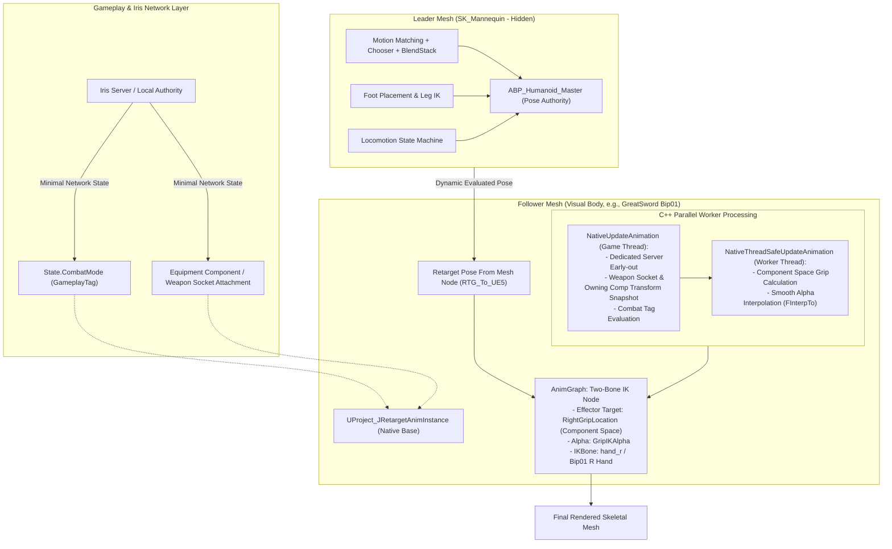

# MMORPG Runtime Retargeting & Weapon Hand IK Architecture

> **문서 버전:** 1.0.0  
> **최종 수정일:** 2026-09-22  
> **대상 엔진:** Unreal Engine 5.8  
> **핵심 기술 스택:** Motion Matching, BlendStack, IK Rig & IK Retargeter, Iris Replication, Gameplay Ability System (GAS), Worker Thread Parallel Anim Evaluation  
> **문서 목적:** 본 문서는 Project J의 인간형 캐릭터 모션 파이프라인(리더-팔로워 런타임 리타기팅 및 C++ 무기 손 IK)의 설계 배경과 기술적 맥락을 기술하고, 외부 아키텍트 및 AI가 구조적 적합성과 최적화 포인트를 검토할 수 있도록 상세 명세를 제공합니다.

---

## 1. 아키텍처 배경 및 문제 정의 (Background & Problem Statement)

### 1.1 프로젝트 환경 및 모션 매칭(Motion Matching)의 특성
Project J는 대규모 동시 접속 액션 MMORPG를 지향하며, 플레이어블 캐릭터의 로코모션(이동/방향전환/정지/스트레이프) 품질을 극대화하기 위해 **Unreal Engine 5의 Motion Matching + Chooser + BlendStack 파이프라인(GASP 기반)**을 사용하고 있습니다.

모션 매칭 시스템은 대량의 애니메이션 시퀀스를 사전 분석하여 생성된 **Pose Search Database (PSD)**를 기반으로 궤적(Trajectory)과 현재 포즈를 실시간 쿼리하여 가장 자연스러운 프레임을 선택합니다.

### 1.2 봉착한 핵심 과제 (Challenges)

1. **다양한 외형 에셋 및 이종 골격(Skeletal Mesh) 도입의 한계**:
   - MMORPG 특성상 다양한 종족, 성별, 직업, 외부 마켓플레이스 캐릭터 에셋이 지속적으로 추가됩니다.
   - 외부 에셋 중 다수는 언리얼 표준 마네킹(`SK_Mannequin`)이 아닌 3ds Max `Bip01` 등의 이종 골격 계층 구조와 바인드 포즈(T-Pose vs A-Pose)를 가집니다.
   - **호환 스켈레톤(Compatible Skeleton) 적용 불가 사유**:
     - 언리얼의 호환 스켈레톤 기능은 본 이름(`pelvis`, `spine_01`, `hand_r` 등)과 부모-자식 트리 구조가 완전히 동일해야만 작동합니다.
     - `Bip01 Pelvis`, `Bip01 R Hand` 등 접두사가 붙거나 본 개수가 다른 골격은 호환 스켈레톤으로 묶을 수 없으며, 반드시 **IK Rig 및 IK Retargeter(`RTG`)**를 거쳐야 합니다.

2. **애니메이션 및 PSD 복제(Duplicate & Retarget)를 하지 않는 이유**:
   - 질문: *"수많은 캐릭터 에셋마다 애니메이션 시퀀스를 오프라인으로 각각 리타깃해서 별도 ABP를 만들면 안 되는가?"*
   - **답변: 모션 매칭 환경에서는 심각한 기술 부채와 메모리 폭증을 유발하여 불가능합니다.**
     - **VRAM / RAM 메모리 폭증**: 일반 시퀀스뿐만 아니라 수백 개의 애니메이션 프레임별 궤적/포즈 특성을 인덱싱한 **Pose Search Database (PSD)**까지 에셋 개수(N개)만큼 중복 로드되어 기가바이트 단위의 메모리 낭비가 발생합니다.
     - **에셋 및 패키징 용량(Storage/Git LFS) 폭발**: 캐릭터가 10개만 추가되어도 수천 개의 `.uasset` 시퀀스가 중복 생성되어 빌드/패키징 시간이 기하급수적으로 증가합니다.
     - **유지보수 분산 (Maintenance Hell)**: 이동 가속도, 정지 관성, 턴인플레이스(Turn-In-Place) 임계값, Chooser 분기 로직 등을 튜닝할 때 모든 캐릭터의 개별 ABP와 PSD를 재빌드/재검증해야 하는 운영상 파편화가 발생합니다.
   - 따라서 **단 1개의 골든 마스터 마네킹에서만 모션 매칭을 실행하고, 외형은 런타임에 동적으로 포즈만 빌려오는 '런타임 리타기팅(Runtime Retargeting)' 구조가 필수적**입니다.

3. **신체 비율 차이로 인한 무기 파지(Weapon Grip) 뒤틀림 현상**:
   - 리타기팅을 통해 포즈를 동적으로 전송하더라도, 캐릭터마다 어깨 너비, 팔 길이, 척추 곡률이 완전히 다릅니다.
   - 무기가 등(등 소켓 `Sheathe_Socket`)에 장착되어 있거나 손에 쥐어졌을 때, 손가락/손바닥이 무기 손잡이(Grip)에서 허공에 뜨거나 파묻히는 시각적 결함이 발생합니다.
   - **왜 마스터 마네킹에서 IK를 풀지 않고 팔로워에서 푸는가? (Post-Retarget IK)**:
     - 마스터 마네킹은 팔로워 캐릭터 고유의 팔 길이(체형)를 알지 못합니다.
     - 마스터 마네킹이 자신의 팔 길이에 맞춰 손을 배치한 뒤 리타깃을 거치면, 팔 길이가 다른 팔로워 골격에서는 다시 위치 오차가 누적됩니다.
     - 따라서 **최종 렌더링 직전, 팔로워 자신의 고유 골격과 로컬 무기 위치를 기준으로 2차 Two-Bone IK를 적용(Post-Retarget)**해야만 완벽한 파지가 보장됩니다.

---

## 2. 채택한 아키텍처 및 설계 원칙 (Proposed Architecture)

이 문제를 해결하기 위해 **"단일 마스터 리더 로코모션 + 경량 런타임 리타깃 팔로워 + C++ 기반 컴포넌트 공간 투본 IK"** 구조를 설계하고 구현하였습니다.

### 2.1 아키텍처 다이어그램 (Architecture Pipeline)

---

## 3. 핵심 구성 요소 상세 (Key Components)

### 3.1 캐릭터 블루프린트 컴포넌트 트리 계층 구조 (Character Blueprint Component Hierarchy)

실제 캐릭터 블루프린트(`BP_GreatSword` / `AProject_JPlayerCharacter`) 내부의 컴포넌트 부모-자식 트리 구조는 다음과 같이 구성되어 있습니다:

* **`[Root] CapsuleComponent`** (이동 및 물리 충돌체)
  * **`[Leader Mesh] Mesh`** (`CharacterMesh0`: 언리얼 기본 상속 `SkeletalMeshComponent`)
    * **골격 에셋**: `SK_Mannequin`
    * **애님 클래스**: `ABP_Humanoid_Master` (모션 매칭 로코모션 마스터)
    * **인게임 가시성**: `Hidden` (`SetVisibility(false)`)
    * **충돌 설정**: `NoCollision`
    * **틱 옵션**: `AlwaysTickPoseAndRefreshBones` (숨겨진 상태에서도 포즈 연산 보장)
    * ↳ **`[Follower Mesh] VisualMesh`** (`Mesh`의 자식 컴포넌트로 Attach)
      * **골격 에셋**: `GreatSword_Woman` (외부 Bip01 골격 외형 메시)
      * **애님 클래스**: `ABP_Greatsword_Woman_RunTIme` (부모: `UProject_JRetargetAnimInstance`)
      * **상대 트랜스폼**: 위치 `(0, 0, 0)`, 회전 `(0, 0, 0)`, 스케일 `(1, 1, 1)`
      * **인게임 가시성**: `Visible` (실제 화면 렌더링 메시)
      * **애님 그래프**: `Retarget Pose From Mesh` (부모 메시 자동 감지) ➔ `Two-Bone IK`
    * ↳ **`[Weapon Component / Actor]`** (무기 컴포넌트 또는 PresentationActor)
      * **부착 소켓**: 등 납도 `Sheathe_Socket` ↔ 손 발도 `hand_rSocket`
      * **손잡이 기준점**: 무기 에셋 자체에 `WeaponGrip_R` 소켓 생성

#### 왜 리더 메시(Mesh)의 '자식(Child)'으로 팔로워 메시를 달아서 구성하는가?
1. **`Retarget Pose From Mesh` 노드의 자동 소스 인식 (Zero Wiring)**:
   - 언리얼 엔진의 `Retarget Pose From Mesh` 노드는 `Source Mesh Component` 핀을 비워둘 경우, **자신의 부모(Parent)에 위치한 SkeletalMeshComponent를 자동으로 감지하여 포즈 소스로 바인딩**합니다.
   - 블루프린트 이벤트 그래프에서 복잡한 컴포넌트 레퍼런스 연결 노드를 둘 필요 없이 완벽하게 자동 연결됩니다.
2. **좌표계 및 캡슐 동기화 보장**:
   - 캐릭터가 웅크리기(Crouch)를 하여 캡슐 높이가 절반으로 줄어들거나 회전할 때, 리더 메시와 팔로워 메시의 로컬 원점(0,0,0)이 영구적으로 고정되어 메시 간 위치 이격이 원천 방지됩니다.
3. **무기 소켓 트랜스폼 추적의 일관성**:
   - 무기가 팔로워 메시의 등 소켓(`Sheathe_Socket`)에 부착되었을 때, C++ `UProject_JRetargetAnimInstance`는 팔로워 메시의 로컬 공간(`InverseTransformPosition`)으로 손잡이 소켓(`WeaponGrip_R`)을 역변환합니다. 부모-자식 트리 상에서 상대적 트랜스폼이 가장 정밀하게 유지됩니다.

### 3.2 리더 메시 (Leader Mesh - `ABP_Humanoid_Master`)
- **역할**: 오직 고품질 모션 연산(Motion Matching, Chooser, 궤적 예측, 블렌드스택, 턴인플레이스)만을 전담하는 마스터 포즈 제공자.
- **스켈레톤**: 언리얼 표준 골격인 `SK_Mannequin`.
- **렌더링**: 게임 내에서는 `SetVisibility(false)`로 보이지 않으며 충돌체를 갖지 않음.
- **Tick 옵션 최적화 및 T-Pose 결함 원인 분석**:
  - 언리얼 기본값인 `VisibilityBasedAnimTickOption = EVisibilityBasedAnimTickOption::OnlyTickMontagesWhenNotRendered`는 메시가 숨겨질 경우 본 트랜스폼 계산을 전면 중단(Freeze)합니다.
  - 이로 인해 팔로워 메시가 정지된 T-Pose 상태의 리더 메시를 리타깃하여 캐릭터가 굳어버리는 버그가 발생했습니다.
  - 따라서 C++ 초기화 단계에서 리더 메시를 **`EVisibilityBasedAnimTickOption::AlwaysTickPoseAndRefreshBones`**로 명시 설정하여, 비가시화 상태에서도 본 행렬을 상시 평가해 하위 팔로워로 포즈를 실시간 공급하도록 보장했습니다.

### 3.3 팔로워 메시 및 런타임 리타기팅 (`ABP_Greatsword_Woman_RunTIme`)
- **역할**: 플레이어의 실제 화면에 렌더링되는 시각적 캐릭터 메시(예: Bip01 골격 기반 여성 대검 캐릭터).
- **AnimGraph 구성**:
  - **`Retarget Pose From Mesh`** 노드: 리더 메시의 포즈를 실시간으로 가져와 `RTG_To_UE5`(IK Retargeter)를 거쳐 실시간 골격 변환.
  - 에셋 복제 없이 수천 개의 언리얼 마네킹 시퀀스를 이종 캐릭터가 100% 실시간 공유.

### 3.4 C++ 무기 손 IK 컨트롤러 (`UProject_JRetargetAnimInstance`)

#### A. 게임 스레드와 워커 스레드 완전 분리 (Worker-Thread Safe)
언리얼 엔진의 병렬 애니메이션 평가(Parallel Animation Evaluation)를 저해하지 않도록 철저히 스레드 안전성을 확보했습니다:
1. **`NativeUpdateAnimation` (게임 스레드)**:
   - 전용 서버(Dedicated Server) 조기 탈출 (`GetNetMode() == NM_DedicatedServer` 시 즉시 반환).
   - 캐릭터의 ASC(GameplayTag `State.CombatMode`)를 확인하여 전투 모드 동기화.
   - 무기 컴포넌트의 소켓(`WeaponGrip_R`) 월드 트랜스폼 및 오너 컴포넌트 트랜스폼을 스냅샷(`SnapshotWeaponSocketWorldTransform`, `SnapshotOwningCompWorldTransform`)으로 캡처.
2. **`NativeThreadSafeUpdateAnimation` (워커 스레드)**:
   - 어떠한 UObject 조회나 액터 쿼리 없이, 캡처된 스냅샷만으로 역변환 연산 수행:
     $$\text{RightGripLocation} = \text{OwningCompTransform}^{-1} \times \text{WeaponSocketTransform}$$
   - `FMath::FInterpTo`를 활용하여 납도(등 파지: Alpha 1.0) ↔ 발도(전투: Alpha 0.0) 간의 급격한 포즈 튐(Popping)을 방지하고 부드럽게 감쇄.

### 3.5 공격/스킬 몽타주와 루트 모션(Root Motion) 처리 규격
- **`CharacterMovementComponent` 종속성**:
  - 언리얼 엔진의 캐릭터 무브먼트는 오직 오너 캐릭터의 메인 메시(`Character->GetMesh()`, 즉 **Leader Mesh**)의 루트 본 이동량만을 감지하여 캡슐을 월드 상에서 이동시킵니다.
  - 따라서 돌진, 대검 회전 베기, 점프 스매시 등 루트 모션이 포함된 모든 스킬 몽타주는 **Leader Mesh에서 재생**되어야 물리 충돌과 캡슐 이동이 정상 작동합니다.
- **포즈 전송 흐름**:
  - Leader Mesh가 몽타주를 재생하면, 해당 포즈가 `Retarget Pose From Mesh`를 통해 Follower Mesh로 실시간 전송됩니다.
  - Follower Mesh의 루트 본은 로컬 (0,0,0)에 고정되고 상/하체 모션만 리타깃되어 재생되므로 완벽한 싱크가 유지됩니다.

### 3.6 대검 양손 파지(Two-Handed Grip) 및 왼손 보조 IK 확장 로드맵
- 대검(Greatsword)은 대표적인 양손 무기입니다. 현재 구현된 `WeaponGrip_R`(주 손잡이)에 이어, 왼손 보조 손잡이(`WeaponGrip_L`) 파지를 지원하도록 C++ 클래스 확장이 예정되어 있습니다:
  - `LeftGripLocation` (컴포넌트 공간 FVector) 및 `LeftGripIKAlpha` (float) 추가.
  - 양손 파지 공격 및 가드(Guard) 모션 시 오른손은 주 손잡이에 고정되고, 왼손은 무기 칼등이나 보조 그립 소켓에 Two-Bone IK로 자동 밀착.

### 3.7 발도/납도 무기 소켓 트랜지션 및 애님 노티파이(AnimNotify) 동기화
- 무기가 등 소켓(`Sheathe_Socket`)에서 손 소켓(`hand_rSocket`)으로 스위칭되는 순간:
  - 순간적인 소켓 교체로 인한 손/무기 튐을 방지하기 위해, 애니메이션 몽타주 내의 특정 프레임에 `AttachWeaponToHand` / `AttachWeaponToSheathe` 애님 노티파이를 배치합니다.
  - C++ `UProject_JRetargetAnimInstance`의 `GripInterpSpeed`(기본값 12.0f)가 노티파이 발생 타이밍과 정합하여 부드러운 감쇄 곡선을 형성합니다.

### 3.8 래그돌(Ragdoll) 및 보조 물리(Chaos Cloth/Hair)와의 공존
- **시각적 메시 우선 물리**:
  - 피격 사망, 넉다운 등의 상황에서 래그돌(`SetAllBodiesSimulatePhysics`)은 시각적 본체인 **Follower Mesh**에서 실행됩니다.
  - 팔로워 애님 그래프에서 `Blend Poses by bool`을 통해 `Retarget Pose From Mesh`의 블렌드 가중치를 1.0에서 0.0으로 전환하며 피직스 애셋으로 자연스럽게 핸드오프합니다.
- **천/헤어 시뮬레이션**:
  - 망토나 치마, 머리카락 등의 본 시뮬레이션(KawaiiPhysics / AnimDynamics)은 팔로워 애님 그래프의 `Two-Bone IK` 노드 뒷단(Post-IK)에 배치되어 자연스러운 2차 모션을 완성합니다.

---

## 4. 네트워크 동기화 및 최적화 전략 (Iris & Dedicated Server)

### 4.1 Iris 복제 시스템 및 안정적 무기 파지 (Deterministic Grip Targets)
- **프레임당 본/IK 좌표 복제 부재 (Zero Per-Frame IK Bandwidth)**:
  - 본 트랜스폼, IK 타깃 위치, 리타기팅 중간 포즈는 네트워크를 통해 복제되지 않습니다.
  - 리플리케이션은 순수 게임플레이 상태(무기 장착 리비전, 전투 태그 `State.CombatMode`, 몽타주 노티파이)만 Iris를 통해 전송됩니다.
- **항시 안정적인 Grip Target 공급 (Stable Grip Targets)**:
  - `UProject_JWeaponPresentationComponent::UpdateGripTargets()`는 Independent Weapon Motion 활성화 여부와 무관하게 무기가 스폰/장착된 동안 매 프레임 주손/보조손 소켓 트랜스폼을 계산하여 공급합니다.
  - Independent Motion은 기본 파지 타깃 위에 덧씌워지는 부가 레이어로 작동하며, 비활성 상태(납도/발도/전투 이동/일반 공격)에서도 안정적인 파지 타깃을 유지합니다.
- **소켓 컴포넌트 캐싱 (Socket Component Caching)**:
  - `UProject_JWeaponPresentationComponent`는 무기 스폰, 프로파일 변경, 소켓 전환 시점에 그립 소켓을 소유한 컴포넌트(`CachedPrimaryGripComponent`, `CachedSecondaryGripComponent`)를 선제적으로 캐싱합니다.
  - 매 프레임 그립 트랜스폼 계산 시 전체 씬 컴포넌트 순회(`GetComponents<USceneComponent>`)를 거치지 않고, 캐시된 컴포넌트에서 즉시 월드 트랜스폼을 질의(Fast Path)합니다. (캐시 무효 시에만 폴백 탐색 및 재캐싱)
- **Authored IK Alpha 권위 보장**:
  - 무기 프로필(`FProject_JWeaponMotionPresentation`)에 정의된 `DefaultDrawnPrimaryIKAlpha`, `DefaultDrawnSecondaryIKAlpha`, `DefaultSheathedPrimaryIKAlpha`, `DefaultSheathedSecondaryIKAlpha`가 최종 가중치 권위를 가집니다.
  - `UProject_JRetargetAnimInstance`는 코드로 1.0f를 강제 덮어쓰지 않고, 프로필에서 정의된 아티스트 authored alpha를 충실히 따릅니다.
- **이벤트 주도형 타깃 갱신 (Event-Driven Target Push)**:
  - 무기 스폰/파괴/소켓 변경 시 `NotifyWeaponTargetChanged`를 통해 등록된 `UProject_JRetargetAnimInstance`에 즉각 타깃이 전달되므로, 매 프레임 월드 액터/컴포넌트를 탐색하는 낭비가 없습니다.

### 4.2 전용 서버(Dedicated Server) 비주얼 격리
- **무기 시각 액터 스폰 차단**:
  - `UProject_JWeaponPresentationComponent::CanCreatePresentation()`에 `NM_DedicatedServer` 가드를 적용하여, 전용 서버 환경에서는 비주얼 무기 액터 스폰 및 비주얼 컴포넌트 런타임 비용을 제거합니다.
- **팔로워 메시 틱 완전 비활성화**:
  - `UProject_JRetargetAnimInstance::NativeInitializeAnimation()`에서 전용 서버일 경우 팔로워 `SkeletalMeshComponent`의 컴포넌트 틱을 `SetComponentTickEnabled(false)`로 정지시켜 애님그래프(`Retarget Pose From Mesh`) 및 워커 스레드 평가를 원천 차단합니다.
- **판정의 정합성**:
  - 서버 공격 판정은 비주얼 팔로워 메시나 시각 액터가 아닌, 서버의 정식 게임플레이 지오메트리(Leader Mesh 및 어택 정의)만을 기준으로 엄격히 집행됩니다.

### 4.3 서버 사이드 리와인드(SSR) 과거 시점 검증 강화
- **공격자 무기 스윕 히스토리 링버퍼 (`FProject_JAuthoritativeSweepRecord`)**:
  - `UProject_JCombatHitValidationComponent`에 128슬롯 고정 크기 링 버퍼(`SweepHistoryStartIndex`, `SweepHistoryCount`) 및 `MaxSweepHistorySeconds`(1.5초) 기반 만료 관리 구조를 구축했습니다. (60~85 Hz 샘플링 환경에서 1.5초를 완전히 커버)
  - 각 스윕 레코드는 `ServerTimestamp`, `TraceStart`, `TraceEnd`, `AttackNodeTag`, `PredictionKey`, `bHitWindowOpen`을 모두 기록합니다.
- **HitWindow 상태 전이 경계 기록 (Transition Boundary Recording)**:
  - `SetHitWindowOpen(bool bOpen)` 호출 시 상태 변화가 일어나는 즉시 전이 타임스탬프와 최신 스윕 위치를 담은 경계 레코드를 기록합니다.
  - 공격이 예기치 않게 취소되거나 조기 종료(`EndAttack`)되더라도 종료 직전 즉시 Close 전이 레코드를 히스토리에 남깁니다.
- **시간축 기반 서브프레임 보간 및 판정 (Sub-frame Interpolation)**:
  - 요청 타임스탬프를 감싸는 두 바운딩 프레임 사이에서 `PredictionKey`와 `AttackNodeTag`가 일치하는 경우에만 선형 보간(`Lerp`)을 수행합니다. 서로 다른 공격 노드 간 교차 보간은 엄격히 차단됩니다.
  - 판정 구간 내 `bHitWindowOpen`은 단순 bool AND가 아니라, Close 시점 타임스탬프 이전까지만 유효(`TargetTimestamp < CloseTimestamp`)하도록 판정하여 Close 직후 지연 요청의 거짓 긍정(False Positive)을 차단합니다.
- **검증 유효 범위 (Active Attack Context Scope - Option A)**:
  - SSR 히스토리는 **현재 활성 공격 activation 내부**의 weapon sweep 및 target rewind 정합성을 보장합니다.
  - 공격 activation이 이미 종료되었거나 다음 콤보 노드로 넘어간 지연 요청은 의도적으로 거절(`AttackActivationMismatch` / `AttackNodeMismatch`)하여 공격 상태 머신 오염을 방지합니다.

### 4.4 Hidden Leader 메시와 ABA(Anim Budget Allocator) 정책
- **액터 렌더링 플래그 연동 (`SetShouldUseActorRenderedFlag(true)`)**:
  - `UProject_JBudgetedSkeletalMeshComponent`에서 액터 가시성 연동을 활성화하여, Leader 메시가 숨겨져 있어도 자식인 Follower 메시가 화면에 렌더링 중이면 ABA가 정상 렌더링 상태로 인식하도록 지원합니다.
- **Policy A / Policy B 런타임 CVar 실시간 토글**:
  - 콘솔 변수 `Project_J.Anim.BudgetTickWhenNotRendered`(기본값 1)를 지원합니다:
    - **Policy A (1)**: `bBudgetTickWhenNotRendered = true` (숨겨진 Leader도 ABA 관전 하에 틱 유지)
    - **Policy B (0)**: `bBudgetTickWhenNotRendered = false` (화면 밖 비전투 캐릭터 스킵, 전투 상태에서만 `GameplayPose` 요구)
  - `UProject_JCharacterAnimationBudgetSubsystem::Refresh()`에서 매 프레임 Game Thread 상의 CVar 값을 읽어 등록된 메시의 `bBudgetTickWhenNotRendered` 및 `IAnimationBudgetAllocator`에 즉각 전파하므로, 런타임에 게임 재시작 없이 Unreal Insights에서 비교 프로파일링할 수 있습니다.

### 4.5 통합 애니메이션 퀄리티 티어 (Unified Animation Quality Tier)
Leader ABA, Follower 런타임 리타기팅, Retarget IK, Hand IK, Foot IK가 단일 정책 구조체(`FProject_JAnimOptimizationPolicy`)를 공유하도록 통합되었습니다:
- **Local (로컬 플레이어)**:
  - Leader 풀 틱 + Follower 풀 리타깃 + Retarget IK (LOD 0) + Hand IK On + Foot IK On.
- **Near (중요도 높음 / 근거리)**:
  - Leader 풀 틱 + Follower 풀 리타깃 + Retarget IK (LOD 1) + Hand IK On + Foot IK On.
- **Mid (중거리 / 일반 군집)**:
  - Leader ABA 스킵 틱 + Follower 리타깃 유지 + Retarget IK Off (FK 위주 리타깃) + **Hand IK Off (연산 대폭 절감)** + Foot IK On.
- **Far (원거리)**:
  - Leader 저빈도 틱 + Far Chooser 전용 + Retarget IK Off + Hand IK Off + Foot IK Off.
- **Hidden (비가시화)**:
  - Leader의 상태 전이에 따라 Follower animation component tick 및 Runtime Retarget / IK evaluation을 비활성화(`SetComponentTickEnabled(false)`)하여 visual animation evaluation 비용을 제거한다. 다시 화면 내 진입 시 `WasOwnerVisualRecentlyRendered` 감지에 의해 즉각 복구.
  - 모듈러 장비 메시(`UProject_JModularMeshComponent`)는 격리되어 독립적인 수명주기를 유지하며, 전용 팔로워 메시만 안전하게 식별 및 제어.
  - 클라이언트 Follower 메시 기본 옵션으로 `VisibilityBasedAnimTickOption::OnlyTickPoseWhenRendered` 적용.
  - `UProject_JRetargetAnimInstance`에서 `bEnableFollowerRetarget`, `bTierAllowsHandIK`, `bTierAllowsFootIK`, `bTierAllowsRetargetIK`, `RetargetIKLODThreshold`, `RetargetLODThreshold`를 노출하여 AnimGraph 상의 조건 분기(`Blend Poses by Bool` 및 노드 LOD 핀) 지원.

---

## 5. 외부 AI 및 아키텍처 검토 요청 사항 (Questions for Architecture Review)

외부 웹 AI 또는 전문 엔지니어에게 본 구조에 대한 심층 검토를 요청하는 주요 항목은 다음과 같습니다:

### [Q1] 대규모 MMORPG 환경에서의 확장성 (Scalability & Budget Allocator)
- 수백 명의 유저가 한 화면에 모이는 레이드/필드전 상황에서, 플레이어당 2개의 스켈레탈 메시(Leader + Follower)와 `Retarget Pose From Mesh`를 실행하는 오버헤드가 문제가 되지 않는가?
- 언리얼 엔진의 **Anim Budget Allocator (ABA)**나 **Significance Manager**를 적용할 때, 비가시화된 Leader Mesh의 틱 빈도를 낮추면 Follower의 리타기팅 포즈가 보간되는가 아니면 끊김이 발생하는가?
- 원거리(LOD 2 이상) 캐릭터의 경우 런타임 리타기팅 노드를 우회하고 단순 공유 포즈나 오프라인 베이킹된 메시로 전환하는 하이브리드 패턴이 권장되는가?

### [Q2] 공격 판정(Combat Collision Sweeps)과 히트박스 위치 동기화
- 액션 판정 시 무기 궤적 트레이스(Weapon Shape Trace)는 **Leader의 무기 소켓**을 기준으로 해야 하는가, 아니면 **Follower의 무기 소켓**을 기준으로 해야 하는가?
- 전용 서버에서는 Follower의 리타깃 및 IK가 실행되지 않으므로 서버의 히트박스 판정과 클라이언트의 시각적 칼날 위치 사이에 괴리가 생길 수 있는데, 업계 표준 실무에서는 이를 어떻게 일치시키는가?

### [Q3] 지형 경사로 적응 (Foot Placement / Leg IK)의 리타기팅 전달력
- 리더 마네킹에서 계산된 `Foot Placement`(경사로 지형 레이캐스트 및 골반 오프셋) 포즈가 IK 리타기터(`RTG_To_UE5`)를 거쳐 팔로워 캐릭터로 넘어갈 때, 팔로워의 다리 길이가 리더와 다를 경우 발바닥 접지가 붕 뜨거나 파묻히지 않는가?
- Follower의 AnimGraph 내부에서 독자적인 Leg IK/Foot Placement를 2차로 실행해야 하는가, 아니면 IK 리타기터의 `IK Goal` 설정만으로 충분히 해결되는가?

### [Q4] 메모리(RAM) vs CPU 비용의 트레이드오프 분석
- 수십 개 종족/직업에 대해 모든 애니메이션과 Pose Search Database를 사전 베이킹(오프라인 복제)하는 방식(메모리 소모 극대화, CPU 소모 최소) 대비,
- 본 문서의 런타임 리타기팅 방식(메모리 최소화, 틱당 런타임 CPU 소모 증가)의 최적 임계점(Tipping Point)은 유저 수/에셋 수 기준 어디에 형성되는가?

### [Q5] 루트 모션(Root Motion) 몽타주와 캡슐 이동 동기화 검증
- 모든 공격/회피 스킬 몽타주를 Leader Mesh에서 재생하고 `Retarget Pose From Mesh`로 팔로워에 흘려보내는 구조에서, 루트 이동량(Delta Translation)이 캡슐에 반영되는 동안 클라이언트 렌더링 메시의 발 미끄러짐(Foot Sliding)이나 딜레이가 발생하지 않는가?

### [Q6] 래그돌(Ragdoll) 및 피직스 애셋 핸드오프
- 피격 사망 시 Follower Mesh가 래그돌로 전환될 때, Leader Mesh는 어떻게 처리해야 하는가? (Leader의 애니메이션 틱을 정지시키고 팔로워가 완전한 피직스 시뮬레이션을 수행하게 만드는 생명주기 관리 베스트 프랙티스는?)

### [Q7] 발도/납도 무기 소켓 스위칭 시 시각적 결함 억제
- 무기가 등 소켓(`Sheathe_Socket`)에서 손 소켓(`hand_rSocket`)으로 이동할 때 발생하는 1프레임 소켓 스위칭 튐을 방지하기 위한 가장 우아한 어태치먼트 블렌딩(Attachment Blending) 실무 기법은?

---

## 6. 부록: 외부 마켓플레이스 FBX 에셋 임포트 및 전처리 표준 (Asset Pipeline)

향후 신규 캐릭터 및 의상 에셋 추가 시 골격 파손을 방지하기 위한 표준 워크플로우입니다:

1. **블렌더(Blender) 에셋 정제**:
   - 마켓플레이스 에셋이 분할 파츠(머리, 몸통, 무기 등)나 다중 아마추어로 구성된 경우, 하나의 스켈레탈 메시로 결합(`Ctrl + J`).
   - 단 하나의 주 아마추어(`Bip01`)만 남기고, 무기나 불필요한 더미 뼈/오브젝트를 독립 분리하여 골격 트리 정제.
2. **언리얼 엔진 임포트**:
   - 이종 골격이므로 `SK_Mannequin`을 지정하지 않고, 고유 스켈레톤 에셋(예: `GreatSword_Woman_Skeleton`)을 신규 생성하여 임포트.
3. **IK Rig 및 IK Retargeter 생성**:
   - `IK_GreatSword_Woman` 생성 후 `Pelvis`를 리타깃 루트로 지정, Spines/Neck/Head/Limbs 체인 정의.
   - `RTG_To_UE5` 리타기터에서 소스(`SKM_Quinn_Simple`)와 타깃(`GreatSword_Woman`)의 바인드 포즈를 A-Pose 기준으로 일치시키고 체인 매핑.
4. **런타임 리타깃 애님 인스턴스 할당**:
   - 팔로워 애님 블루프린트(`ABP_Greatsword_Woman_RunTIme`) 생성 후 부모 클래스를 `UProject_JRetargetAnimInstance`로 설정.
   - `Retarget Pose From Mesh` 노드와 C++ 컴포넌트 공간 `Two-Bone IK` 노드를 연결하여 파이프라인 완성.

