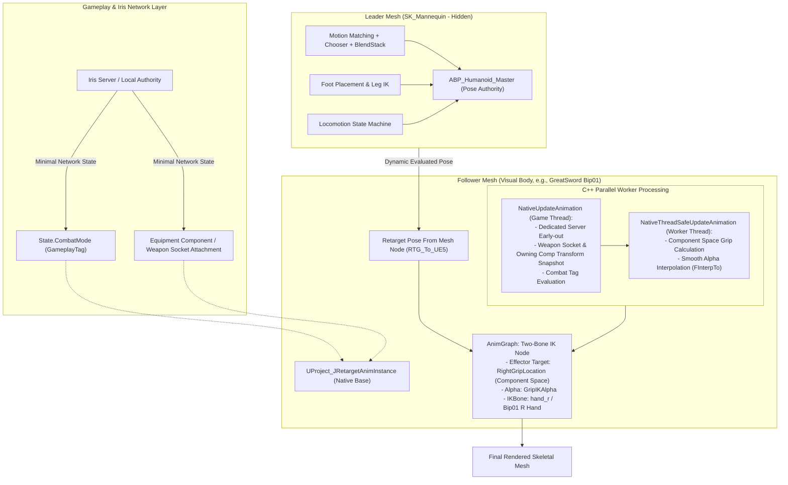

# MMORPG Runtime Retargeting & Weapon Hand IK Architecture

> **문서 버전:** 1.0.0  
> **최종 수정일:** 2026-09-22  
> **대상 엔진:** Unreal Engine 5.8  
> **핵심 기술 스택:** Motion Matching, BlendStack, IK Rig & IK Retargeter, Iris Replication, Gameplay Ability System (GAS), Worker Thread Parallel Anim Evaluation  
> **문서 목적:** 본 문서는 Project J의 인간형 캐릭터 모션 파이프라인(리더-팔로워 런타임 리타기팅 및 C++ 무기 손 IK)의 설계 배경과 기술적 맥락을 기술하고, 외부 아키텍트 및 AI가 구조적 적합성과 최적화 포인트를 검토할 수 있도록 상세 명세를 제공합니다.

---

## 1. 아키텍처 배경 및 문제 정의 (Background & Problem Statement)

### 1.1 프로젝트 환경 및 모션 매칭(Motion Matching)의 특성
Project J는 대규모 동시 접속 액션 MMORPG를 지향하며, 플레이어블 캐릭터의 로코모션(이동/방향전환/정지/스트레이프) 품질을 극대화하기 위해 **Unreal Engine 5의 Motion Matching + Chooser + BlendStack 파이프라인(GASP 기반)**을 사용하고 있습니다.

모션 매칭 시스템은 대량의 애니메이션 시퀀스를 사전 분석하여 생성된 **Pose Search Database (PSD)**를 기반으로 궤적(Trajectory)과 현재 포즈를 실시간 쿼리하여 가장 자연스러운 프레임을 선택합니다.

### 1.2 봉착한 핵심 과제 (Challenges)

1. **다양한 외형 에셋 및 이종 골격(Skeletal Mesh) 도입의 한계**:
   - MMORPG 특성상 다양한 종족, 성별, 직업, 외부 마켓플레이스 캐릭터 에셋이 지속적으로 추가됩니다.
   - 외부 에셋 중 다수는 언리얼 표준 마네킹(`SK_Mannequin`)이 아닌 3ds Max `Bip01` 등의 이종 골격 계층 구조와 바인드 포즈를 가집니다.
   - 본 계층 구조와 이름이 일치하지 않아 UE의 '호환 스켈레톤(Compatible Skeleton)' 기능을 직접 사용할 수 없습니다.

2. **애니메이션 및 PSD 복제(Duplicate & Retarget)의 메모리/유지보수 폭발**:
   - 각 이종 에셋마다 수백 개의 모션 매칭용 애니메이션을 오프라인으로 복제/리타깃하고, 에셋별로 별도의 Pose Search Database를 생성하는 방식은 다음과 같은 치명적 단점이 있습니다:
     - **메모리 폭증 (VRAM/RAM)**: 에셋 수에 비례하여 기가바이트 단위의 애니메이션 및 검색 데이터베이스 복제.
     - **유지보수 분산**: 로코모션 튜닝, Chooser 로직, 트랜지션 블렌드 설정 변경 시 모든 직업/에셋의 ABP를 개별 수정해야 함.

3. **신체 비율 차이로 인한 무기 파지(Weapon Grip) 뒤틀림 현상**:
   - 리타기팅을 통해 포즈를 전송하더라도, 캐릭터마다 어깨 너비, 팔 길이, 척추 곡률이 다릅니다.
   - 무기가 등(등 소켓 `Sheathe_Socket`)에 장착되어 있거나 손에 쥐어졌을 때, 손가락/손바닥이 무기 손잡이(Grip)에서 허공에 뜨거나 파묻히는 시각적 결함이 발생합니다.

---

## 2. 채택한 아키텍처 및 설계 원칙 (Proposed Architecture)

이 문제를 해결하기 위해 **"단일 마스터 리더 로코모션 + 경량 런타임 리타깃 팔로워 + C++ 기반 컴포넌트 공간 투본 IK"** 구조를 설계하고 구현하였습니다.

### 2.1 아키텍처 다이어그램 (Architecture Pipeline)

---

## 3. 핵심 구성 요소 상세 (Key Components)

### 3.1 리더 메시 (Leader Mesh - `ABP_Humanoid_Master`)
- **역할**: 오직 고품질 모션 연산(Motion Matching, Chooser, 궤적 예측, 블렌드스택, 턴인플레이스)만을 전담하는 마스터 포즈 제공자.
- **스켈레톤**: 언리얼 표준 골격인 `SK_Mannequin`.
- **렌더링**: 게임 내에서는 `SetVisibility(false)`로 보이지 않으며 충돌체를 갖지 않음.
- **Tick 옵션 최적화**:
  - `VisibilityBasedAnimTickOption = EVisibilityBasedAnimTickOption::AlwaysTickPoseAndRefreshBones` 설정.
  - 마스터 메시가 비가시화(Hidden) 상태여도 하위 팔로워 메시로 본 트랜스폼을 계속 공급해야 하므로 포즈 갱신을 보장함.

### 3.2 팔로워 메시 및 런타임 리타기팅 (`ABP_Greatsword_Woman_RunTIme`)
- **역할**: 플레이어의 실제 화면에 렌더링되는 시각적 캐릭터 메시(예: Bip01 골격 기반 여성 대검 캐릭터).
- **AnimGraph 구성**:
  - **`Retarget Pose From Mesh`** 노드: 리더 메시의 포즈를 실시간으로 가져와 `RTG_To_UE5`(IK Retargeter)를 거쳐 실시간 골격 변환.
  - 에셋 복제 없이 수천 개의 언리얼 마네킹 시퀀스를 이종 캐릭터가 100% 실시간 공유.

### 3.3 C++ 무기 손 IK 컨트롤러 (`UProject_JRetargetAnimInstance`)

#### A. 게임 스레드와 워커 스레드 완전 분리 (Worker-Thread Safe)
언리얼 엔진의 병렬 애니메이션 평가(Parallel Animation Evaluation)를 저해하지 않도록 철저히 스레드 안전성을 확보했습니다:
1. **`NativeUpdateAnimation` (게임 스레드)**:
   - 전용 서버(Dedicated Server) 조기 탈출 (`GetNetMode() == NM_DedicatedServer` 시 즉시 반환).
   - 캐릭터의 ASC(GameplayTag `State.CombatMode`)를 확인하여 전투 모드 동기화.
   - 무기 컴포넌트의 소켓(`WeaponGrip_R`) 월드 트랜스폼 및 오너 컴포넌트 트랜스폼을 스냅샷(`SnapshotWeaponSocketWorldTransform`, `SnapshotOwningCompWorldTransform`)으로 캡처.
2. **`NativeThreadSafeUpdateAnimation` (워커 스레드)**:
   - 어떠한 UObject 조회나 액터 쿼리 없이, 캡처된 스냅샷만으로 역변환 연산 수행:
     $$\text{RightGripLocation} = \text{OwningCompTransform}^{-1} \times \text{WeaponSocketTransform}$$
   - `FMath::FInterpTo`를 활용하여 납도(등 파지: Alpha 1.0) ↔ 발도(전투: Alpha 0.0) 간의 급격한 포즈 튐(Popping)을 방지하고 부드럽게 감쇄.

---

## 4. 네트워크 동기화 및 최적화 전략 (Iris & Dedicated Server)

### 4.1 Iris 복제 시스템과의 정합성
- **대역폭 제로 (0 Network Bandwidth Overhead)**:
  - 본 트랜스폼, IK 타깃 위치, 리타기팅 중간 포즈는 네트워크를 통해 전혀 복제되지 않습니다.
  - 리플리케이션은 순수 게임플레이 상태(무기 장착 여부, 전투 태그 `State.CombatMode`)만 Iris를 통해 전송됩니다.
- **결정론적 로컬 평가 (Deterministic Local Evaluation)**:
  - 모든 리모트 클라이언트는 서버로부터 받은 고수준 상태를 기반으로 자신의 로컬 머신에서 동일한 C++ IK 로직과 리타기팅 노드를 병렬 실행합니다.
  - 패킷 손실이나 지연이 발생해도 손이나 무기가 공중에 분리되는 현상이 발생하지 않습니다.

### 4.2 전용 서버(Dedicated Server) 부하 최소화
- 시각적 메시 리타기팅과 투본 IK는 클라이언트 전용(Visual Only) 연산입니다.
- 서버 환경에서는 `NativeUpdateAnimation`에서 즉시 반환되어 CPU 사이클 소모가 0에 수렴합니다.

---

## 5. 외부 AI 및 아키텍처 검토 요청 사항 (Questions for Architecture Review)

외부 웹 AI 또는 전문 엔지니어에게 본 구조에 대한 심층 검토를 요청하는 주요 항목은 다음과 같습니다:

### [Q1] 대규모 MMORPG 환경에서의 확장성 (Scalability & Budget Allocator)
- 수백 명의 유저가 한 화면에 모이는 레이드/필드전 상황에서, 플레이어당 2개의 스켈레탈 메시(Leader + Follower)와 `Retarget Pose From Mesh`를 실행하는 오버헤드가 문제가 되지 않는가?
- 언리얼 엔진의 **Anim Budget Allocator (ABA)**나 **Significance Manager**를 적용할 때, 비가시화된 Leader Mesh의 틱 빈도를 낮추면 Follower의 리타기팅 포즈가 보간되는가 아니면 끊김이 발생하는가?
- 원거리(LOD 2 이상) 캐릭터의 경우 런타임 리타기팅 노드를 우회하고 단순 공유 포즈나 오프라인 베이킹된 메시로 전환하는 하이브리드 패턴이 권장되는가?

### [Q2] 공격 판정(Combat Collision Sweeps)과 히트박스 위치 동기화
- 액션 판정 시 무기 궤적 트레이스(Weapon Shape Trace)는 **Leader의 무기 소켓**을 기준으로 해야 하는가, 아니면 **Follower의 무기 소켓**을 기준으로 해야 하는가?
- 전용 서버에서는 Follower의 리타깃 및 IK가 실행되지 않으므로 서버의 히트박스 판정과 클라이언트의 시각적 칼날 위치 사이에 괴리가 생길 수 있는데, 업계 표준 실무에서는 이를 어떻게 일치시키는가?

### [Q3] 지형 경사로 적응 (Foot Placement / Leg IK)의 리타기팅 전달력
- 리더 마네킹에서 계산된 `Foot Placement`(경사로 지형 레이캐스트 및 골반 오프셋) 포즈가 IK 리타기터(`RTG_To_UE5`)를 거쳐 팔로워 캐릭터로 넘어갈 때, 팔로워의 다리 길이가 리더와 다를 경우 발바닥 접지가 붕 뜨거나 파묻히지 않는가?
- Follower의 AnimGraph 내부에서 독자적인 Leg IK/Foot Placement를 2차로 실행해야 하는가, 아니면 IK 리타기터의 `IK Goal` 설정만으로 충분히 해결되는가?

### [Q4] 메모리(RAM) vs CPU 비용의 트레이드오프 분석
- 수십 개 종족/직업에 대해 모든 애니메이션과 Pose Search Database를 사전 베이킹(오프라인 복제)하는 방식(메모리 소모 극대화, CPU 소모 최소) 대비,
- 본 문서의 런타임 리타기팅 방식(메모리 최소화, 틱당 런타임 CPU 소모 증가)의 최적 임계점(Tipping Point)은 유저 수/에셋 수 기준 어디에 형성되는가?
