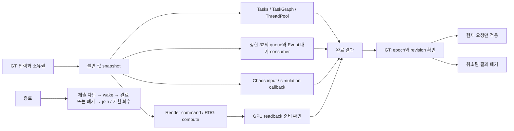

# E 후속 검증과 F 실행 경계 실험

2026-09-12, 실제 main 작업 디렉터리. 기준 커밋 `7ed9467`에 이 문서와 함께 있는 미커밋 변경을 적용해 측정했다. 과거 A–E 수치는 [기존 보고서](../SystemsModernization.md)에 보존한다.

**F의 8개 자동화 fixture를 구현·실행했다.** E는 기본 조명 PSO 누락을 해결했고, 사용자 승인 후 **운영 ABP 2개와 Trail 1개를 저장했다.** 적용 후 정밀 시각 비교와 driver cold 인증까지 완료한 것은 아니다.

## 구조와 적용 판단

실험은 기본 비활성인 [ProjectJExperiments](../../../../Plugins/ProjectJExperiments) Editor 플러그인에 있다. 일반 게임의 Tick·CMC·GAS·오디오·렌더러에 새 스케줄러를 설치하지 않는다. PCG 의존성도 실험 플러그인의 Editor 타깃으로 제한했다.



장비 장착/해제의 권한 변경은 기존 GT 직렬 경로를 유지한다. Mass의 bounded snapshot→계산→join→GT apply와 큰 부하에서의 조건부 병렬화도 유지한다. F 결과로 기존 게임플레이 API를 일괄 교체하지 않았다.

| 실험 | 실제 검증 | 현재 적용 판단 |
|---|---|---|
| 실행 API | production target scoring 재사용, 5개 API 결과 일치, 작은/큰 입력 비교 | 작업 제출만으로 계산 자체가 빨라지지는 않는다. 내부 병렬화와 GT에서 결과를 기다리는 비용을 구분 |
| Tick·Concurrent Tick | 64 consumer, 실제 엔진 프레임마다 실행 횟수 확인, prerequisite 유무, 제거/재등록 | 값 전용 계산에만 검토. 의존성 없이 병렬 Tick을 켜면 이전 snapshot을 읽을 수 있음 |
| 전용 스레드 | FRunnable + pooled FEvent + 짧은 lock + atomic stop, queued/executing/미소비 완료를 합쳐 32개 상한 | 장기 blocking 요구가 없는 production에는 추가하지 않음 |
| Chaos | 실제 solver callback의 값 입력/출력, 단조 revision, epoch 무효화, unregister→flush→join→destroy | 독립 예측 계산의 실험. rigid-body Actor 접촉·CMC·근접전 권한을 PT로 이관한 결과가 아님 |
| RDG/Async Compute | 65,536개 uint, 비선형 반복 계산, CPU 결과 일치, 비동기 readback, 5개 취소 세대 폐기 | compute queue와 graphics queue overlap은 관측했지만 이 fixture의 GT 전달 시간은 개선되지 않음 |
| Audio | 128 silent PCM source, 실제 Audio Thread/Mixer, concurrency 16, 원거리 virtualization, stop 후 active 0 | 엔진 오디오 경로 재사용. 새로운 오디오 스레드나 시스템 볼륨 변경 없음 |
| PCG | 임시 Game world의 실제 graph/component, 동시 요청 상한 4, 4,096점 생성, 같은 seed 재생성, 취소·cleanup | runtime on-demand graph 실험. WP stream-out·RuntimeGeneration scheduler 전체 검증 또는 운영 월드 PCG 도입은 아님 |

## 측정 조건

- UE **5.8.2**, Win64 Development Editor / D3D12, Windows 11 25H2.
- Ryzen 7 9800X3D, Radeon RX 9070 XT, Adrenalin 26.8.1 (`32.0.31041.1004`).
- F 전체: `Saved/Validation/EF_20260912/FinalF01`, E 사전검증 2개 포함 **10개 통과, 오류 0, 경고 0**.
- GPU 측정은 folding 방지 연산과 RDG scope를 보강한 `GPUScope02`에서 **1개 재검증 통과**. 공개 `gpu.csv`와 큐 이벤트는 이 실행을 사용한다. 이어 `GPUGeneration03`에서 제출 직후 epoch 무효화→완료 후 비교를 명시적으로 보강해 **1개 추가 통과**했으며, 기능 검증 JSON과 source hash를 별도로 보존한다.
- production 회귀: `RegressionEF01`, 애니메이션 예산/전투 연속성/장비 종료/PSO **17개 통과, 오류·경고 0**.
- 표의 median은 중앙값, p95는 nearest rank `ceil(0.95×N)`. 한 프로세스 안의 반복 표본이며, 독립된 다회 실행이나 MMO 전체 FPS 측정이 아니다.

### 동일 scoring 계산: 제출과 내부 병렬화

각 입력 크기마다 5회 warm-up 후 API별 40개 표본, 순서를 회전했다. 동시에 한 작업만 제출하고 완료를 기다렸다. 따라서 아래 값은 **제출부터 완료까지의 지연**이며 다수 owner의 비차단 처리량이 아니다.

| API | 128개 median / p95 (µs) | 16,384개 median / p95 (µs) |
|---|---:|---:|
| Serial | 1.20 / 1.40 | 230.05 / 293.90 |
| UE::Tasks | 1.90 / 4.10 | 230.75 / 249.40 |
| TaskGraph | 2.10 / 4.20 | 230.60 / 266.80 |
| Async ThreadPool | 7.00 / 10.90 | 249.60 / 315.40 |
| Tasks + ParallelFor | 2.65 / 4.50 | 111.15 / 147.90 |

큰 입력에서 내부 ParallelFor를 사용한 경로의 median은 Serial 대비 **51.7% 감소**했다. 작은 입력에서는 오히려 제출·동기화 비용이 커진다. 이 값으로 장비 UObject 변경이나 작은 Mass 배치를 무조건 병렬화할 근거는 없다.

CSV의 `queue_us`는 제출 시작부터 계산 시작까지라 제출 비용을 포함한다. `wait_us`는 제출 함수 반환 후 GT가 기다린 시간이고, 계산/queue와 겹친다. 열들을 합산하면 중복 계산한다. UE Tasks/TaskGraph는 기다리는 GT에서 실행될 수도 있어 실제 thread ID를 별도로 기록했다.

### Tick: 순서를 지킨 뒤 비교

64 consumer × 모드별 60개 유효 프레임, 5개 warm-up 프레임 제외. 각 consumer가 지정한 횟수만큼 uint 반복 연산을 수행한다. `World::Tick` 시간에는 테스트 월드의 기본 엔진 비용도 포함된다.

| consumer당 반복 | 직렬+prerequisite median / p95 (µs) | 병렬+prerequisite median / p95 (µs) |
|---|---:|---:|
| 128 | 252.20 / 322.90 | 250.20 / 330.60 |
| 16,384 | 1,054.55 / 1,136.80 | 323.75 / 391.90 |

병렬·무의존성 조건에서는 3,840번의 소비 중 각각 **3,833 / 1,632건**이 이전 버전을 읽었다. prerequisite를 지정하면 두 부하 모두 **0건**이다. 잠금은 데이터 레이스를 막지만, 현재 프레임의 producer가 먼저 실행된다는 순서는 보장하지 않는다.

### 취소와 종료

- 전용 consumer 16회 생성/종료: 매회 32개 완료를 정확히 한 번 소비하고, idle/busy stop을 교대로 검증. shutdown median **1.312 ms**, 최대 **1.917 ms**.
- 4개 동시 producer × 1,024개 × 8회: **8,192개 중복 없는 완료**, stop 이후 제출 수락 **0건**. idle 시 Event wait 진입도 확인했다. idle CPU 사용률을 측정한 것은 아니다.
- Chaos: 320개 요청을 회수하고 epoch가 바뀐 **32개 결과를 적용하지 않았다**. TaskGraph 모드 160개 중 실제 GT 밖 callback은 **106개**였다. 즉시 join하는 비교의 GT wait median은 **68.75 µs**로, 현재 생산 전투에 그대로 적용할 이유가 없다.
- GPU: 32개 결과 배열이 CPU 기준과 일치, 27개 적용·5개 세대 폐기. readback은 완료 후 RT에서 unlock/release하며, GT는 준비 상태를 polling한다.

### GPU overlap과 실제 이득의 구분

최종 `GPUScope02`의 실제 GPU timeline에서 Async 요청 16개 모두 compute queue에서 실행됐고, 독립 graphics-queue compute와 겹쳤다. 겹친 구간 median은 **3.60 µs**였다. 일반 Compute 16개는 같은 graphics queue에서 순차 실행돼 overlap 0이었다.

GT 전달 시간 median은 **16.638 / 16.684 ms**(Compute / Async)다. 이 값에는 automation frame cadence, render command, CPU reference 검사와 readback polling이 포함된다. GPU scope도 barrier·queue 실행 구간을 포함하며 순수 ALU 시간으로 해석하지 않는다. **overlap 지원을 확인했지만 성능 향상으로 채택하지 않았다.**

### Audio와 PCG

Audio baseline은 active sound 128개와 실제 device source 32개가 관측됐다. concurrency 16 조건은 active/source 16개, 원거리 조건은 virtual component 128개였다. 모든 조건에서 Stop 이후 fixture active/playing은 0이다. 이 실행 로그에 underrun/underflow 메시지는 없지만, 일반적인 모든 음원·장시간 부하의 무결성을 보증하지 않는다. silent PCM은 실제 스킬 음원의 decode/stream 비용을 대표하지 않는다.

PCG는 4개 component가 각 4,096점을 만들었고 동일 seed 재실행의 위치/seed hash가 일치했다. 첫 생성 4개 완료까지 약 **32 ms**, 생성 중 월드 Tick 최대 **1.074 ms**였다. 이 측정은 생성 종료까지의 지연과 관측된 Tick 비용이며 강제 1 ms scheduler 예산이 아니다. 취소 round 출력과 cleanup 후 잔여 출력은 0이다. static-mesh spawn, 광역 World Partition 이동 및 장시간 generation storm은 범위 밖이다.

## E: 기본 조명 PSO

`ULightComponent::PrecachePSOs`는 명시된 LightFunctionMaterial만 요청하지만 TLV는 엔진 기본 light function도 사용한다. `UProject_JRenderingWarmupSubsystem`에서 GameInstance 초기화 시 이 기본 material을 엔진 공개 `PrecacheMaterialPSOs` 경로에 높은 우선순위로 요청했다. 별도 renderer permutation 복제나 엔진 설치 파일 변경은 없다. 전용 서버/렌더 불가/PSO 비활성 상태에서는 요청하지 않는다.

동일 main cook과 동일 실행 파일(`0A31996823152282C23ED9F3F1C657D2CC6093EBA775C39DB798684B2AE82A51`)로 실제 input→GAS→montage→Notify→Trail→unequip을 각 3회 실행했다.

| 조건 | Full Precached | Full Missed / TooLate / Untracked | 누적 PSO 생성 시간 (s) |
|---|---:|---:|---:|
| 사전 요청 OFF, 새 앱 디렉터리 | 6,628 | 1 / 0 / 0 | 0.50 |
| ON, 새 앱 디렉터리 | 6,667 | 0 / 0 / 0 | 3.92 |
| ON, 같은 앱 디렉터리 재사용 | 6,667 | 0 / 0 / 0 | 0.40 |

ON은 **39개 PSO를 추가 요청**한다. 첫 실행의 생성 비용 증가를 숨기지 않는다. 위 시간은 엔진 집계 누적값으로 startup wall time이나 frame hitch가 아니다. 시각/장비 load는 각각 35.45 / 33.61 / 33.73 ms였고, 60 FPS 제한·조건당 1회이므로 loading 개선율을 주장하지 않는다. 캡처에서 캐릭터·공격 Trail의 렌더링도 확인했다.

`ProjectJ.Rendering.PrecacheDefaultLightFunction=0`을 시작 전에 설정하면 동일 binary 비교가 가능하다. 앱 디렉터리만 분리했고 **OS/driver 캐시는 유지했으므로 driver cold가 아니다**. 저수준 RHI의 모든 `Missed` 로그와 위 material Full validation 값을 혼동하지 않는다.

## E: 승인된 에셋 적용

적용과 함께 보고된 정지 후 제자리 걷기의 전환 정책 누락을 보완했다. [Stop→Idle 수정 및 회귀 검증](StopIdle_Fix.md)에 수정 전 실패/수정 후 통과와 검증 범위를 기록했다.

2026-09-12 사용자 승인 후 운영 ABP의 snapshot getter 5개를 직접 property 읽기로 바꿨다. Master의 bound handler **43→41**, Greatsword Layer **1→0**이며 컴파일 오류가 없다. native thread-safe update에서 조준 3개와 전투 이동 2개 값을 복사한다. graph traversal 도중 바뀌는 state-controller/IK 정책은 기존 getter를 유지한다.

이는 부분적인 함수 실행 제거이며, 전체 ABP Fast Path 완료나 runtime node CPU 개선율을 뜻하지 않는다. 별도 commandlet으로 ABP 2개와 Trail의 25 m 거리 컬링·고정 bounds ±350 cm를 저장했다. 저장 전 세 에셋을 백업하고 두 ABP의 컴파일·handler 감소를 모두 확인했다. 자동화 테스트는 에셋을 저장하지 않으며 이미 적용된 그래프의 연결·컴파일도 검사한다. 적용 기록: `Saved/Validation/StopIdle_20260912/Apply/animation-applied.csv`.

운영 시각 비교, 각 VFX의 중요도/instance 예산, 보스·파티 전투 거리 정책과 driver cold 인증은 아직 남는다. 사용자 캐릭터 BP 이벤트 그래프와 레벨은 수정하지 않았다.

## 재현과 증거

```powershell
# 모든 Editor/UBT/dotnet/LiveCoding/ShaderCompileWorker 종료 후, 저장소 루트에서
./Scripts/Validation/Build-Experiments.ps1 -RunName MyBuild
./Scripts/Validation/Measure-Experiments.ps1 -RunName MyRun -Rendered
python ./Scripts/Validation/Summarize-Experiments.py `
    ./Docs/Benchmarks/ExecutionExperiments_2026-09-12/Data
```

빌드는 direct UBT의 `-Plugin=...uplugin`을 사용한다. UBT의 `-EnablePlugins`만으로는 해당 plugin이 빌드되지 않는 것을 확인했다. 실행 시에는 `-EnablePlugins=ProjectJExperiments`를 사용한다. 에셋 저장은 이 재현 명령에 포함되지 않는다.

[원본 CSV/검증 JSON](Data) · [재계산 결과](summary.json) · [재계산 스크립트](../../../../Scripts/Validation/Summarize-Experiments.py)

실패 기록은 `Saved/Validation/EF_20260912`에 보존했다. 초기 Tick 측정은 엔진 프레임당 1회 실행 규칙을 반영하지 않아 무효 처리했다. Audio handle의 월드 불일치 assertion, PCG invalid bounds도 fixture에서 수정해 재검증했다. UAT stage 디렉터리 정리 실패는 새 경로와 `-nocleanstage`로 해결했고 기존 증거는 삭제하지 않았다. Shader/engine startup의 기존 로그 오류를 테스트 10개의 오류 수와 혼동하지 않는다.
