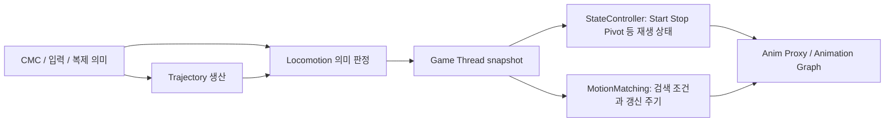

# 캐릭터 컴포넌트·DA·아키텍처 고도화 점검

기준: 2026-10-03, `main`, `33b574a1d6775306a26357f67bc3d79311e7189b`.

이 문서는 기존 최적화·책임 분리 이후의 구조를 검토한다. 판단 기준은 클래스 수나 추상화 단계가 아니라 **캐릭터 교체에도 상태가 올바르게 유지되는지, OTM·Start 동작을 보존하면서 개선할 수 있는지, 새 직업·장비·스킬을 일관되게 만들 수 있는지, 실패 원인을 추적하고 검증할 수 있는지**다.

## 1. 결론과 범위

현재 구조는 캐릭터에 모든 기능이 몰려 있는 초기 구조를 이미 벗어났다. PlayerState의 지속 상태, Avatar의 표현, 입력 해석, 전투 판정, 애니메이션 스냅샷, 비동기 시각 에셋 관리가 분리되어 있다. 특히 `FProject_JCombatConfiguration`, Ability grant source lease, StateController runtime, visual request revision을 유지하고 확장하는 편이 유리하다.

다음 개선의 중심은 **소유자의 수명과 효과의 수명 일치 → 데이터 생산·소비 시점 명시 → 조합된 DA 검증 → 제작·진단 도구 강화**다. 전면 재작성이나 컴포넌트 추가 분할부터 시작할 이유는 찾지 못했다.

| 점검 영역 | 범위와 결과의 의미 |
| --- | --- |
| 플레이어 | 네이티브 생성 기준 Avatar의 프로젝트 컴포넌트 19개와 PlayerState 컴포넌트 4개, 총 23개를 항목별 검토 |
| DA | 캐릭터·전투·애니메이션·장비·탑승 관련 C++ DA 타입 23개를 항목별 검토. 저장된 DA 인스턴스 전수 검증과는 다름 |
| 연계 구조 | 모듈 경계, 입력/GAS, 상태 제어/MM, 장비, 비동기 로딩, 메시지, 복제/SSR, 타기팅/NPC 경계, handover 계약 |
| 실행 검증 | UE 5.8 Editor Development 빌드 성공. 선정한 기존 자동화 79개 성공: 일반 성공 76개, 경고 동반 성공 3개 |
| 변경 | 이 점검 보고서와 문서 인덱스만 작성. 동작 코드와 에셋은 수정하지 않음 |
| 미확인 | Blueprint 추가 컴포넌트, 모든 실제 DA 값·소켓·Chooser/ABP 연결, 네트워크 실환경, 시각적 OTM·Start 품질, 패키지/Shipping, 실측 성능 |

Unreal MCP는 프로젝트 정책에 따라 사용하지 않았다. 기존 자동화가 읽은 Greatsword 등 일부 fixture 에셋은 테스트 근거에 포함되지만, 이를 에셋 전체 확인으로 확대 해석하지 않는다. NPC·백엔드·렌더링은 플레이어 연결 경계를 확인한 범위이며 각 시스템 전체의 별도 감사 완료를 뜻하지 않는다.

표기의 의미:

- **코드 경로 확인**: 관련 호출·소유권·분기를 소스에서 확인했다. 아래 새 경계 사례를 모두 실행 재현했다는 의미는 아니다.
- **구조 개선**: 현재 동작의 오류를 단정하지 않으며, 확장 시 얻을 수 있는 이익과 비용을 제안한다.
- **조건부**: 특정 에셋 구성·런타임 사용·콘텐츠 규모에서 적용한다.
- **P1**: 상태 누수·조작 복귀 실패처럼 먼저 다룰 정확성 문제. **P2**: 경계 안정성·제작 오류 방지. **P3**: 필요와 측정에 따라 도입할 개선.

## 2. 먼저 다룰 항목

| 순서 | 항목 | 판단 | 권장 방향 | 규모 |
| --- | --- | --- | --- | --- |
| A01 | 장비 Gameplay 효과의 소유권이 Avatar에 걸려 있음 | P1, 코드 경로 확인 | 효과 부여·회수는 지속 소유자, Avatar는 시각 표현. 우선 원래 ASC를 보관해 회수 보장 | 중간 |
| A02 | 탑승 중 Rider의 PlayerState 해제 후 Mounted 태그 회수 | P1, 코드 경로 확인 | 태그를 부여한 ASC를 기준으로 회수하고 탑승 세션에 소유권 명시 | 작음~중간 |
| A03 | 강제 하차와 Mount 종료 시 복구 경로 | P1, 코드 경로 확인 | 일반 하차 위치 탐색과 강제 수명 정리를 분리 | 중간 |
| A04 | 생성 중단된 궤적을 의미 판정에서 읽을 수 있음 | P2, 코드 경로 확인 | 궤적 조회에 freshness/eligibility 계약 적용, 기존 CMC 추정으로 fallback | 작음~중간 |
| A05 | Mounted Layer 로드 실패 후 재요청 반복 | P2, 코드 경로 확인 | 실패 상태·재시도 상한·재초기화 식별자를 갖는 공통 binding 보조 구조 | 작음~중간 |
| A06 | 개별 DA는 유효하지만 조합은 충돌할 수 있음 | P2, 구조 개선 및 일부 검증 공백 | 기존 CombatConfiguration을 확장해 최종 grant/input/attack 구성 검증 | 중간 |
| A07 | 장비 Effect와 입력 Command의 제작 계약 누락 | P2, 코드 경로 확인 | 회수 가능한 장비 GE, 실제 history 한도 등 제작 시 검증 | 작음 |
| A08 | 궤적·OTM·Start의 시점과 전환 이유 추적 | P2, 구조 개선 | 현재 분리를 유지하고 frame context 및 경계 재생 테스트 보강 | 중간 |
| A09 | 스킬 실행 확장과 설정 변경 중 동작 정책 | P2/P3, 조건부 | 행위별 GA, 명시적 Skill/Input 구분, 실행 중 설정 revision 정책 | 중간 |
| A10 | 통신·로딩·대규모 서버 경계 | P3, 조건부 | 타입 있는 이벤트, 연결된 복제 정책, 측정 기반 로딩/복제 조정 | 요구 규모에 따라 다름 |

### A01. 장비 효과는 장비 소유자의 수명에 맞춰야 한다

근거: [EquipmentRuntime](../../../Source/Project_JCharacter/Private/Components/Project_JEquipmentRuntimeComponent.cpp)의 `BindToEquipmentManager`, `ApplyEquipmentGameplay`, `RemoveEquipmentGameplay`, [runtime item](../../../Source/Project_JCharacter/Public/Components/Project_JEquipmentRuntimeComponent.h), [PlayerCharacter](../../../Source/Project_JCharacter/Private/Project_JPlayerCharacter.cpp)의 `UnPossessed`/`GetAbilitySystemOwnerActor`, [BaseCharacter](../../../Source/Project_JCharacter/Private/Project_JBaseCharacter.cpp)의 `UnPossessed`.

현재 EquipmentManager와 ASC는 PlayerState에 있지만, ability/GE/stat을 실제 부여·회수하는 EquipmentRuntime은 Avatar에 있다. Runtime item은 grant/effect handle을 저장하면서 **부여 대상 ASC는 저장하지 않는다**. 회수 시 `GetAbilitySystemComponentFromActor(OwnerCharacter)`를 다시 호출한다.

Avatar가 먼저 PlayerState와 분리된 뒤 파괴되거나 다른 소유자로 연결되면, 회수 대상이 null 또는 다른 ASC가 될 수 있다. 그 상태에서도 runtime item은 제거되어 원래 ASC에 남은 효과를 회수할 근거를 잃는다. 새 Avatar는 같은 장비를 다시 초기화한다. Ability lease가 동일 source의 중복 spec을 막아도, 회수되지 않은 lease와 별도로 적용되는 장비 GE/stat까지 해결하지는 않는다.

권장 구조:

```text
PlayerState 또는 NPC의 지속 Gameplay 소유자
  EquipmentManager ── 장착 목록 / 권한 검증
       └─ Gameplay grant ledger ── 원래 ASC / source / GE handles / 적용 상태

Avatar
  EquipmentRuntime ── 목록 관찰 / Mesh / WeaponPresentation / 시각 요청 revision
```

새 ActorComponent를 반드시 추가할 필요는 없다. 우선 EquipmentManager가 소유하는 작은 ledger로 시작할 수 있다. NPC는 자체 ASC 소유 경로를 같은 계약으로 지원한다.

작은 수정으로 먼저 안정화할 경우, **원래 ASC를 기록하고 그 대상에만 회수**하며 Avatar bind/unbind 순서를 명시한다. 장기적으로 효과가 Avatar 생존과 무관하게 유지되어야 하는지 정책을 정한 뒤 Gameplay 적용을 지속 소유자로 옮긴다. 단순히 UnPossessed에서 모든 장비를 해제하면 탑승 때 능력치가 사라질 수 있어 권장하지 않는다.

검증: 장비를 착용한 상태에서 respawn, old/new Avatar 공존, PlayerState A→B 교체, PlayerState 해제 후 Destroy, 탑승/하차를 반복한다. 원래 ASC의 grant 수·GE 수·최종 능력치를 함께 검사한다. 기존 `ProjectJ.Extension.Progression.PlayerStateRespawn`은 시작 장비 부작용을 의도적으로 배제한 fixture여서 이 경계를 검증하지 않는다.

### A02. 탑승 태그의 회수 대상이 possession 변경에 영향을 받는다

근거: [MountCharacter](../../../Source/Project_JMount/Private/Mount/Project_JMountCharacter.cpp) 209·248행 부근, [MountComponent](../../../Source/Project_JMount/Private/Mount/Project_JMountComponent.cpp) 50행, PlayerCharacter 360행. 로컬 UE 5.8 `Engine/Private/Pawn.cpp`의 `APawn::UnPossessed`에서 `SetPlayerState(nullptr)`를 확인했다.

현재 호출 순서는 다음과 같다.

1. 탑승: Rider에 `State_Mounted` 추가 → Controller가 Mount를 Possess → Rider의 PlayerState 연결 해제.
2. 하차: Rider에서 `State_Mounted` 제거 시도 → Controller가 Rider를 다시 Possess.
3. 2번의 제거 시점에는 Rider를 통해 원래 PlayerState ASC를 찾을 수 없다. 기본 네이티브 경로에서는 loose tag가 남을 수 있고 반복 시 count가 누적될 수 있다.

태그를 부여한 ASC와 부여 여부를 탑승 세션에 보관하고, 그 ASC에 정확히 한 번 회수하는 방식을 권장한다. possession 순서만 바꾸는 수정은 파괴·연결 해제·실패 중단 경계를 다루지 못한다. **플레이어의 지속 상태 소유자와 현재 조종 Pawn은 별도 개념**으로 취급해야 한다.

검증: 실제 PlayerController/PlayerState를 사용하는 반복 탑승·하차, 탑승 중 Rider/Mount 파괴, 연결 해제에서 Mounted tag count=0, 원래 Rider의 조작·충돌·이동 복구를 확인한다. 현재 Mount 자동화는 입력 소유권·체력·tick·Anim owner loss를 검사하지만 이 possession 왕복 전체를 검증하지 않는다.

### A03. 강제 하차는 일반 하차 위치 실패와 별도로 종료되어야 한다

근거: MountCharacter `HandleHealthDepleted` 128행, `DismountRider` 248행, `FindDismountLocation` 306행, `EndPlay` 96행.

`DismountRider(true)`도 `FindDismountLocation` 실패 시 바로 false를 반환한다. 위치 후보는 우측 한 곳이며 막혀 있으면 탈출하지 못한다. 체력 소진 경로는 이를 한 번 호출하고, EndPlay는 체력 delegate를 회수하지만 Rider/Controller의 복구를 수행하지 않는다.

일반 하차에는 유효한 위치가 필요하다. 강제 종료에는 **위치 실패와 무관한 소유권·태그·부착·이동 상태 정리 보장**이 필요하다. 좌/우/후방 등의 제한된 후보 검사와, 실패 시 프로젝트가 정한 안전 복구 위치/정책을 별도로 두는 것이 좋다. 강제로 충돌 속에 캐릭터를 놓는 것을 해결책으로 삼지는 않는다. World teardown에서는 재possess를 생략하는 등 종료 사유도 구분한다.

검증: 우측만 막힌 상황, 모든 후보가 막힌 상황, 비행 중 사망, Mount Destroy, Rider Destroy, World teardown. 정리 함수의 중복 호출도 안전해야 한다.

### A04. 궤적의 생성 조건을 조회 조건에도 반영한다

근거: [MotionMatchingTrajectory](../../../Source/Project_JCharacter/Private/Animation/Project_JMotionMatchingTrajectoryComponent.cpp) 174·217·304행, [LocomotionAnimState](../../../Source/Project_JCharacter/Private/Project_JLocomotionAnimStateComponent.cpp) 145·640·692행.

궤적은 DedicatedServer·탑승·최근 렌더링되지 않은 원격 캐릭터에서 생성하지 않는다. 생성 중단 시 기존 sample은 남는다. `TryGetFuturePlanarVelocity`는 generation eligibility/age를 확인하지 않고 sample을 읽고, Locomotion 의미 판정은 이를 미래 속도로 사용할 수 있다. 숨겨진 원격 캐릭터의 상태 갱신은 완전히 중단되지 않고 낮은 주기로 실행된다.

따라서 **생성되지 않은 기간의 오래된 미래 예측이 현재 상태 판정에 사용될 수 있는 코드 경로**가 있다. 가시화 복귀 시에는 이미 PresentationWake reset이 있으므로, 이를 무시하고 화면 복귀가 반드시 깨진다고 단정할 수는 없다.

최소 개선은 조회 함수가 유효성 실패를 반환하고, 소비자가 이미 보유한 현재 속도·가속·제동 기반 추정을 사용하게 하는 것이다. 기준 시간은 로컬/원격 갱신 주기에 맞춰 정해야 하며 임의의 공통 1프레임 제한은 피한다. generation/reset revision, age, last generated frame, invalid reason을 한 계약에서 읽게 한다. 기존 필드가 있으므로 같은 정보를 새로 중복 저장할 필요는 없다.

성능상 이익은 새 알고리즘보다는 불필요한 생성 없이도 소비 정확성을 보장하는 데 있다. 새 snapshot을 도입하더라도 전체 trajectory 배열을 추가로 매 프레임 복사하지 않는다.

### A05. Layer 로딩과 바인딩에 실패 상태·AnimInstance 식별자를 추가한다

근거: [MountedAnimationLayer](../../../Source/Project_JCharacter/Private/Components/Project_JMountedAnimationLayerComponent.cpp) 52·114·192행, [CombatAnimationLayer](../../../Source/Project_JCharacter/Private/Components/Project_JCombatAnimationLayerComponent.cpp) 34·177행.

Mounted layer의 완료 콜백은 class resolve 실패 후에도 `RefreshLayer()`를 호출한다. 이 함수는 class가 없으면 다시 preload한다. 경로가 잘못되었을 때 요청→실패→재요청을 반복할 수 있다. Combat layer는 완료 실패를 로그 후 반환하므로 두 구현의 정책도 다르다.

또한 두 컴포넌트 모두 class가 같으면 연결을 생략한다. 런타임에 Mesh/AnimInstance를 재초기화하는 기능을 사용할 경우 class 일치만으로 실제 연결 상태를 보장하기 어렵다. 이 부분은 해당 재초기화 사용 시나리오에서 검증할 조건부 항목이다.

권장 보조 구조: `{RequestedPath, RequestGeneration, Mesh/AnimInstance identity, LoadedClass, FailureState, RetryBudget}`. 로드 실패는 상태 변경 또는 제한된 재시도에 의해서만 다시 요청한다. 현재처럼 기본 pose fallback과 EndPlay cancel은 유지한다. `VisualAssetSubsystem`을 활용하더라도 layer의 준비 시점·pin 수명과 서비스 정책이 맞는지 먼저 확인한다. 두 컴포넌트를 거대한 공통 베이스 클래스로 합칠 필요는 없다.

검증: 존재하지 않는 layer 경로, 로딩 중 mount/weapon 변경, 동일 class의 AnimInstance 교체, EndPlay 직전 완료. 실패 시 요청 횟수도 검사한다.

### A06. 최종 DA 조합을 검증하는 계층이 필요하다

근거: [CombatConfiguration](../../../Source/Project_JCharacter/Private/Combat/Project_JCombatConfiguration.cpp), [CombatStyleDefinition](../../../Source/Project_JCharacter/Private/Combat/Project_JCombatStyleDefinition.cpp), [AbilitySystemComponent](../../../Source/Project_JGAS/Private/Project_JAbilitySystemComponent.cpp) 43·66행, [CharacterClassDefinition](../../../Source/Project_JCharacter/Public/CharacterClass/Project_JCharacterClassDefinition.h).

`FProject_JCombatConfiguration`은 이미 GameplayStyle과 AnimationStyle의 최종 출처·revision을 보존한다. 좋은 기반이다. 이를 대체할 새 resolver를 만들기보다 **실제 부여되는 능력 목록과 입력 정책, 공격 참조, 표현 호환성까지 검증 범위를 확장**하는 편이 낫다.

대표적인 현재 공백은 서로 다른 grant source의 동일 InputTag다. ASC 입력 함수는 해당 태그를 가진 모든 spec을 순회한다. CombatStyle 내부 중복 검증이나 같은 source의 lease 중복 방지는 Class AbilitySets, Advancement AdditionalAbilitySets, Equipment AbilitySet 등 서로 다른 경로의 충돌까지 막지 않는다. 상호 차단 조건이 없는 능력 둘에 같은 태그가 부여되면 둘 다 활성화될 수 있다. Melee의 공격 상태 차단이 모든 종류의 GA에 대한 일반 해법은 아니다.

최종 구성 미리보기에는 다음을 표시한다.

| 항목 | 필요한 정보 |
| --- | --- |
| 입력 | InputTag → Skill/Ability → grant source. 중복은 명시적으로 허용한 경우만 통과 |
| Gameplay | Class/Advancement/Equipment 중 실제 승자, override 사유, AttackTag/Combo/Command 참조 |
| 표현 | AnimationStyle, WeaponPresentation, Advancement cosmetic override, body/mesh 호환성 |
| 적용 | configuration revision, 기존 실행을 유지/취소하는 정책, validation 오류와 경고 |

해석 규칙은 에디터 미리보기와 런타임이 함께 사용한다. `Project_JCharacterEditor`의 기존 Content Bundle 제작·검증 경로에 이를 연결하면 제작자가 여러 DA를 열어 수동으로 추적하는 비용이 줄어든다. 임의의 장비>전직>직업 고정 우선순위를 새로 도입하지 말고 현재 `bOverrideEquippedGameplay` 규칙을 보존한다.

### A07. 제작 시 차단할 수 있는 구체적 공백

| 대상 | 현재 코드 근거 | 개선 |
| --- | --- | --- |
| 장비 EquipmentEffects | [EquipmentItemDefinition](../../../Source/Project_JCharacter/Private/Equipment/Project_JEquipmentItemDefinition.cpp)는 class null은 검사하지만 DurationPolicy는 검사하지 않음. EquipmentRuntime은 handle 제거로 회수 | 지속 장착 보너스에 허용할 GE 정책을 검사. Instant는 handle 제거로 base attribute 변경을 되돌릴 수 없으므로 별도의 일회성 equip 효과로 구분하거나 금지 |
| Stat fallback | EquipmentRuntime `ApplyEquipmentEffects`는 유효 active handle이 없으면 StatModifiers fallback 가능 | GE 적용 성공과 지속 handle 생성 여부를 구분. Instant를 허용하면 이미 실행된 효과 위에 fallback이 더해질 수 있으므로 제작 계약부터 명확히 함 |
| CombatCommandSet | execution history는 최대 16개로 clamp, DA validator는 sequence 상한 미검사 | 공통 상수/정책을 참조해 17개 이상 등 실행 불가능한 입력열 차단. 시간 값은 양수뿐 아니라 finite 검사 |
| ComboDefinition | 시작 node 존재, node ID, transition 대상, 입력 중복 검사 있음. 시작 조건 중첩·도달 불가 node 검사는 없음 | 도달성, 시작 조건 우선순위, Required/Blocked 모순 검사. 동일 입력의 조건별 분기가 필요하면 명시적 우선순위/비중첩 계약을 만든 뒤 기존 중복 금지 완화 |
| AttackDefinition | montage/playrate/trace/IK 검증은 있음 | 지정 section의 실재, 지원되는 실행·이동 정책, Required/Blocked 모순, schema 호환성까지 확장 |
| RootMotionWarped | enum은 있으나 프로젝트 C++에서 warping target/실행 계약은 확인되지 않음. NPC executor는 명시적으로 거부 | 이름만 보고 제작자가 지원 완료로 오해하지 않도록 executor capability 검증. BP 구현 여부는 별도 확인. 지원 구현 전 모든 GA에서 사용 가능하다고 간주하지 않음 |
| Class/Advancement registry | [CharacterDataSubsystem](../../../Source/Project_JCharacter/Private/CharacterClass/Project_JCharacterDataSubsystem.cpp)은 config 배열을 로드. 현재 DefaultGame.ini는 AssetManager scan만 설정 | ID 조회를 사용할 때 registry 등록의 단일 경로를 확정. scan과 subsystem map 구축이 같은 작업이 아님. BP 직접 참조로 동작하는 기존 경로까지 고장났다는 의미는 아님 |

새 validator는 개별 DA용과 조합용을 구분하되, 같은 규칙 구현을 에디터·CI·런타임 readiness에서 재사용한다. 지금도 validation 함수와 authoring 테스트가 있으므로 그 위에 보강한다.

### A08. OTM·Start를 보존하는 개선안

현재 좋은 분리:



`LocomotionAnimState`는 이동 의미, `StateControllerRuntime`은 실제 선택/commit/hold/소비, `MotionMatchingRuntime`은 검색 시점과 context 변화를 맡는다. 이들을 단일 거대 FSM으로 합치면 의미와 재생 상태가 다시 얽힌다. GroundMotionMode와 재생 one-shot state가 비슷해 보인다는 이유만으로 하나를 제거하는 것도 적절하지 않다.

권장 개선은 기존 snapshot에 필요한 공통 frame context를 정리하는 것이다. 입력/이동 revision, rotation mode, gait, 궤적 generation/reset revision·age, 로컬 입력/원격 복제의 출처, transition reason을 함께 추적한다. 이미 존재하는 값은 재사용하고 매 프레임 새로운 UObject를 만들지 않는다.

특히 궤적 reset은 단순히 “producer로 옮기자”로 끝낼 수 없다. [CharacterAnimInstance](../../../Source/Project_JCharacter/Private/Animation/Project_JCharacterAnimInstance.cpp) 1028·3426행 부근에서는 acceleration stop reset이 chooser 처리 뒤에 수행되고, 로컬 combat strafe history 보존 예외가 있다. Stop 검색 직전 history를 지우면 이전에 해결한 방향 선택 문제가 돌아올 수 있다.

따라서 reset 요청의 소유권을 정리할 때 **이번 프레임의 Stop 검색은 이전 history를 소비하고, reset의 적용 시점은 그 뒤인지**를 명시해야 한다. CMC→캐릭터→mesh의 tick 시점도 실제 prerequisite 및 trace로 확인한다. 이번 점검은 1프레임 지연을 재현한 것이 아니다.

회귀 시나리오:

| 상황 | 보존할 동작 |
| --- | --- |
| 정지→OTM Start→Cycle | Start 중복 시작 방지, committed gait와 시작 방향 유지, 정상 Cycle 진입 |
| Start 도중 입력 회전/급반전 | Start turn exit와 Pivot 우선순위, 요청 revision의 한 번 소비 |
| Start 직후 입력 해제 | Stop 여부와 history 사용 시점, 짧은 탭에서 불필요한 재시작 방지 |
| OTM↔Combat Strafe | rotation mode 전환과 Stop 방향, 로컬 history 보존 |
| 원격 캐릭터 숨김→표시 | 중단된 궤적을 현재값으로 오인하지 않음, wake reset 후 정상 선택 |
| 점프/착지/몽타주/탑승/teleport | 이전 one-shot·pivot·trajectory가 다음 상태로 누출되지 않음 |
| 30/60/120fps 및 희소 원격 갱신 | 전환 순서·commit 횟수·reset 이유가 설명 가능하고 결과가 안정적 |

value runtime 입력을 기록하고 다시 재생하는 작은 테스트를 먼저 추가하고, 마지막에는 실제 ABP/Chooser와 네트워크 PIE로 시각 확인한다. 최적의 블렌드·포즈는 headless 테스트만으로 확정할 수 없다.

### A09. 스킬 확장은 입력·정의·실행 역할을 유지하며 진행한다

현재 흐름은 `EnhancedInput binding → SkillInputRouter → SkillInputExecution → GAS / CombatCommand / Combo`로 분리되어 있다. Router가 입력 조합을 해석하고 Execution이 history·원시 입력 전달을 관리하는 것은 타당하다. 기존 sequence/rate 제한과 서버 command 재해석도 유지한다.

`AttackDefinition`과 `ComboDefinition`을 재사용하는 근접 전투 기반은 충분히 유용하다. 다음 확장에서는 다음을 권장한다.

- 지속적인 Skill identity와 Input slot을 구분한다. 스킬 위치를 바꿀 때 스킬 자체의 식별자·저장 데이터까지 바뀌지 않게 한다.
- 일반 instant, projectile, channel, charge 등 **실제 실행 수명이 다른 기능**은 해당 GA executor가 책임진다. 모든 스킬을 Melee combo node로 표현하려 하지 않는다.
- AttackDefinition의 trace/damage/movement 데이터를 재사용하되 executor별 지원 범위를 검증한다. 현재 `bMontageDriven=false` 등의 정의 가능성이 곧 모든 기존 executor의 지원을 뜻하지 않는다.
- class/advancement/style 변경 중 활성 스킬을 이전 snapshot으로 완료할지 즉시 취소할지 정한다. weapon revision 취소는 이미 있으므로, 필요한 경우 현재 configuration revision과 일관되게 확장한다.
- SourceObject는 현재 ItemDef 또는 Gameplay owner 등으로 사용된다. 새 SkillDefinition을 넣을 때 기존 GA가 임의 타입을 기대하지 않도록 typed execution context/accessor를 정한다.

범용 fragment/행동 그래프 시스템은 서로 다른 콘텐츠에서 반복되는 조합이 확인될 때 도입한다. 지금은 몇 가지 executor와 작고 명확한 정의가 개발·디버깅 비용이 낮다. GAS의 비용·쿨다운·태그 계약을 재사용하고 병렬로 같은 규칙의 별도 시스템을 만들지 않는다.

### A10. 통신과 규모 확장

**로컬 통신:** 즉시 성공/실패가 필요한 equip/activate 요청은 직접 함수와 결과 타입, 완료 사실은 소유 범위가 좁은 delegate가 적합하다. 현재 구조의 이 부분은 유지한다. [MessageSubsystem](../../../Source/Project_JCore/Public/System/Project_JMessageSubsystem.h)은 GameInstance의 로컬 메시지 라우터이며 RPC나 서버 간 통신이 아니다. 소스상 주 사용 확인 범위는 테스트다. 향후 UI·퀘스트·로그 등 독립 소비자가 늘면 UObject payload 대신 타입 있는 작은 이벤트와 명시적 구독 handle을 고려한다. locomotion의 매 프레임 전달을 전역 버스에 올릴 이유는 없다.

**복제:** ReplicatedAnimEvent, ReplicatedJumpState, CombatPresentation의 상태 복구와 이벤트 전달 역할을 문서화한다. 사건 ID/revision, 늦은 수신, relevancy 복귀, owner 예측 중복 제거를 공통 시나리오로 검증하는 편이 단순히 RPC 수를 줄이는 것보다 먼저다. UI에는 모든 수치를 전체 broadcast하기보다 필요한 소비자만 갱신하는 현재 방향이 맞다.

**MMO 정책:** [NetObjectFilter_Distance](../../../Source/Project_JCharacter/Public/Network/Project_JNetObjectFilter_Distance.h), [NetObjectPrioritizer_Combat](../../../Source/Project_JCharacter/Public/Network/Project_JNetObjectPrioritizer_Combat.h)는 UObject 기반 정책 계산기다. 실제 Iris filter/prioritizer override는 주석 상태이며 확인된 호출은 진단 경로에 있다. 따라서 정책 테스트 통과를 실제 연결별 네트워크 절감으로 볼 수 없다. 대규모 접속을 목표로 하는 단계에는 엔진 복제 adapter 연결 및 packet trace가 필요하다.

**PlayerState:** 현재 NetUpdateFrequency=100, ASC Mixed mode다. 이를 모든 연결에서 무조건 100Hz 전송한다고 해석하면 안 된다. 실제 변경 빈도·관련성·수신자·payload별 bytes를 측정하고 public 상태와 owner-only 상세 상태를 조정한다.

**로딩:** 필수 Gameplay 정의의 resident 범위와 cosmetic soft asset의 지연 로딩 범위를 구분한다. 현재 hard reference와 AlwaysCook 설정은 소규모 콘텐츠에서는 간단하고 예측 가능하다. 규모가 커질 때 asset bundle/ID registry로 옮기되, soft reference로 바꾸기만 해서 첫 공격 시 hitch가 생기지 않게 한다. 이번 감사는 startup 비용이나 FPS 개선량을 측정하지 않았다.

**Handover:** PlayerCharacter의 직렬화는 version 1, level, location, rotation 중심이다. progression에는 별도 snapshot 기반이 있지만 inventory/equipment/cooldown 등의 완전한 전송 경로가 이 메서드에 연결된 상태는 아니다. 프로젝트 문서의 vertical slice 범위에서는 기반으로 이해하되, 서버 이동 기능을 구현할 때 지속 소유자 ID·schema migration·재시도 idempotency를 포함한 계약을 완성해야 한다.

## 3. 플레이어 컴포넌트별 점검표

아래 이름은 `Project_J` 접두사를 생략했다. 파일은 각 타입과 동명의 header/cpp다. Avatar 목록은 [PlayerCharacter 생성자](../../../Source/Project_JCharacter/Private/Project_JPlayerCharacter.cpp) 146~177행 및 [BaseCharacter](../../../Source/Project_JCharacter/Private/Project_JBaseCharacter.cpp) 36행, 지속 소유자 목록은 [PlayerState](../../../Source/Project_J/Game/Project_JPlayerState.cpp) 16~25행에서 확인했다.

| # | 컴포넌트 | 유지할 점 | 개선/판정 |
| --- | --- | --- | --- |
| 1 | EquipmentRuntime | 시각 async revision, 취소·재시도, 무기 revoke 이벤트 | **우선 개선 A01.** Gameplay ledger의 수명을 Avatar에서 분리 |
| 2 | Camera | 로컬 전용 갱신, 카메라 정책 분리 | 유지. 보간이 끝난 뒤 sleep은 실제 비용이 있을 때 검토. 카메라 state/target 변경 시 wake 계약 필요 |
| 3 | LocomotionAnimState | 이동 의미/전환 정책, 원격 hidden 갱신 제한 | **A04/A08.** 입력·궤적의 유효성과 transition reason을 함께 전달 |
| 4 | MotionMatchingTrajectory | 엔진 trajectory 활용, 프레임당 생성 제한, wake reset, 원격 smoothing opt-in | **A04/A08.** 소비 freshness와 reset 시점 명시. 커스텀 예측 엔진 재작성 불필요 |
| 5 | CharacterUIBinding | ASC delegate 바인딩과 consumer 수 기반 수요 관리 | 유지. owner 교체·해제 후 소비자가 남는 경우의 rebinding을 A01 수명 테스트와 함께 확인 |
| 6 | PlayerInputBinding | 자신이 추가한 EnhancedInput handle의 회수 | 유지. 재possess/입력 컴포넌트 교체 경계가 핵심. 전역 입력 binding 일괄 삭제는 피함 |
| 7 | SkillInputRouter | chord/modifier 우선순위와 grace 처리, DA 매핑 | **A06/A09.** 최종 구성 기준 모호한 입력 검증 및 필요 시 사용자 rebind 계층 |
| 8 | SkillInputExecution | command history, sequence/rate 제한, 서버 원시 입력 재해석 | **A06/A07.** 16개 history 제작 한도와 active configuration 변경 계약 |
| 9 | AnimationUpdateCoordinator | 최적화 policy를 일관되게 계산·적용 | 유지. gameplay pose demand와 cosmetic budget의 우선순위·사유를 진단에 표시 |
| 10 | ReplicatedAnimEvent | 원격 의미 이벤트와 순서/시점 보유 | 유지+조건부 강화. 늦은 이벤트·relevancy 복귀·빈번한 cosmetic 입력 시나리오 검증 |
| 11 | ReplicatedJumpState | 로컬 예측과 서버 확인 상태의 표현 분리 | 유지. 늦은 confirm/중복/새 possession epoch 테스트. 관측 없이 out-of-order 버그로 단정하지 않음 |
| 12 | CombatState | ASC tag와 전투 상태의 명시적 binding | 유지. A01/A02와 같은 원래 ASC 해제·새 ASC 연결 계약 공유 |
| 13 | CombatIntro | intro/outro 및 취소 수명 캡슐화 | 유지. montage 중 장비 변경·피격·탑승의 interruption 우선순위를 시나리오화 |
| 14 | CombatAnimationLayer | 전투 layer async preload, 실패 로그, unlink | **A05.** class 외 mesh/AnimInstance identity와 실패 상태 추적 |
| 15 | WeaponPresentation | 무기 actor identity, 장착/손/공격 구동, pose와 무기 revision 연동 | 유지+진단 강화. 큰 파일 길이만으로 분할하지 말고 attachment 계산·blade pose 같은 순수 계산만 필요 시 추출 |
| 16 | CombatPresentation | Gameplay 판정과 VFX/SFX 분리, 상태 복구·pool 연계 | 유지. 전직/무기 cosmetic override의 최종 출처를 A06 preview에 노출 |
| 17 | CombatHitValidation | 서버 attack/node/prediction/weapon revision 검증, 요청을 판정으로 신뢰하지 않음 | 유지. 공격 종료 경계·지연 hit 허용 정책을 명시하고 네트워크 시뮬레이션으로 검증 |
| 18 | Mount | 탑승 요청과 replicated mount 참조 분리 | **우선 개선 A02/A03.** persistent ASC tag token과 중단 가능한 탑승 세션 |
| 19 | MountedAnimationLayer | profile 기반 비동기 layer, fallback pose | **A05.** 실패 재요청 상한과 실제 연결 identity |
| 20 | Progression (PlayerState) | 직업/전직/레벨·snapshot의 지속 소유, 재초기화 idempotency | 유지+**A06/A09.** 장비 grant와 일관된 resolved loadout 및 실행 중 변경 정책 |
| 21 | Inventory (PlayerState) | common ItemDefinition, 서버 GUID 기반 조회, FastArray·owner-only 상태 | 유지. 영속 저장 도입 시 item definition ID와 instance ID 구분 및 schema 정책 |
| 22 | EquipmentManager (PlayerState) | 장착 목록·권한·operation result, 변경 이벤트 | **A01.** authoritative Gameplay grant ledger 소유 후보. visual 구현은 맡기지 않음 |
| 23 | AbilitySystem (PlayerState) | GAS tick 수명 유지, 입력 tag dispatch, grant source lease | 유지+**A06.** 서로 다른 source의 input 충돌 검사, 원래 ASC로 lease 회수 |

### 엔진 기본·동적·선택 컴포넌트

| 대상 | 점검 결과 |
| --- | --- |
| Capsule / CharacterMovement / CameraBoom / FollowCamera | 엔진 표준 역할 유지. 특히 이동 예측·서버 보정과 별개인 두 번째 movement owner를 도입하지 않음 |
| BudgetedSkeletalMesh | gameplay pose 요구를 합성하는 구조가 유용. 공격 notify/trace에 필요한 pose는 시각 거리 최적화로 중단하지 않아야 함 |
| ModularMesh | 장비 표시 시 동적 생성. source/follower skeleton 호환과 attachment/leader pose 선택 유지. mesh 교체와 A05를 함께 검증 |
| ServerSideRewind | 서버 history/ring buffer, reset 및 검증 기반 유지. 현재 주된 capsule 판정의 정확도·지연 허용은 게임 요구로 결정. PlayerCharacter 생성자의 기본 부착은 아니므로 실제 BP 부착은 미확인 |
| TargetScoring | snapshot·weak ref·epoch/revision·완료 후 재검증 구조 유지. 플레이어 기본 컴포넌트라고 간주하지 않음 |
| NPCAction | 타깃 선택 결과를 실제 실행 가능한 action으로 검증하는 경계 유지. 지원 executor 정책을 DA validator와 연결. NPC 전체 행동 품질 평가는 별도 |
| AttributeSet | UActorComponent는 아니며 위 23개에 포함하지 않음. GAS 상태 소유와 GE 적용/회수 계약에서 함께 확인 |

## 4. DA 타입별 점검표

DA 상속이 있다는 사실보다 **기본 정의·실행·표현의 조합**, **안전한 수정 단위**, **실행 가능한 값의 검증**을 평가했다. `ClampMin` 등 편집 UI metadata만 있는 경우를 런타임/CI 검증 완료로 취급하지 않았다.

| # | DA 타입 | 현재 구조와 유지점 | 다음 개선 |
| --- | --- | --- | --- |
| 1 | CharacterClassDefinition | ClassId/schema, 초기 attribute, AbilitySets, 기본 style | graph validator는 있으나 자체 IsDataValid 없음. root 작성 검증 및 registry/조합 검증 연결 |
| 2 | CharacterAdvancementDefinition | prerequisite/branch/grant policy, gameplay override와 cosmetic override 분리 | 전직 graph 검증 유지. 최종 grant/input 충돌 및 실행 중 변경 정책 추가 |
| 3 | DefaultAttributeSetData | 기본 능력치 묶음, 자체 validation | 유지. 영속 능력치 snapshot과 기본 템플릿을 혼동하지 않음 |
| 4 | AbilitySet | ability/effect grant와 회수 handle, source lease | 유지. 개별 set 검증을 최종 source 조합 검증으로 확장 |
| 5 | CombatStyleDefinition | gameplay/animation 참조, inline abilities, derived runtime catalog | 좋은 중심 정의. legacy readiness 경로와 새 authoring 경로의 validation 수준을 명시하고 실패 이유 노출 |
| 6 | AttackDefinition | 공격 ID·montage·trace·damage·movement를 재사용 | A07의 section/capability/조건 검증. 필요 없는 효과마다 subclass를 만들지 않음 |
| 7 | AttackSet | AttackTag lookup, 중복 검사 | derived catalog가 있는 style과 수동 catalog의 단일 원본 정책 유지. 조합 시 참조 누락 검증 |
| 8 | ComboDefinition | node와 transition으로 근접 연계 표현 | A07의 도달성·시작 모호성 검사. 조건별 분기는 실제 요구 시 우선순위 계약 도입 |
| 9 | CombatCommandSet | 시간 제한 입력열, 길이/priority 기준 선택 | history 한도·finite·동일 우선순위 모호성 보강 |
| 10 | SkillInputMappingData | 입력 chord를 tag로 데이터화, 자체 validation | 사용자 rebind와 Gameplay 스킬 ID 분리, 최종 loadout의 slot 중복 검증 |
| 11 | CombatPresentationSet | AttackTag별 표현 lookup, 전직 override 가능 | 유지. gameplay 복제 없이 cosmetic만 교체하는 좋은 경계 |
| 12 | AttackPresentationProfile | trail/impact 등 공격 표현 분리, 자체 validation | executor·무기 profile과 필요한 소켓/표현 호환을 조합 검증 |
| 13 | CharacterAnimProfile | locomotion/combat 등 body의 기본 animation 조합 | 개별 자체 validator 보강. 현재 runtime configuration helper 검증도 함께 재사용 |
| 14 | LocomotionProfile | 이동·전환·원격 시각·거리 최적화 정책과 validator | 유지. 의미 정책/표현 budget 그룹을 편집 화면에서 명료하게 묶고 변경 영향 표시 |
| 15 | MotionMatchingAssetSet | DB/Chooser 관련 자산과 프로젝트 validation helper | 엔진 MM 확장 기반 유지. 실제 스켈레톤·Chooser output 계약은 authored asset 확인 필요 |
| 16 | CombatAnimProfile | combat strafe, aim/intro 정책 분리 | 자체 validation 보강 및 WeaponAnimProfile과의 최종 fallback 표시 |
| 17 | WeaponAnimProfile | weapon linked layer, intro/outro 표현 분리 | montage playrate/section·layer 호환 검증 보강. gameplay attack 정의를 다시 이곳으로 합치지 않음 |
| 18 | HandGripProfile | grip/IK 기준·validator | 유지. 실제 source/visual mesh의 socket·bone 계약까지 preview 검증 |
| 19 | WeaponPresentationProfile | actor/mesh·attachment·grip·공격 표시 정책, validator | 유지. 최종 profile/mesh/source와 함께 identity를 진단에 표시 |
| 20 | ItemDefinition | 장비 외 아이템도 수용하는 common base, ItemId/icon/stack | base 수준 identity·stack/finite 등 검증과 저장용 ID 정책 보강 |
| 21 | EquipmentItemDefinition | common item에 slot/GE/style/visual 추가, validator | A01/A07. 지속 효과와 일회성 효과의 정책 분리 |
| 22 | MountItemDefinition | common item에 soft mount class/spawn 설정 | class 존재·적합성·spawn 수치 검증. 실제 로드·spawn 실패 결과를 사용자 흐름에 전달 |
| 23 | RiderAnimationProfile | Mount별 rider animation layer/data | 자체 validation 보강. layer 적합성과 rider skeleton 계약을 A05/A06에 연결 |

추천 확장 방식은 현재의 조합형 DA를 유지하는 것이다. 예를 들어 대검을 사용하는 두 전직이 피해 규칙은 같고 trail 색만 다르면 `CombatPresentationOverrideSet`을 달리하고, 전체 style/attack을 복사하지 않는다. 공격 동작·판정이 다르면 AttackDefinition/실행 정책을 바꾼다. 새로운 저장 ID나 revision 정책은 authoring definition과 플레이 중 instance state를 구분해서 설계한다.

## 5. 그 밖의 구조별 판정

| 구조 | 판정 및 제안 |
| --- | --- |
| 8개 모듈 | Core/GAS/Mount/Character/Project_J/MMO/CharacterEditor/AnimationNodes의 현재 경계 유지. 새로운 직업을 추가할 때마다 모듈을 늘릴 필요 없음 |
| BaseCharacter / PlayerCharacter / Greatsword | 공통 Gameplay 소유 조회와 player wiring, 얇은 직업 class라는 방향 유지. PlayerCharacter의 profile resolver·진단은 독립 helper로 정리할 여지가 있으나 새 컴포넌트화는 필수 아님 |
| Locomotion semantic / StateController runtime / MM runtime | 분리 유지. A08의 frame contract·trace replay가 다음 개선 |
| Anim snapshot / proxy | Game Thread UObject 조회와 worker 소비를 분리하는 방향 유지. 새 기능에서 worker가 live component/DA를 직접 탐색하지 않게 검토 |
| Animation budget / presentation budget | gameplay-required pose를 보장한 후 cosmetic 비용을 줄이는 정책 유지. 거리별 숫자는 실측 후 변경 |
| VisualAssetSubsystem | token·취소·bounded admission/retry 기반 유지. A05처럼 우회 로더의 실패 정책이 일관적인지 점검 |
| Object pool | Niagara 등 단기 표현에 유용. reset/owner/async 완료의 계약이 없는 객체를 무조건 pooling하지 않음 |
| Equipment / Inventory replication | authoritative instance lookup와 delta 복제 유지. A01로 Gameplay ledger와 Avatar 표현 분리 완성 |
| Hit validation / SSR | 서버가 정의·시간·노드를 선택하는 구조 유지. lag compensation 정책과 false reject 비율은 네트워크 실측 필요 |
| Target/NPC 비동기 계산 | snapshot 계산과 Game Thread commit 분리 유지. stale epoch/revision과 대상 생존성 재검증을 새 작업에도 일관되게 적용 |
| Message / delegate | 직접 요청·소유 범위 delegate·교차 도메인 이벤트를 목적별 사용. 전역 event bus로 일괄 교체하지 않음 |
| Class registry / AssetManager | 현재 scan과 ID lookup registry의 연결 공백 명시. 모든 soft asset을 시작 시 sync load하는 방식은 규모 증가 시 재검토 |
| Backend / MMO / Handover | 현재 문서상 기반/vertical slice 범위를 존중. 서버 이전·영속 저장·실제 복제 adapter는 독립적인 제품 요구와 검증 단계가 필요 |
| Authoring 도구 / 문서 | 기존 Content Bundle 제작 도구를 effective configuration preview로 확장. 오래된 WeaponAnimProfile 중심 설명 등은 실제 AttackDefinition/Style 구조와 대조해 정리 |

## 6. 검증 근거와 남은 확인

### 이번에 실행한 검증

직접 UnrealBuildTool을 사용했고 완료까지 대기했다.

```powershell
& 'C:\Program Files\Epic Games\UE_5.8\Engine\Binaries\DotNET\UnrealBuildTool\UnrealBuildTool.exe' `
  Project_JEditor Win64 Development `
  '-Project=C:\Users\I\Documents\GitHub\Project_J\Project_J.uproject' `
  -NoHotReload -NoUBA -MaxParallelActions=1 `
  '-Log=C:\Users\I\Documents\GitHub\Project_J\Saved\Logs\ArchitectureAudit_20261003_UBT.log'
```

결과: `Succeeded`, 134.39초. 최초 sandbox 실행은 UBT 사용자 로그 디렉터리 접근 권한 때문에 컴파일 전에 실패했다. 프로세스와 Windows Application 오류 로그를 확인한 뒤 권한을 갖춘 동일 직접 UBT 경로로 완료했다. 엔진/캐시 삭제나 build 강제 중단은 하지 않았다.

기존 headless automation 선택 범위:

```text
ProjectJ.Architecture
+ ProjectJ.Internal
+ ProjectJ.Extension
+ ProjectJ.Components
+ ProjectJ.Animation
+ ProjectJ.Combat
+ ProjectJ.Presentation
+ ProjectJ.Authoring
```

`UnrealEditor-Cmd.exe`, `-unattended -NullRHI -nosound -NoLiveCoding -nop4 -nosplash`, `-TestExit="Automation Test Queue Empty"`로 실행했다. 결과는 79개 성공, 실패 0개, 미실행 0개다. 이 선택 범위 밖의 전체 프로젝트 테스트까지 통과했다고 주장하지 않는다.

| 경고 포함 성공 테스트 | 경고 | 해석 |
| --- | --- | --- |
| ProjectJ.Animation.TwoHandIKTransitionAndCurve | 1개 | fixture의 None socket 관련 경고 |
| ProjectJ.Combat.WeaponPresentationIdentity | 5개 | fixture의 None socket 관련 경고 |
| ProjectJ.Presentation.StableGripTargetsAndAuthoredAlpha | 1개 | fixture의 None socket 관련 경고 |

증거 파일: [UBT log](../../../Saved/Logs/ArchitectureAudit_20261003_UBT.log), [automation log](../../../Saved/Logs/ArchitectureAudit_20261003_Tests.log), [automation JSON](../../../Saved/Automation/ArchitectureAudit_20261003/index.json). Saved 산출물은 로컬 검증 기록으로, 저장소에 영구 보존된 문서와는 다르다.

테스트 통과는 현재 선택된 회귀 계약의 통과다. A01~A07의 새로운 경계 사례에 대한 반증이나 실제 에셋 전체의 정상성 증명이 아니다. 이번 작업에서는 감사 대상 동작 코드를 수정하지 않았으므로 새 테스트 코드를 추가하지 않았다.

### 실제 에셋·플레이 확인이 필요한 항목

| 확인 대상 | 최소 확인 내용 |
| --- | --- |
| BP_GreatSword 및 사용하는 자식 BP | 네이티브 외 추가 컴포넌트, SSR 부착, 중복 BeginPlay/입력/장비 로직 |
| 실제 Class/Advancement/Equipment/Style 묶음 | 최종 입력 tag·AbilitySet 중복, gameplay/animation override, registry 등록 |
| 실제 Mount/Rider profile | 탑승/하차 possession 왕복, tag count, layer 경로, 사망/파괴 복구 |
| CharacterAnimProfile / Chooser / MM DB / ABP | snapshot property binding, skeleton 호환, OTM·Start·Stop·Pivot 선택/블렌드 |
| WeaponPresentation / HandGrip / Montage | 실제 socket/bone/notify/section, source pose와 visual mesh의 결과 |
| 멀티플레이 PIE 또는 테스트 서버 | 지연·유실·relevancy 복귀, owner/proxy 결과, SSR false reject, mount 왕복 |
| 성능 capture | 숨겨진 캐릭터 수별 animation/trajectory/GC, 로드 admission, 연결별 replication bytes |

위 작업은 현재 검토와 구분한다. 에셋 조회가 필요하면 프로젝트의 명시적 Unreal MCP 사용 정책을 따르고 관련 에셋만 조회해야 한다.

## 7. 적용 순서와 완료 기준

| 단계 | 작업 | 완료 기준 |
| --- | --- | --- |
| 1. 수명 정확성 | A01 장비 grant 회수, A02 Mounted tag, A03 강제 하차 | 장비 착용 Avatar 교체 및 탑승 반복 후 능력치·grant·tag count 보존, 조작 복귀 |
| 2. 경계 안정성 | A04 궤적 조회 유효성, A05 로드 실패, A07 제작 검증 | invalid sample fallback, 실패 요청 상한, 실행 불가능 DA 거부 |
| 3. 애니메이션 관측 | A08 frame context/transition reason/재생 테스트 | OTM·Start 기존 회귀 시나리오 유지와 전환 사유 추적, 실제 시각 검증 |
| 4. 콘텐츠 확장 | A06 최종 구성 preview/validator, A09 새 스킬 executor | 새 직업·전직·장비 묶음을 중복 입력 없이 구성하고 변경 원인을 preview에서 설명 가능 |
| 5. 규모 대응 | A10 복제 adapter/asset bundle/handover | 실제 목표 동접·콘텐츠 규모와 packet/CPU/메모리 측정으로 필요성과 개선 확인 |

지금 유지할 설계를 먼저 고정하고 작은 단위로 검증하면서 진행하는 것이 좋다. 이번 점검에서 가장 큰 개선 여지는 추상화의 양보다 **수명·시점·조합에 대한 계약의 완성도**에 있다.
