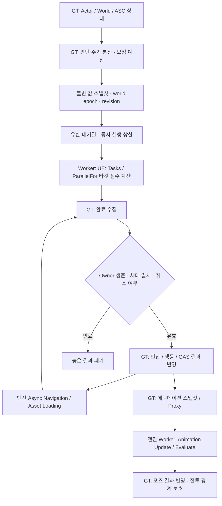
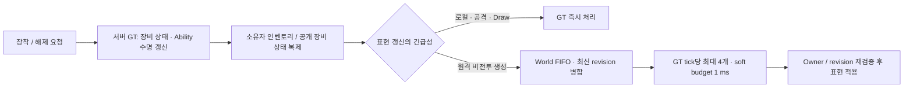

# Project J

### Unreal Engine 5.8 · C++ · Third-person Action MMORPG Prototype

서버 권위형 전투·장비 시스템과 Motion Matching을 기반으로, **다수 캐릭터의 판단·이동·애니메이션·이펙트 비용을 제어하는 개인 개발 프로젝트**입니다.

멀티스레딩의 설계 기준은 **Game Thread의 상태 소유권, Worker의 값 계산, 완료 결과의 유효성 검증**입니다. 작업량이 커졌을 때의 처리 시간뿐 아니라 취소·재입장·캐릭터 파괴·월드 종료까지 구현과 검증 범위에 포함합니다.

[아티스트·디자이너 협업](#아티스트디자이너를-위한-협업-안내) · [멀티스레드 구조](#멀티스레드-구조) · [측정 결과](Docs/Benchmarks/SystemsModernization.md) · [검증 데이터](Docs/Benchmarks/Data) · [문서 목록](Docs/README.md)

## 측정으로 확인한 변화

| 영역 | 비교 조건 | Before → After | 결과 |
|---|---|---|---|
| **Mass 이동·간격 계산** | 2,048 moving agents, 직렬 / 병렬 | CPU 구간 p95 **0.6342 → 0.2409 ms** | **62.0% 감소** |
| **Niagara 생성** | 100개 동시 생성, 풀 미사용 / 사용 | 생성 CPU p95 **4.5739 → 3.3451 ms** | **26.9% 감소** |
| **네트워크 관심 영역** | NPC 100개 + client 2개, AllRelevant / Spatial | aggregate **18,786 → 13,223 B/s** | **29.6% 감소** |
| **Trail PSO coverage** | 같은 packaged binary, 보완 OFF / ON | Full PSO miss **1 → 0** | 누락된 render target 구성 보완 |

**측정 범위:** UE 5.8 / Windows 11 / Ryzen 7 9800X3D. GPU 실험은 Radeon RX 9070 XT, D3D12를 사용했습니다. 각각 독립된 workload이며, 전체 게임 FPS 개선율이나 2,048명 동시 접속 성능을 의미하지 않습니다. 표본 수·실행 조건·실패 기록은 [벤치마크 문서](Docs/Benchmarks/SystemsModernization.md), 재계산 가능한 CSV/JSON은 [Data](Docs/Benchmarks/Data)에 공개합니다.

## 아티스트·디자이너를 위한 협업 안내

Project J는 **캐릭터·애니메이션·무기·의상·이펙트를 실제 플레이 안에서 연결하고 다듬는 협업**을 지향합니다. 새로운 직업의 전투 스타일, 무기별 액션, 서로 다른 분위기의 스킨과 마법 연출처럼 시도해 보고 싶은 콘텐츠를 함께 구체화할 수 있습니다.

### 함께 만들 수 있는 콘텐츠

| 분야 | 프로젝트에 연결하는 방식 | 함께 확인할 부분 |
|---|---|---|
| **캐릭터·몬스터 모델** | Skeletal Mesh와 캐릭터 프로필, AnimBP에 연결 | skeleton·비율·리타게팅, 발 접지와 손 IK |
| **의상·방어구·무기** | 장비 정의와 표현 프로필로 메시·부착 위치 구성, 호환되는 파츠는 Leader Pose 사용 | 본 구조, 소켓·그립, 클리핑과 LOD |
| **이동·전투 애니메이션** | Motion Matching/Chooser용 이동 데이터와 무기별 프로필, 공격 몽타주 조합 | 이동·회전 전환, root motion, 공격·복귀 타이밍 |
| **Niagara 이펙트** | 공격 태그별 presentation profile과 몽타주 Notify 구간에 연결 | Trail 시작·끝, 무기 소켓, 잔상·중단 시 정리와 가독성 |
| **직업·스킬·콤보 기획** | 입력 태그, AbilitySet, 콤보 그래프와 AttackDefinition 조합 | 입력 분기, 연계 구간, 판정·이동·연출의 일치 |

캐릭터 호환성은 특정한 “표준 규격” 하나로 보장하지 않습니다. 사용할 skeleton과 애니메이션을 먼저 맞추고 리타게팅·소켓·IK를 검증합니다. 기존 구조로 표현할 수 있는 콘텐츠는 데이터와 프로필로 연결하고, 새로운 동작 규칙이 필요하면 C++ 기능을 함께 확장합니다.

### 콘텐츠를 게임 안에 연결하는 흐름

1. **의도와 기준 공유:** 콘셉트, 레퍼런스, 사용할 캐릭터·무기, 원하는 동작과 효과를 정합니다. 제작 초기에 skeleton·크기·축·소켓 기준을 맞춥니다.
2. **에셋과 데이터 연결:** 아티스트가 메시·애니메이션·Niagara를 제작하고, 디자이너와 프로그래머가 장비·전투·표현 프로필에 연결합니다. 기존 작성 가이드를 기준으로 변경 범위를 나눕니다.
3. **플레이 피드백:** 이동·공격·장착·해제에서 동작을 확인하고, 전환 속도·공격 타이밍·Trail 길이·잔상·클리핑을 조정합니다.
4. **다인원·네트워크 확인:** 로컬과 원격 캐릭터에서 표현을 비교하고, 공격 취소·무기 교체·캐릭터 파괴 때 정리되는지와 동시 표시 비용을 확인합니다.

**역할의 경계:** Data Asset은 콘텐츠 선택과 튜닝, Blueprint/AnimBP는 에셋 조합과 시각 표현, C++는 서버 권한·상태 전이·입력·복제·작업 수명을 담당합니다. 이펙트의 모양을 바꿀 때 피해 판정까지 복제해서 수정할 필요가 없도록 전투 정의와 표현 정의를 분리했습니다.

### 바로 활용할 수 있는 기반

- **입력 조합과 콤보:** 좌·우클릭, 동시 입력, Shift/Ctrl/Alt 같은 modifier를 입력 태그로 해석하고, 콤보 그래프에서 공격 정의를 선택합니다. 조합별 실제 동작은 데이터로 구성합니다.
- **무기별 액션과 외형:** 장착한 장비의 메시·표현 프로필과 전투 스타일을 연결해 무기 외형, 대기·공격 애니메이션 구성을 바꿀 수 있습니다.
- **같은 공격의 다른 연출:** 기본 전투 스타일의 VFX를 전직 또는 스킨별 cue로 덮어쓸 수 있습니다. 동일한 공격 정의에 서로 다른 Trail·방출 효과를 붙이는 방식입니다.
- **데이터 기반 이동 확장:** 이동 문맥과 콘텐츠 프로필을 나누고, Motion Matching·Chooser·Linked Anim Layer를 통해 애니메이션을 구성합니다. 실제 품질은 사용할 애니메이션과 리타게팅·프로필 튜닝을 함께 확인합니다.

작성 가이드: [콘텐츠 확장](Docs/ContentExpansionGuide.md) · [장비·직업 데이터 빠른 참조](Docs/DataAssetQuickReference.md) · [공격·콤보 작성](Docs/GreatswordCombatAuthoringGuide.md) · [전투 VFX 연결](Docs/CombatVFXArchitecture.md#authoring) · [이동 프로필 확장](Docs/DataDrivenLocomotionExtensionGuide.md)

## 멀티스레드 구조

Game Thread(GT)가 Actor·World·GAS 상태를 읽고 변경합니다. 직접 제출하는 작업에는 값 스냅샷을 전달하고, 엔진이 제공하는 Navigation·로딩·애니메이션 비동기 경로는 해당 엔진 서비스가 실행을 관리합니다.



이 흐름은 NPC 판단·행동의 책임 경계를 나타냅니다. Mass는 별도의 **GT snapshot/grid → 직렬 또는 병렬 chunk 계산 → join → GT 적용** 경로를 사용합니다. 모든 비동기 서비스가 하나의 공통 작업 큐를 공유하는 구조는 아닙니다.

### 장비 권한과 시각 표현의 처리 순서



장비 상태와 GAS 변경에는 GT 실행 순서를 유지합니다. 원격 비전투 캐릭터의 시각 오브젝트 **생성**을 프레임에 분산하며, 기존 표현 해제는 즉시 처리합니다. 해제 비용까지 모두 분산된 것으로 해석하지 않습니다.

## A–E 구현 범위

| 단계 | 구현한 내용 | 확인한 규모·동작 |
|---|---|---|
| **A · 비동기 기반** | 배치 타깃 scoring, 공유 공간 스냅샷, owner lease 기반 로딩 공유, 요청 상한과 취소 수명 | 256 owners / 1,024 공유 요청에서 실제 load 1회, 취소64 / 완료960 |
| **B · 애니메이션 예산** | C++ snapshot/AnimInstance proxy, 엔진 병렬 평가, Animation Budget Allocator, 필수 전투 포즈 보호 | 공격 완료·취소·해제·파괴와 예산 등록/복귀 회귀 |
| **C · NPC 판단·Navigation** | observer 기반 갱신, 후보 예산, Async Navigation admission/retry, stale InRange 해제 | 판단 대상2,048 / observers512, Nav burst512 전달·timeout0 |
| **D · 군중·복제·표현** | Mass 값 이동과 Character 인계, 공간 관련성, 원격 표현 생성 FIFO | Mass2,048 값 일치, 서버+실제 socket clients4 / NPC512 기능 검증 |
| **E · VFX·PSO·애니메이션 보완** | Niagara pool 수명, 선택 갱신 위상 분산, cooked 초기화 보호, Trail PSO 보완, 거리 컬링 실험 | 최종 packaged 스킬3회 × 신규/재사용 cache, 렌더링 회귀24개 |

A–E의 현재 구현은 `main`에 통합되어 있습니다. **E의 운영 에셋별 최적화·품질 검증은 진행 중**이며, 단계별 실험 통과와 모든 기능의 운영 적용을 구분합니다.

## 설계에서 중요하게 다룬 경계

### 작업량에 맞춘 병렬 실행

Mass의 간격 계산을 포함한 CPU 구간은 스냅샷 생성과 join 비용까지 측정합니다. 기본 `ProjectJ.Mass.Parallel=-1`은 **실제 이동 중인 agent가 1,024개 이상이고 간격 계산이 켜진 경우** 병렬 chunk를 선택합니다. 작은 단순 이동 작업에서는 직렬이 더 저렴했던 결과도 판단에 반영했습니다.

이 Mass 경로는 **선택적으로 등록한 NPC의 Character·ASC·장비를 유지하는 프로토타입**입니다. 전투·몽타주·root motion 등을 보호하고, 과밀하거나 막힌 경로는 Character 이동으로 복귀합니다. Actor 메모리 절감이나 원거리 ISM 표현까지 구현된 상태는 아닙니다.

→ [Mass 인계와 실행 선택](Source/Project_JCharacter/Private/Mass/Project_JMassRepresentationSubsystem.cpp) · [값 계산 Processor](Source/Project_JCharacter/Private/Mass/Project_JMassMovementProcessor.cpp)

### 과부하와 늦은 완료를 함께 제어

요청을 무제한으로 쌓는 대신 대기열·실행 중 작업·프레임별 적용에 상한을 둡니다. 배치 후보 예산에 도달하면 미처리 NPC부터 다음 tick에 재개하고, Navigation 입장이 거절되면 분산 재시도로 넘깁니다. 취소는 결과 적용 권한을 제거하며 실제 작업 완료와는 구분합니다.

완료 시점에 weak owner, world epoch, revision을 확인해 이전 장비·이전 월드의 결과가 현재 상태에 적용되는 것을 막습니다. 공유 참조의 수명 안전성과 Worker가 읽는 데이터의 안전성을 별도 계약으로 다룹니다.

→ [Scoring 수명](Source/Project_JCore/Private/System/Project_JTargetScoringSubsystem.cpp) · [Navigation 압력 제어](Source/Project_JCharacter/Private/System/Project_JNPCPathSubsystem.cpp) · [표현 FIFO](Source/Project_JCharacter/Private/System/Project_JPresentationBudgetSubsystem.cpp)

### 실행 방식보다 실제 측정 결과를 우선

| 관측 | 반영한 판단 |
|---|---|
| 병렬 Net Tick에서 실제 worker overlap 확인, CPU 개선은 일관되지 않음 | 기본 Net Tick 병렬화를 활성화하지 않음 |
| Niagara 생성 p95 감소, 종료 비용은 큰 차이 없음 | 풀의 생성 비용·반환 수명을 구분해서 관리 |
| 거리 컬링 이후 simulation 감소, 보이는 ribbon 렌더 비용은 거의 동일 | GPU 렌더링 전체 개선으로 확대 해석하지 않음 |
| 신규 application cache와 재사용 비교에서 preload 이득 불명확 | driver cold 또는 hitch 제거로 주장하지 않음 |

### Editor와 packaged 실행의 차이를 회귀로 포착

- **Cooked 애니메이션 초기화:** authored AnimBP가 설치되기 전 native Motion Matching 노드가 folded NodeData 없이 실행되는 crash를 수정했습니다. 임시 구간은 엔진 reference pose를 사용하고, AnimBP 연결 후 generated graph를 사용합니다. native-only MM fallback은 cooked에서 지원하지 않습니다.
- **UE 5.8 Trail PSO:** 기존 Distortion collector의 shader/state를 재사용하면서 rough-refraction의 누락된 RT 구성을 보완했습니다. validation 옵션에 의존하지 않는 검색과 **monolithic 게임에 한정한 등록**으로 적용 범위를 제한합니다. 엔진 소스와 화질 설정은 변경하지 않았습니다.

→ [Animation Proxy](Source/Project_JCharacter/Private/Animation/Project_JCharacterAnimInstanceProxy.cpp) · [PSO 보완](Source/Project_J/Rendering/Project_JDistortionPSOPrecache.cpp)

## 검증 현황

| 검증 | 결과 | 해석 범위 |
|---|---|---|
| main 직접 UBT Editor / Game 빌드 | 모두 성공 | Win64 Development |
| main 다인원·수명 회귀 | **56개 통과 / 오류0 / 경고10** | NullRHI, 기존 경고 포함 |
| main 실제 RHI 전투·애니메이션·장비 회귀 | **24개 통과 / 오류0 / 경고0** | 56개 집합과 중복 있음 |
| 별도 socket 다중 접속 | 서버1 + clients4, NPC512 검증·정상 종료 | AOI 재입장, owner-only inventory, 공개 장비, 삭제·접속 종료 |
| packaged 스킬 통합 | 신규/재사용 application cache 각각3회 성공 | 장착 → GAS → 몽타주 → hit window → Trail → 해제/정리 |

수치는 **2026-09-10의 보존된 실행 결과**입니다. main 회귀는 코드 `f2c31fb`, 전투 에셋 `89f94b4` 기준이며, 이후 테스트 목적으로 캐릭터 BP 이벤트 그래프를 비운 로컬 변경까지 재검증한 결과는 아닙니다. [검증 근거와 재현 조건](Docs/Benchmarks/SystemsModernization.md)을 함께 확인할 수 있습니다.

## 게임플레이와 콘텐츠 확장 기반

멀티스레드 작업과 함께, 콘텐츠가 늘어날 때 상태·표현·복제의 책임이 섞이지 않도록 아래 기반을 유지합니다.

| 기반 | 구현한 책임과 확장 방향 |
|---|---|
| **PlayerState / Character 분리** | 플레이어의 ASC·인벤토리·장비 상태와 Avatar의 이동·표현 수명을 분리. NPC는 character-local 소유 경로 사용 |
| **모듈러 장비 표현** | 호환되는 파츠를 메인 메시의 Leader Pose에 연결하고, 장착 상태와 시각 오브젝트의 수명을 별도로 관리 |
| **FastArray 기반 복제** | 인벤토리·장비 변경분을 전달하고 owner-only 데이터와 공개 표현을 구분 |
| **원격 이동 궤적 보정** | 복제된 이동과 visual smoothing을 사용해 원격 캐릭터의 Motion Matching 입력 방향 보정 |
| **데이터 유효성 검사** | 장비·프로필의 필수 참조와 설정을 `IsDataValid` 등으로 검사. 실제 애니메이션·연출 품질은 플레이 검증과 병행 |
| **서버 간 상태 전달 준비** | Handover envelope, 검증·취소·실패 상태와 transport 경계를 마련. 운영 분산 서버와 영속 저장 완성을 의미하지 않음 |

→ [모듈러 메시](Source/Project_JCharacter/Private/Components/Project_JModularMeshComponent.cpp) · [원격 궤적](Source/Project_JCharacter/Public/Animation/Project_JMotionMatchingTrajectoryComponent.h) · [장비 데이터 검사](Source/Project_JCharacter/Private/Equipment/Project_JEquipmentItemDefinition.cpp) · [Handover](Source/Project_J/Backend/Project_JHandoverManager.h)

## 프로젝트 구성

| 모듈 | 주요 책임 |
|---|---|
| [Project_JCore](Source/Project_JCore) | 값 타입, 비동기 scoring, 공간 스냅샷, 공유 시각 에셋 서비스 |
| [Project_JGAS](Source/Project_JGAS) | Ability System Component와 Attribute 기반 |
| [Project_JCharacter](Source/Project_JCharacter) | 캐릭터·장비·전투·애니메이션·NPC 판단/이동·Mass 인계 |
| [Project_J](Source/Project_J) | PlayerState/Controller, 게임 연결, 통합 진단 fixture |
| [Project_JCharacterEditor](Source/Project_JCharacterEditor) | Editor 전용 Navigation 통합·부하 시험 |
| [Project_JMount](Source/Project_JMount) | 탈것과 탑승 캐릭터 연결 |

플레이어의 ASC·인벤토리·장비 소유권은 PlayerState에 두고 Character의 표현 수명과 분리합니다. GAS 전투 정의, 장비별 animation/presentation profile, Motion Matching/Chooser, Niagara 에셋을 조합하는 방식으로 기능을 확장합니다. 일반 NPC는 플레이어와 다른 소유 경로를 사용합니다.

## 빌드와 실행

Unreal Engine **5.8**, Win64 C++ 도구 체인과 **Git LFS**가 필요합니다. 에셋은 LFS 파일까지 받은 후 `Project_J.uproject`를 사용합니다. 저장소 루트의 PowerShell에서:

```powershell
git lfs pull
$engineRoot = 'C:/Program Files/Epic Games/UE_5.8'
$projectFile = (Resolve-Path './Project_J.uproject').Path
& "$engineRoot/Engine/Binaries/DotNET/UnrealBuildTool/UnrealBuildTool.exe" `
    Project_JEditor Win64 Development "-Project=$projectFile" -WaitMutex
```

빌드 전에 Unreal Editor·Live Coding·기존 컴파일 프로세스가 종료됐는지 확인하고, 실행한 빌드는 완료까지 기다립니다. 검증 스크립트는 [Scripts/Validation](Scripts/Validation)에 있으며, [벤치마크 재현 안내](Docs/Benchmarks/SystemsModernization.md#재현)를 따릅니다.

## 다음 작업

- **E:** 운영 전투 장면의 ABP 노드별 최적화와 시각 비교, Niagara 에셋별 거리/bounds/instance 예산 적용, 별도 `DefaultLightFunctionMaterial` PSO 누락과 driver cold 검증.
- **F:** Tasks/TaskGraph/ThreadPool, Tick 의존성, 전용 스레드·동기화, 물리 snapshot, RDG/Async Compute, Audio·PCG의 독립 실험과 적용 판단.
- **MMORPG 확장:** 실제 전투 서버 tick과 더 많은 접속·패킷 조건, 운영 Mass 표현 전환 검증.

[벤치마크와 데이터](Docs/Benchmarks/SystemsModernization.md) · [설계·검증 이력](Docs/Architecture/ProjectJ_Systems_Modernization_Refactor_2026-09-08.md) · [초기 프로파일링 기준선](Docs/Architecture/ProjectJ_Profiling_Consolidated_Summary_2026-09-06.md) · [전체 문서](Docs/README.md)
